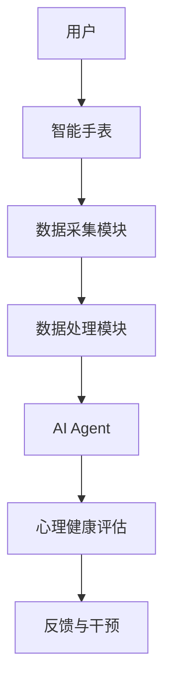
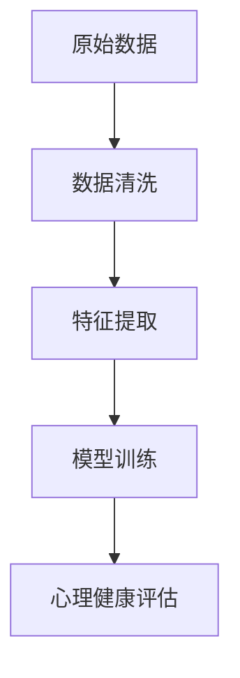

                 

# AI Agent在智能手表中的心理健康监测功能

> 关键词：AI Agent, 智能手表, 心理健康监测, 数据分析, 可穿戴设备

> 摘要：本文深入探讨了AI Agent在智能手表中进行心理健康监测的功能，分析了其核心概念、算法原理、系统架构，并通过实际案例展示了其在智能手表中的应用。文章还总结了AI Agent在心理健康监测中的优势与挑战，并展望了未来的发展方向。

---

# 第1章: 心理健康监测的背景与意义

## 1.1 心理健康问题的现状

### 1.1.1 当代社会心理健康问题的普遍性
现代社会节奏加快，工作压力增大，心理健康问题日益普遍。根据世界卫生组织（WHO）的报告，全球约有9.7亿人受到心理健康问题的困扰，其中焦虑症和抑郁症是主要的两类。智能手表等可穿戴设备因其便携性和实时监测能力，成为心理健康监测的重要工具。

### 1.1.2 心理健康问题对企业和社会的影响
心理健康问题不仅影响个人生活质量，还对企业和社会造成巨大损失。例如，焦虑和抑郁可能导致工作效率下降、 absenteeism（旷工）增加，以及医疗成本上升。据研究，心理健康问题每年为企业带来的损失高达数万亿美元。

### 1.1.3 可穿戴设备在心理健康监测中的潜力
可穿戴设备通过实时监测生理数据（如心率、皮肤温度、运动模式等），结合AI技术，可以有效识别心理健康问题的早期信号。智能手表作为最常见的可穿戴设备之一，具有屏幕小、计算能力有限的特点，因此需要高效的AI算法来实现心理健康监测。

## 1.2 AI Agent的基本概念

### 1.2.1 人工智能代理的定义
AI Agent（人工智能代理）是指能够感知环境、自主决策并执行任务的智能体。它通过传感器获取数据，利用算法进行分析，并根据结果采取行动。AI Agent的核心在于其自主性和智能性。

### 1.2.2 AI Agent的核心功能与特点
AI Agent具有以下核心功能：
1. **感知环境**：通过传感器或数据接口获取实时信息。
2. **分析数据**：利用机器学习算法对数据进行处理和分析。
3. **决策与行动**：根据分析结果做出决策并执行任务。
4. **自主学习**：通过反馈机制不断优化自身算法。

### 1.2.3 AI Agent在智能手表中的应用场景
在智能手表中，AI Agent可以用于：
- **实时监测**：持续采集用户的生理数据和行为数据。
- **异常检测**：通过算法识别潜在的心理健康问题。
- **个性化建议**：根据用户的健康状况提供定制化的干预建议。

## 1.3 智能手表的硬件与软件基础

### 1.3.1 智能手表的硬件构成
智能手表的硬件主要包括：
1. **显示屏**：用于显示时间、通知和健康数据。
2. **传感器**：如心率传感器、加速度传感器、陀螺仪等。
3. **处理器**：用于数据处理和算法运行。
4. **存储器**：存储健康数据和应用程序。

### 1.3.2 智能手表的操作系统与开发框架
主流的智能手表操作系统包括：
- **Apple Watch**：基于iOS系统开发。
- **Android Wear**：基于Android系统开发。
- **其他品牌**：如华为WATCH、三星Galaxy Watch等。

开发智能手表心理健康监测功能的常用框架包括：
- **C语言**：用于底层开发。
- **Python**：用于数据分析和机器学习算法实现。
- **TensorFlow Lite**：用于在智能手表上运行轻量级的机器学习模型。

### 1.3.3 智能手表在健康监测中的优势
智能手表的优势在于其便携性和实时监测能力。用户可以随时随地监测自己的健康状况，无需额外设备或专业人员的协助。

---

## 1.4 本章小结
本章介绍了心理健康问题的现状及其对社会的影响，阐述了AI Agent的基本概念和功能特点，并分析了智能手表的硬件和软件基础。通过本章的学习，读者可以理解AI Agent在智能手表中的重要性及其应用潜力。

---

# 第2章: 心理健康监测的核心概念与AI Agent的结合

## 2.1 心理健康监测的关键指标

### 2.1.1 心理健康的主要评估维度
心理健康监测的关键指标包括：
1. **压力水平**：通过心率变异性（HRV）和皮质醇水平评估。
2. **情绪状态**：通过用户的行为数据（如运动模式、社交互动）和语言表达进行分析。
3. **睡眠质量**：通过睡眠周期监测和睡眠时间分析。

### 2.1.2 心理健康监测的数据来源
数据来源包括：
- **生理数据**：心率、皮肤电活动（EDA）、体温等。
- **行为数据**：运动模式、使用频率、操作习惯等。
- **语言数据**：社交媒体动态、语音数据等。

### 2.1.3 心理健康监测的指标体系
为了全面评估心理健康状况，需要构建一个综合的指标体系，包括生理指标、行为指标和语言指标。

## 2.2 AI Agent在心理健康监测中的角色

### 2.2.1 数据采集与处理
AI Agent通过智能手表的传感器实时采集用户的生理数据，并将这些数据传输到云端或本地进行处理。

### 2.2.2 数据分析与决策
AI Agent利用机器学习算法对数据进行分析，识别潜在的心理健康问题，并生成相应的反馈和建议。

### 2.2.3 用户反馈与干预
AI Agent可以根据分析结果向用户发送个性化的健康建议，例如提醒用户休息、建议运动或提供放松技巧。

## 2.3 心理健康监测与AI Agent的系统架构

### 2.3.1 系统整体架构图（Mermaid流程图）

### 2.3.2 核心概念对比表
| 概念       | 描述                                                                 |
|------------|----------------------------------------------------------------------|
| 心理健康指标 | 包括压力水平、情绪状态、睡眠质量等                                       |
| AI Agent功能 | 数据采集、分析、反馈与干预                                             |

## 2.4 本章小结
本章详细介绍了心理健康监测的核心指标和AI Agent在其中扮演的角色，并通过Mermaid流程图和对比表展示了系统的整体架构和功能分配。

---

# 第3章: 心理健康监测的算法原理与实现

## 3.1 数据采集与预处理

### 3.1.1 数据采集模块
AI Agent通过智能手表的传感器采集用户的数据，包括心率、运动模式、皮肤电活动等。

### 3.1.2 数据预处理
为了提高算法的准确性，需要对采集的数据进行预处理，包括数据清洗、归一化和特征提取。

## 3.2 数据分析与特征提取

### 3.2.1 特征提取算法
常用的特征提取算法包括：
- **主成分分析（PCA）**：用于降维和提取关键特征。
- **小波分析**：用于分析信号的时频特性。

### 3.2.2 算法流程图（Mermaid）

## 3.3 算法实现与优化

### 3.3.1 机器学习模型
常用的机器学习模型包括：
- **支持向量机（SVM）**：用于分类问题。
- **随机森林（Random Forest）**：用于回归和分类问题。

### 3.3.2 模型优化
通过交叉验证和超参数调优，可以提高模型的准确性和鲁棒性。

## 3.4 本章小结
本章详细介绍了心理健康监测的算法原理，包括数据采集与预处理、特征提取和模型训练，并通过Mermaid流程图展示了整个算法流程。

---

## 总结与展望

### 总结
AI Agent在智能手表中的心理健康监测功能具有重要意义。通过实时监测用户的生理和行为数据，AI Agent可以有效识别心理健康问题，并提供个性化的干预建议。

### 展望
未来，随着AI技术的不断发展，心理健康监测将更加精准和智能化。例如，通过引入更先进的算法（如深度学习）和更多的数据来源，可以进一步提高监测的准确性和实时性。

---

## 作者：AI天才研究院/AI Genius Institute & 禅与计算机程序设计艺术 /Zen And The Art of Computer Programming

---

通过本文的详细介绍，读者可以全面了解AI Agent在智能手表中的心理健康监测功能，包括其核心概念、算法原理和系统架构。希望本文能为相关领域的研究和应用提供有价值的参考。

