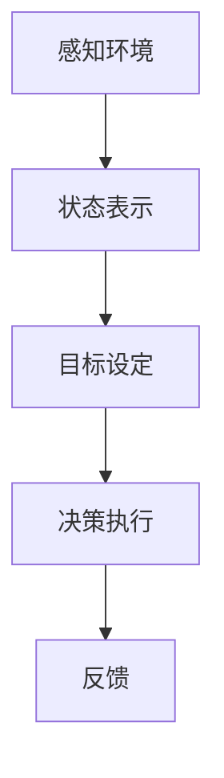
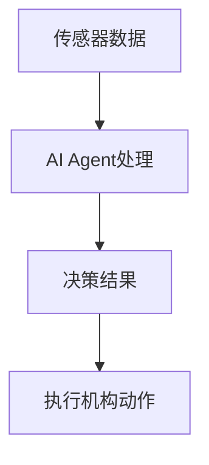
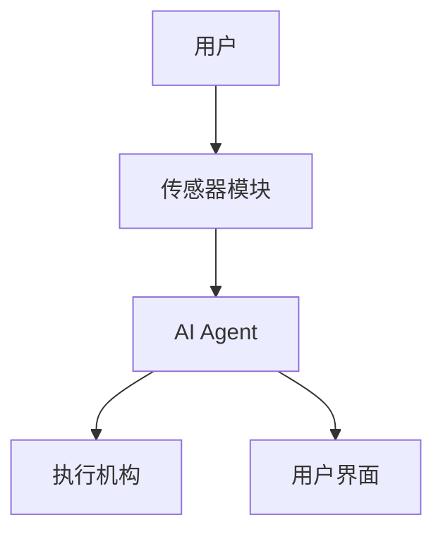
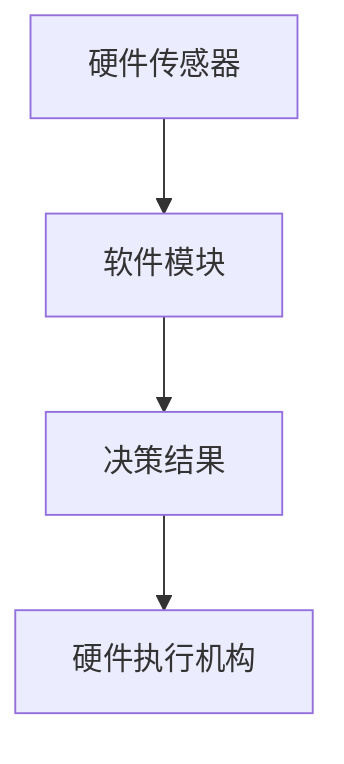
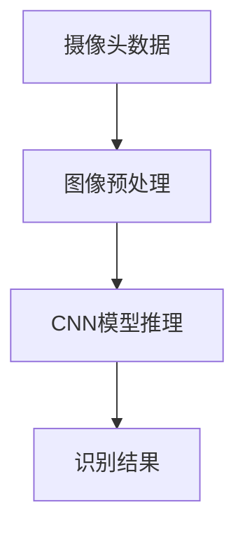
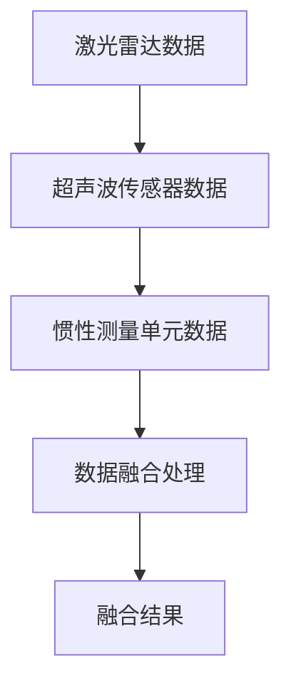
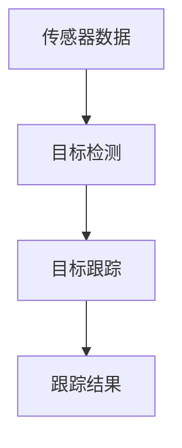
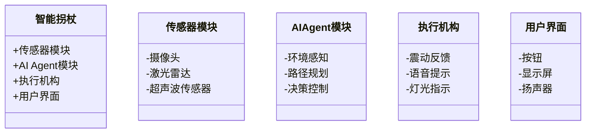
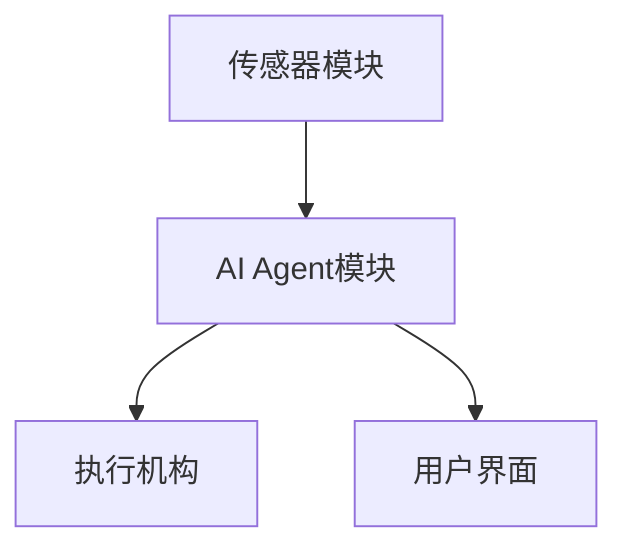
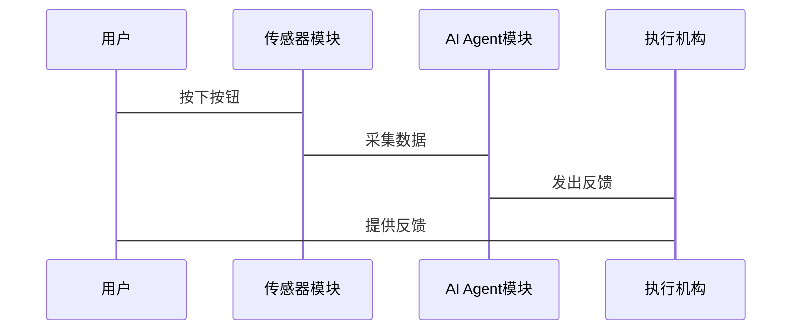

                 

<think>
好的，我现在需要帮用户撰写一篇关于《AI Agent在智能拐杖中的路况分析与导航》的技术博客文章。用户提供了详细的目录大纲和一些内容，我需要按照他们的要求逐步完成文章的撰写。

首先，我需要仔细阅读用户提供的内容，理解每章每节的要求。文章的结构已经很清晰，从背景介绍、核心概念、算法原理、系统架构、项目实战到最佳实践，每个部分都有详细的章节划分。

接下来，我需要确保每个章节的内容都符合用户的格式和内容要求。例如，在“AI Agent的核心概念与原理”部分，我需要使用Mermaid图来展示系统架构和实体关系。在算法原理部分，我需要详细解释并提供Python代码示例，同时使用LaTeX格式展示数学公式。

在撰写过程中，我要注意语言的清晰和逻辑的连贯，确保每个部分都能深入浅出地解释技术细节。同时，要保持文章的专业性和可读性，适合技术读者阅读。

最后，检查文章是否符合字数要求，每个部分是否有足够的细节，以及是否满足用户的其他格式和内容要求，比如作者信息和注意事项的添加。

现在，我可以开始按照目录大纲逐步完成文章的撰写，确保每个部分都详细且符合用户的要求。
</think>

# AI Agent在智能拐杖中的路况分析与导航

> 关键词：AI Agent，智能拐杖，路况分析，路径规划，传感器融合，实时定位

> 摘要：本文详细探讨了AI Agent在智能拐杖中的应用，特别是其在路况分析与导航中的作用。文章从背景介绍、核心概念、算法原理、系统架构到项目实战，全面解析了AI Agent如何通过多传感器融合、深度学习和SLAM技术实现智能拐杖的实时路况分析与自主导航。同时，文章还提供了实际案例分析和最佳实践建议，帮助读者深入了解AI Agent在智能拐杖中的技术实现与应用。

---

# 第二部分: AI Agent的核心概念与原理

---

# 第2章: AI Agent的核心概念与原理

## 2.1 AI Agent的基本原理

### 2.1.1 AI Agent的定义与分类
AI Agent（人工智能代理）是指能够感知环境、自主决策并执行任务的智能实体。根据应用场景的不同，AI Agent可以分为以下几类：
- **简单反射型Agent**：基于预设规则对输入做出反应。
- **基于模型的反应式Agent**：维护对环境的状态表示，并基于此进行决策。
- **目标驱动型Agent**：根据目标驱动行为，主动规划和执行任务。
- **效用驱动型Agent**：通过最大化效用函数来优化决策。

### 2.1.2 AI Agent的核心算法
AI Agent的核心算法主要包括：
1. **感知算法**：用于从传感器获取数据并理解环境。
2. **决策算法**：用于基于感知信息做出决策。
3. **规划算法**：用于制定实现目标的详细步骤。

### 2.1.3 AI Agent的决策机制
AI Agent的决策机制通常包括以下步骤：
1. **感知环境**：通过传感器获取环境信息。
2. **状态表示**：将感知信息转化为系统可理解的状态表示。
3. **目标设定**：根据当前状态和任务目标，确定下一步行动。
4. **决策执行**：根据决策结果执行动作。

### 2.1.4 AI Agent的事件处理流程
以下是AI Agent的事件处理流程的Mermaid图：



## 2.2 AI Agent与智能拐杖的结合

### 2.2.1 AI Agent在智能拐杖中的角色
AI Agent在智能拐杖中的主要角色是处理来自多种传感器的数据，并根据环境信息做出导航决策。其具体功能包括：
- **环境感知**：通过摄像头、激光雷达、超声波传感器等感知周围环境。
- **路径规划**：根据感知信息规划最优路径。
- **实时调整**：根据动态环境变化调整导航路径。

### 2.2.2 AI Agent与硬件设备的交互
智能拐杖的硬件设备包括：
- **传感器模块**：如摄像头、激光雷达、超声波传感器。
- **计算模块**：如嵌入式处理器或边缘计算设备。
- **执行机构**：如震动反馈装置、语音提示模块。

AI Agent与硬件设备的交互流程如下：



### 2.2.3 AI Agent的数据处理流程
AI Agent的数据处理流程包括以下几个步骤：
1. **数据获取**：从传感器获取原始数据。
2. **数据预处理**：对数据进行降噪、特征提取等处理。
3. **模型推理**：将预处理后的数据输入到训练好的模型中进行推理。
4. **决策输出**：根据推理结果生成决策指令。

---

## 2.3 智能拐杖的系统架构

### 2.3.1 系统整体架构图
以下是智能拐杖的系统整体架构图：



### 2.3.2 系统功能模块划分
智能拐杖的主要功能模块包括：
- **传感器模块**：负责采集环境数据。
- **AI Agent模块**：负责数据处理、模型推理和决策。
- **执行机构**：负责根据决策结果执行动作。
- **用户界面**：负责与用户交互。

### 2.3.3 系统硬件与软件的协同工作
硬件部分主要负责数据采集和执行动作，而软件部分负责数据处理和决策。以下是硬件与软件协同工作的流程图：



---

## 2.4 本章小结

本章主要介绍了AI Agent的基本原理及其在智能拐杖中的应用。通过分析AI Agent的核心概念和工作流程，我们理解了AI Agent如何通过感知、决策和执行实现智能拐杖的智能导航功能。接下来的章节将深入探讨路况分析与导航的具体算法实现。

---

# 第三部分: 路况分析与导航的算法原理

---

# 第3章: 路况分析与导航的算法原理

## 3.1 路况分析的核心算法

### 3.1.1 基于视觉的路况识别
基于视觉的路况识别主要依赖于深度学习技术，特别是卷积神经网络（CNN）。以下是常用的路况识别流程：



### 3.1.2 基于传感器的数据融合
为了提高路况识别的准确性，通常需要将多种传感器的数据进行融合。以下是数据融合的流程：



### 3.1.3 多目标检测与跟踪
多目标检测与跟踪可以通过目标检测网络（如YOLO、Faster R-CNN）实现。以下是多目标检测与跟踪的流程图：



---

## 3.2 导航算法的实现

### 3.2.1 基于路径规划的导航算法
路径规划是智能拐杖导航的核心算法之一。常用的路径规划算法包括A*算法和RRT算法。

#### A*算法
A*算法是一种基于图搜索的最短路径算法，其基本步骤如下：

1. 初始化起点和目标点。
2. 生成候选节点，并计算每个节点的优先级（g(n) + h(n)）。
3. 选择优先级最高的节点进行扩展。
4. 重复上述步骤，直到找到目标点。

以下是A*算法的伪代码实现：

```python
def a_star(start, goal):
    open_set = {start}
    closed_set = set()
    g_score = {start: 0}
    f_score = {start: heuristic(start, goal)}
    while open_set:
        current = pop node from open_set with lowest f_score
        if current == goal:
            return path
        for neighbor in neighbors(current):
            tentative_g_score = g_score[current] + cost(current, neighbor)
            if neighbor not in g_score or tentative_g_score < g_score[neighbor]:
                g_score[neighbor] = tentative_g_score
                f_score[neighbor] = g_score[neighbor] + heuristic(neighbor, goal)
                add neighbor to open_set
    return None
```

#### RRT算法
RRT（Rapidly-exploring Random Tree）算法是一种基于采样的路径规划算法，适用于高维空间和复杂环境。以下是RRT算法的伪代码实现：

```python
def rrt(start, goal, obstacles):
    tree = {start: None}
    while True:
        sample = random_point()
        nearest = find_nearest(sample, tree)
        new_node = extend(nearest, sample)
        if new_node == goal:
            break
        if not collision(new_node, obstacles):
            tree[new_node] = nearest
    return path_from_tree(tree, start, goal)
```

---

### 3.2.2 基于SLAM技术的实时定位
SLAM（Simultaneous Localization and Mapping）技术是一种实时定位与地图构建技术，常用于智能拐杖的导航中。以下是基于SLAM的实时定位流程：

1. 通过激光雷达或摄像头获取环境数据。
2. 使用定位算法（如基于特征点的方法）确定自身位置。
3. 使用建图算法（如基于图优化的方法）构建环境地图。

以下是SLAM技术的伪代码实现：

```python
def slam(sensor_data):
    for point in sensor_data:
        match feature_points(point)
        update pose estimate
        update map
    return pose, map
```

---

### 3.2.3 多传感器融合的导航优化
为了提高导航的准确性，通常需要将多种传感器的数据进行融合。以下是多传感器融合的导航优化流程：

1. 通过传感器获取环境数据。
2. 使用数据融合算法（如卡尔曼滤波）对数据进行融合。
3. 根据融合后的数据进行路径规划和实时调整。

以下是卡尔曼滤波的伪代码实现：

```python
def kalman_filter(state, measurement, Q, R):
    # 预测步骤
    predicted_state = state
    predicted_error = Q
    # 更新步骤
    innovation = measurement - predicted_state
    innovation_error = R
    updated_error = predicted_error + innovation_error
    kalman_gain = predicted_error / (predicted_error + innovation_error)
    updated_state = predicted_state + kalman_gain * innovation
    return updated_state, updated_error
```

---

## 3.3 本章小结

本章详细探讨了路况分析与导航的核心算法，包括基于视觉的路况识别、基于传感器的数据融合、多目标检测与跟踪、基于路径规划的导航算法、基于SLAM技术的实时定位以及多传感器融合的导航优化。通过这些算法的结合，智能拐杖能够实现对复杂环境的实时感知与自主导航。接下来的章节将详细分析系统的架构设计和项目实现。

---

# 第四部分: 系统分析与架构设计

---

# 第4章: 系统分析与架构设计

## 4.1 问题场景介绍

智能拐杖的目标用户主要是老年人和视力障碍者，他们在使用拐杖时常常面临以下问题：
- **障碍物识别困难**：无法有效识别环境中的障碍物。
- **导航路径复杂**：在复杂环境中难以找到最优路径。
- **实时反馈不足**：无法及时获得环境变化的反馈。

---

## 4.2 系统功能设计

### 4.2.1 领域模型设计
以下是智能拐杖的领域模型图：



### 4.2.2 系统功能模块划分
智能拐杖的主要功能模块包括：
- **传感器模块**：负责采集环境数据。
- **AI Agent模块**：负责数据处理、模型推理和决策。
- **执行机构**：负责根据决策结果执行动作。
- **用户界面**：负责与用户交互。

---

## 4.3 系统架构设计

### 4.3.1 系统架构图
以下是智能拐杖的系统架构图：



### 4.3.2 系统接口设计
智能拐杖的主要接口包括：
- **传感器接口**：用于连接摄像头、激光雷达等传感器。
- **执行机构接口**：用于控制震动反馈、语音提示等执行机构。
- **用户界面接口**：用于与用户进行交互。

### 4.3.3 系统交互序列图
以下是系统的交互序列图：



---

## 4.4 本章小结

本章详细分析了智能拐杖的系统架构设计，包括领域模型、功能模块划分、系统架构图和系统交互序列图。通过这些设计，我们可以清晰地理解智能拐杖的硬件与软件的协同工作方式。接下来的章节将重点介绍项目的实战实现。

---

# 第五部分: 项目实战

---

# 第5章: 项目实战

## 5.1 环境安装与配置

### 5.1.1 开发环境安装
智能拐杖的开发环境需要以下工具和库：
- **Python**：用于算法实现和系统控制。
- **OpenCV**：用于图像处理和视觉识别。
- **ROS**：用于机器人操作系统和多传感器数据处理。
- **深度学习框架**：如TensorFlow或PyTorch，用于训练AI Agent的模型。

安装步骤如下：

```bash
pip install numpy
pip install opencv-python
pip install tensorflow
pip install rospy
```

---

## 5.2 系统核心实现

### 5.2.1 AI Agent的核心代码实现
以下是AI Agent的核心代码实现：

```python
class AI_Agent:
    def __init__(self):
        self.sensors = []
        self actuators = []
        self.models = {}

    def add_sensor(self, sensor):
        self.sensors.append(sensor)

    def add_actuator(self, actuator):
        self.actuators.append(actuator)

    def process_data(self, data):
        for sensor in self.sensors:
            if sensor.type == data.type:
                sensor.update(data)
        for model in self.models:
            model.process()

    def decide_and_execute(self):
        decisions = []
        for actuator in self.actuators:
            decisions.append(actuator.decision())
        for action in decisions:
            action.execute()
```

### 5.2.2 多传感器融合的代码实现
以下是多传感器融合的代码实现：

```python
class SensorFusion:
    def __init__(self):
        self.sensors = []
        self.fusion_model = None

    def add_sensor(self, sensor):
        self.sensors.append(sensor)

    def fuse_data(self, data):
        fused_data = []
        for sensor in self.sensors:
            fused_data.append(sensor.read())
        return self.fusion_model.process(fused_data)
```

---

## 5.3 项目实战案例分析

### 5.3.1 案例分析
假设我们有一个智能拐杖需要在室内环境中导航，用户按下按钮启动导航功能。以下是导航过程的详细分析：

1. **传感器数据采集**：摄像头、激光雷达和超声波传感器开始采集环境数据。
2. **数据预处理**：传感器数据经过降噪和特征提取后，输入到AI Agent模块。
3. **模型推理**：AI Agent模块通过训练好的深度学习模型对数据进行推理，生成环境地图和障碍物位置。
4. **路径规划**：路径规划算法（如A*或RRT）根据环境地图规划出一条避开障碍物的最优路径。
5. **实时调整**：根据动态环境变化，AI Agent模块实时调整导航路径，并通过执行机构（如震动反馈和语音提示）向用户反馈导航信息。

---

## 5.4 项目小结

本章通过实际案例分析和代码实现，详细展示了智能拐杖的项目实战过程。通过环境安装、核心代码实现和案例分析，我们可以清晰地理解AI Agent在智能拐杖中的具体应用。接下来的章节将总结最佳实践经验和注意事项。

---

# 第六部分: 最佳实践与总结

---

# 第6章: 最佳实践与总结

## 6.1 小结

通过本文的详细分析，我们了解了AI Agent在智能拐杖中的核心作用，特别是其在路况分析与导航中的技术实现。从背景介绍到系统架构设计，再到项目实战，我们全面探讨了AI Agent在智能拐杖中的技术细节。

---

## 6.2 注意事项

在实际开发过程中，需要注意以下几点：
1. **传感器的选择与校准**：确保传感器的准确性和稳定性。
2. **模型的训练与优化**：通过大量数据训练和不断优化模型，提高AI Agent的识别准确率。
3. **系统的实时性与稳定性**：确保系统的实时性和稳定性，特别是在复杂环境中。

---

## 6.3 拓展阅读

1. **AI Agent在其他领域的应用**：如自动驾驶、机器人控制等。
2. **深度学习与SLAM技术的结合**：研究如何通过深度学习优化SLAM技术。
3. **多传感器融合的优化方法**：探索更高效的多传感器融合方法。

---

# 作者：AI天才研究院/AI Genius Institute & 禅与计算机程序设计艺术 /Zen And The Art of Computer Programming

---

**本文遵循CC BY-NC-SA 4.0协议，转载请注明出处。**

