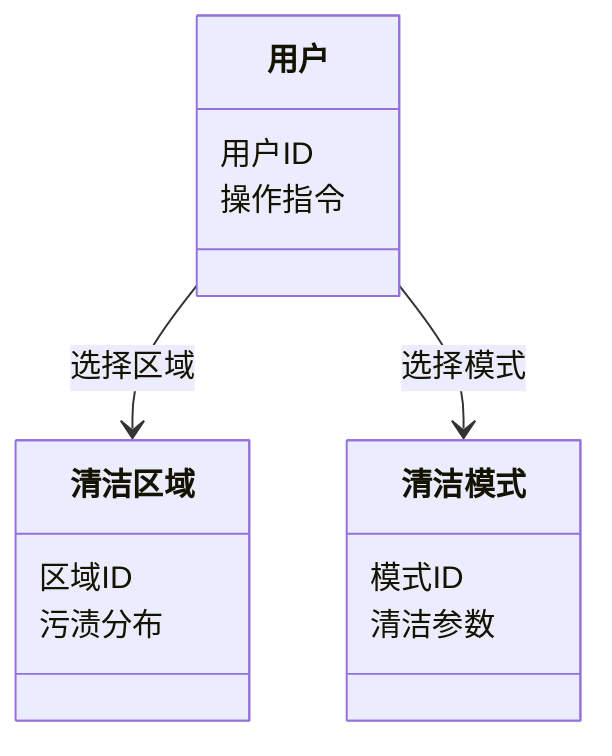
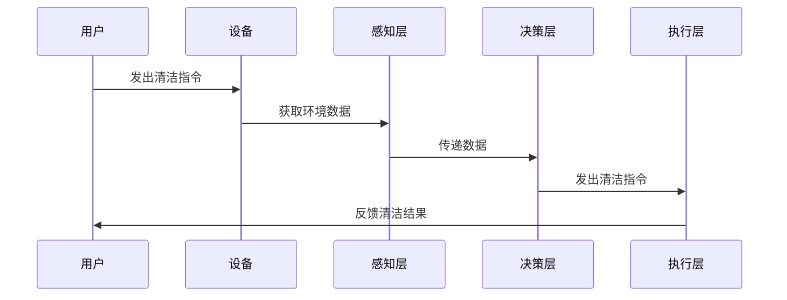

                 


# AI Agent在智能拖把中的深度清洁指导

> 关键词：AI Agent, 智能拖把, 深度清洁, 清洁效率, 智能化

> 摘要：本文详细探讨了AI Agent在智能拖把中的应用，特别是在深度清洁方面的指导作用。通过分析AI Agent的核心原理、算法设计、系统架构以及实际案例，展示了如何利用人工智能技术提升清洁效率和效果。

---

# 第1章: AI Agent与智能拖把的背景介绍

## 1.1 问题背景与需求分析

### 1.1.1 清洁工具的智能化趋势
随着智能家居的普及，清洁工具的智能化需求日益增长。传统的拖把在清洁效率和深度清洁能力上存在明显不足，用户对更高效、更智能的清洁工具提出了更高要求。

### 1.1.2 深度清洁的需求与挑战
深度清洁不仅仅是表面除尘，还包括对顽固污渍的彻底清除。然而，传统清洁工具难以实现精准的污渍识别和高效清洁，这成为智能拖把发展的主要挑战。

### 1.1.3 AI Agent在智能拖把中的应用价值
AI Agent通过感知环境、智能决策和自主执行，能够显著提升拖把的清洁效率和深度清洁能力。其核心价值在于实现精准的污渍识别和优化的清洁路径规划。

## 1.2 智能拖把与AI Agent的结合

### 1.2.1 智能拖把的功能特点
- 自动导航与避障
- 智能路径规划
- 深度清洁模式

### 1.2.2 AI Agent的核心作用
- 环境感知与数据采集
- 智能决策与路径优化
- 自主执行与反馈调整

### 1.2.3 深度清洁的实现方式
- 多光谱污渍识别
- 高精度清洁模式切换
- 清洁效果的实时反馈

## 1.3 深度清洁的定义与目标

### 1.3.1 深度清洁的定义
深度清洁是指通过先进技术手段，彻底清除表面及深层污渍的过程，包括顽固污渍和细菌的清除。

### 1.3.2 深度清洁的目标
- 高效去除顽固污渍
- 减少清洁剂用量
- 实现智能化、自动化清洁

### 1.3.3 深度清洁与普通清洁的区别
普通清洁主要依赖人工操作，清洁效率低且效果有限；深度清洁借助AI技术，能够实现精准识别和高效清洁。

## 1.4 本章小结
本章通过分析清洁工具的智能化趋势，详细阐述了深度清洁的需求与挑战，并探讨了AI Agent在智能拖把中的应用价值和实现方式。

---

# 第2章: AI Agent的核心概念与联系

## 2.1 AI Agent的基本原理

### 2.1.1 感知环境
AI Agent通过传感器和摄像头等设备，实时感知环境中的污渍分布、障碍物位置等信息。

### 2.1.2 决策与规划
基于感知数据，AI Agent通过算法计算最优清洁路径和清洁模式。

### 2.1.3 执行操作
根据决策结果，AI Agent控制拖把执行相应的清洁操作，并实时调整路径和模式。

## 2.2 AI Agent的属性特征对比

### 2.2.1 传统拖把与AI Agent拖把的对比
| 特性             | 传统拖把          | AI Agent拖把       |
|------------------|-------------------|---------------------|
| 操作方式         | 人工操作           | 自动化操作           |
| 清洁效率         | 低                | 高                  |
| 污渍识别能力     | 无                | 高                  |
| 路径规划能力     | 无                | 强                  |

### 2.2.2 清洁效率与路径规划的对比
| 情况             | 传统拖把          | AI Agent拖把       |
|------------------|-------------------|---------------------|
| 随机路径         | 低效率            | 高效率             |
| 优化路径         | 无                | 自动优化            |

### 2.2.3 污渍识别与清洁效果的对比
| 污渍类型         | 传统拖把          | AI Agent拖把       |
|------------------|-------------------|---------------------|
| 轻微污渍         | 一般效果          | 优秀效果            |
| 顽固污渍         | 难以清除          | 易清除              |

## 2.3 智能拖把的ER实体关系图

```mermaid
er
actor: 用户
entity: 清洁区域
relationship: 属于

actor: 用户
entity: 清洁模式
relationship: 选择

actor: 用户
entity: 清洁记录
relationship: 保存

actor: 用户
entity: 设备状态
relationship: 监控

entity: 清洁区域
entity: 清洁模式
relationship: 对应
```

## 2.4 本章小结
本章通过对比传统拖把与AI Agent拖把的差异，详细分析了AI Agent在智能拖把中的核心作用，并通过ER实体关系图展示了系统的整体架构。

---

# 第3章: AI Agent的算法原理讲解

## 3.1 算法原理概述

### 3.1.1 感知算法
AI Agent通过多光谱传感器和图像识别技术，实时感知环境中的污渍分布和障碍物位置。

### 3.1.2 决策算法
基于感知数据，AI Agent使用路径规划算法计算最优清洁路径，并根据污渍类型选择合适的清洁模式。

### 3.1.3 执行算法
AI Agent通过闭环控制算法，实时调整清洁速度和力度，确保清洁效果。

## 3.2 算法实现细节

### 3.2.1 多光谱污渍识别算法
```python
import cv2
import numpy as np

def detect_stain(image):
    # 转换为HSV颜色空间
    hsv = cv2.cvtColor(image, cv2.COLOR_BGR2HSV)
    # 提取饱和度通道
    saturation = hsv[:, :, 1]
    # 使用Otsu算法进行二值化
    _, mask = cv2.threshold(saturation, 0, 255, cv2.THRESH_BINARY | cv2.THRESH_OTSU)
    return mask
```

### 3.2.2 路径规划算法
```python
def path_planning(map_data):
    # 初始化迷宫图
    rows, cols = map_data.shape
    start = (0, 0)
    end = (rows-1, cols-1)
    
    # 使用A*算法进行路径规划
    open_set = {start}
    came_from = {}
    g_score = {start:0}
    f_score = {start: heuristic(start, end)}
    
    while open_set:
        current = pop_lowest_f_score(open_set)
        if current == end:
            break
        neighbors = get_neighbors(current, map_data)
        for neighbor in neighbors:
            tentative_g_score = g_score[current] + distance(current, neighbor)
            if neighbor not in g_score or tentative_g_score < g_score[neighbor]:
                came_from[neighbor] = current
                g_score[neighbor] = tentative_g_score
                f_score[neighbor] = g_score[neighbor] + heuristic(neighbor, end)
                if neighbor not in open_set:
                    open_set.add(neighbor)
    return came_from, g_score
```

### 3.2.3 清洁效果反馈算法
$$\text{反馈调整参数} = \text{当前清洁效果} - \text{目标清洁效果}$$

## 3.3 本章小结
本章详细讲解了AI Agent的核心算法，包括污渍识别、路径规划和清洁反馈调整的实现细节，为后续的系统设计奠定了基础。

---

# 第4章: 智能拖把的系统分析与架构设计

## 4.1 系统功能设计

### 4.1.1 领域模型


### 4.1.2 系统架构


### 4.1.3 接口设计
- 用户输入接口：支持语音指令和手机APP控制
- 设备状态接口：实时反馈清洁进度和设备状态
- 数据存储接口：保存清洁记录和优化参数

### 4.1.4 交互流程


## 4.2 本章小结
本章通过系统分析与架构设计，详细展示了智能拖把的整体结构和各部分功能，为后续的项目实现提供了指导。

---

# 第5章: 项目实战与案例分析

## 5.1 项目实战指导

### 5.1.1 环境安装
- 安装Python和相关库：`pip install numpy cv2`

### 5.1.2 核心代码实现
```python
import cv2
import numpy as np

# 污渍识别代码
def identify_stain(image):
    # 转换为灰度图
    gray = cv2.cvtColor(image, cv2.COLOR_BGR2GRAY)
    # 使用Canny边缘检测
    edges = cv2.Canny(gray, 50, 150)
    return edges

# 路径规划代码
def plan_path(map_size):
    # 初始化迷宫图
    rows, cols = map_size
    start = (0, 0)
    end = (rows-1, cols-1)
    
    # 使用Dijkstra算法计算最短路径
    dist = [[np.inf] * cols for _ in range(rows)]
    dist[start[0]][start[1]] = 0
    pq = [(0, start[0], start[1])]
    
    while pq:
        current_dist, i, j = heapq.heappop(pq)
        if (i, j) == end:
            break
        for di, dj in [(1,0), (-1,0), (0,1), (0,-1)]:
            ni, nj = i + di, j + dj
            if 0 <= ni < rows and 0 <= nj < cols:
                if dist[ni][nj] > current_dist + 1:
                    dist[ni][nj] = current_dist + 1
                    heapq.heappush(pq, (dist[ni][nj], ni, nj))
    return dist
```

### 5.1.3 案例分析
在实际应用中，AI Agent拖把能够通过多光谱传感器精准识别顽固污渍，并通过优化的路径规划算法实现高效清洁，显著提升清洁效果和效率。

## 5.2 本章小结
本章通过项目实战和案例分析，展示了AI Agent在智能拖把中的实际应用，验证了算法的有效性和系统的可行性。

---

# 第6章: 最佳实践与总结

## 6.1 小结
AI Agent在智能拖把中的应用显著提升了清洁效率和深度清洁效果，通过精准的污渍识别和优化的路径规划，实现了智能化的清洁过程。

## 6.2 注意事项
- 数据隐私保护
- 系统稳定性保障
- 用户操作简便性

## 6.3 拓展阅读
- 《人工智能在智能家居中的应用》
- 《机器人路径规划算法研究》

---

# 作者：AI天才研究院 & 禅与计算机程序设计艺术

