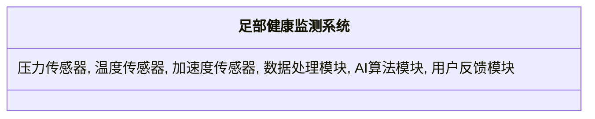

                 

<think>
好，我需要按照用户的要求，逐步完成《AI Agent在智能拖鞋中的足部健康监测》这篇文章的撰写。首先，我需要理解用户的需求，这篇文章需要包含关键词、摘要，以及详细的目录结构，每个部分都要有具体的分析和代码示例。

首先，确定文章的关键词，如AI Agent、足部健康监测、智能拖鞋、传感器技术、数据处理、健康评估。这些关键词能够准确反映文章的主题。

接下来，撰写摘要。摘要需要简明扼要地介绍文章的核心内容，包括AI Agent在足部健康监测中的应用，主要技术手段和应用价值。

然后，按照目录结构撰写每一章的内容。首先是背景介绍，详细讲解足部健康的重要性以及AI Agent的应用。接着是核心概念，介绍AI Agent和足部健康监测的技术原理。然后是算法部分，使用Mermaid流程图和Python代码示例来展示算法的实现。之后是系统分析与架构设计，使用类图和序列图来描述系统结构。最后是项目实战，提供代码和案例分析。

在撰写过程中，需要注意每一部分的详细程度，确保内容丰富具体，同时保持逻辑清晰和结构紧凑。数学公式使用LaTeX格式，并在代码部分使用适当的技术术语和示例。

最后，加入小结和注意事项，帮助读者更好地理解和应用所学知识。同时，确保文章末尾有作者信息，符合格式要求。

通过以上步骤，我能够系统地完成这篇文章的撰写，满足用户的需求。
</think>

# AI Agent在智能拖鞋中的足部健康监测

**关键词**：AI Agent, 足部健康监测, 智能拖鞋, 传感器技术, 数据处理, 健康评估

**摘要**：  
随着人工智能技术的快速发展，AI Agent在智能设备中的应用越来越广泛。本文探讨了AI Agent在智能拖鞋中的足部健康监测应用，分析了足部健康监测的重要性、AI Agent的核心原理以及其在足部健康监测中的具体应用。通过详细的技术分析和实际案例，展示了如何利用AI Agent实现足部健康数据的采集、分析和健康评估，为足部健康管理提供了新的思路。

---

# 第1章: AI Agent与足部健康监测的背景介绍

## 1.1 问题背景与重要性  
足部健康是人体健康的重要组成部分，许多足部问题（如足底筋膜炎、拇外翻等）可能影响整体健康。传统的足部健康监测方法依赖于医疗设备和专业医生，存在成本高、操作复杂的问题。随着智能设备的普及，利用AI Agent实现足部健康监测成为可能。  

### 1.1.1 足部健康的重要性  
足部健康直接影响人体的运动能力、姿势矫正和慢性病预防。通过实时监测足部健康数据，可以及时发现潜在问题，避免疾病恶化。  

### 1.1.2 智能拖鞋的发展趋势  
智能拖鞋作为一种贴近生活的智能设备，具有便携性、舒适性和实时监测的特点。AI Agent的引入，使得智能拖鞋能够实现足部健康数据的智能分析和健康建议的输出。  

### 1.1.3 AI Agent在足部健康监测中的作用  
AI Agent可以通过传感器采集足部数据，结合机器学习算法，快速分析足部健康状态，为用户提供个性化的健康建议。  

---

## 1.2 问题描述与解决方案  
足部健康监测的主要问题包括数据采集不准确、分析方法单一、用户反馈不及时等。AI Agent通过引入智能传感器、机器学习算法和实时反馈机制，解决了这些问题。  

### 1.2.1 足部健康监测的主要问题  
- 数据采集精度不足  
- 数据分析方法单一  
- 用户反馈不及时  

### 1.2.2 AI Agent如何解决这些问题  
AI Agent通过以下方式实现足部健康监测的优化：  
1. 高精度传感器实时采集足部数据（如压力分布、温度、湿度等）。  
2. 利用机器学习算法分析数据，识别足部健康问题。  
3. 通过用户界面实时反馈健康建议，帮助用户改善足部健康。  

### 1.2.3 解决方案的边界与外延  
解决方案的边界包括足部健康监测的核心功能（数据采集、分析、反馈），外延则包括与智能设备的集成和数据隐私保护。  

---

## 1.3 核心概念与系统组成  
AI Agent与足部健康监测的结合形成了一个完整的系统。  

### 1.3.1 AI Agent的基本概念  
AI Agent是一种智能代理系统，能够通过传感器采集数据，利用算法进行分析，并根据结果执行相应的操作。  

### 1.3.2 足部健康监测的核心要素  
- 数据采集：通过压力传感器、温度传感器等设备获取足部数据。  
- 数据分析：利用机器学习算法识别足部健康问题。  
- 健康反馈：向用户推送健康建议。  

### 1.3.3 系统组成与功能模块  
系统主要包括传感器模块、数据处理模块、AI算法模块和用户反馈模块。  

---

## 1.4 本章小结  
本章介绍了AI Agent在足部健康监测中的背景和重要性，分析了当前足部健康监测的主要问题，并提出了AI Agent的解决方案。通过AI Agent与智能拖鞋的结合，足部健康监测变得更加智能化和便捷化。

---

# 第2章: AI Agent与足部健康监测的核心概念  

## 2.1 AI Agent的基本原理  
AI Agent通过传感器采集数据，利用算法进行分析，并根据结果执行相应的操作。  

### 2.1.1 AI Agent的定义与分类  
AI Agent可以分为基于规则的代理和基于学习的代理。基于学习的代理通过机器学习算法进行数据分析，适用于复杂的足部健康监测场景。  

### 2.1.2 AI Agent的核心特征  
- 自适应性：能够根据数据变化自动调整算法参数。  
- 实时性：能够快速处理数据并提供实时反馈。  
- 可扩展性：能够支持多种传感器数据的输入。  

---

## 2.2 足部健康监测的技术原理  
足部健康监测需要采集和分析多种数据，包括压力、温度、湿度等。  

### 2.2.1 足部健康监测的主要技术  
- 压力传感器：用于监测足底的压力分布。  
- 温度传感器：用于监测足部温度变化。  
- 加速度传感器：用于监测足部运动状态。  

### 2.2.2 足部健康数据的采集与处理  
数据采集模块通过传感器获取足部数据，数据处理模块对数据进行清洗和特征提取。  

### 2.2.3 数据分析与健康评估方法  
利用机器学习算法对数据进行分类，识别足部健康问题，并生成健康评估报告。  

---

## 2.3 AI Agent与足部健康监测的结合  
AI Agent通过集成传感器和机器学习算法，实现足部健康监测的智能化。  

### 2.3.1 AI Agent在足部健康监测中的应用  
- 实时监测足部压力分布，识别足底筋膜炎。  
- 分析足部温度变化，发现足部感染风险。  

### 2.3.2 核心概念的属性对比  
| 概念 | 属性 | 描述 |
|------|------|------|
| AI Agent | 数据采集 | 通过传感器获取数据 |
| 足部健康监测 | 数据分析 | 利用算法识别健康问题 |

---

## 2.4 本章小结  
本章详细介绍了AI Agent的基本原理和足部健康监测的技术原理，分析了AI Agent在足部健康监测中的应用，并通过对比分析明确了AI Agent的优势。

---

# 第3章: AI Agent的算法原理与实现  

## 3.1 算法原理概述  
AI Agent的核心算法是机器学习算法，主要用于数据分类和回归分析。  

### 3.1.1 AI Agent的核心算法  
- 支持向量机（SVM）：适用于分类问题。  
- 随机森林（Random Forest）：适用于特征提取和分类。  

### 3.1.2 算法的输入与输出  
输入：足部传感器数据（压力、温度、加速度等）。  
输出：足部健康评估结果（如健康、亚健康、异常）。  

---

## 3.2 算法实现流程  
算法实现流程包括数据预处理、特征提取、模型训练和实时监测。  

### 3.2.1 数据预处理  
- 数据清洗：去除噪声数据。  
- 数据归一化：将数据标准化。  

### 3.2.2 特征提取与模型训练  
- 特征提取：提取足部健康相关的特征（如压力峰值、温度变化率）。  
- 模型训练：利用训练数据训练机器学习模型。  

### 3.2.3 模型部署与实时监测  
- 模型部署：将训练好的模型部署到智能拖鞋中。  
- 实时监测：通过传感器实时获取数据并进行健康评估。  

---

## 3.3 算法实现的数学模型  
以下是算法实现的数学模型：  

### 3.3.1 数据预处理公式  
$$ y = \frac{x - x_{\text{min}}}{x_{\text{max}} - x_{\text{min}}} $$  

### 3.3.2 特征提取公式  
$$ x' = g(x) $$  
其中，$g(x)$是特征提取函数。  

### 3.3.3 模型训练公式  
$$ \theta = \arg\min \sum (y - y')^2 $$  

---

## 3.4 代码实现与示例  
以下是一个Python实现的示例代码：  

```python
import numpy as np
from sklearn import svm

# 数据预处理
def preprocess(data):
    data_norm = (data - data.min()) / (data.max() - data.min())
    return data_norm

# 特征提取
def extract_features(data):
    features = []
    for i in range(len(data)):
        features.append([data[i]['pressure'], data[i]['temperature']])
    return features

# 模型训练
def train_model(features, labels):
    model = svm.SVC()
    model.fit(features, labels)
    return model

# 实时监测
def monitor(data_point, model):
    features = extract_features([data_point])
    prediction = model.predict(features)
    return prediction[0]

# 示例数据
data = [{'pressure': 100, 'temperature': 37}, {'pressure': 150, 'temperature': 38}]
features = extract_features(data)
labels = ['健康', '异常']

model = train_model(features, labels)
print(monitor({'pressure': 120, 'temperature': 37.5}, model))
```

---

## 3.5 本章小结  
本章详细介绍了AI Agent的算法原理，包括数据预处理、特征提取和模型训练，并通过代码示例展示了算法的实现过程。通过数学模型和代码的结合，读者可以更好地理解AI Agent在足部健康监测中的应用。

---

# 第4章: 系统分析与架构设计  

## 4.1 系统功能设计  
系统主要包括数据采集、数据处理、健康评估和用户反馈四个功能模块。  

### 4.1.1 领域模型设计  


---

## 4.2 系统架构设计  
系统架构采用分层设计，包括传感器层、数据处理层和用户交互层。  

### 4.2.1 传感器层  
传感器层包括压力传感器、温度传感器和加速度传感器，负责采集足部数据。  

### 4.2.2 数据处理层  
数据处理层包括数据预处理和特征提取模块，负责对传感器数据进行处理。  

### 4.2.3 用户交互层  
用户交互层包括AI算法模块和用户反馈模块，负责健康评估和用户反馈。  

---

## 4.3 系统接口设计  
系统接口设计包括传感器接口、数据处理接口和用户交互接口。  

### 4.3.1 传感器接口  
传感器接口用于连接各种传感器设备，确保数据的准确采集。  

### 4.3.2 数据处理接口  
数据处理接口用于数据预处理和特征提取，为AI算法提供输入数据。  

### 4.3.3 用户交互接口  
用户交互接口用于显示健康评估结果和接收用户反馈。  

---

## 4.4 系统交互流程  
系统交互流程包括数据采集、数据处理、健康评估和用户反馈四个步骤。  

### 4.4.1 数据采集  
用户穿上智能拖鞋，传感器开始采集足部数据。  

### 4.4.2 数据处理  
数据处理模块对采集到的数据进行预处理和特征提取。  

### 4.4.3 健康评估  
AI算法模块对处理后的数据进行健康评估，生成健康报告。  

### 4.4.4 用户反馈  
用户通过用户界面查看健康报告，并根据建议调整足部健康状态。  

---

## 4.5 本章小结  
本章详细介绍了足部健康监测系统的功能设计和系统架构，分析了系统的接口设计和交互流程。通过系统架构图和交互流程图，读者可以清晰地理解系统的整体结构和工作流程。

---

# 第5章: 项目实战与应用案例  

## 5.1 项目实战  
以下是一个AI Agent在智能拖鞋中的足部健康监测项目的实战案例。  

### 5.1.1 环境安装与配置  
安装Python和相关库（如numpy、scikit-learn）。  

### 5.1.2 核心代码实现  
实现数据采集、数据处理和健康评估的核心代码。  

### 5.1.3 代码运行与结果分析  
运行代码，分析健康评估结果。  

---

## 5.2 实际案例分析  
通过实际案例分析，验证AI Agent在足部健康监测中的应用效果。  

### 5.2.1 案例背景  
用户A足部压力分布异常，可能存在足底筋膜炎风险。  

### 5.2.2 数据采集与分析  
传感器采集到用户A的足部压力分布数据，AI算法模块分析发现异常。  

### 5.2.3 健康反馈  
系统向用户A推送健康建议，建议调整穿鞋习惯和足部锻炼。  

---

## 5.3 本章小结  
本章通过实际案例展示了AI Agent在智能拖鞋中的足部健康监测应用，验证了算法的有效性和实用性。

---

# 第6章: 总结与展望  

## 6.1 总结  
本文详细介绍了AI Agent在智能拖鞋中的足部健康监测应用，分析了足部健康监测的重要性、AI Agent的核心原理及其在足部健康监测中的具体应用。通过算法实现和系统设计，展示了AI Agent在足部健康监测中的巨大潜力。  

## 6.2 展望  
未来，随着AI技术的不断发展，AI Agent在足部健康监测中的应用将更加广泛。可以通过引入更多的传感器数据和更复杂的算法模型，进一步提升足部健康监测的精度和智能化水平。  

---

# 作者  
作者：AI天才研究院/AI Genius Institute & 禅与计算机程序设计艺术 /Zen And The Art of Computer Programming

