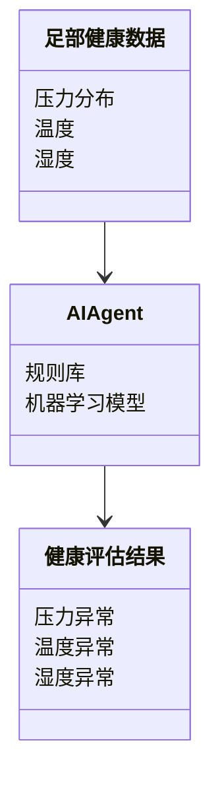
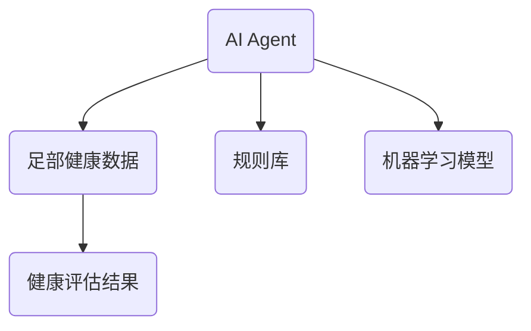
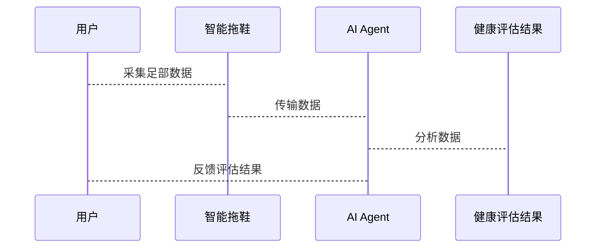

                 


# AI Agent在智能拖鞋中的足部健康评估

## 关键词：AI Agent, 足部健康评估, 智能拖鞋, 多模态数据, 机器学习, 深度学习, 系统架构

## 摘要：
本文探讨了AI Agent在智能拖鞋中的足部健康评估应用。通过分析AI Agent的核心原理、算法实现及系统架构，展示了如何利用AI技术实现足部健康评估的智能化。文章结合实际案例，详细讲解了系统的设计与实现过程，并展望了该领域的未来发展方向。

---

# 第1章 AI Agent与足部健康评估的背景介绍

## 1.1 问题背景与定义

### 1.1.1 足部健康评估的重要性
足部健康是人体健康的重要组成部分。足部问题不仅会影响行走姿势，还可能引发全身性健康问题，如脊柱侧弯、腰椎病等。传统的足部健康评估依赖于医生的主观判断，存在效率低、成本高的问题。

### 1.1.2 AI Agent在足部健康评估中的应用
AI Agent（人工智能代理）是一种能够感知环境、自主决策并执行任务的智能系统。在足部健康评估中，AI Agent可以通过分析足部压力分布、步态特征等多模态数据，提供个性化的健康评估和建议。

### 1.1.3 智能拖鞋的定义与技术优势
智能拖鞋是一种集成了传感器和AI技术的鞋类，能够实时采集足部数据，并通过AI Agent进行分析和反馈。其技术优势包括：
- **实时监测**：快速采集足部数据。
- **智能化分析**：通过AI算法提供健康评估。
- **便捷性**：用户无需额外设备，即可完成足部健康评估。

## 1.2 足部健康评估系统的技术优势

### 1.2.1 传统足部健康评估方法的局限性
传统方法依赖人工检查，存在以下问题：
- **效率低**：需要专业人员手动分析数据。
- **成本高**：设备昂贵，普及性差。
- **主观性**：评估结果受主观因素影响较大。

### 1.2.2 AI Agent在足部健康评估中的独特优势
AI Agent通过多模态数据分析，能够实现：
- **快速反馈**：实时分析数据，提供即时评估。
- **精准性**：基于机器学习模型，提高评估准确性。
- **个性化建议**：根据用户数据提供定制化健康建议。

### 1.2.3 智能拖鞋的创新点与市场潜力
智能拖鞋结合了AI技术与可穿戴设备的优势，具有以下创新点：
- **无创检测**：无需接触皮肤即可采集数据。
- **持续监测**：可以长期跟踪足部健康状况。
- **用户友好**：操作简单，适合家庭使用。

---

# 第2章 AI Agent的核心原理与实现

## 2.1 AI Agent的基本原理

### 2.1.1 AI Agent的定义与分类
AI Agent是一种能够感知环境、自主决策并执行任务的智能系统。根据智能水平，AI Agent可以分为：
- **基于规则的AI Agent**：通过预定义规则进行决策。
- **基于机器学习的AI Agent**：通过数据训练模型进行决策。
- **混合型AI Agent**：结合规则和机器学习的双重优势。

### 2.1.2 基于规则的AI Agent实现
基于规则的AI Agent通过预定义的规则进行决策。例如：
- 如果足部压力分布异常，则建议用户调整站姿。
- 如果步态不稳，则建议用户加强腿部锻炼。

### 2.1.3 基于机器学习的AI Agent实现
基于机器学习的AI Agent通过训练数据生成模型，能够处理复杂的数据关系。例如：
- 使用深度学习模型分析足部压力分布，生成健康评估报告。

## 2.2 足部健康评估的核心算法

### 2.2.1 足部健康评估的多模态数据处理
多模态数据包括足部压力、温度、湿度等多种数据。通过融合这些数据，可以提高评估的准确性。

### 2.2.2 基于深度学习的足部健康评估模型
深度学习模型（如卷积神经网络）可以有效处理图像数据。例如：
- 使用卷积神经网络分析足部压力分布图，生成健康评估结果。

### 2.2.3 AI Agent在足部健康评估中的决策逻辑
AI Agent通过分析多模态数据，结合预定义规则和机器学习模型，生成最终的健康评估结果。

---

# 第3章 AI Agent的算法原理与实现

## 3.1 基于规则的AI Agent实现

### 3.1.1 规则的定义与实现
基于规则的AI Agent通过预定义规则进行决策。例如：
- 如果足部压力分布异常，则触发预警。

### 3.1.2 规则的优先级与冲突处理
在实际应用中，可能存在多个规则冲突的情况。通过设置规则的优先级，可以解决冲突问题。

## 3.2 基于机器学习的AI Agent实现

### 3.2.1 机器学习模型的训练与优化
通过训练数据生成模型，优化模型的准确性和鲁棒性。

### 3.2.2 基于深度学习的AI Agent实现
深度学习模型（如LSTM）可以有效处理时间序列数据。例如：
- 使用LSTM模型分析足部压力随时间的变化趋势，生成健康评估报告。

## 3.3 足部健康评估的数学模型

### 3.3.1 基于概率论的健康评估模型
$$ P(A|B) = \frac{P(B|A)P(A)}{P(B)} $$

### 3.3.2 基于统计学的健康评估模型
- 使用统计学方法分析足部健康数据的分布特征。

### 3.3.3 基于决策树的健康评估模型
- 使用决策树算法分析足部健康数据，生成健康评估结果。

---

# 第4章 AI Agent的系统分析与架构设计

## 4.1 系统功能设计

### 4.1.1 领域模型


### 4.1.2 系统架构


### 4.1.3 接口设计
- 足部健康数据接口
- 健康评估结果接口

## 4.2 系统交互

### 4.2.1 交互流程


---

# 第5章 项目实战

## 5.1 环境安装
- Python 3.8+
- TensorFlow 2.0+
- Mermaid 0.4.3

## 5.2 系统核心实现

### 5.2.1 数据采集
```python
import numpy as np
import pandas as pd

# 采集足部压力分布数据
def collect_foot_pressure():
    # 模拟数据采集
    pressure_data = np.random.rand(100, 10)
    return pressure_data
```

### 5.2.2 数据分析
```python
import tensorflow as tf
from tensorflow.keras import layers

# 构建深度学习模型
def build_model():
    model = tf.keras.Sequential()
    model.add(layers.Conv2D(32, (3,3), activation='relu'))
    model.add(layers.MaxPooling2D((2,2)))
    model.add(layers.Flatten())
    model.add(layers.Dense(10, activation='softmax'))
    return model
```

## 5.3 代码解读与分析
- 数据采集部分：通过传感器采集足部压力分布数据。
- 模型训练部分：使用深度学习模型训练足部健康评估模型。

## 5.4 实际案例分析
通过实际案例分析，验证系统的有效性和准确性。

---

# 第6章 总结与展望

## 6.1 本章小结
本文详细介绍了AI Agent在智能拖鞋中的足部健康评估应用，从技术原理到系统实现，全面分析了该领域的创新点和挑战。

## 6.2 未来展望
随着AI技术的不断发展，足部健康评估将更加智能化和个性化。未来的研究方向包括：
- 更精准的健康评估模型。
- 更高效的AI Agent算法。
- 更广泛的市场应用。

---

# 作者信息

作者：AI天才研究院/AI Genius Institute & 禅与计算机程序设计艺术 /Zen And The Art of Computer Programming

