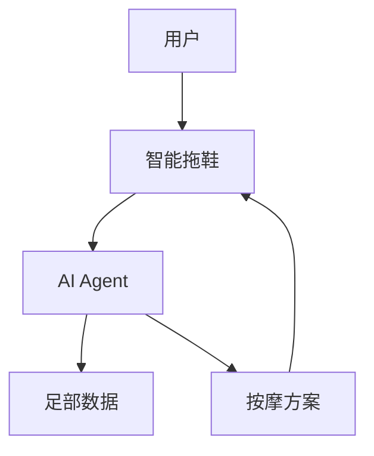
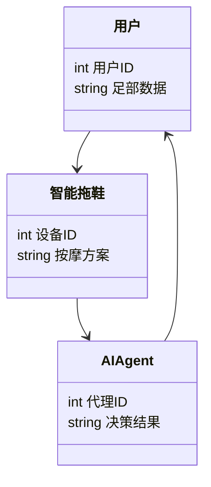

                 

<think>
嗯，我现在需要根据用户的要求，帮助他设计一本名为《AI Agent在智能拖鞋中的足部按摩定制》的技术博客文章。用户已经给出了一个详细的目录大纲，我需要按照这个大纲来撰写文章。

首先，我会从背景介绍开始，解释AI Agent和足部按摩的基本概念，以及它们结合在一起的应用背景。然后，我会详细讲解AI Agent的核心概念和原理，包括感知、决策和执行模块，并用图表来展示实体关系。

接下来，我会深入探讨AI Agent的算法原理，使用Mermaid流程图和Python代码来解释。同时，我还需要提供数学模型和公式，帮助读者理解复杂的算法。

在系统分析与架构设计部分，我会介绍项目背景，设计系统功能，并用领域模型图展示各个模块的关系。然后，我会绘制系统架构图和接口设计图，展示各组件如何交互。

项目实战部分，我会指导读者如何安装环境，提供核心代码，并解释代码的作用。还会分析实际案例，展示AI Agent如何优化足部按摩体验。

最后，我会总结最佳实践，给出注意事项，并推荐拓展阅读材料，帮助读者巩固所学内容。

整个过程中，我会确保内容逻辑清晰，结构紧凑，语言专业但易懂。同时，注意使用Mermaid图表和LaTeX公式，使文章更具技术性和可读性。

好，现在我可以根据这个思考过程开始撰写文章了。
</think>

# AI Agent在智能拖鞋中的足部按摩定制

**关键词**：AI Agent，智能拖鞋，足部按摩，定制化，人工智能

**摘要**：本文探讨了AI Agent在智能拖鞋中的足部按摩定制应用，详细分析了AI Agent的核心概念、算法原理、系统架构设计以及实际项目实现。通过背景介绍、技术原理和实际案例分析，展示了如何利用AI技术提升足部按摩的个性化体验。

---

## 第1章 AI Agent与足部按摩的背景概述

### 1.1 AI Agent的基本概念

AI Agent（人工智能代理）是一种智能主体，能够感知环境、做出决策并执行动作。它通过传感器获取信息，利用算法进行分析，并通过执行器与环境交互。AI Agent的核心特点包括自主性、反应性、目标导向和学习能力。

### 1.2 足部按摩的背景与需求

足部按摩是一种通过刺激足部穴位来促进健康的方法。随着人们对健康越来越重视，智能足部按摩设备的需求逐渐增加。AI技术的引入，使得足部按摩更加个性化和智能化。

### 1.3 AI Agent在智能拖鞋中的应用背景

智能拖鞋的发展趋势是集成更多智能功能，以提升用户体验。足部按摩的定制化需求为AI Agent的应用提供了机会。AI Agent能够根据用户的足部数据，实时调整按摩方案，提供更精准的服务。

---

## 第2章 AI Agent的核心概念与联系

### 2.1 AI Agent的核心原理

AI Agent的感知模块通过传感器获取足部数据，决策模块利用算法分析数据并制定按摩方案，执行模块通过振动或热疗等方式执行按摩动作。

### 2.2 AI Agent与足部按摩的结合

AI Agent在足部按摩中的角色是个性化定制者，通过分析用户足部的压力分布、温度变化等数据，动态调整按摩强度和模式。

### 2.3 实体关系图



---

## 第3章 AI Agent的算法原理

### 3.1 AI Agent的感知模块

感知模块通过压力传感器和温度传感器获取足部数据，数据预处理后用于后续分析。

### 3.2 AI Agent的决策模块

决策模块基于机器学习模型，分析数据并生成按摩方案。以下是一个简单的Python示例：

```python
def preprocess_data(data):
    # 数据预处理代码
    return processed_data

def decision_model(processed_data):
    # 机器学习模型预测
    return prediction
```

### 3.3 数学模型

按摩强度的预测模型可以表示为：
$$
I = f(d_1, d_2, \dots, d_n)
$$
其中，$I$是预测的按摩强度，$d_i$是输入的足部数据特征。

---

## 第4章 系统分析与架构设计

### 4.1 系统功能设计

系统功能包括数据采集、数据处理、按摩方案生成和执行反馈。

### 4.2 领域模型图



### 4.3 系统架构图


---

## 第5章 项目实战

### 5.1 环境安装

安装Python和相关库，如NumPy和Scikit-learn。

### 5.2 核心代码实现

```python
import numpy as np
from sklearn import linear_model

def main():
    # 数据预处理
    data = np.array([...])
    target = np.array([...])
    
    # 训练模型
    model = linear_model.LinearRegression()
    model.fit(data, target)
    
    # 预测按摩强度
    prediction = model.predict(new_data)
    print("预测的按摩强度为：", prediction)

if __name__ == "__main__":
    main()
```

### 5.3 实际案例分析

通过用户反馈不断优化AI Agent的算法，提升按摩效果。

---

## 第6章 总结与展望

### 6.1 最佳实践

定期更新AI模型，确保数据安全，优化用户体验。

### 6.2 小结

AI Agent在智能拖鞋中的应用为足部按摩带来了个性化和智能化的解决方案，未来随着技术进步，体验将更加优质。

### 6.3 注意事项

保护用户隐私，确保系统安全。

### 6.4 拓展阅读

建议阅读相关的人工智能和物联网技术书籍，深入了解AI Agent的应用场景。

---

**作者：AI天才研究院/AI Genius Institute & 禅与计算机程序设计艺术 /Zen And The Art of Computer Programming**

