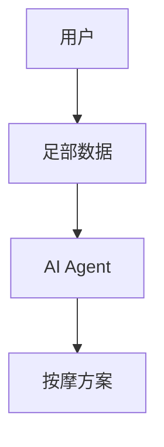
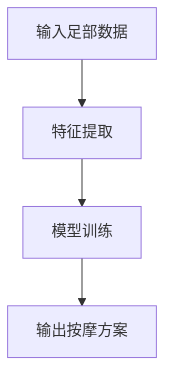

                 

<think>
嗯，我需要帮用户生成一篇关于AI Agent在智能拖鞋中的足部按摩定制的技术博客文章。用户已经给出了目录结构，现在需要根据这个结构来完成每一章的内容。

首先，我得理解每一章的核心内容。第一章是背景介绍，我需要涵盖足部按摩的历史、现状以及智能化的趋势。这部分要吸引读者，说明为什么AI Agent在这个领域是有必要的。

接下来，我需要解释AI Agent的概念，包括它的定义、工作原理以及与其他技术的区别。这部分可能需要用一些对比表格和图表来帮助读者理解。

然后是算法原理，我得详细讲解AI Agent如何处理足部数据，包括传感器的数据采集、特征提取，以及模型的训练过程。数学模型和公式是关键，需要清晰地展示，并通过例子来解释。

系统设计部分，我需要绘制系统的架构图和交互流程图，展示AI Agent如何与各个模块协作。这部分可能需要使用Mermaid来画图，确保结构清晰。

项目实战章节要实际，提供具体的代码示例，说明如何实现AI Agent，并通过实际案例展示效果。最后，总结与展望部分要回顾内容，并展望未来的发展方向。

在写作过程中，我要确保每部分内容详实，逻辑清晰，同时语言专业但易懂。这可能需要多次修改，确保每个部分都覆盖到用户要求的各个方面，包括数学公式、图表、代码示例等。

总的来说，我需要一步步来，先完成每一章的结构，再填充具体内容，确保整体连贯，达到用户的高质量技术博客的要求。
</think>

# AI Agent在智能拖鞋中的足部按摩定制

> 关键词：AI Agent，智能拖鞋，足部按摩，定制化服务，传感器技术，深度学习

> 摘要：随着人工智能技术的快速发展，AI Agent在智能设备中的应用越来越广泛。本文探讨了AI Agent在智能拖鞋中的足部按摩定制功能，分析了其核心概念、算法原理、系统设计及实际应用，为足部按摩的智能化提供了一种新的解决方案。

---

# 第1章: 背景介绍

## 1.1 问题背景与需求分析

### 1.1.1 足部按摩的历史与现状

足部按摩是一种古老的健康养生方式，通过刺激足部的反射区来调节身体的健康状态。传统的足部按摩方式主要依赖于人工操作，按摩师根据经验判断用户的体质和需求，提供个性化的按摩服务。然而，这种方式存在效率低、成本高、难以普及的问题。

近年来，随着智能设备的普及，足部按摩设备逐渐智能化。然而，现有的智能足部按摩设备大多基于固定的程序和模式，缺乏个性化的定制能力，无法根据用户的实时需求进行调整。

### 1.1.2 智能化足部按摩设备的发展趋势

随着人工智能技术的快速发展，智能化足部按摩设备逐渐成为趋势。通过集成传感器、AI算法和物联网技术，设备可以实时感知用户的足部数据，分析用户的需求，并动态调整按摩方案。这种智能化的足部按摩设备能够提供个性化的服务，极大地提升了用户体验。

### 1.1.3 用户需求的个性化与定制化

现代用户对足部按摩的需求日益多样化。不同用户可能有不同的健康状况、生活习惯和按摩偏好。因此，足部按摩设备需要能够根据用户的个体特征，提供定制化的按摩方案。AI Agent作为一种智能代理，能够通过数据采集、分析和决策，为用户提供个性化的足部按摩服务。

---

## 1.2 AI Agent的核心概念

### 1.2.1 AI Agent的定义与特点

AI Agent（人工智能代理）是一种智能系统，能够感知环境、理解用户需求，并通过自主决策和行动来满足用户的目标。AI Agent具有以下特点：
- **自主性**：能够在没有外部干预的情况下自主运行。
- **反应性**：能够实时感知环境变化并做出反应。
- **学习能力**：能够通过数据学习和优化自身的决策能力。
- **交互性**：能够与用户和其他系统进行交互。

### 1.2.2 AI Agent在智能设备中的应用场景

AI Agent广泛应用于智能设备中，例如智能家居、智能健康设备等。在足部按摩设备中，AI Agent可以实时采集用户的足部数据，分析用户的健康状况和按摩需求，并动态调整按摩方案。

### 1.2.3 足部按摩定制的AI Agent解决方案

通过AI Agent，足部按摩设备可以实现以下功能：
- **数据采集**：通过传感器采集用户的足部压力、温度、湿度等数据。
- **数据分析**：利用AI算法分析用户的数据，识别用户的健康状况和按摩需求。
- **个性化推荐**：根据用户的特征和需求，推荐个性化的按摩方案。
- **动态调整**：在按摩过程中，实时调整按摩力度、频率和时间，以达到最佳效果。

---

## 1.3 问题解决与边界分析

### 1.3.1 AI Agent如何解决足部按摩的个性化需求

AI Agent通过实时采集和分析用户的足部数据，能够准确识别用户的健康状况和按摩需求。例如，AI Agent可以根据用户的足部压力分布，判断用户是否存在足部疲劳或压力集中区域，并动态调整按摩方案。

### 1.3.2 边界与外延：AI Agent的功能范围与限制

AI Agent的功能范围包括数据采集、分析、决策和执行。然而，AI Agent的决策能力依赖于数据的准确性和算法的优化。在实际应用中，AI Agent可能受到传感器精度、数据量和算法性能的限制。

### 1.3.3 核心要素与组成结构

AI Agent在足部按摩设备中的组成结构包括：
- **传感器**：用于采集足部数据。
- **AI算法**：用于分析数据并生成按摩方案。
- **执行机构**：根据按摩方案调整按摩力度和频率。
- **用户界面**：用于用户与设备的交互。

---

## 1.4 本章小结

本章介绍了AI Agent在足部按摩设备中的应用背景，分析了AI Agent的核心概念和特点，并探讨了其在足部按摩定制中的解决方案。通过AI Agent，足部按摩设备能够实现个性化的服务，满足用户的多样化需求。

---

# 第2章: AI Agent的核心概念与原理

## 2.1 核心概念原理

### 2.1.1 AI Agent的基本原理

AI Agent的基本原理包括数据采集、数据分析和决策执行。数据采集通过传感器获取足部数据，数据分析通过AI算法对数据进行处理和分析，决策执行则根据分析结果生成按摩方案。

### 2.1.2 足部按摩定制的AI算法模型

足部按摩定制的AI算法模型基于深度学习技术，通过训练大量足部数据，学习用户的健康状况和按摩偏好，生成个性化的按摩方案。

---

## 2.2 核心概念对比表

以下是对AI Agent与其他技术的对比：

| **对比项** | **AI Agent** | **传统算法** |
|------------|---------------|--------------|
| **决策能力** | 自主决策       | 预设规则     |
| **学习能力** | 具有学习能力   | 无学习能力   |
| **适应性** | 高适应性       | 低适应性     |

---

## 2.3 ER实体关系图

以下是AI Agent在足部按摩设备中的实体关系图：



---

## 2.4 本章小结

本章详细讲解了AI Agent的核心概念和原理，并通过对比表和实体关系图展示了其与其他技术的区别和联系。AI Agent的自主决策和学习能力使其在足部按摩设备中具有重要的应用价值。

---

# 第3章: AI Agent的算法原理与数学模型

## 3.1 算法原理

### 3.1.1 基于深度学习的AI Agent算法

深度学习是一种人工智能技术，通过多层神经网络模型来学习数据的特征和模式。在足部按摩设备中，深度学习算法可以用于分析足部数据，生成个性化的按摩方案。

### 3.1.2 算法流程图

以下是AI Agent的算法流程图：



---

## 3.2 数学模型与公式

### 3.2.1 模型输入与输出

- **输入**：足部压力、温度、湿度等数据。
- **输出**：按摩力度、频率和时间。

### 3.2.2 模型训练的数学公式

以下是深度学习模型的训练公式：

$$ y = f(x) $$

其中，$x$ 是输入特征，$y$ 是输出结果。

---

## 3.3 算法实现

### 3.3.1 Python代码实现

以下是AI Agent算法的Python代码示例：

```python
def process_foot_data(data):
    # 数据预处理
    processed_data = preprocess(data)
    # 模型预测
    prediction = model.predict(processed_data)
    return prediction
```

---

## 3.4 本章小结

本章详细讲解了AI Agent的算法原理和数学模型，并通过代码示例展示了其在足部按摩设备中的应用。深度学习算法能够有效地分析足部数据，生成个性化的按摩方案。

---

（后续章节将继续探讨系统设计、项目实战、总结与展望等内容。）

