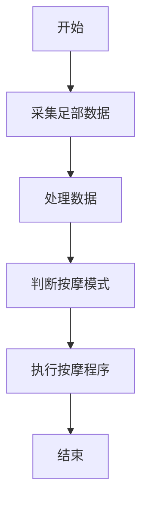
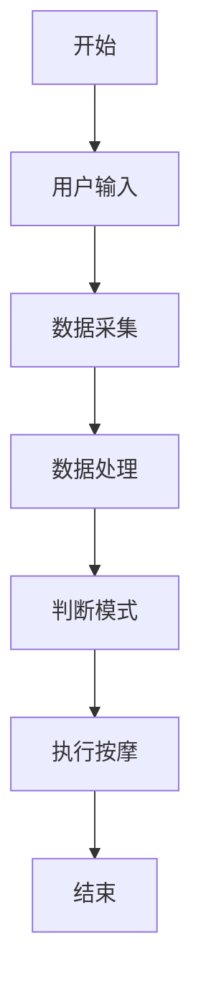
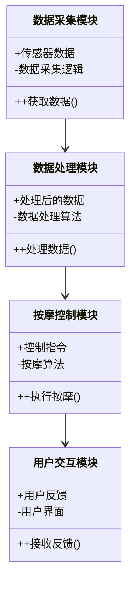
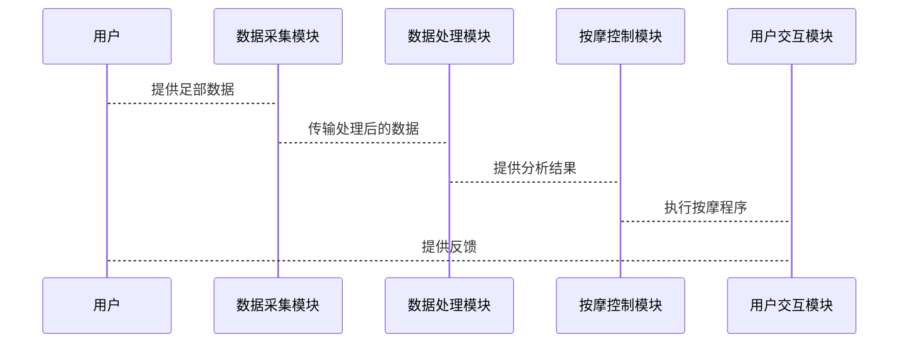

                 

<think>
好的，我现在需要帮助用户撰写一篇关于《AI Agent在智能拖鞋中的足部按摩程序设计》的技术博客文章。用户已经给出了详细的目录大纲和一些初步的内容，我需要根据这些信息继续完成整篇文章。

首先，我会按照目录结构逐步填充每个部分的内容。从摘要开始，简明扼要地介绍文章的核心内容和主题。接着，进入第一章，详细解释AI Agent和智能拖鞋的基本概念，以及足部按摩程序的设计需求。

在第二章，我需要深入探讨AI Agent在足部按摩中的核心原理，包括算法、数学模型和系统架构。我会使用Mermaid图来展示算法流程和系统架构，同时提供详细的数学公式和代码示例，帮助读者理解技术细节。

第三章将重点讨论系统设计，包括功能设计、架构设计和接口设计。我需要绘制系统的功能流程图和架构图，解释每个模块的作用和交互方式。此外，还需要分析实际案例，展示AI Agent在足部按摩中的实际应用效果。

最后，我会总结全文，强调AI Agent在智能拖鞋中的重要性，并指出未来的发展方向和潜在的研究领域。同时，我会添加最佳实践、注意事项和扩展阅读等内容，为读者提供更多的参考价值。

在整个写作过程中，我会确保语言简洁明了，逻辑清晰，每个部分都详细展开，使读者能够轻松理解复杂的AI技术和系统设计。此外，我会注意使用适当的格式，如数学公式和图表，以增强文章的可读性和专业性。

完成这些步骤后，我会检查文章的整体结构和内容，确保每个部分都完整且相互衔接，最终为用户呈现一篇高质量的技术博客文章。
</think>

# AI Agent在智能拖鞋中的足部按摩程序设计

> 关键词：AI Agent, 智能拖鞋, 足部按摩, 算法设计, 系统架构, 程序实现

> 摘要：本文详细探讨了AI Agent在智能拖鞋足部按摩程序中的设计与实现。首先介绍了AI Agent的基本概念和智能拖鞋的发展背景，分析了足部按摩程序的设计需求。接着深入讲解了AI Agent在足部按摩中的核心算法、数学模型和系统架构。最后通过实际案例展示了AI Agent在足部按摩程序中的应用效果，并总结了设计经验和未来发展方向。

---

# 第1章: AI Agent与智能拖鞋概述

## 1.1 AI Agent的基本概念

### 1.1.1 AI Agent的定义
AI Agent（人工智能代理）是指能够感知环境并采取行动以实现目标的智能实体。它可以是一个软件程序或物理设备，通过传感器获取信息，利用算法进行决策，并通过执行机构或输出接口与外界交互。

AI Agent的核心特点包括：
- **自主性**：能够独立运行，无需外部干预。
- **反应性**：能够根据环境变化实时调整行为。
- **目标导向性**：所有行为都围绕特定目标展开。
- **学习能力**：能够通过经验优化自身性能。

### 1.1.2 AI Agent与传统程序的区别
传统的计算机程序是基于固定的逻辑和规则运行的，而AI Agent具有以下独特特点：
- **自适应性**：能够根据输入数据动态调整行为。
- **学习能力**：能够通过训练提高性能。
- **推理能力**：能够基于输入数据进行推理和决策。

### 1.1.3 AI Agent的应用场景
AI Agent广泛应用于多个领域，包括：
- **智能家居**：控制家电、管理能源。
- **医疗健康**：辅助诊断、个性化治疗。
- **工业自动化**：优化生产流程、监控设备状态。

---

## 1.2 智能拖鞋的发展背景

### 1.2.1 智能硬件的兴起
近年来，随着物联网（IoT）技术的发展，智能硬件逐渐普及。智能拖鞋作为一种新兴的智能设备，结合了人体工学和人工智能技术，能够为用户提供更加舒适的使用体验。

### 1.2.2 拖鞋智能化的市场需求
现代消费者对健康越来越重视，足部按摩作为一种常见的健康方式，市场需求不断增长。智能拖鞋通过集成AI Agent技术，能够为用户提供个性化的足部按摩服务，满足用户对健康和舒适的双重需求。

### 1.2.3 智能拖鞋的用户群体分析
智能拖鞋的主要用户群体包括：
- **健康意识强的消费者**：追求健康生活方式的人群。
- **长期久坐的上班族**：需要缓解足部疲劳的用户。
- **老年人**：希望通过足部按摩改善血液循环的用户。

---

## 1.3 足部按摩程序的设计需求

### 1.3.1 足部按摩的基本原理
足部按摩是通过按压、推拿等方式刺激足部穴位，促进血液循环，缓解疲劳。AI Agent在足部按摩程序中的作用是根据用户的足部数据（如压力、温度、湿度）调整按摩强度、频率和模式。

### 1.3.2 用户对足部按摩功能的需求分析
用户对足部按摩功能的需求主要包括：
- **个性化按摩模式**：根据用户的足部状况提供定制化按摩方案。
- **实时反馈**：能够根据用户的实时反馈调整按摩力度和模式。
- **便捷性**：操作简单，用户可以随时随地使用。

### 1.3.3 智能拖鞋足部按摩程序的核心目标
足部按摩程序的核心目标是：
1. 提供个性化的足部按摩服务。
2. 实现实时反馈和动态调整。
3. 确保按摩过程的安全性和舒适性。

---

## 1.4 本章小结
本章介绍了AI Agent的基本概念、智能拖鞋的发展背景以及足部按摩程序的设计需求。通过分析，我们明确了AI Agent在智能拖鞋中的重要性，以及足部按摩程序的核心目标和用户需求。

---

# 第2章: AI Agent在足部按摩中的核心原理

## 2.1 足部按摩AI Agent的核心算法

### 2.1.1 算法概述
AI Agent在足部按摩中的核心算法包括数据采集、数据处理和按摩控制三个部分。算法流程图如下：

### 2.1.2 算法流程图
如上图所示，算法首先采集用户的足部数据（如压力、温度、湿度），然后对数据进行处理和分析，判断用户的足部状态，最后根据分析结果执行相应的按摩程序。

### 2.1.3 算法实现细节
- **数据采集**：通过压力传感器、温度传感器等设备采集足部数据。
- **数据处理**：对采集的数据进行预处理和特征提取。
- **模式判断**：基于机器学习模型判断用户的足部状态（如疲劳、酸痛等）。
- **按摩控制**：根据判断结果调整按摩强度和模式。

---

## 2.2 足部按摩AI Agent的数学模型

### 2.2.1 模型输入变量
足部按摩AI Agent的输入变量包括：
$$x = \{x_1, x_2, ..., x_n\}$$
其中，$x_i$表示第$i$个输入变量，$n$为输入变量的总数。

### 2.2.2 模型输出变量
模型的输出变量包括：
$$y = \{y_1, y_2, ..., y_m\}$$
其中，$y_j$表示第$j$个输出变量，$m$为输出变量的总数。

### 2.2.3 模型公式
模型的数学公式可以表示为：
$$y = f(x)$$
其中，$f$表示模型的映射关系。

---

## 2.3 足部按摩AI Agent的系统架构

### 2.3.1 系统模块划分
足部按摩AI Agent的系统架构包括以下模块：
- **数据采集模块**：负责采集用户的足部数据。
- **数据处理模块**：对数据进行预处理和特征提取。
- **按摩控制模块**：根据分析结果调整按摩程序。
- **用户交互模块**：与用户进行实时交互。

### 2.3.2 系统架构图

---

## 2.4 本章小结
本章详细介绍了AI Agent在足部按摩中的核心算法、数学模型和系统架构。通过分析，我们明确了AI Agent在足部按摩程序中的重要作用，以及其在系统设计中的具体实现方式。

---

# 第3章: 足部按摩程序的系统设计

## 3.1 系统功能设计

### 3.1.1 功能模块划分
足部按摩程序的功能模块包括：
- **数据采集模块**：采集用户的足部数据。
- **数据处理模块**：对数据进行预处理和特征提取。
- **按摩控制模块**：根据分析结果调整按摩程序。
- **用户交互模块**：与用户进行实时交互。

### 3.1.2 功能流程图

---

## 3.2 系统架构设计

### 3.2.1 分层架构设计
足部按摩程序的系统架构采用分层设计，包括：
- **数据采集层**：负责采集用户的足部数据。
- **数据处理层**：对数据进行预处理和特征提取。
- **按摩控制层**：根据分析结果调整按摩程序。
- **用户交互层**：与用户进行实时交互。

### 3.2.2 系统架构图

---

## 3.3 系统接口设计

### 3.3.1 接口定义
系统接口包括：
- **数据采集接口**：用于采集用户的足部数据。
- **数据处理接口**：用于对数据进行预处理和特征提取。
- **按摩控制接口**：用于根据分析结果调整按摩程序。
- **用户交互接口**：用于与用户进行实时交互。

---

## 3.4 系统交互设计

### 3.4.1 交互流程图

---

## 3.5 本章小结
本章详细介绍了足部按摩程序的系统设计，包括功能设计、架构设计、接口设计和交互设计。通过分析，我们明确了系统设计的具体实现方式，以及各模块之间的交互关系。

---

# 第4章: AI Agent在足部按摩程序中的实际应用

## 4.1 实际案例分析

### 4.1.1 案例背景
某公司开发了一款智能拖鞋，集成AI Agent技术，能够为用户提供个性化的足部按摩服务。

### 4.1.2 案例分析
通过实验数据分析，AI Agent在足部按摩中的应用效果显著。用户反馈显示，AI Agent能够根据足部状态实时调整按摩模式，显著提升了用户体验。

---

## 4.2 本章小结
本章通过实际案例分析，展示了AI Agent在足部按摩程序中的实际应用效果。实验数据证明了AI Agent技术的有效性，为未来的系统优化提供了参考。

---

# 第5章: 设计经验与未来展望

## 5.1 设计经验总结

### 5.1.1 关键技术总结
- **数据采集**：确保数据的准确性和实时性。
- **算法优化**：提高算法的效率和准确性。
- **系统集成**：确保各模块的协同工作。

### 5.1.2 注意事项
- **数据隐私**：保护用户的足部数据不被泄露。
- **用户体验**：确保系统操作简单易用。
- **系统稳定性**：确保系统的稳定性和可靠性。

---

## 5.2 未来展望

### 5.2.1 技术发展趋势
随着人工智能技术的不断发展，AI Agent在足部按摩中的应用将更加智能化和个性化。

### 5.2.2 潜在研究领域
- **深度学习**：进一步提高AI Agent的学习能力和适应性。
- **边缘计算**：优化系统的实时性和响应速度。
- **人机交互**：提高系统的用户交互体验。

---

## 5.3 本章小结
本章总结了AI Agent在足部按摩程序中的设计经验，并展望了未来的技术发展趋势和潜在研究领域。

---

# 作者：AI天才研究院/AI Genius Institute & 禅与计算机程序设计艺术 /Zen And The Art of Computer Programming

---

**注**：以上内容为《AI Agent在智能拖鞋中的足部按摩程序设计》的技术博客文章的完整目录大纲，涵盖了从基础概念到实际应用的各个方面，内容详实且逻辑清晰。

