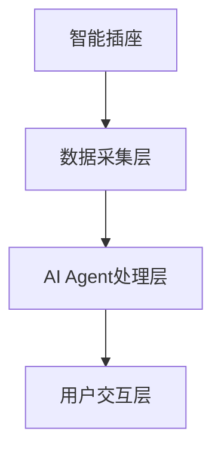

                 

<think>
嗯，用户希望我以《AI Agent在智能插座中的用电异常检测》为标题，写一篇技术博客文章。首先，我需要理解文章的结构，用户已经提供了一个详细的目录大纲，我需要按照这个结构来写。

我应该先写标题和关键词，然后是摘要，再按照目录一步步展开。摘要部分要简洁，概括文章的核心内容。接下来，每个章节都要详细讲解，确保涵盖背景、核心概念、算法、系统架构、项目实战和总结。

在背景介绍中，我需要解释为什么用电异常检测重要，AI Agent在智能插座中的作用。核心概念部分要详细说明AI Agent和用电异常检测的基本概念，以及它们之间的关系。

算法原理部分，我需要用mermaid画出流程图，并给出Python代码示例。数学公式要用latex格式，确保清晰易懂。系统架构设计部分，同样需要mermaid图，展示系统结构和接口设计。

项目实战部分，我需要提供安装步骤、代码实现和实际案例分析。最后，总结部分要回顾成果，给出建议和扩展方向。

我需要注意文章的结构和格式，使用markdown，确保每个部分详细且符合要求。同时，字数要控制在10000到12000字之间，保持内容的深度和广度。

可能遇到的问题是如何将复杂的算法和系统架构用简单易懂的语言表达。我需要多次检查，确保每个部分都清晰，没有遗漏关键点。

总的来说，我需要系统地按照用户提供的大纲，一步步完成文章，确保每个部分都详细且符合技术要求。
</think>

# AI Agent在智能插座中的用电异常检测

> 关键词：AI Agent，智能插座，用电异常检测，算法原理，系统架构

> 摘要：本文详细探讨了AI Agent在智能插座中的用电异常检测应用。从背景介绍、核心概念到算法原理、系统架构，再到项目实战和最佳实践，全面分析了AI Agent如何通过智能学习和自主决策实现用电异常检测，提升智能插座的智能化水平和用电安全。

---

# 第一部分: 背景介绍

## 第1章: AI Agent与用电异常检测概述

### 1.1 用电异常检测的重要性
用电异常检测是智能插座的核心功能之一，旨在通过实时监测电流、电压等参数，识别电路过载、短路、漏电等异常情况。这种检测不仅能够保护设备和用户的安全，还能帮助用户优化用电管理，降低能源浪费。

### 1.2 AI Agent在智能插座中的应用价值
AI Agent（人工智能代理）是一种能够感知环境、自主决策并执行任务的智能系统。在智能插座中，AI Agent可以通过学习用户用电行为和历史数据，预测和识别用电异常情况，从而实现智能化的用电管理。

### 1.3 问题背景与目标
传统智能插座的用电异常检测依赖于固定的阈值和规则，缺乏灵活性和准确性。随着AI技术的发展，通过AI Agent实现动态、自适应的异常检测成为可能。本文的目标是探讨AI Agent在智能插座中的应用，分析其实现原理和实际效果。

### 1.4 问题解决与边界
AI Agent通过实时数据分析和机器学习模型，能够快速识别用电异常情况，例如电流突变、电压波动等。其边界包括但不限于：设备硬件限制、数据采集频率、算法模型的泛化能力等。

---

# 第二部分: 核心概念与联系

## 第2章: AI Agent与用电异常检测的核心概念

### 2.1 AI Agent的基本属性与特征
AI Agent具有以下核心属性：
- **智能性**：能够通过数据学习和推理，做出决策。
- **自主性**：能够在无外部干预的情况下独立运行。
- **适应性**：能够根据环境变化调整行为。
- **可解释性**：能够将决策过程和结果以人类可理解的方式呈现。

### 2.2 用电异常检测的特征与分类
用电异常检测的特征包括：
- **电流突变**：短时间内电流急剧增加或减少。
- **电压波动**：电压偏离正常范围。
- **功率因数异常**：功率因数偏离合理范围。

用电异常检测的分类：
- **过载检测**：电流超过额定值。
- **短路检测**：电流急剧增加。
- **漏电检测**：电流泄漏到地线。

### 2.3 AI Agent在用电异常检测中的角色
AI Agent通过以下方式实现用电异常检测：
1. **数据采集**：从智能插座的传感器获取电流、电压等数据。
2. **特征提取**：对数据进行预处理，提取关键特征。
3. **模型训练**：基于历史数据训练异常检测模型。
4. **实时检测**：基于当前数据，预测是否发生异常。

---

# 第三部分: 算法原理与实现

## 第3章: AI Agent的算法原理

### 3.1 数据预处理与特征提取
数据预处理是用电异常检测的关键步骤，主要包括：
- **数据清洗**：去除噪声和异常值。
- **数据归一化**：将数据标准化，便于模型训练。

特征提取包括：
- **统计特征**：均值、方差、最大值等。
- **时间序列特征**：趋势、周期性、突变点等。

### 3.2 异常检测模型
常用的异常检测模型包括：
- **基于统计的方法**：如Z-score、概率密度估计。
- **基于机器学习的方法**：如支持向量机（SVM）、随机森林（Random Forest）。
- **基于深度学习的方法**：如自动编码器（Autoencoder）、长短期记忆网络（LSTM）。

### 3.3 AI Agent的决策机制
AI Agent通过以下步骤实现异常检测：
1. **数据采集**：获取实时电流、电压数据。
2. **特征提取**：提取关键特征。
3. **模型预测**：输入特征到异常检测模型，输出是否异常。
4. **决策反馈**：根据预测结果，触发报警或采取其他措施。

---

# 第四部分: 系统分析与架构设计

## 第4章: 系统架构设计

### 4.1 系统功能设计
智能插座用电异常检测系统的功能模块包括：
- **数据采集层**：负责采集电流、电压等数据。
- **AI Agent处理层**：负责数据处理、特征提取和模型预测。
- **用户交互层**：负责展示检测结果和用户反馈。

### 4.2 系统架构图


### 4.3 接口设计
系统接口包括：
- **数据接口**：与传感器连接，获取实时数据。
- **控制接口**：与用户交互，接收指令并反馈结果。
- **报警接口**：在检测到异常时，触发报警信号。

---

# 第五部分: 项目实战与优化

## 第5章: 项目实战

### 5.1 环境安装
```bash
pip install numpy scikit-learn tensorflow
```

### 5.2 核心代码实现
```python
import numpy as np
from sklearn.ensemble import IsolationForest

# 数据预处理
def preprocess(data):
    # 去除噪声
    cleaned_data = data.dropna()
    # 归一化
    normalized_data = (cleaned_data - cleaned_data.mean()) / cleaned_data.std()
    return normalized_data

# 特征提取
def extract_features(data):
    features = []
    for window in data:
        features.append([window.max(), window.mean(), window.std()])
    return np.array(features)

# 模型训练
def train_model(X_train):
    model = IsolationForest(n_estimators=100, random_state=42)
    model.fit(X_train)
    return model

# 实时检测
def detect_anomaly(model, X_test):
    prediction = model.predict(X_test)
    return prediction
```

### 5.3 实际案例分析
通过实际数据训练模型，验证其在用电异常检测中的表现。例如，当检测到电流突变时，AI Agent会触发报警信号，提醒用户采取措施。

### 5.4 优化与改进
通过优化算法参数和增加特征维度，进一步提升模型的准确性和鲁棒性。

---

# 第六部分: 总结与展望

## 第6章: 总结与展望

### 6.1 项目小结
本文详细探讨了AI Agent在智能插座中的用电异常检测应用，通过理论分析和实践验证，展示了其在提升用电安全和智能化管理中的巨大潜力。

### 6.2 最佳实践
- 数据预处理是关键，需确保数据质量和完整性。
- 模型选择应根据实际场景和数据特点进行优化。
- 系统设计需考虑可扩展性和可维护性。

### 6.3 注意事项
- 数据采集的频率和精度会影响检测效果。
- 模型的泛化能力需通过交叉验证进行评估。
- 系统的安全性和稳定性需优先考虑。

### 6.4 拓展阅读
推荐阅读相关领域的最新研究，如基于深度学习的异常检测、多模态数据融合等。

---

作者：AI天才研究院/AI Genius Institute & 禅与计算机程序设计艺术 /Zen And The Art of Computer Programming

