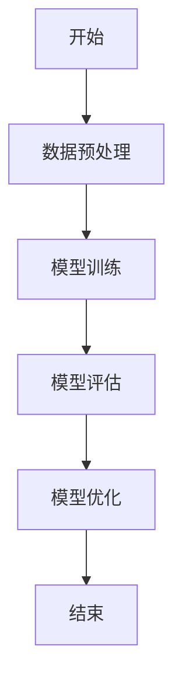

                 


# AI Agent在智能教育系统中的应用

> 关键词：AI Agent, 智能教育系统, 个性化学习, 教育技术, 人工智能

> 摘要：本文详细探讨了AI Agent在智能教育系统中的应用，从AI Agent的基本概念到其在教育系统中的具体实现，分析了其在教育领域的巨大潜力和实际应用价值。

---

## 第1章: AI Agent与智能教育系统背景

### 1.1 AI Agent的基本概念

AI Agent（人工智能代理）是一种能够感知环境并采取行动以实现目标的智能实体。它具备以下核心特征：

- **自主性**：能够在没有外部干预的情况下独立运行。
- **反应性**：能够实时感知环境并做出反应。
- **目标导向**：所有行为都以实现特定目标为导向。
- **学习能力**：能够通过经验改进自身性能。

### 1.2 智能教育系统的定义与发展

智能教育系统是一种利用人工智能技术来优化教学过程、提升学习效果的教育系统。其发展历程可以分为以下几个阶段：

1. **传统教育系统**：基于教师授课和学生被动接受知识的模式。
2. **多媒体教育系统**：引入多媒体技术，提供更丰富的教学资源。
3. **智能化教育系统**：结合人工智能技术，实现个性化教学和智能辅助。

### 1.3 AI Agent在教育中的应用价值

AI Agent在智能教育系统中的应用价值主要体现在以下几个方面：

- **提高教学效率**：通过自动化处理教学任务，减少教师的工作负担。
- **个性化学习支持**：根据学生的学习情况提供个性化的学习建议和资源。
- **教学资源优化**：通过智能分析和推荐，优化教学资源的利用效率。

---

## 第2章: AI Agent的核心原理与技术

### 2.1 AI Agent的基本原理

AI Agent的核心原理包括知识表示、逻辑推理和自然语言处理。

- **知识表示**：通过符号逻辑或向量空间模型等方式表示知识。
- **逻辑推理**：基于知识库进行逻辑推理，得出结论。
- **自然语言处理**：通过NLP技术实现与用户的自然语言交互。

### 2.2 AI Agent的分类与应用场景

AI Agent可以根据实现方式分为以下几类：

| 分类标准 | 分类 | 描述 |
|----------|------|------|
| 实现方式 | 基于规则的AI Agent | 通过预定义的规则进行推理和行动 |
|          | 基于机器学习的AI Agent | 通过机器学习模型进行预测和决策 |
|          | 基于深度学习的AI Agent | 使用深度神经网络进行复杂模式识别 |

### 2.3 AI Agent的算法基础

AI Agent的算法基础主要包括监督学习、无监督学习和强化学习。

- **监督学习**：通过标记数据训练模型，使其能够对新数据进行分类或回归预测。
- **无监督学习**：通过聚类等技术对未标记数据进行分析和处理。
- **强化学习**：通过与环境交互，学习最优策略以实现目标。

---

## 第3章: 智能教育系统中的AI Agent架构

### 3.1 系统架构概述

智能教育系统的架构设计通常包括以下几个层次：

1. **数据层**：存储教学数据、学习者数据等。
2. **算法层**：实现AI Agent的核心算法和逻辑。
3. **服务层**：提供API接口，供上层应用调用。
4. **应用层**：实现具体的应用功能，如个性化推荐、智能问答等。

### 3.2 AI Agent与教育系统的交互流程

AI Agent与教育系统的交互流程可以分为以下几个步骤：

1. **用户需求分析**：AI Agent通过分析学习者的行为和数据，识别学习需求。
2. **系统响应策略**：根据需求生成相应的教学策略和推荐。
3. **结果反馈与优化**：根据反馈结果不断优化AI Agent的性能。

### 3.3 系统核心组件

智能教育系统的核心组件包括：

- **知识库管理**：负责知识的存储、检索和更新。
- **学习者模型**：根据学习者的行为和数据，构建个性化的学习模型。
- **个性化推荐算法**：基于学习者模型，推荐适合的学习资源和路径。

---

## 第4章: AI Agent在智能教育中的算法实现

### 4.1 算法原理概述

AI Agent在智能教育中的算法实现主要包括以下几种：

- **基于规则的推理算法**：通过预定义的规则进行推理和决策。
- **基于机器学习的分类算法**：通过训练模型对学习者进行分类和预测。
- **基于深度学习的生成算法**：通过生成模型生成个性化的内容和建议。

### 4.2 算法实现步骤

AI Agent算法的实现步骤如下：

1. **数据预处理**：对数据进行清洗、归一化等处理。
2. **模型训练**：使用训练数据训练模型参数。
3. **模型优化**：通过调整超参数和优化算法提升模型性能。

### 4.3 算法流程图



---

## 第5章: 智能教育系统中的数学模型与公式

### 5.1 知识表示的数学模型

知识表示的向量空间模型可以表示为：

$$v_i = [w_1, w_2, ..., w_n]$$

其中，$w_j$ 表示第$j$个特征的权重值。

### 5.2 逻辑推理的数学模型

基于逻辑推理的决策树模型可以表示为：

$$f(x) = \text{sign}(\sum_{i=1}^n w_i x_i + b)$$

其中，$w_i$ 表示特征权重，$x_i$ 表示输入特征，$b$ 表示偏置项。

---

## 第6章: 项目实战与案例分析

### 6.1 环境搭建

需要安装以下工具和库：

- Python 3.8+
- TensorFlow 2.0+
- Scikit-learn 0.24+

### 6.2 核心代码实现

以下是AI Agent在智能教育系统中的核心代码实现：

```python
import numpy as np
from sklearn import tree

# 数据预处理
X = np.array([[...], [...], ...])
y = np.array([...])

# 模型训练
model = tree.DecisionTreeClassifier()
model.fit(X, y)

# 模型预测
def predict(x):
    return model.predict(x)
```

### 6.3 案例分析

以个性化学习推荐为例，假设某学生的学习数据如下：

| 学科   | 成绩 | 兴趣程度 |
|--------|------|----------|
| 数学   | 85   | 高       |
| 语文   | 70   | 中       |
| 英语   | 80   | 低       |

AI Agent会基于上述数据推荐适合的学习资源和策略。

---

## 第7章: 总结与展望

### 7.1 本章总结

本文详细探讨了AI Agent在智能教育系统中的应用，从理论基础到实际应用，分析了其在教育领域的巨大潜力和实际价值。

### 7.2 未来展望

随着人工智能技术的不断发展，AI Agent在智能教育系统中的应用将更加广泛和深入，未来可能会出现更加智能化、个性化的教育模式。

---

作者：AI天才研究院 & 禅与计算机程序设计艺术

