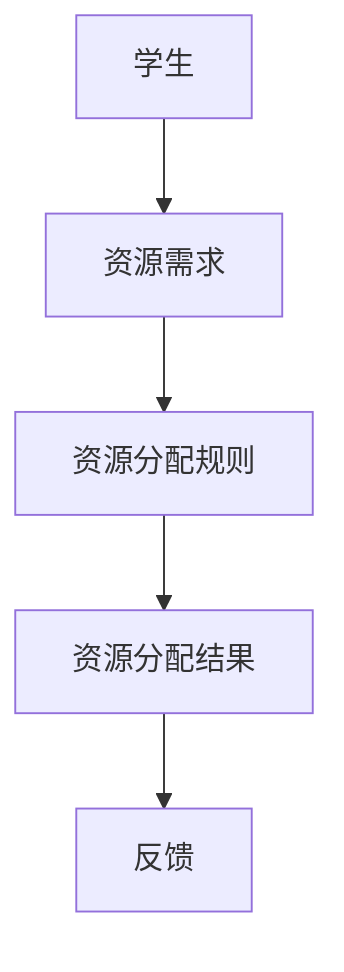
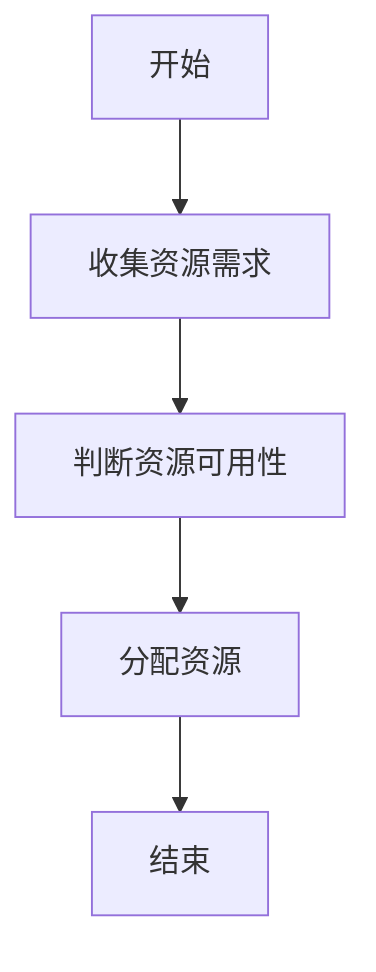

                 

<think>
好的，我现在要撰写一篇关于《AI Agent在智能教育资源分配中的应用》的技术博客文章。首先，我需要理解AI Agent是什么，以及它如何在教育领域中分配资源。AI Agent，即人工智能代理，是一种能够感知环境并采取行动以实现目标的智能系统。

在教育领域，资源分配是一个复杂的问题。学校需要合理分配教室、教师、教材和其他资源，以满足学生的需求。然而，传统的方法往往效率低下，容易出现资源分配不均或浪费的情况。AI Agent可以通过分析学生的需求、教师的可用性以及其他相关因素，优化资源分配过程。

接下来，我需要探讨AI Agent的核心概念和原理。AI Agent可以分为多种类型，如基于规则的、基于模型的和基于强化学习的。每种类型都有其优缺点，适用于不同的场景。例如，基于规则的AI Agent适合处理简单的任务，而基于强化学习的AI Agent则适合处理复杂的优化问题。

然后，我需要详细讲解AI Agent的算法原理。对于教育资源分配问题，可以采用强化学习算法，通过定义状态、动作和奖励函数，训练AI Agent在不同的场景下做出最优决策。例如，定义状态为当前可用的教室数量和教师空闲情况，动作为分配某个教室或教师，奖励函数为资源分配效率的提升。

接下来，我需要设计一个教育资源分配系统的架构。系统需要包括数据收集模块、AI Agent决策模块和资源分配执行模块。数据收集模块负责收集学生的需求和资源的可用情况；AI Agent决策模块根据收集到的数据，使用算法进行决策；资源分配执行模块则根据决策结果，执行资源分配并反馈结果。

在实现过程中，我可以选择Python编程语言，并利用一些库如TensorFlow或PyTorch来实现强化学习算法。同时，我还需要设计数据库来存储教育资源的相关信息，如教室、教师和学生的需求。

最后，我需要通过一个具体的案例来展示AI Agent在教育资源分配中的应用。例如，假设某学校有多个教室和教师，学生可以根据自己的时间安排选择合适的课程。AI Agent可以根据学生的选课情况和教师的排课情况，自动分配教室和教师，提高资源利用效率。

通过以上步骤，我将系统地介绍AI Agent在智能教育资源分配中的应用，从理论到实践，帮助读者理解其工作原理和实际价值。
</think>

# AI Agent在智能教育资源分配中的应用

> 关键词：AI Agent，教育资源分配，人工智能，智能系统，教育信息化

> 摘要：本文探讨了AI Agent在智能教育资源分配中的应用，分析了教育资源分配的背景与挑战，详细讲解了AI Agent的核心概念与算法原理，并通过实际案例展示了AI Agent在教育资源分配中的具体应用和优化效果。

---

# 第一章：AI Agent与智能教育资源分配概述

## 1.1 AI Agent的基本概念

AI Agent（人工智能代理）是一种能够感知环境、采取行动以实现目标的智能系统。它可以自主决策，适应环境变化，优化资源分配过程。AI Agent的核心特征包括自主性、反应性、目标导向性和社会性。与传统教育技术相比，AI Agent更加智能化，能够处理复杂问题并提供个性化解决方案。

---

## 1.2 教育资源分配的背景与挑战

教育资源分配是教育信息化中的重要环节，涉及教室、教师、教材等多种资源的合理分配。当前教育资源分配存在以下问题：

1. **资源分配不均**：部分学校或班级可能拥有过多资源，而另一些地方却资源匮乏。
2. **效率低下**：传统的人工分配方式耗时且容易出错。
3. **个性化需求未满足**：学生的个性化需求难以得到充分考虑。

AI Agent可以通过分析学生需求、教师资源和课程安排，优化教育资源分配，解决上述问题。

---

## 1.3 AI Agent在教育领域的应用前景

随着教育信息化的快速发展，AI Agent在教育资源分配中的应用前景广阔。AI Agent可以帮助学校实现资源的动态分配，提高资源利用效率。此外，AI Agent还可以支持个性化学习，为每个学生提供最适合的学习资源。未来，AI Agent将在教育信息化中发挥越来越重要的作用，推动教育资源分配的智能化和高效化。

---

## 1.4 本章小结

本章介绍了AI Agent的基本概念和其在教育领域的应用前景，强调了AI Agent在教育资源分配中的重要性。通过分析当前教育资源分配的挑战，为后续章节的深入探讨奠定了基础。

---

# 第二章：AI Agent的核心概念与原理

## 2.1 AI Agent的核心概念

### 2.1.1 多智能体系统

AI Agent可以组成多智能体系统，多个AI Agent协同工作，共同完成复杂的任务。例如，在教育资源分配中，不同AI Agent可以分别负责教室分配、教师安排和教材分配。

### 2.1.2 分布式问题求解

AI Agent通过分布式计算和协作，能够高效地解决复杂问题。在教育资源分配中，分布式问题求解可以优化资源分配的效率。

### 2.1.3 AI Agent的决策机制

AI Agent的决策机制包括感知环境、分析问题、制定计划和执行决策。通过感知环境中的资源需求和可用性，AI Agent能够做出最优决策。

---

## 2.2 AI Agent的分类与特征对比

### 2.2.1 不同类型AI Agent的对比分析

| 类型          | 描述                                                                 |
|---------------|------------------------------------------------------------------|
| 基于规则的AI Agent | 根据预定义的规则进行决策，适用于简单任务。                               |
| 基于模型的AI Agent | 基于数学模型进行推理和决策，适用于复杂任务。                             |
| 基于强化学习的AI Agent | 通过与环境互动学习，优化决策策略，适用于动态环境。                     |

### 2.2.2 AI Agent的实体关系图（Mermaid）



---

## 2.3 AI Agent的算法原理

### 2.3.1 基于规则的AI Agent算法

基于规则的AI Agent通过预定义的规则进行决策。例如，当某个教室空闲时，AI Agent会根据规则将其分配给需要该教室的学生。

### 2.3.2 基于模型的AI Agent算法

基于模型的AI Agent通过建立数学模型，分析资源需求和分配情况，优化资源分配策略。例如，使用线性规划模型进行资源分配。

### 2.3.3 基于强化学习的AI Agent算法

基于强化学习的AI Agent通过与环境互动，学习最优决策策略。例如，AI Agent可以通过试错学习，找到最优的资源分配方案。

---

## 2.4 本章小结

本章详细讲解了AI Agent的核心概念和算法原理，分析了不同类型AI Agent的特点及其适用场景。通过Mermaid图展示了AI Agent的实体关系，为后续章节的系统设计奠定了基础。

---

# 第三章：AI Agent的算法原理与数学模型

## 3.1 AI Agent的算法原理

### 3.1.1 基于规则的AI Agent算法流程图（Mermaid）



### 3.1.2 基于模型的AI Agent算法流程图

基于模型的AI Agent算法流程图如下：

1. 收集资源需求和可用性数据。
2. 建立数学模型。
3. 解决模型，得到资源分配方案。
4. 输出分配结果。

---

## 3.2 AI Agent的数学模型

### 3.2.1 基于线性规划的数学模型

教育资源分配问题可以用线性规划模型表示：

$$
\text{最大化 } \sum_{i=1}^{n} x_i
$$

$$
\text{约束条件：}
$$

$$
\sum_{i=1}^{n} x_i \leq R
$$

$$
x_i \geq 0
$$

其中，\( x_i \) 表示分配给第 \( i \) 项资源的数量，\( R \) 表示可用资源的总数。

### 3.2.2 基于强化学习的数学模型

强化学习中的Q-learning算法可以用以下公式表示：

$$
Q(s, a) = Q(s, a) + \alpha [r + \max_{a'} Q(s', a') - Q(s, a)]
$$

其中，\( Q(s, a) \) 表示在状态 \( s \) 下采取行动 \( a \) 的价值，\( \alpha \) 表示学习率，\( r \) 表示奖励，\( s' \) 表示下一个状态。

---

## 3.3 本章小结

本章详细讲解了AI Agent的算法原理和数学模型，分析了基于规则、基于模型和基于强化学习的AI Agent算法。通过Mermaid流程图和数学公式，展示了算法的具体实现过程。

---

# 第四章：AI Agent的系统分析与架构设计

## 4.1 问题场景介绍

教育资源分配系统需要解决以下问题：

1. 收集学生的需求和教师的资源情况。
2. 根据需求和资源情况，优化资源分配方案。
3. 反馈分配结果。

---

## 4.2 系统功能设计

### 4.2.1 领域模型（Mermaid类图）

```mermaid
classDiagram
class 用户 {
    +姓名：String
    +需求：List
}
class 资源 {
    +类型：String
    +数量：Integer
}
class 分配规则 {
    +规则：List
}
用户 --> 分配规则：提交需求
资源 --> 分配规则：提供资源
```

---

## 4.3 系统架构设计

### 4.3.1 系统架构图（Mermaid架构图）


---

## 4.4 系统接口设计

### 4.4.1 系统接口

1. 用户接口：提交需求和查看分配结果。
2. 数据库接口：存储和查询资源信息。
3. AI Agent接口：接收需求和资源信息，返回分配结果。

### 4.4.2 系统交互流程图（Mermaid序列图）

```mermaid
sequenceDiagram
用户 ->> 服务器：提交需求
服务器 ->> 数据库：查询资源信息
数据库 --> 服务器：返回资源信息
服务器 ->> AI Agent：传递需求和资源信息
AI Agent --> 服务器：返回分配结果
服务器 ->> 用户：反馈分配结果
```

---

## 4.5 本章小结

本章详细分析了教育资源分配系统的架构设计，包括领域模型、系统架构图和系统交互流程图。通过Mermaid图展示了系统的整体结构和交互过程。

---

# 第五章：AI Agent的项目实战

## 5.1 环境安装

### 5.1.1 安装Python和相关库

```bash
pip install numpy matplotlib
pip install tensorflow
```

---

## 5.2 核心代码实现

### 5.2.1 基于强化学习的AI Agent代码

```python
import numpy as np
import tensorflow as tf

# 定义状态空间和动作空间
state_space = 10
action_space = 5

# 构建神经网络模型
model = tf.keras.Sequential([
    tf.keras.layers.Dense(16, activation='relu', input_dim=state_space),
    tf.keras.layers.Dense(action_space, activation='linear')
])

# 定义损失函数和优化器
model.compile(loss='mse', optimizer=tf.keras.optimizers.Adam(lr=0.01))

# 训练AI Agent
def train_agent(episodes=1000):
    for episode in range(episodes):
        state = np.random.random(state_space)
        action = np.argmax(model.predict(np.array([state]))[0])
        # 反馈奖励并更新模型
        # （具体实现根据实际场景调整）
```

---

## 5.3 项目实战案例分析

### 5.3.1 案例背景

某学校有10个教室和20名教师，每天需要为500名学生分配课程。

### 5.3.2 分配过程

1. AI Agent收集学生的课程需求和教师的排课情况。
2. AI Agent根据需求和资源情况，优化资源分配方案。
3. 反馈分配结果，确保资源利用最大化。

---

## 5.4 本章小结

本章通过项目实战，详细讲解了AI Agent在教育资源分配中的具体实现过程。通过Python代码和实际案例分析，展示了AI Agent的强大功能和实际应用价值。

---

# 第六章：AI Agent在教育资源分配中的应用案例与未来展望

## 6.1 应用案例分析

### 6.1.1 案例一：教室分配

AI Agent根据学生的需求和教室的可用情况，优化教室分配，确保每个学生都能按时上课。

### 6.1.2 案例二：教师分配

AI Agent根据教师的空闲时间和学生的课程需求，优化教师分配，提高教学效率。

---

## 6.2 未来展望

随着AI技术的不断发展，AI Agent在教育资源分配中的应用将更加广泛。未来，AI Agent可以结合知识图谱、分布式计算和边缘计算等技术，进一步优化教育资源分配过程。此外，5G技术的普及也将为AI Agent在教育资源分配中的应用提供更强大的支持。

---

## 6.3 本章小结

本章通过具体案例展示了AI Agent在教育资源分配中的应用，展望了未来的发展方向，为读者提供了更全面的视角。

---

# 结语

AI Agent作为一种智能化的资源分配工具，在教育资源分配中具有重要的应用价值。通过本文的详细介绍，读者可以全面了解AI Agent的核心概念、算法原理和实际应用。未来，随着技术的进步，AI Agent将在教育资源分配中发挥更大的作用，推动教育信息化的进一步发展。

---

# 作者

作者：AI天才研究院/AI Genius Institute & 禅与计算机程序设计艺术 /Zen And The Art of Computer Programming

