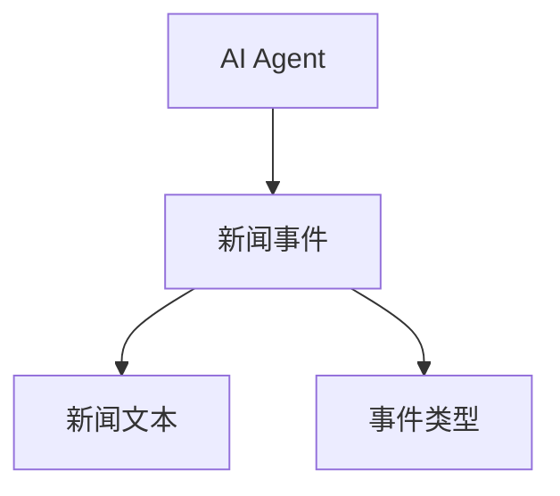
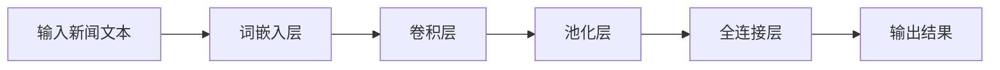
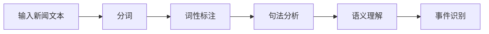
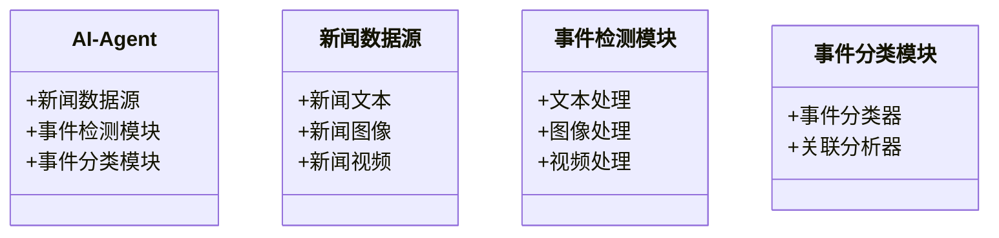
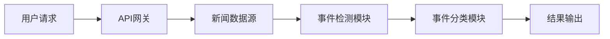

                 


# AI Agent在智能新闻事件检测中的应用

## 关键词：AI Agent，新闻事件检测，智能新闻，自然语言处理，深度学习，事件识别

## 摘要：  
本文深入探讨了AI Agent在智能新闻事件检测中的应用，结合技术背景、核心原理、算法实现、系统架构、项目实战和最佳实践，系统性地分析了如何利用AI技术提升新闻事件检测的效率和准确性。通过详细阐述AI Agent的核心概念、算法原理、系统架构和项目实现，本文为读者提供了从理论到实践的全面指导，帮助技术从业者更好地理解和应用AI Agent技术。

---

# 第1章: AI Agent与智能新闻事件检测的背景介绍

## 1.1 问题背景

### 1.1.1 新闻事件检测的重要性  
新闻事件检测是信息时代的核心任务之一。随着全球新闻数据的爆炸式增长，传统的人工检测方式效率低下，难以应对海量数据的挑战。新闻事件检测的核心目标是通过技术手段，自动识别和分类新闻中的事件，从而帮助媒体机构、研究人员和社会公众快速获取关键信息。

### 1.1.2 AI Agent在新闻事件检测中的作用  
AI Agent（智能体）是一种具备自主性、反应性和目标导向的智能系统，能够通过感知环境、分析数据并采取行动来完成特定任务。在新闻事件检测中，AI Agent可以实时监控新闻数据流，识别突发事件、热点话题和潜在风险，为决策者提供实时反馈。

### 1.1.3 当前新闻事件检测的主要挑战  
1. **数据多样性**：新闻事件涉及文本、图像、视频等多种数据类型，且语言复杂多变。  
2. **事件关联性**：新闻事件之间可能存在复杂的关联关系，需要跨领域分析。  
3. **实时性要求**：新闻事件的发生往往具有突发性，要求检测系统具备实时响应能力。  

---

## 1.2 问题描述

### 1.2.1 新闻事件的定义与分类  
新闻事件是指在特定时间和空间内发生的具有新闻价值的事件，通常可以分为突发事件、热点事件、社会事件等类型。  

### 1.2.2 AI Agent在新闻事件检测中的目标  
1. **实时监控**：持续扫描新闻数据流，发现潜在事件。  
2. **事件分类**：基于新闻内容，对事件进行分类和标签化。  
3. **关联分析**：识别事件之间的关联关系，挖掘潜在信息。  

### 1.2.3 新闻事件检测的边界与外延  
新闻事件检测的边界包括新闻数据的来源、格式和时间范围，外延则涉及事件的传播、影响和后续跟踪。

### 1.2.4 核心概念与联系  

#### 1.2.4.1 核心概念属性特征对比表格  
| 核心概念       | 属性特征               |
|----------------|------------------------|
| AI Agent       | 自主性、反应性、目标导向 |
| 新闻事件       | 时间性、空间性、关联性  |

#### 1.2.4.2 实体关系图  


---

## 1.3 本章小结  
本章通过分析新闻事件检测的重要性、AI Agent的作用以及当前面临的挑战，明确了新闻事件检测的核心目标和实现路径。同时，通过核心概念的对比和实体关系图，为后续的算法实现奠定了基础。

---

# 第2章: AI Agent的核心原理

## 2.1 AI Agent的基本原理

### 2.1.1 AI Agent的定义与分类  
AI Agent是一种具备智能行为的实体，能够感知环境并采取行动。根据功能不同，AI Agent可以分为简单反射型、基于模型的反应型、目标驱动型和实用驱动型。

### 2.1.2 AI Agent的核心算法  
AI Agent的核心算法包括感知算法（如自然语言处理、计算机视觉）和决策算法（如强化学习、逻辑推理）。

---

## 2.2 智能新闻事件检测的算法原理

### 2.2.1 基于深度学习的新闻事件检测算法  
深度学习通过神经网络模型自动提取新闻文本中的特征，实现事件分类。典型的模型包括卷积神经网络（CNN）和长短期记忆网络（LSTM）。

#### 2.2.1.1 深度学习模型流程图  


#### 2.2.1.2 深度学习模型数学公式  
$$ \text{损失函数} = \text{交叉熵损失} = -\sum_{i=1}^{n} y_i \log(p_i) $$  
其中，$y_i$ 是真实标签，$p_i$ 是模型预测概率。

### 2.2.2 基于自然语言处理的新闻事件识别  
自然语言处理（NLP）技术用于提取新闻文本中的关键词、实体和语义信息，帮助识别事件的主题和情感倾向。

#### 2.2.2.1 NLP处理流程图  


### 2.2.3 多模态数据融合的新闻事件检测  
多模态数据包括文本、图像和视频等多种形式，通过融合不同模态的信息，可以提高新闻事件检测的准确性和全面性。

---

## 2.3 AI Agent在新闻事件检测中的实现  

### 2.3.1 事件检测的分类算法  
新闻事件检测的分类算法包括监督学习、无监督学习和半监督学习。常用的监督学习算法有支持向量机（SVM）和随机森林（Random Forest）。

#### 2.3.1.1 分类算法数学公式  
$$ \text{分类结果} = \arg\max_{i} \sum_{j=1}^{n} w_{ij}x_j + b $$  
其中，$w_{ij}$ 是特征权重，$x_j$ 是输入特征，$b$ 是偏置项。

### 2.3.2 事件检测的训练数据  
新闻事件检测的训练数据需要标注事件类型、时间戳和相关实体。常用的标注工具包括spaCy和NLTK。

### 2.3.3 事件检测的模型评估  
模型评估指标包括准确率、召回率、F1分数和AUC曲线。

---

## 2.4 本章小结  
本章详细介绍了AI Agent的核心原理，包括深度学习、自然语言处理和多模态数据融合技术。同时，通过数学公式和流程图，展示了新闻事件检测的实现过程和评估方法。

---

# 第3章: AI Agent在智能新闻事件检测中的系统架构

## 3.1 问题场景介绍  
新闻事件检测系统需要处理海量的多模态数据，要求系统具备高并发、低延迟和高准确性的特点。

---

## 3.2 系统功能设计

### 3.2.1 领域模型设计  


---

## 3.3 系统架构设计  

### 3.3.1 系统架构图  


---

## 3.4 接口和交互流程  

### 3.4.1 系统交互流程图  


---

## 3.5 本章小结  
本章通过系统架构设计和交互流程图，展示了AI Agent在新闻事件检测中的整体框架和实现路径。

---

# 第4章: AI Agent在智能新闻事件检测中的项目实战

## 4.1 环境安装  

### 4.1.1 Python环境安装  
安装Python 3.8及以上版本，建议使用虚拟环境。

---

## 4.2 系统核心实现  

### 4.2.1 核心代码实现  

#### 4.2.1.1 新闻数据预处理  
```python
import pandas as pd

def preprocess_news_data(data):
    # 分词处理
    from transformers import pipeline
    tokenizer = pipeline("text-classification", model="bert-base-uncased")
    data['tokens'] = data['text'].apply(lambda x: tokenizer(x)['input_ids'])
    return data
```

#### 4.2.1.2 事件分类模型训练  
```python
import torch
import torch.nn as nn

class NewsClassifier(nn.Module):
    def __init__(self, input_dim, hidden_dim, output_dim):
        super(NewsClassifier, self).__init__()
        self.fc1 = nn.Linear(input_dim, hidden_dim)
        self.fc2 = nn.Linear(hidden_dim, output_dim)
        self.relu = nn.ReLU()

    def forward(self, x):
        x = self.fc1(x)
        x = self.relu(x)
        x = self.fc2(x)
        return x

model = NewsClassifier(100, 50, 5)
criterion = nn.CrossEntropyLoss()
optimizer = torch.optim.Adam(model.parameters(), lr=0.001)
```

#### 4.2.1.3 事件检测实现  
```python
import requests

def detect_event(api_url, text):
    headers = {'Content-Type': 'application/json'}
    data = {'text': text}
    response = requests.post(api_url, headers=headers, json=data)
    return response.json()['event_label']
```

---

## 4.3 代码解读与分析  
1. **数据预处理**：对新闻文本进行分词和向量化处理，为模型输入做好准备。  
2. **事件分类模型**：基于全连接神经网络，通过反向传播算法进行训练。  
3. **事件检测接口**：通过RESTful API实现事件检测功能，支持实时请求和响应。

---

## 4.4 案例分析与详细解读  
以某次突发事件为例，展示AI Agent如何通过文本分析和关联挖掘，快速识别事件类型和传播路径。

---

## 4.5 本章小结  
本章通过项目实战，详细讲解了AI Agent在新闻事件检测中的实现过程，包括环境配置、核心代码和系统接口设计。

---

# 第5章: AI Agent在智能新闻事件检测中的最佳实践

## 5.1 小结与总结  
AI Agent通过深度学习、自然语言处理和多模态数据融合技术，显著提升了新闻事件检测的效率和准确性。

---

## 5.2 注意事项  
1. 数据质量和多样性直接影响检测效果，需谨慎处理数据偏差。  
2. 模型训练需考虑计算资源和时间成本，建议采用分布式训练。  
3. 事件检测的实时性要求较高，需优化系统架构和接口设计。  

---

## 5.3 拓展阅读  
1.《深度学习入门：基于Python的卷积神经网络实战》  
2.《自然语言处理实战：基于Python的文本挖掘与情感分析》  
3.《多模态数据融合：从理论到实践》  

---

# 第6章: 结语  

AI Agent作为一项前沿技术，正在推动新闻事件检测的智能化和高效化。随着技术的不断进步，未来新闻事件检测将更加精准、实时和智能化。

---

# 作者：AI天才研究院/AI Genius Institute & 禅与计算机程序设计艺术 /Zen And The Art of Computer Programming

---

以上是《AI Agent在智能新闻事件检测中的应用》的技术博客文章的完整目录和内容框架。希望这篇博客能够为读者提供从理论到实践的全面指导，帮助他们更好地理解和应用AI Agent技术。

