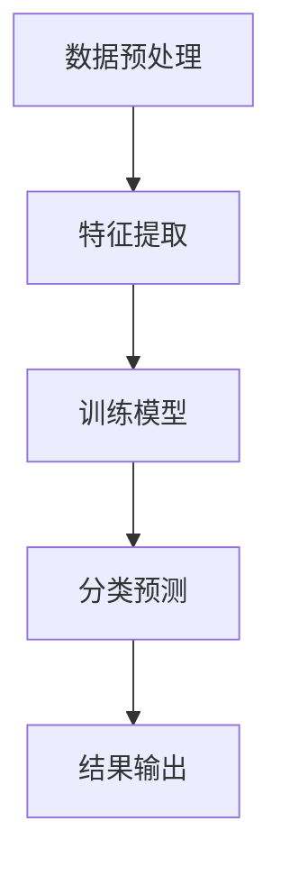
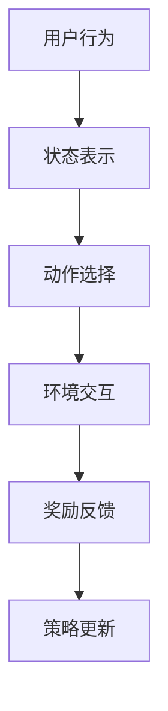
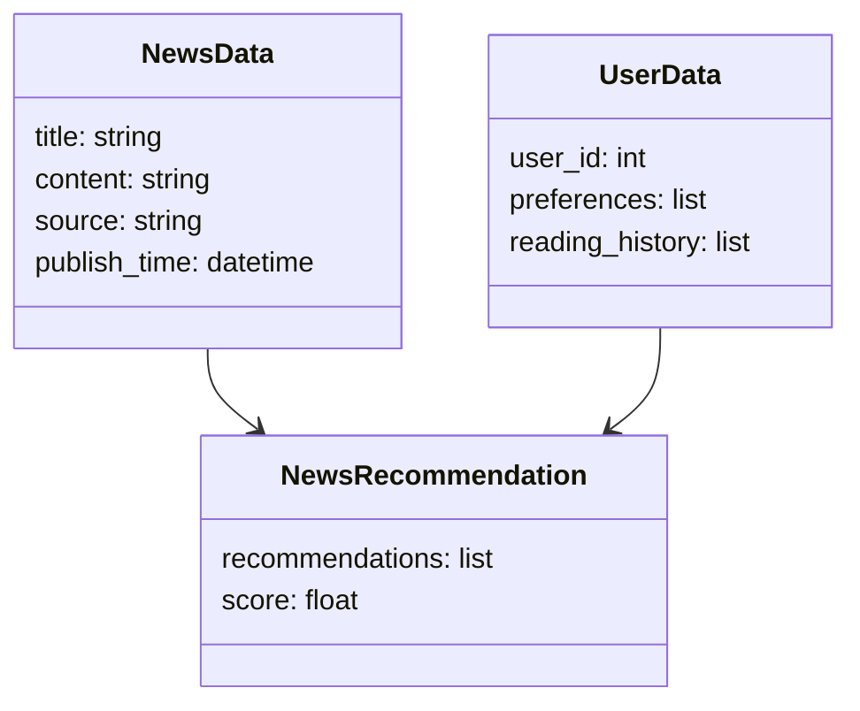
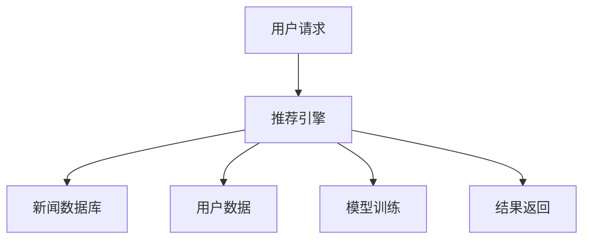
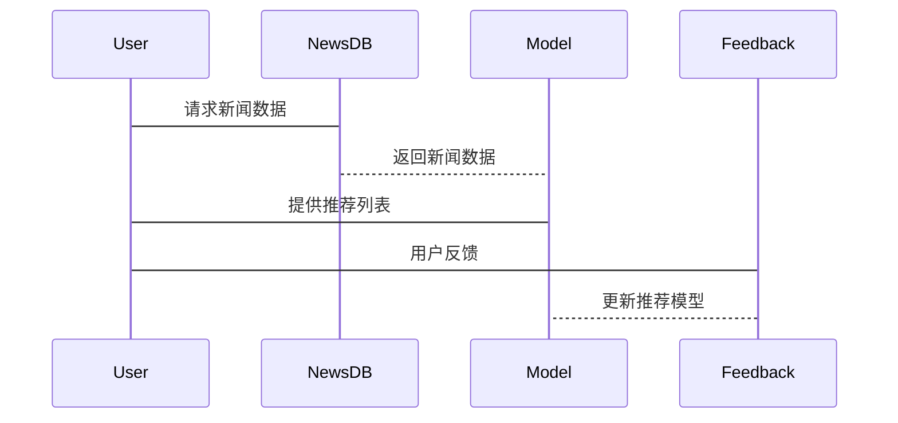

                 


# AI Agent在智能新闻聚合中的角色

## 关键词：AI Agent, 智能新闻聚合, 自然语言处理, 机器学习, 个性化推荐, 新闻推荐系统

## 摘要：  
AI Agent（人工智能代理）在智能新闻聚合中扮演着越来越重要的角色。随着信息爆炸的时代的到来，用户每天面对海量的新闻信息，如何快速、准确地筛选出符合个人兴趣的新闻成为一大挑战。AI Agent通过自然语言处理、机器学习等技术，能够实现智能化的新闻聚合与推荐。本文将从AI Agent的基本概念、核心原理、算法实现、系统架构设计到实际项目案例，全面解析AI Agent在智能新闻聚合中的角色与应用。

---

## 第1章: AI Agent与智能新闻聚合的背景与概念

### 1.1 AI Agent的基本概念
#### 1.1.1 AI Agent的定义  
AI Agent是一种能够感知环境、自主决策并执行任务的智能实体。它通过传感器获取信息，利用算法进行分析和推理，并通过执行器采取行动。AI Agent的核心在于其智能性，能够适应环境变化并优化决策。

#### 1.1.2 AI Agent的核心特征  
- **自主性**：能够在没有外部干预的情况下独立运行。  
- **反应性**：能够实时感知环境并做出反应。  
- **学习能力**：通过数据和反馈不断优化自身的决策模型。  
- **协作性**：能够与其他Agent或系统协同工作。

#### 1.1.3 AI Agent与传统新闻聚合的区别  
传统新闻聚合主要依赖人工筛选和简单的关键词匹配，而AI Agent能够通过机器学习和自然语言处理技术，实现更智能、更个性化的新闻推荐。

### 1.2 智能新闻聚合的背景与需求
#### 1.2.1 数字化新闻环境的现状  
随着互联网的发展，新闻来源变得多元化，用户每天接触到的信息量急剧增加，但信息的碎片化使得用户难以快速找到有价值的内容。

#### 1.2.2 用户对个性化新闻的需求  
用户希望新闻聚合系统能够根据自身的兴趣和需求，提供个性化的新闻推荐，而不是千篇一律的内容。

#### 1.2.3 传统新闻聚合的局限性  
传统新闻聚合方式依赖人工筛选，效率低且难以满足用户的个性化需求。同时，人工筛选还可能受到主观因素的影响，导致推荐结果不够精准。

### 1.3 AI Agent在新闻聚合中的角色定位
#### 1.3.1 AI Agent作为新闻聚合的核心驱动力  
AI Agent通过自然语言处理和机器学习技术，能够从海量的新闻数据中提取关键信息，并根据用户的兴趣进行个性化推荐。

#### 1.3.2 AI Agent在新闻筛选与推荐中的作用  
AI Agent能够通过分析用户的阅读历史、偏好和实时行为，快速筛选出用户感兴趣的内容，并实时更新推荐结果。

#### 1.3.3 AI Agent与用户需求的匹配  
AI Agent能够通过不断学习用户的反馈，优化推荐算法，从而更精准地匹配用户的个性化需求。

---

## 第2章: AI Agent的核心原理

### 2.1 AI Agent的决策机制
#### 2.1.1 监督学习与无监督学习的对比  
- **监督学习**：基于标注数据进行训练，适用于已知类别的情况。  
- **无监督学习**：基于未标注数据进行训练，适用于未知类别的情况。  

#### 2.1.2 强化学习在AI Agent决策中的应用  
强化学习通过奖励机制，让AI Agent在与环境的交互中不断优化决策策略。例如，当AI Agent推荐的新闻被用户点击时，系统会给予正向反馈，从而增加类似推荐的权重。

#### 2.1.3 基于规则的决策系统  
基于规则的决策系统通过预定义的规则对新闻进行筛选和推荐，适用于规则明确的场景。

### 2.2 AI Agent的自然语言处理能力
#### 2.2.1 NLP技术在新闻理解中的应用  
自然语言处理技术（NLP）能够帮助AI Agent理解新闻内容的语义和上下文，从而实现更精准的推荐。

#### 2.2.2 基于上下文的语义分析  
通过分析新闻的上下文信息，AI Agent能够更好地理解新闻的主题和相关性，从而提高推荐的准确性。

#### 2.2.3 多语言新闻处理的挑战  
AI Agent需要处理多种语言的新闻内容，这对模型的多语言支持和跨文化理解提出了更高的要求。

### 2.3 AI Agent的学习与自适应能力
#### 2.3.1 连续学习（CL）在新闻聚合中的应用  
连续学习（Continuous Learning）能够让AI Agent在实时接收数据的过程中不断更新模型，从而保持推荐的实时性和准确性。

#### 2.3.2 知识图谱的构建与更新  
AI Agent通过构建和更新知识图谱，能够更好地理解新闻内容之间的关联性，从而提高推荐的准确性。

#### 2.3.3 基于反馈的自适应学习  
通过用户的反馈，AI Agent能够不断优化推荐算法，从而更精准地匹配用户的个性化需求。

---

## 第3章: AI Agent的算法原理与实现

### 3.1 基于监督学习的新闻分类算法
#### 3.1.1 数据预处理与特征提取  
- 数据预处理：包括去除停用词、分词、去除噪声数据等。  
- 特征提取：通过TF-IDF（Term Frequency-Inverse Document Frequency）等方法提取关键词特征。  

#### 3.1.2 算法流程图（Mermaid）  


#### 3.1.3 Python实现代码示例  
```python
from sklearn.feature_extraction.text import TfidfVectorizer
from sklearn.svm import SVC

# 数据预处理与特征提取
vectorizer = TfidfVectorizer()
X = vectorizer.fit_transform(news_data)

# 训练模型
model = SVC()
model.fit(X, labels)

# 分类预测
test_X = vectorizer.transform(test_data)
predicted_labels = model.predict(test_X)
```

#### 3.1.4 数学模型与公式  
- TF-IDF公式：  
  $$ TF-IDF(t, d) = TF(t, d) \times IDF(t) $$  
  其中，$TF(t, d)$ 是词 $t$ 在文档 $d$ 中的频率，$IDF(t)$ 是词 $t$ 的逆文档频率。  

- 支持向量机（SVM）的目标函数：  
  $$ \min_{w, b, \xi} \frac{1}{2}||w||^2 + C \sum_{i=1}^{n} \xi_i $$  
  约束条件：  
  $$ y_i (w \cdot x_i + b) \geq 1 - \xi_i $$  
  $$ \xi_i \geq 0 $$  

### 3.2 基于强化学习的新闻推荐算法  
#### 3.2.1 强化学习框架  
- 状态空间：用户的行为、历史点击记录、新闻内容特征等。  
- 行动空间：推荐特定的新闻内容。  
- 奖励函数：用户点击新闻后的反馈，如点击率、停留时间等。  

#### 3.2.2 算法流程图（Mermaid）  


#### 3.2.3 算法实现代码示例  
```python
import numpy as np
import gym

# 定义环境
class NewsRecommendEnv(gym.Env):
    def __init__(self):
        self.state = None
        self.action_space = gym.spaces.Discrete(n_actions)
        self.observation_space = gym.spaces.Box(low=0, high=1, shape=(n_features,))

    def step(self, action):
        # 执行推荐动作
        reward = get_reward(action)
        return self._get_next_state(), reward, done, info

    def _get_next_state(self):
        # 更新状态
        return new_state

# 初始化环境
env = NewsRecommendEnv()

# 定义策略网络
policy = torch.nn.Sequential(
    torch.nn.Linear(n_features, 64),
    torch.nn.ReLU(),
    torch.nn.Linear(64, n_actions)
)

# 定义价值网络
value_net = torch.nn.Sequential(
    torch.nn.Linear(n_features, 64),
    torch.nn.ReLU(),
    torch.nn.Linear(64, 1)
)

# 初始化参数
optimizer = torch.optim.Adam(policy.parameters(), lr=1e-4)
```

---

## 第4章: AI Agent的系统分析与架构设计

### 4.1 系统功能设计  
#### 4.1.1 领域模型（Mermaid 类图）  


### 4.2 系统架构设计  
#### 4.2.1 系统架构图（Mermaid 架构图）  


### 4.3 接口设计与交互流程  
#### 4.3.1 接口设计  
- **输入接口**：用户请求、新闻数据、用户数据。  
- **输出接口**：推荐结果、反馈数据。  

#### 4.3.2 交互流程（Mermaid 序列图）  


---

## 第5章: 项目实战——AI Agent驱动的新闻推荐系统

### 5.1 项目环境安装  
```bash
pip install numpy scikit-learn tensorflow-gpu
```

### 5.2 核心代码实现  
#### 5.2.1 数据预处理  
```python
import pandas as pd
from sklearn.feature_extraction.text import TfidfVectorizer

# 加载新闻数据
news_df = pd.read_csv('news_data.csv')

# 数据预处理
vectorizer = TfidfVectorizer(max_features=1000)
X = vectorizer.fit_transform(news_df['content'])
```

#### 5.2.2 模型训练与预测  
```python
from sklearn.model

