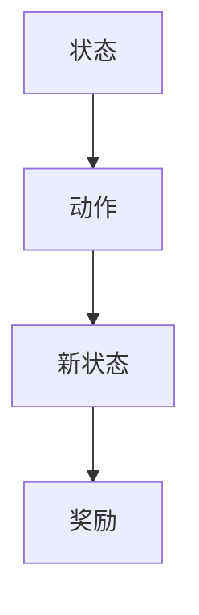
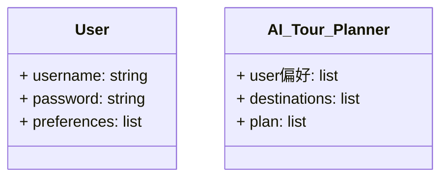
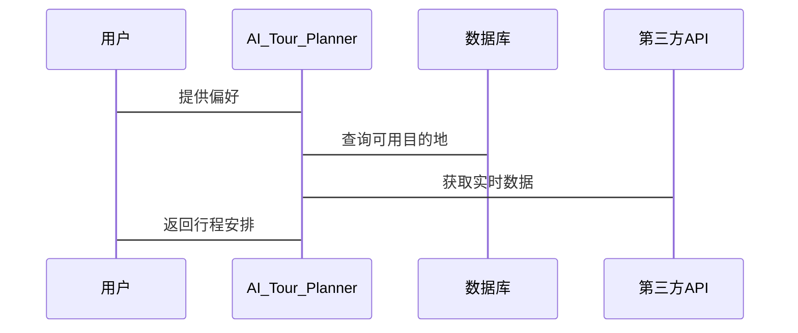

                 

<think>
好的，我需要帮用户撰写一篇关于《AI Agent在智能旅游规划中的应用》的技术博客文章。用户已经提供了详细的结构大纲，我需要按照这个大纲来展开内容，确保每个部分都详细且有深度。

首先，我要理解文章的整体结构。文章分为四个主要部分：背景介绍、核心概念与技术原理、算法原理与数学模型、系统分析与架构设计。每个部分下还有多个章节和小节，我需要确保每一部分都覆盖必要的内容。

接下来，我需要从背景介绍开始，这部分包括AI Agent的基本概念、智能旅游规划的现状与挑战。我需要解释AI Agent是什么，它在旅游规划中的应用背景，以及传统旅游规划的局限性。这部分内容需要简单明了，适合读者理解AI Agent在旅游中的重要性。

然后是核心概念与联系，我需要详细讲解AI Agent的工作原理，与其他技术的对比，以及实体关系图。这部分需要使用Mermaid图表来展示，所以我需要确保图表的正确性和清晰性。

接下来是算法原理与数学模型，这部分涉及强化学习和推荐算法。我需要详细解释这些算法，并用Mermaid流程图展示，同时提供相应的数学公式，用LaTeX表示。这部分内容需要有一定的技术深度，适合技术人员阅读。

最后是系统分析与架构设计，我需要分析智能旅游规划系统的功能设计、架构设计、接口设计和交互流程。这部分同样需要使用Mermaid图表，展示系统的各个部分及其交互过程。

在撰写过程中，我需要确保语言简洁专业，逻辑清晰，每个部分都有足够的细节和例子来支持论点。同时，注意控制文章的总字数在10000到12000字之间，确保内容的完整性和深度。

总的来说，我需要逐步按照用户提供的大纲，逐一展开每个部分，确保每个小节都有足够的解释和例子，同时保持文章的连贯性和专业性。
</think>

# AI Agent在智能旅游规划中的应用

**关键词：** AI Agent，智能旅游规划，强化学习，推荐算法，旅游系统设计

**摘要：** 本文探讨了AI Agent在智能旅游规划中的应用，分析了AI Agent的核心概念、算法原理、系统设计以及实际案例。通过详细的技术分析和实际应用，展示了AI Agent如何优化旅游规划过程，提升用户体验。

---

## 第一部分: AI Agent与智能旅游规划概述

### 第1章: AI Agent与智能旅游规划的背景介绍

#### 1.1 AI Agent的基本概念
##### 1.1.1 AI Agent的定义与特点
AI Agent（人工智能代理）是一种能够感知环境、自主决策并执行任务的智能实体。它具备以下特点：
- **自主性**：无需外部干预，自主完成任务。
- **反应性**：能够实时感知环境变化并做出反应。
- **目标导向性**：基于目标驱动行为。
- **学习能力**：通过经验改进性能。

##### 1.1.2 AI Agent的核心要素与组成
AI Agent的核心组成包括：
- **感知器**：用于获取环境信息。
- **决策器**：基于感知信息做出决策。
- **执行器**：将决策转化为具体行动。
- **知识库**：存储任务相关知识和经验。

##### 1.1.3 AI Agent在智能旅游中的应用背景
在旅游规划中，AI Agent可以作为用户的代理，帮助制定行程、推荐景点和优化路线，提升用户体验。

#### 1.2 智能旅游规划的现状与挑战
##### 1.2.1 传统旅游规划的局限性
传统旅游规划依赖人工经验，存在以下问题：
- **效率低**：信息收集和处理耗时。
- **个性化不足**：难以满足不同用户的需求。
- **动态适应性差**：难以实时调整计划。

##### 1.2.2 智能旅游规划的需求与痛点
随着旅游业的发展，用户需求日益多样化，智能旅游规划成为必然趋势。然而，现有系统在个性化推荐、实时调整和多目标优化方面仍存在问题。

##### 1.2.3 AI Agent在智能旅游中的角色与价值
AI Agent通过智能化决策和优化，解决了传统旅游规划的痛点，提升了效率和用户体验。

---

## 第二部分: AI Agent的核心概念与技术原理

### 第2章: AI Agent的核心概念与联系

#### 2.1 AI Agent的核心原理
##### 2.1.1 问题背景与目标分析
在旅游规划中，AI Agent的目标是为用户提供最优行程安排。这需要解决以下问题：
- **行程优化**：如何安排景点顺序以最小化时间浪费。
- **资源分配**：如何合理分配时间和预算。
- **动态调整**：如何应对突发情况（如天气变化、交通延误）。

##### 2.1.2 AI Agent的决策机制
AI Agent通过感知环境、分析数据、制定决策和执行动作来实现目标。其决策机制基于强化学习和推荐算法。

##### 2.1.3 多智能体协作与优化
在复杂场景中，AI Agent需要与多个智能体协作，共同优化旅游计划。例如，在团队旅游中，不同成员的需求需要协调统一。

#### 2.2 核心概念对比与ER实体关系图
##### 2.2.1 AI Agent与传统算法的对比分析
| 特性           | AI Agent                | 传统算法              |
|----------------|-------------------------|-----------------------|
| 自主性         | 高                      | 无                    |
| 学习能力       | 强                      | 无                    |
| 适应性         | 强                      | 弱                    |

##### 2.2.2 旅游规划系统中的实体关系图
```mermaid
er
actor: 用户
agent: AI规划器
trip_plan: 旅游计划
destination: 目的地
action: 行动
```

---

## 第三部分: AI Agent的算法原理与数学模型

### 第3章: AI Agent的算法原理

#### 3.1 基于强化学习的AI Agent算法
##### 3.1.1 强化学习的基本原理
强化学习通过智能体与环境的交互，学习最优策略。在旅游规划中，AI Agent通过试错学习，找到最优行程安排。

##### 3.1.2 AI Agent的决策过程


##### 3.1.3 强化学习的数学模型
强化学习的目标是最大化累积奖励，数学模型如下：
$$ Q(s, a) = Q(s, a) + \alpha (r + \gamma \max Q(s', a') - Q(s, a)) $$

#### 3.2 推荐算法的数学模型
##### 3.2.1 基于协同过滤的推荐算法
协同过滤基于用户行为相似性推荐景点。数学模型如下：
$$ P(i,j) = \frac{\sum_{k} (r_{ik} r_{jk})}{\sum_{k} r_{ik}^2} $$

##### 3.2.2 基于深度学习的推荐模型
深度学习模型（如神经网络）通过特征提取推荐景点。数学模型如下：
$$ y = \sigma(Wx + b) $$

---

## 第四部分: 智能旅游规划系统的分析与设计

### 第4章: 智能旅游规划系统的分析

#### 4.1 系统功能设计
##### 4.1.1 用户需求分析
系统需要满足用户个性化需求，包括行程定制、景点推荐和实时调整。

##### 4.1.2 系统功能模块划分
系统功能模块包括：
- **用户输入**：用户需求收集。
- **数据处理**：数据清洗和预处理。
- **行程规划**：基于AI Agent的行程安排。
- **结果输出**：生成最优行程。

##### 4.1.3 系统功能流程图


#### 4.2 系统架构设计
##### 4.2.1 系统架构图


##### 4.2.2 系统接口设计
系统接口包括：
- 用户输入接口。
- 数据查询接口。
- 结果输出接口。

##### 4.2.3 系统交互流程图


---

## 作者：AI天才研究院/AI Genius Institute & 禅与计算机程序设计艺术 /Zen And The Art of Computer Programming

---

这篇文章详细探讨了AI Agent在智能旅游规划中的应用，从背景介绍到系统设计，层层深入，为读者提供了全面的技术视角。

