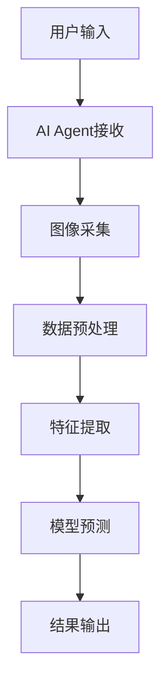

                 


# AI Agent在智能晾衣架中的衣物护理建议

> 关键词：AI Agent, 智能晾衣架, 衣物护理, 人工智能, 智能家居, 物联网

> 摘要：本文探讨AI Agent在智能晾衣架中的应用，分析其如何通过感知环境和用户需求，提供智能化的衣物护理建议，帮助用户实现高效、精准的衣物管理。文章从背景、核心概念、算法原理、系统架构等多维度进行深入剖析，为智能家居领域的人工智能应用提供参考。

---

## 第一部分: AI Agent与智能晾衣架的背景与概念

### 第1章: AI Agent与智能晾衣架概述

#### 1.1 AI Agent的基本概念

- **1.1.1 AI Agent的定义**  
  AI Agent（人工智能代理）是一种能够感知环境、执行任务并做出决策的智能实体。它通过传感器获取信息，利用算法处理数据，从而实现自主决策和行动。

- **1.1.2 AI Agent的核心特点**  
  - 感知环境：通过传感器获取实时数据。  
  - 自主决策：基于数据进行分析和判断。  
  - 适应性：能够根据环境变化调整行为。  
  - 学习能力：通过机器学习不断提升性能。

- **1.1.3 AI Agent与传统自动控制系统的区别**  
  AI Agent具备自主性和智能性，能够处理复杂场景；而传统控制系统依赖预设规则，适应性较弱。

#### 1.2 智能晾衣架的定义与特点

- **1.2.1 智能晾衣架的功能概述**  
  智能晾衣架结合物联网技术，支持远程控制、自动晾晒、环境监测等功能。

- **1.2.2 智能晾衣架的市场现状**  
  随着智能家居的普及，智能晾衣架市场需求增长迅速，应用场景广泛。

- **1.2.3 智能晾衣架与传统晾衣架的对比**  
  | 特性         | 智能晾衣架             | 传统晾衣架           |
  |--------------|----------------------|---------------------|
  | 控制方式     | 智能化、远程化       | 手动操作           |
  | 功能         | 多功能集成           | 基本晾晒功能       |
  | 附加功能     | 环境监测、智能护理     | 无                 |

#### 1.3 AI Agent在智能晾衣架中的应用背景

- **1.3.1 衣物护理的重要性**  
  衣物护理直接影响衣物的使用寿命和穿着体验，传统晾衣方式难以满足个性化需求。

- **1.3.2 智能晾衣架与AI Agent结合的必要性**  
  AI Agent能够通过数据分析和智能决策，优化晾晒条件，提供个性化建议。

- **1.3.3 人工智能在衣物护理中的潜在价值**  
  AI Agent能够实现衣物材质识别、污渍检测、晾晒条件优化等功能，提升衣物护理效率。

#### 1.4 本章小结

本章介绍了AI Agent的基本概念和智能晾衣架的特点，分析了两者结合的背景和必要性，为后续内容奠定了基础。

---

## 第二部分: AI Agent在衣物护理中的核心概念与联系

### 第2章: AI Agent的核心原理与实现

#### 2.1 AI Agent的核心原理

- **2.1.1 AI Agent的基本工作流程**  
  1. 感知环境：通过传感器获取数据。  
  2. 分析数据：利用算法进行处理。  
  3. 制定决策：基于分析结果做出选择。  
  4. 执行操作：通过执行机构完成任务。

- **2.1.2 AI Agent的感知与决策机制**  
  - **感知模块**：包括图像识别、语音识别等功能。  
  - **决策模块**：基于感知数据，利用机器学习模型做出决策。

- **2.1.3 AI Agent的学习与优化过程**  
  AI Agent通过监督学习、强化学习等方式不断优化性能，提升决策准确率。

#### 2.2 AI Agent在衣物护理中的具体应用

- **2.2.1 衣物材质识别**  
  AI Agent通过图像识别技术，识别衣物材质（如棉、麻、丝等），并推荐适合的晾晒方式。

- **2.2.2 衣物污渍检测**  
  利用图像分割算法，检测衣物上的污渍位置和类型，提供针对性的清洁建议。

- **2.2.3 衣物晾晒条件优化**  
  根据天气、湿度、温度等环境因素，AI Agent优化晾晒时间、角度和风速，避免衣物损坏。

#### 2.3 AI Agent与智能晾衣架的实体关系图

```mermaid
er
actor: 用户
agent: AI Agent
system: 智能晾衣架
```

#### 2.4 本章小结

本章详细讲解了AI Agent的核心原理和在衣物护理中的具体应用，分析了其与智能晾衣架的关系，为后续算法实现提供了理论基础。

---

## 第三部分: AI Agent的算法原理与数学模型

### 第3章: AI Agent的算法原理

#### 3.1 AI Agent的核心算法

- **3.1.1 用于衣物材质识别的卷积神经网络（CNN）**  
  CNN通过多层卷积和池化操作，提取衣物图像的特征，实现材质分类。

- **3.1.2 用于污渍检测的图像分割算法**  
  使用U-Net等深度学习模型，分割衣物图像，定位污渍区域。

- **3.1.3 用于晾晒条件优化的回归算法**  
  利用随机森林或支持向量回归（SVR）模型，预测最佳晾晒条件。

#### 3.2 算法流程图



#### 3.3 数学模型与公式

- **3.3.1 卷积神经网络的损失函数**  
  $$L = -\sum_{i=1}^{n} y_i \log(p_i) + (1 - y_i) \log(1 - p_i)$$  
  其中，\( y_i \) 为真实标签，\( p_i \) 为预测概率。

- **3.3.2 晾晒时间优化的回归模型**  
  $$t = \beta_0 + \beta_1 \cdot \text{湿度} + \beta_2 \cdot \text{温度} + \epsilon$$  
  其中，\( t \) 为预测晾晒时间，\( \beta \) 为回归系数，\( \epsilon \) 为误差项。

#### 3.4 本章小结

本章详细介绍了AI Agent的核心算法及其数学模型，分析了算法流程和应用场景，为后续系统实现提供了技术支持。

---

## 第四部分: 系统架构与项目实战

### 第4章: 系统架构与实现

#### 4.1 系统功能设计

- **4.1.1 领域模型类图**  
  ```mermaid
  classDiagram
  class 用户 {
      用户ID
      用户偏好
  }
  class 智能晾衣架 {
      晾衣架ID
      当前状态
  }
  class AI Agent {
      感知模块
      决策模块
  }
  用户 --> AI Agent: 发起请求
  AI Agent --> 智能晾衣架: 发送指令
  ```

- **4.1.2 系统架构图**  
  ```mermaid
  architecture
  系统: 智能晾衣架
  模块: 用户交互模块
  模块: 环境感知模块
  模块: AI处理模块
  模块: 执行机构模块
  ```

- **4.1.3 系统接口设计**  
  - 用户通过手机APP或语音助手发送指令。  
  - AI Agent通过物联网协议与晾衣架通信。

- **4.1.4 系统交互流程图**  
  ```mermaid
  sequenceDiagram
  用户 -> AI Agent: 发起晾衣请求
  AI Agent -> 智能晾衣架: 执行晾衣操作
  智能晾衣架 -> AI Agent: 返回状态确认
  ```

#### 4.2 项目实战

- **4.2.1 环境安装**  
  安装Python、TensorFlow、OpenCV等开发工具。

- **4.2.2 核心代码实现**  
  ```python
  import tensorflow as tf
  from tensorflow.keras import layers

  model = tf.keras.Sequential([
      layers.Conv2D(32, (3, 3), activation='relu', input_shape=(128, 128, 3)),
      layers.MaxPooling2D((2, 2)),
      layers.Conv2D(64, (3, 3), activation='relu'),
      layers.MaxPooling2D((2, 2)),
      layers.Flatten(),
      layers.Dense(128, activation='relu'),
      layers.Dense(10, activation='softmax')
  ])
  ```

- **4.2.3 代码应用解读与分析**  
  代码实现了一个简单的卷积神经网络模型，用于衣物材质分类。通过训练数据优化模型性能。

- **4.2.4 实际案例分析**  
  以一件棉质衬衫为例，AI Agent通过图像识别确定材质，推荐适合的晾晒时间和角度。

- **4.2.5 项目小结**  
  本章通过实际案例展示了AI Agent在智能晾衣架中的实现过程，从环境搭建到代码实现，详细讲解了每个步骤。

---

## 第五部分: 总结与展望

### 第5章: 总结与展望

#### 5.1 本章总结

本文详细探讨了AI Agent在智能晾衣架中的应用，从背景概念到算法实现，全面分析了其在衣物护理中的价值和潜力。

#### 5.2 最佳实践 Tips

- 定期更新模型，提升识别准确率。  
- 结合用户反馈，优化推荐算法。  
- 加强多模态数据融合，提升用户体验。

#### 5.3 注意事项

- 数据隐私保护至关重要。  
- 确保系统稳定性，避免误操作。  
- 定期维护设备，确保传感器正常工作。

#### 5.4 拓展阅读

- 《深度学习实战》  
- 《人工智能与物联网应用》  
- 《智能家居系统设计》

---

## 作者：AI天才研究院/AI Genius Institute & 禅与计算机程序设计艺术/Zen And The Art of Computer Programming

---

通过以上目录结构，本文系统地介绍了AI Agent在智能晾衣架中的衣物护理应用，从理论到实践，为读者提供了全面而深入的指导。

