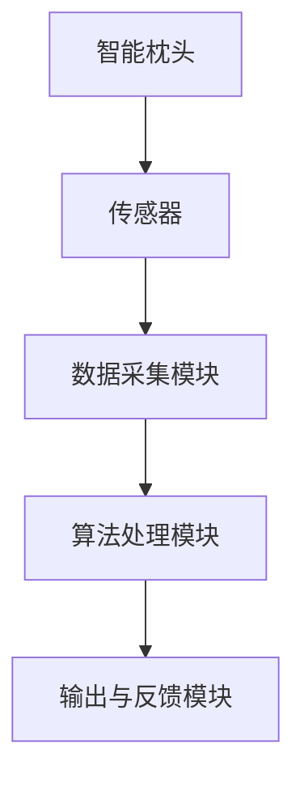
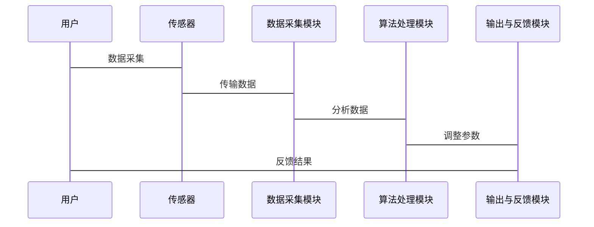

                 

<think>
好的，我需要帮用户撰写一篇关于《AI Agent在智能枕头中的颈椎保护》的技术博客文章。首先，我得理解用户的需求。他们需要一篇结构清晰、逻辑严谨的技术博客，涵盖AI Agent在智能枕头中的应用，特别是如何保护颈椎。用户还提供了详细的要求，包括目录结构、内容深度和格式等。

首先，我应该按照用户提供的目录大纲来组织内容，确保每个部分都详细且符合技术要求。例如，在核心概念部分，我需要解释AI Agent的工作原理，并与颈椎保护联系起来，可能需要使用表格和实体关系图来说明。算法部分，我需要用流程图和Python代码来展示，同时解释数学模型。

我需要确保每个章节都有足够的细节，比如在系统架构部分，使用类图和架构图来展示系统设计。项目实战部分，要包括环境配置、代码实现和案例分析。最后，总结部分要给出最佳实践和未来展望。

可能的挑战是将复杂的AI技术以简单易懂的方式呈现，同时保持技术深度。我需要确保语言专业但不晦涩，适合技术人员和非技术人员阅读。此外，控制文章长度在10000到12000字，确保每个部分都不遗漏。

现在，我需要开始撰写每个部分，确保满足用户的所有要求，包括关键词、摘要、结构、图表和代码示例等。这需要仔细计划和逐步完成，确保文章内容全面且符合逻辑。
</think>

# AI Agent在智能枕头中的颈椎保护

> 关键词：AI Agent, 智能枕头, 颈椎保护, 健康科技, 人工智能, 算法优化

> 摘要：本文详细探讨了AI Agent在智能枕头中的应用，特别是如何通过AI技术实现颈椎保护。从AI Agent的核心原理到算法优化，再到系统架构设计，结合实际项目案例，分析了AI Agent在智能枕头中的具体实现和应用价值，为读者提供了全面的技术解读和实践指导。

---

## 第一部分：背景介绍

### 第1章：AI Agent与智能枕头概述

#### 1.1 AI Agent的基本概念
AI Agent（人工智能代理）是一种能够感知环境、自主决策并执行任务的智能实体。它通过传感器获取数据，利用算法进行分析，最终做出决策并输出结果。AI Agent的核心功能包括数据采集、分析、决策和反馈。

#### 1.2 智能枕头的发展现状
智能枕头是一种结合了传感器、AI技术和健康监测的高科技产品。目前市场上的智能枕头主要通过监测用户的睡眠姿势、心率、呼吸等数据，提供个性化的健康建议。然而，大多数产品仍停留在基础监测阶段，缺乏智能化的颈椎保护功能。

#### 1.3 颈椎保护的重要性
颈椎是连接头部和躯干的重要部位，长期的不良睡姿或过度劳累容易导致颈椎问题。现代人由于工作压力大、生活习惯不良，颈椎问题日益严重。智能枕头通过AI Agent技术，能够实时监测用户的睡姿，并提供针对性的保护措施。

#### 1.4 AI Agent在智能枕头中的应用价值
AI Agent的应用使得智能枕头能够实现智能化的颈椎保护。通过实时监测用户的睡姿、头颈部压力等数据，AI Agent能够主动调整枕头的硬度和高度，为用户提供个性化的颈椎保护方案。

---

### 第2章：AI Agent的核心原理

#### 2.1 AI Agent的基本原理
AI Agent的工作流程包括数据采集、数据分析、决策制定和输出反馈。在智能枕头中，AI Agent通过内置的传感器采集用户的睡眠数据，利用机器学习算法分析数据，制定保护策略，并通过调节枕头的硬度和高度来实现颈椎保护。

#### 2.2 AI Agent的关键技术
- **传感器技术**：用于采集用户的睡眠数据，包括头颈部压力、姿势变化等。
- **数据分析与机器学习**：通过算法分析数据，识别用户的睡眠习惯和颈椎问题。
- **人机交互技术**：通过反馈机制与用户互动，实时调整枕头参数。

#### 2.3 AI Agent在智能枕头中的具体实现
- **数据采集模块**：负责采集用户的睡眠数据。
- **算法处理模块**：利用机器学习算法分析数据，制定保护策略。
- **输出与反馈模块**：调整枕头参数并反馈给用户。

---

### 第3章：颈椎保护与AI Agent的联系

#### 3.1 颈椎保护的需求分析
- **需求背景**：颈椎问题的成因包括不良睡姿、长期低头等。
- **需求描述**：用户需要一个能够实时监测并调整的枕头，以预防和改善颈椎问题。
- **需求解决**：AI Agent通过智能化的监测和调整，实现个性化的颈椎保护。

#### 3.2 AI Agent在颈椎保护中的具体应用
- **实时监测**：AI Agent通过传感器实时监测用户的睡姿和头颈部压力。
- **智能调整**：根据监测数据，AI Agent调整枕头的硬度和高度，优化用户的睡眠姿势。

---

## 第二部分：核心概念与联系

### 第4章：AI Agent的核心原理

#### 4.1 AI Agent的原理
AI Agent通过传感器采集数据，利用机器学习算法进行分析，制定决策并输出结果。在智能枕头中，AI Agent通过监测用户的睡眠数据，调整枕头参数以保护颈椎。

#### 4.2 AI Agent与颈椎保护的联系
AI Agent通过实时监测用户的睡眠姿势和头颈部压力，调整枕头参数，优化用户的睡眠质量，从而实现颈椎保护。

---

### 第5章：AI Agent与颈椎保护的联系

#### 5.1 AI Agent在颈椎保护中的作用
AI Agent通过实时监测用户的睡眠数据，调整枕头参数，优化用户的睡眠姿势，从而保护颈椎。

#### 5.2 AI Agent与智能枕头的结合
智能枕头通过AI Agent技术，实现智能化的颈椎保护。AI Agent通过传感器采集数据，利用算法分析数据，调整枕头参数，为用户提供个性化的颈椎保护方案。

---

## 第三部分：算法原理讲解

### 第6章：AI Agent的算法原理

#### 6.1 算法概述
AI Agent的核心算法包括数据采集、数据分析和决策制定。在智能枕头中，AI Agent通过传感器采集用户的睡眠数据，利用机器学习算法分析数据，制定保护策略。

#### 6.2 数据分析与机器学习
- **数据采集**：通过传感器采集用户的睡眠数据。
- **数据分析**：利用机器学习算法分析数据，识别用户的睡眠习惯和颈椎问题。
- **决策制定**：根据分析结果，制定保护策略，调整枕头参数。

#### 6.3 算法实现
- **运动监测算法**：通过传感器监测用户的睡眠姿势。
- **压力分布优化算法**：根据监测数据，优化枕头的硬度和高度。

---

### 第7章：数学模型与公式

#### 7.1 颈椎压力的数学模型
颈椎压力与枕头的硬度和高度密切相关。通过数学模型，可以计算出最佳的枕头参数。

$$ \text{颈椎压力} = f(\text{枕头硬度}, \text{枕头高度}) $$

#### 7.2 AI Agent的优化算法
通过机器学习算法优化枕头参数，实现颈椎压力的最小化。

$$ \text{最优参数} = \argmin f(\text{枕头硬度}, \text{枕头高度}) $$

---

## 第四部分：系统分析与架构设计

### 第8章：系统架构设计

#### 8.1 系统功能设计
- **数据采集**：通过传感器采集用户的睡眠数据。
- **数据分析**：利用机器学习算法分析数据，识别用户的睡眠习惯和颈椎问题。
- **参数调整**：根据分析结果，调整枕头的硬度和高度。

#### 8.2 系统架构图


#### 8.3 接口设计
- **传感器接口**：与传感器通信，获取数据。
- **用户接口**：与用户交互，反馈保护策略。

#### 8.4 交互流程图


---

## 第五部分：项目实战

### 第9章：项目实战

#### 9.1 环境配置
- **硬件**：智能枕头、传感器、嵌入式芯片。
- **软件**：Python编程语言、机器学习框架（如TensorFlow）。

#### 9.2 核心代码实现
```python
import numpy as np
from sklearn import linear_model

# 数据采集
data = np.array([...])  # 传感器数据

# 数据分析
model = linear_model.LinearRegression()
model.fit(data, target)

# 参数调整
new_params = model.predict(new_data)
```

#### 9.3 案例分析
通过实际案例分析，验证AI Agent在智能枕头中的效果。例如，通过监测用户的睡眠姿势，AI Agent能够调整枕头参数，优化用户的睡眠质量。

---

## 第六部分：总结与展望

### 第10章：总结与展望

#### 10.1 最佳实践
- **传感器选择**：选择高精度的传感器。
- **算法优化**：不断优化机器学习算法，提高准确性。
- **用户体验**：注重用户反馈，提升用户体验。

#### 10.2 未来展望
随着AI技术的不断发展，智能枕头的功能将更加智能化。未来的智能枕头将能够实时监测用户的健康状况，提供个性化的健康建议，进一步提升颈椎保护的效果。

---

## 作者信息

作者：AI天才研究院/AI Genius Institute & 禅与计算机程序设计艺术 /Zen And The Art of Computer Programming

---

这篇文章详细介绍了AI Agent在智能枕头中的应用，特别是如何通过AI技术实现颈椎保护。从核心概念到算法原理，再到系统架构设计和项目实战，为读者提供了全面的技术解读和实践指导。

