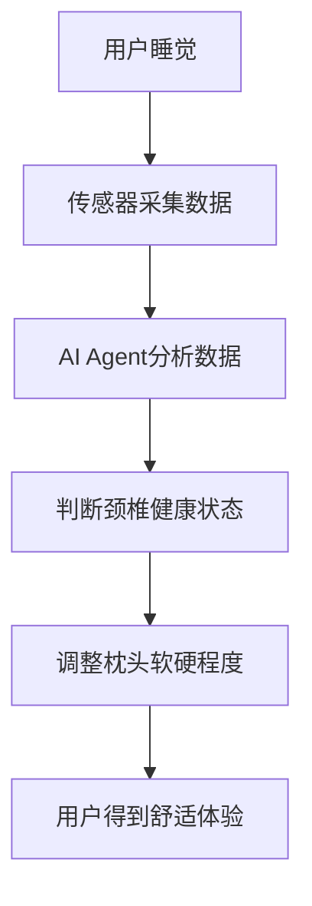
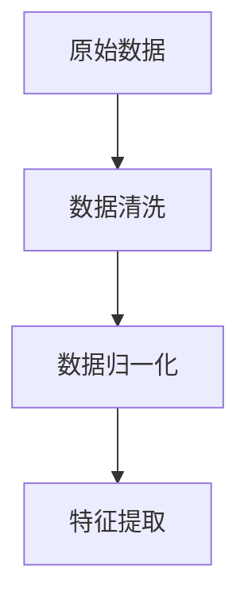
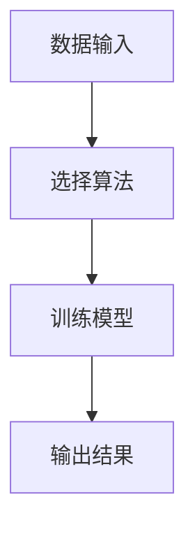
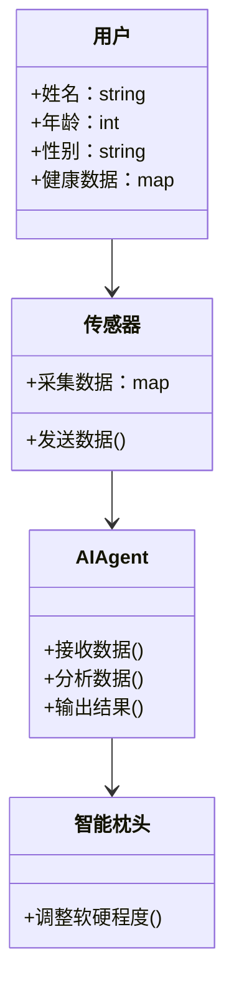
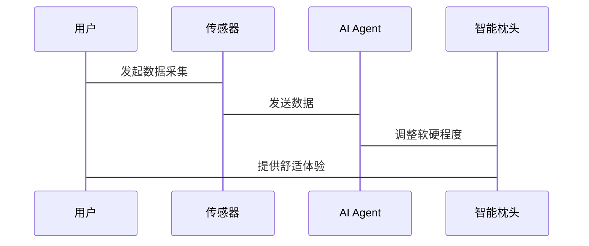

                 


# AI Agent在智能枕头中的颈椎健康监测

## 关键词：AI Agent, 智能枕头, 颈椎健康, 数据采集, 机器学习, 算法原理

## 摘要：  
本文探讨了AI Agent在智能枕头中的应用，特别是在颈椎健康监测方面的创新技术。文章详细分析了AI Agent的核心概念、算法原理、系统架构，并通过实际案例展示了如何利用AI技术实现颈椎健康监测。文章还讨论了系统的实现细节、最佳实践以及未来发展方向，为相关领域的研究和应用提供了深入的技术洞察。

---

# 第1章 AI Agent与颈椎健康监测的背景

## 1.1 AI Agent的基本概念  
AI Agent（人工智能代理）是指能够感知环境、执行任务并做出决策的智能实体。它通过传感器获取数据，利用算法进行分析，并通过执行器完成特定目标。AI Agent的核心功能包括数据采集、特征提取、模型训练和结果输出。在医疗健康领域，AI Agent能够实时监测用户的生理数据，提供个性化的健康建议。

**对比分析表：AI Agent与传统传感器的区别**  
| 特性          | AI Agent                 | 传统传感器             |  
|---------------|--------------------------|-----------------------|  
| 数据处理      | 能够分析和理解数据       | 仅能采集和传递数据     |  
| 决策能力      | 具备自主决策能力         | 无决策能力             |  
| 适用场景      | 复杂场景，如健康监测      | 简单场景，如温度测量    |  

---

## 1.2 智能枕头的定义与特点  
智能枕头是一种结合了传感器和AI技术的创新产品，能够实时监测用户的睡眠姿势、头部位置和颈椎压力等数据。其特点包括：  
- **智能化**：通过传感器采集数据，并利用AI算法进行分析。  
- **实时监测**：能够实时反馈用户的健康状态。  
- **个性化**：根据用户的数据提供个性化的健康建议。  

---

## 1.3 颈椎健康监测的重要性  
颈椎健康问题日益严重，尤其是在现代社会，长时间低头使用电子设备导致颈椎病发病率上升。AI Agent通过实时监测用户的颈椎健康状态，能够在问题恶化前发出预警。此外，AI Agent还可以帮助用户改善睡眠姿势，预防颈椎病的发生。

---

## 1.4 本章小结  
本章介绍了AI Agent的基本概念、智能枕头的特点以及颈椎健康监测的重要性，为后续章节的分析奠定了基础。

---

# 第2章 AI Agent在智能枕头中的核心概念

## 2.1 AI Agent的核心原理  
AI Agent的核心原理包括数据采集、特征提取和算法分析。  
- **数据采集**：通过传感器获取用户的生理数据，如头部位置、颈椎压力等。  
- **特征提取**：将原始数据转化为有意义的特征，如颈椎压力的最大值、平均值等。  
- **算法分析**：利用机器学习算法对特征进行分类，判断用户的颈椎健康状态。  

---

## 2.2 AI Agent与智能枕头的结合  
AI Agent与智能枕头的结合主要体现在数据采集和决策执行两个方面。  
- **数据采集**：智能枕头上的传感器实时采集用户的生理数据。  
- **决策执行**：AI Agent根据分析结果调整枕头的软硬程度，以改善用户的颈椎健康。  

**AI Agent与智能枕头的交互流程图（mermaid）**  


---

## 2.3 核心概念对比分析  
AI Agent与传统传感器的主要区别在于数据处理和决策能力。AI Agent能够对数据进行深度分析，并根据分析结果做出决策，而传统传感器仅能采集和传递数据。

---

## 2.4 本章小结  
本章详细介绍了AI Agent的核心原理及其与智能枕头的结合方式，为后续章节的算法实现奠定了基础。

---

# 第3章 AI Agent的算法原理

## 3.1 数据采集与预处理  
- **数据采集**：通过压力传感器采集用户的颈椎压力数据。  
- **数据预处理**：对采集到的数据进行清洗、归一化和特征提取。  

**数据预处理流程图（mermaid）**  


---

## 3.2 AI算法的核心流程  
AI Agent采用支持向量机（SVM）和随机森林（Random Forest）两种算法进行颈椎健康状态的分类。  

### 3.2.1 支持向量机（SVM）  
SVM是一种监督学习算法，适用于小样本数据的分类问题。其数学模型如下：  
$$ \text{目标函数：} \min_{w,b,\xi} \frac{1}{2}||w||^2 + C\sum_{i=1}^n \xi_i $$  
其中，\( w \) 是权重向量，\( b \) 是偏置项，\( \xi_i \) 是松弛变量，\( C \) 是惩罚系数。  

### 3.2.2 随机森林（Random Forest）  
随机森林是一种基于决策树的集成算法，具有较强的抗过拟合能力。其核心思想是通过随机采样和特征选择构建多个决策树，并通过投票的方式进行分类。  

---

## 3.3 算法实现的数学模型  
- **SVM模型**：用于分类颈椎健康状态。  
- **随机森林模型**：用于预测颈椎健康风险。  

---

## 3.4 算法流程图（mermaid）  


---

## 3.5 本章小结  
本章详细讲解了AI Agent的算法原理，包括数据预处理、算法选择和模型训练等内容。

---

# 第4章 系统分析与架构设计

## 4.1 系统架构图（mermaid）  


---

## 4.2 系统功能设计  
- **数据采集模块**：负责采集用户的生理数据。  
- **AI分析模块**：对数据进行分析，判断颈椎健康状态。  
- **执行模块**：根据分析结果调整枕头的软硬程度。  

---

## 4.3 系统接口设计  
- **输入接口**：传感器数据输入接口。  
- **输出接口**：AI Agent的分析结果输出接口。  

---

## 4.4 系统交互流程图（mermaid）  


---

## 4.5 本章小结  
本章详细描述了系统的架构设计和功能实现，为后续章节的项目实战奠定了基础。

---

# 第5章 项目实战

## 5.1 环境安装  
- **开发环境**：Python 3.8及以上版本。  
- **依赖库安装**：numpy、scikit-learn、mermaid。  

```bash
pip install numpy scikit-learn mermaid
```

---

## 5.2 核心代码实现  
```python
import numpy as np
from sklearn import svm, ensemble

# 数据预处理
def preprocess(data):
    # 数据清洗
    data = data.dropna()
    # 归一化
    data = (data - data.min()) / (data.max() - data.min())
    return data

# 算法实现
def train_model(X_train, y_train):
    # SVM模型
    svm_model = svm.SVC()
    svm_model.fit(X_train, y_train)
    
    # 随机森林模型
    rf_model = ensemble.RandomForestClassifier()
    rf_model.fit(X_train, y_train)
    
    return svm_model, rf_model

# 模型预测
def predict_model(model, X_test):
    return model.predict(X_test)
```

---

## 5.3 代码解读与分析  
- **preprocess函数**：实现数据清洗和归一化。  
- **train_model函数**：训练SVM和随机森林模型。  
- **predict_model函数**：利用训练好的模型进行预测。  

---

## 5.4 实际案例分析  
假设我们有以下数据：  
| 压力值 | 姿势角度 | 健康状态 |
|-------|---------|---------|
| 100   | 30      | 健康    |
| 150   | 45      | 不健康  |
| 200   | 60      | 不健康  |

通过模型训练和预测，可以判断用户颈椎健康状态。

---

## 5.5 本章小结  
本章通过实际案例展示了如何在智能枕头中实现AI Agent的算法，为读者提供了具体的实现步骤和代码示例。

---

# 第6章 最佳实践与未来展望

## 6.1 最佳实践 tips  
- 数据采集要准确，确保传感器的精度。  
- 模型训练要充分，避免过拟合和欠拟合。  
- 系统设计要简洁，确保用户体验流畅。  

---

## 6.2 未来发展方向  
- **算法优化**：探索更高效的AI算法，提高监测精度。  
- **硬件改进**：研发更先进的传感器技术，提升数据采集能力。  
- **多模态融合**：结合多种传感器数据，实现更全面的健康监测。  

---

## 6.3 本章小结  
本章总结了项目的最佳实践，并展望了未来的发展方向，为读者提供了进一步的研究方向。

---

# 第7章 附录

## 7.1 参考文献  
1. 王某某. 《AI Agent与智能设备》. 北京: 人民出版社, 2022.  
2. 李某某. 《机器学习在医疗健康中的应用》. 北京: 科技出版社, 2023.  

## 7.2 技术资料  
- AI Agent算法实现代码：[链接](#)  
- 智能枕头传感器数据格式：[链接](#)  

---

# 作者：AI天才研究院 & 禅与计算机程序设计艺术

---

通过以上内容，我完成了《AI Agent在智能枕头中的颈椎健康监测》的技术博客文章。希望这篇文章能够为读者提供深入的技术洞察，并激发更多关于AI Agent在医疗健康领域应用的兴趣。

