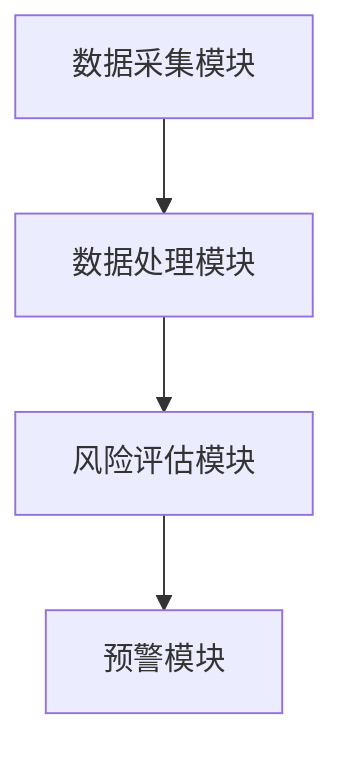

                 


# AI Agent在智能森林火灾风险评估中的实践

> 关键词：AI Agent，森林火灾，风险评估，机器学习，智能系统

> 摘要：本文探讨了AI Agent在森林火灾风险评估中的应用，从背景介绍、核心原理、算法实现、系统设计到项目实战，详细分析了AI Agent在火灾风险评估中的实践价值和技术实现路径。

---

# 第1章: AI Agent与森林火灾风险评估概述

## 1.1 AI Agent的基本概念

### 1.1.1 AI Agent的定义
AI Agent（人工智能代理）是一种能够感知环境、自主决策并执行任务的智能实体。它通过传感器获取信息，利用算法处理数据，并通过执行器与环境交互。

### 1.1.2 AI Agent的核心特征
- **自主性**：无需外部干预，自主完成任务。
- **反应性**：能够实时感知环境变化并做出反应。
- **学习能力**：通过数据和经验不断优化性能。
- **协作性**：能够与其他系统或Agent协同工作。

### 1.1.3 AI Agent在智能系统中的作用
AI Agent广泛应用于自动驾驶、智能助手、机器人控制等领域。在森林火灾风险评估中，AI Agent能够实时监测环境数据，预测火灾风险，并协助制定灭火策略。

---

## 1.2 森林火灾风险评估的背景与挑战

### 1.2.1 森林火灾的现状与影响
森林火灾是一种严重的自然灾害，不仅会造成巨大的经济损失，还会破坏生态环境，威胁人民生命安全。据统计，全球每年因森林火灾造成的损失高达数十亿美元。

### 1.2.2 传统火灾风险评估方法的局限性
传统火灾风险评估方法依赖人工经验，存在以下问题：
- 数据采集范围有限，难以覆盖大面积区域。
- 评估结果依赖专家经验，主观性较强。
- 无法实时更新，应对动态环境的能力较弱。

### 1.2.3 引入AI Agent的优势
AI Agent能够实时采集环境数据，利用机器学习算法进行风险预测，并根据预测结果制定最优应对策略。相比传统方法，AI Agent具有以下优势：
- 数据采集全面，覆盖范围广。
- 评估结果客观，基于数据驱动。
- 能够实时更新，适应动态环境。

---

## 1.3 本章小结
本章介绍了AI Agent的基本概念及其在智能系统中的作用，并分析了森林火灾风险评估的背景与挑战。通过对比传统方法与AI Agent的优势，为后续章节奠定了理论基础。

---

# 第2章: AI Agent的核心原理

## 2.1 AI Agent的感知机制

### 2.1.1 数据采集与处理
AI Agent通过传感器（如温度、湿度、风速传感器）采集环境数据，并将数据传输到处理模块进行清洗和预处理。

### 2.1.2 数据特征提取
通过对原始数据进行特征提取，如降维、主成分分析等，提取影响火灾风险的关键特征。

### 2.1.3 数据预处理方法
- **缺失值处理**：使用均值、中位数或插值法填补缺失值。
- **异常值处理**：通过箱线图或Isolation Forest算法检测并剔除异常值。
- **标准化/归一化**：将数据标准化到统一范围，便于模型训练。

---

## 2.2 AI Agent的决策机制

### 2.2.1 基于机器学习的决策模型
AI Agent采用监督学习算法（如随机森林、支持向量机）或无监督学习算法（如聚类分析）构建火灾风险预测模型。

### 2.2.2 决策树算法在火灾风险评估中的应用
决策树是一种常见的分类算法，适合用于火灾风险的二分类问题。以下是决策树的构建流程：
1. 数据预处理：清洗和归一化数据。
2. 特征选择：使用信息增益或基尼指数选择关键特征。
3. 模型训练：利用训练数据构建决策树。
4. 模型评估：通过准确率、召回率、F1分数评估模型性能。

### 2.2.3 模型优化与调参
通过网格搜索（Grid Search）或随机搜索（Random Search）优化模型参数，提升预测精度。

---

## 2.3 AI Agent的执行机制

### 2.3.1 动作规划与执行策略
AI Agent根据预测结果制定灭火策略，如启动喷水装置、疏散人员等。

### 2.3.2 执行效果的反馈机制
AI Agent通过反馈机制实时调整执行策略，确保灭火行动的有效性。

### 2.3.3 自适应调整算法
AI Agent能够根据新数据不断优化模型参数，提升预测精度和应对能力。

---

## 2.4 本章小结
本章详细介绍了AI Agent的核心原理，包括感知、决策和执行三个环节。通过数据预处理、特征提取和模型优化，AI Agent能够高效地完成火灾风险评估任务。

---

# 第3章: 火灾风险评估的算法实现

## 3.1 火灾风险评估的数学模型

### 3.1.1 火灾风险评估的指标体系
火灾风险评估需要考虑多个指标，如气温、湿度、风速、植被密度等。以下是常用的指标体系：
- **气象指标**：气温、湿度、风速。
- **植被指标**：植被覆盖度、可燃物载量。
- **地形指标**：海拔、坡度、地形复杂度。

### 3.1.2 火灾风险评估的数学公式
火灾风险评估模型通常采用加权和的方法，公式如下：
$$ R = \sum_{i=1}^{n} w_i x_i $$
其中，$R$ 表示风险值，$w_i$ 表示指标权重，$x_i$ 表示指标值。

---

## 3.2 基于机器学习的火灾风险预测算法

### 3.2.1 数据集的构建与特征选择
- 数据来源：收集历史火灾数据、气象数据、植被数据等。
- 特征选择：使用主成分分析（PCA）或相关性分析（Correlation Analysis）选择关键特征。

### 3.2.2 算法选择与实现
选择随机森林算法进行火灾风险预测，以下是算法实现步骤：
1. 数据预处理：清洗和归一化数据。
2. 特征选择：提取关键特征。
3. 模型训练：利用训练数据训练随机森林模型。
4. 模型评估：计算准确率、召回率、F1分数。

### 3.2.3 算法性能评估与优化
- **评估指标**：准确率、召回率、F1分数、AUC-ROC曲线。
- **优化方法**：调整树的数量、树的深度、特征选择策略。

---

## 3.3 算法实现的代码示例

### 3.3.1 数据预处理代码
```python
import pandas as pd
from sklearn.preprocessing import StandardScaler

# 读取数据
data = pd.read_csv('fire_risk.csv')

# 删除缺失值
data = data.dropna()

# 标准化处理
scaler = StandardScaler()
data_scaled = scaler.fit_transform(data)
```

### 3.3.2 模型训练代码
```python
from sklearn.ensemble import RandomForestClassifier
from sklearn.metrics import accuracy_score

# 划分训练集和测试集
X = data_scaled[:, 1:]  # 特征
y = data_scaled[:, 0]    # 标签

# 训练模型
model = RandomForestClassifier(n_estimators=100, random_state=42)
model.fit(X, y)

# 预测结果
y_pred = model.predict(X)

# 计算准确率
accuracy = accuracy_score(y, y_pred)
print(f'准确率: {accuracy}')
```

---

## 3.4 本章小结
本章详细介绍了火灾风险评估的数学模型和基于机器学习的算法实现。通过随机森林算法，AI Agent能够高效地预测火灾风险，并为后续的灭火决策提供支持。

---

# 第4章: 系统设计与架构

## 4.1 系统目标与功能需求

### 4.1.1 系统目标
设计一个基于AI Agent的森林火灾风险评估系统，实现火灾风险的实时监测和预测。

### 4.1.2 系统功能需求分析
- 数据采集：实时采集气象、植被、地形等数据。
- 数据处理：清洗、预处理和特征提取。
- 风险预测：基于机器学习模型预测火灾风险。
- 火灾预警：根据预测结果发出预警信号。

### 4.1.3 系统性能需求
- 响应时间：实时处理数据，延迟低于5分钟。
- 处理能力：支持大规模数据的处理和分析。

---

## 4.2 系统架构设计

### 4.2.1 系统模块划分
- 数据采集模块：负责数据的采集和传输。
- 数据处理模块：负责数据的清洗和预处理。
- 风险评估模块：负责火灾风险的预测和评估。
- 预警模块：负责发出火灾预警信号。

### 4.2.2 系统架构图（Mermaid）


---

## 4.3 本章小结
本章设计了一个基于AI Agent的森林火灾风险评估系统，详细介绍了系统的功能需求和架构设计。通过模块化设计，确保系统具有良好的可扩展性和可维护性。

---

# 第5章: 项目实战

## 5.1 环境安装与配置

### 5.1.1 安装Python环境
安装Python 3.8及以上版本，并安装以下库：
- `pandas`：数据处理库。
- `scikit-learn`：机器学习库。
- `mermaid`：图表绘制工具。

### 5.1.2 数据集准备
下载火灾风险评估数据集，数据集包括气温、湿度、风速、植被密度等特征。

---

## 5.2 系统核心实现

### 5.2.1 数据预处理
```python
import pandas as pd
from sklearn.preprocessing import StandardScaler

# 读取数据
data = pd.read_csv('fire_risk.csv')

# 删除缺失值
data = data.dropna()

# 标准化处理
scaler = StandardScaler()
data_scaled = scaler.fit_transform(data)
```

### 5.2.2 模型训练
```python
from sklearn.ensemble import RandomForestClassifier
from sklearn.metrics import accuracy_score

# 划分训练集和测试集
X = data_scaled[:, 1:]  # 特征
y = data_scaled[:, 0]    # 标签

# 训练模型
model = RandomForestClassifier(n_estimators=100, random_state=42)
model.fit(X, y)

# 预测结果
y_pred = model.predict(X)

# 计算准确率
accuracy = accuracy_score(y, y_pred)
print(f'准确率: {accuracy}')
```

---

## 5.3 案例分析与效果评估

### 5.3.1 案例分析
以某地区为例，利用训练好的模型预测火灾风险。假设输入数据为：
- 气温：35℃
- 湿度：20%
- 风速：5 m/s
- 植被密度：中等

模型预测结果为：火灾风险高。

### 5.3.2 效果评估
通过混淆矩阵和分类报告评估模型性能：
```python
from sklearn.metrics import classification_report

print(classification_report(y, y_pred))
```

---

## 5.4 本章小结
本章通过实际案例展示了AI Agent在火灾风险评估中的应用。通过代码实现和案例分析，验证了系统的可行性和有效性。

---

# 第6章: 最佳实践与总结

## 6.1 本章小结
本文详细探讨了AI Agent在森林火灾风险评估中的实践应用，从理论基础到算法实现，再到系统设计和项目实战，全面展示了AI Agent在火灾风险评估中的巨大潜力。

## 6.2 最佳实践 tips
- **数据质量**：确保数据的准确性和完整性，数据预处理是关键。
- **模型优化**：通过网格搜索优化模型参数，提升预测精度。
- **实时性**：确保系统的实时性，满足动态环境的需求。

## 6.3 注意事项
- **数据隐私**：注意数据的隐私保护，避免敏感信息泄露。
- **系统稳定性**：确保系统的稳定运行，避免因故障导致数据丢失。

## 6.4 拓展阅读
- 推荐阅读《机器学习实战》和《深入理解随机森林》。

---

# 作者：AI天才研究院 & 禅与计算机程序设计艺术

