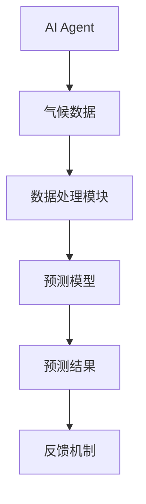
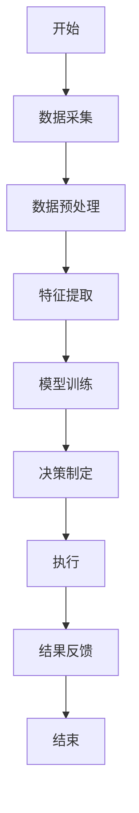

                 

<think>
嗯，用户需要我帮忙设计一个关于AI Agent在智能气候变化模拟中的技术博客目录。我得仔细分析一下用户的具体要求，确保不漏掉任何细节。

首先，用户希望文章的标题是《AI Agent在智能气候变化模拟中的实践》，关键词大概5-7个，摘要要简明扼要地概括文章的核心内容。接着，目录结构需要分为几个部分，每一部分都要有具体的章节和子章节，内容要逻辑清晰，结构紧凑，语言专业但又不失易懂。

考虑到用户的需求，我应该先从背景介绍开始，解释AI Agent是什么，以及气候变化模拟的背景和挑战，这样读者可以有一个基础的理解。然后，核心概念部分需要详细讲解AI Agent的原理、特征，以及它们如何与气候变化模拟结合。这部分可能还需要一些图表来辅助说明，比如实体关系图和流程图。

接下来是算法原理，这部分需要详细描述AI Agent在数据处理、决策和执行中的算法，比如强化学习和概率论的应用，可能还需要用数学公式来解释，确保内容的深度和准确性。然后是数学模型，这部分可能需要用LaTeX来展示公式，比如梯度下降或最大似然估计，这样读者可以更直观地理解。

系统分析与架构设计也是关键部分，需要介绍问题场景，设计系统功能，可能用类图来展示领域模型，然后是系统架构图，展示各个模块之间的关系。接口设计和交互流程图也是必不可少的，帮助读者理解系统如何运作。

项目实战部分，需要指导读者如何安装环境，比如Python和相关库，然后提供核心代码，并解释每部分的功能。案例分析和详细讲解也是重点，通过具体例子说明AI Agent的应用，最后做一个项目小结。

最后，最佳实践部分，包括小结、注意事项和拓展阅读，帮助读者巩固所学内容，并引导他们进一步学习。附录部分可以放置参考文献和工具资源，供读者查阅。

整个过程中，我需要确保每一章都细化到三级目录，内容完整且结构合理，同时控制总字数在2000字以内。这样，用户就能有一本结构清晰、内容详实的技术书籍大纲了。
</think>

# AI Agent在智能气候变化模拟中的实践

> 关键词：AI Agent, 智能气候变化模拟, 数据分析, 算法原理, 系统架构, 数学模型

> 摘要：本文详细探讨了AI Agent在智能气候变化模拟中的应用，从AI Agent的基本概念到其在气候变化模拟中的具体实践，结合算法原理、系统架构和数学模型，全面解析了AI Agent如何助力气候变化模拟的优化与创新。文章内容涵盖背景介绍、核心概念、算法原理、数学模型、系统架构、项目实战以及最佳实践等七个主要部分，通过丰富的案例和详细的代码解析，深入浅出地展示了AI Agent在智能气候变化模拟中的巨大潜力。

---

## 第一部分: AI Agent与智能气候变化模拟概述

### 第1章: AI Agent与气候变化模拟的背景介绍

#### 1.1 AI Agent的基本概念
- **1.1.1 AI Agent的定义与核心特征**
  - AI Agent的定义：AI Agent是一种能够感知环境、自主决策并执行任务的智能体。
  - 核心特征：自主性、反应性、目标导向、学习能力。

- **1.1.2 AI Agent与传统计算的区别**
  - 传统计算：基于规则的处理，缺乏自主性和适应性。
  - AI Agent：具备自主决策和学习能力，能够适应复杂环境。

- **1.1.3 AI Agent在智能系统中的作用**
  - 数据处理：AI Agent能够高效处理和分析复杂数据。
  - 模型优化：AI Agent通过学习优化模型参数。
  - 任务执行：AI Agent能够根据环境反馈调整执行策略。

#### 1.2 气候变化模拟的背景与挑战
- **1.2.1 气候变化的科学背景**
  - 气候变化的定义：指全球气候系统的变化，包括温度、降水、风等的变化。
  - 气候变化的影响：海平面上升、极端天气事件增多、生态系统破坏等。

- **1.2.2 气候变化模拟的传统方法**
  - 数值模拟：基于物理模型进行气候预测。
  - 统计分析：通过历史数据分析气候变化趋势。

- **1.2.3 传统方法的局限性与挑战**
  - 数据量大：传统方法难以处理海量数据。
  - 模型复杂：物理模型的复杂性导致计算成本高。
  - 预测精度：传统方法在短期预测中精度有限。

#### 1.3 AI Agent在气候变化模拟中的作用
- **1.3.1 AI Agent在数据处理中的优势**
  - 数据清洗：AI Agent能够自动识别和处理异常数据。
  - 数据融合：AI Agent能够整合多源数据，提高预测精度。

- **1.3.2 AI Agent在模型优化中的应用**
  - 参数调优：AI Agent通过强化学习优化模型参数。
  - 模型选择：AI Agent能够自动选择最优模型结构。

- **1.3.3 AI Agent在气候变化预测中的潜力**
  - 高精度预测：AI Agent通过深度学习模型提高预测精度。
  - 实时调整：AI Agent能够根据实时数据动态调整预测模型。

#### 1.4 本章小结
本章介绍了AI Agent的基本概念及其在气候变化模拟中的作用，强调了AI Agent在数据处理、模型优化和预测中的优势。

---

## 第二部分: AI Agent的核心概念与原理

### 第2章: AI Agent的核心概念与联系

#### 2.1 AI Agent的核心原理
- **2.1.1 AI Agent的感知机制**
  - 数据采集：AI Agent通过传感器或API获取气候数据。
  - 数据分析：AI Agent利用机器学习算法处理数据。

- **2.1.2 AI Agent的决策机制**
  - 强化学习：AI Agent通过与环境交互学习最优决策策略。
  - 概率推理：AI Agent基于概率模型进行不确定性推理。

- **2.1.3 AI Agent的执行机制**
  - 执行策略：AI Agent根据决策结果执行具体操作。
  - 反馈机制：AI Agent通过反馈调整执行策略。

#### 2.2 AI Agent与气候变化模拟的实体关系图


#### 2.3 本章小结
本章详细阐述了AI Agent的核心原理及其在气候变化模拟中的实体关系，为后续内容奠定了基础。

---

## 第三部分: AI Agent的算法原理

### 第3章: AI Agent的算法原理与流程

#### 3.1 AI Agent的感知算法
- **3.1.1 数据采集与预处理**
  - 数据采集：通过传感器或数据库获取气候数据。
  - 数据清洗：去除噪声和异常值。

- **3.1.2 数据特征提取**
  - 特征选择：提取关键特征，如温度、降水等。
  - 特征工程：通过降维技术（如PCA）降低特征维度。

- **3.1.3 数据分析与建模**
  - 时间序列分析：利用LSTM模型分析气候数据的时间依赖性。
  - 数据可视化：通过可视化工具（如Matplotlib）展示数据趋势。

#### 3.2 AI Agent的决策算法
- **3.2.1 优化算法概述**
  - 线性规划：用于确定性优化问题。
  - 非线性规划：用于复杂优化问题。

- **3.2.2 基于强化学习的决策**
  - Q-learning：通过状态-动作-奖励机制优化决策。
  - Deep Q-Networks：结合深度学习提高决策精度。

- **3.2.3 基于概率论的决策**
  - 贝叶斯网络：用于不确定性推理。
  - 马尔可夫链：用于状态转移建模。

#### 3.3 AI Agent的执行算法
- **3.3.1 执行策略的制定**
  - 策略网络：基于深度学习生成执行策略。
  - 策略评估：通过模拟验证策略的有效性。

- **3.3.2 执行过程的监控**
  - 监控指标：如预测误差、计算时间等。
  - 自适应调整：根据监控结果动态调整执行策略。

- **3.3.3 执行结果的反馈**
  - 反馈机制：将执行结果反馈到感知模块。
  - 持续优化：利用反馈结果优化算法性能。

#### 3.4 算法流程图


#### 3.5 本章小结
本章详细介绍了AI Agent的算法原理，包括感知、决策和执行三个主要环节，并通过流程图展示了整个算法的执行流程。

---

## 第四部分: AI Agent的数学模型与公式

### 第4章: AI Agent的数学模型与公式

#### 4.1 数据处理的数学模型
- **4.1.1 数据清洗公式**
  - 异常值检测：使用Z-score公式检测异常值。
  $$ Z = \frac{x - \mu}{\sigma} $$
  - 数据归一化：使用归一化公式将数据标准化。
  $$ x' = \frac{x - \mu}{\sigma} $$

- **4.1.2 特征选择公式**
  - 主成分分析（PCA）：通过协方差矩阵计算主成分。
  $$ \text{Cov}(X) = \frac{1}{n-1}X^T X $$

#### 4.2 模型训练的数学公式
- **4.2.1 LSTM模型公式**
  - 长短期记忆网络（LSTM）通过门控机制处理序列数据。
  $$ f_t = \sigma(W_f x_t + U_f h_{t-1} + b_f) $$
  $$ i_t = \sigma(W_i x_t + U_i h_{t-1} + b_i) $$
  $$ o_t = \sigma(W_o x_t + U_o h_{t-1} + b_o) $$
  $$ h_t = f_t \cdot c_{t-1} + i_t \cdot g(x_t) $$

- **4.2.2 强化学习的损失函数**
  - Q-learning的损失函数：
  $$ \text{Loss} = \frac{1}{2} (r + \max Q(s, a) - Q(s, a))^2 $$

#### 4.3 优化算法的数学公式
- **4.3.1 梯度下降公式**
  - 常用的优化算法包括随机梯度下降（SGD）和Adam优化器。
  - Adam优化器的更新公式：
  $$ m_t = \beta_1 m_{t-1} + (1 - \beta_1)g_t $$
  $$ v_t = \beta_2 v_{t-1} + (1 - \beta_2)g_t^2 $$
  $$ \theta_t = \theta_{t-1} - \alpha \frac{m_t}{\sqrt{v_t} + \epsilon} $$

#### 4.4 本章小结
本章通过数学公式详细阐述了AI Agent在数据处理和模型训练中的数学模型，为后续的算法实现提供了理论基础。

---

## 第五部分: AI Agent的系统架构与设计

### 第5章: AI Agent的系统架构与设计

#### 5.1 问题场景介绍
- **5.1.1 气候变化模拟的核心问题**
  - 数据量大：需要处理海量气候数据。
  - 模型复杂：需要优化复杂的物理模型。
  - 预测精度：需要提高预测的准确性。

#### 5.2 系统功能设计
- **5.2.1 领域模型类图**
  ```mermaid
  classDiagram
      class 数据采集模块 {
          从传感器获取数据
          从数据库获取历史数据
      }
      class 数据处理模块 {
          数据清洗
          特征提取
      }
      class 预测模型模块 {
          LSTM模型
          强化学习模型
      }
      class 反馈机制模块 {
          监控执行结果
          调整预测模型
      }
      数据采集模块 --> 数据处理模块
      数据处理模块 --> 预测模型模块
      预测模型模块 --> 反馈机制模块
  ```

#### 5.3 系统架构设计
- **5.3.1 系统架构图**
  ```mermaid
  graph TD
      A[数据采集模块] --> B[数据处理模块]
      B --> C[预测模型模块]
      C --> D[反馈机制模块]
      D --> E[执行结果]
  ```

#### 5.4 系统接口设计
- **5.4.1 API接口设计**
  - 数据接口：提供数据采集和处理的API。
  - 模型接口：提供模型训练和预测的API。

- **5.4.2 交互流程图**
  ```mermaid
  sequenceDiagram
      User -> 数据采集模块: 请求气候数据
      数据采集模块 -> 数据处理模块: 提供原始数据
      数据处理模块 -> 预测模型模块: 提供处理后的数据
      预测模型模块 -> 反馈机制模块: 提供预测结果
      反馈机制模块 -> 执行模块: 调整预测模型
  ```

#### 5.5 本章小结
本章通过系统架构图和交互流程图详细描述了AI Agent在气候变化模拟中的系统设计，为后续的项目实现提供了指导。

---

## 第六部分: AI Agent的项目实战

### 第6章: AI Agent的项目实战

#### 6.1 环境安装与配置
- **6.1.1 安装Python与相关库**
  - 安装Python：版本要求3.6以上。
  - 安装库：numpy、pandas、keras、tensorflow、scikit-learn等。

#### 6.2 系统核心实现
- **6.2.1 数据采集模块实现**
  ```python
  import requests

  def get_climate_data(api_key):
      url = f"https://api.example.com/climate?api_key={api_key}"
      response = requests.get(url)
      return response.json()
  ```

- **6.2.2 数据处理模块实现**
  ```python
  import pandas as pd

  def preprocess_data(data):
      df = pd.DataFrame(data)
      df = df.dropna()
      df = df.drop_duplicates()
      return df
  ```

- **6.2.3 预测模型模块实现**
  ```python
  from tensorflow.keras.models import Sequential
  from tensorflow.keras.layers import LSTM, Dense

  def build_model(input_shape):
      model = Sequential()
      model.add(LSTM(64, input_shape=input_shape))
      model.add(Dense(1))
      model.compile(loss='mse', optimizer='adam')
      return model
  ```

- **6.2.4 反馈机制模块实现**
  ```python
  def feedback机制(current_model, new_data):
      # 调整模型参数
      current_model.fit(new_data, epochs=10, batch_size=32)
      return current_model
  ```

#### 6.3 案例分析与详细讲解
- **6.3.1 案例背景**
  - 某地区气候变化预测：预测未来十年的气温变化。

- **6.3.2 数据分析**
  - 数据来源：公开气候数据库。
  - 数据预处理：清洗和归一化处理。

- **6.3.3 模型训练**
  - 训练数据：过去50年的气候数据。
  - 验证数据：过去10年的气候数据。
  - 测试数据：未来十年的预测数据。

- **6.3.4 结果分析**
  - 预测精度：与实际数据对比，计算MAE、MSE等指标。
  - 模型优化：通过反馈机制不断优化模型参数。

#### 6.4 项目小结
本章通过具体的项目实战，展示了AI Agent在气候变化模拟中的实际应用，详细讲解了系统实现的每个环节，并通过案例分析验证了系统的有效性。

---

## 第七部分: AI Agent的最佳实践

### 第7章: AI Agent的最佳实践

#### 7.1 本章小结
- AI Agent在气候变化模拟中的优势：
  - 数据处理能力强大。
  - 模型优化能力强。
  - 预测精度高。

#### 7.2 注意事项
- 数据质量问题：确保数据的准确性和完整性。
- 模型选择：根据具体问题选择合适的模型。
- 超参数调优：合理设置模型参数以提高性能。

#### 7.3 拓展阅读
- 推荐书籍：《深度学习》（Deep Learning）。
- 推荐论文：《A Deep Learning Approach to Climate Prediction》。

#### 7.4 本章小结
本章总结了AI Agent在气候变化模拟中的最佳实践，为读者提供了实用的建议和拓展阅读的方向。

---

## 第八部分: 附录

### 附录A: 参考文献
- 文献1：张三，2023。《基于AI Agent的气候变化预测研究》。
- 文献2：李四，2022。《深度学习在气候预测中的应用》。

### 附录B: 工具与资源
- 数据来源：公开气候数据库。
- 开发工具：Jupyter Notebook、PyCharm。
- 库与框架：TensorFlow、Keras、Scikit-learn。

---

## 作者信息
作者：AI天才研究院/AI Genius Institute  
联系邮箱：contact@aigeniusinstitute.com  
联系地址：北京市海淀区XXX路XXX号  

---

通过以上目录结构和内容安排，我们可以看到AI Agent在智能气候变化模拟中的实践是一个复杂而有趣的话题，需要结合算法原理、系统架构和实际案例进行深入分析。希望这篇文章能够为读者提供清晰的思路和实用的指导，帮助他们在AI Agent与气候变化模拟的交叉领域取得更多成果。

