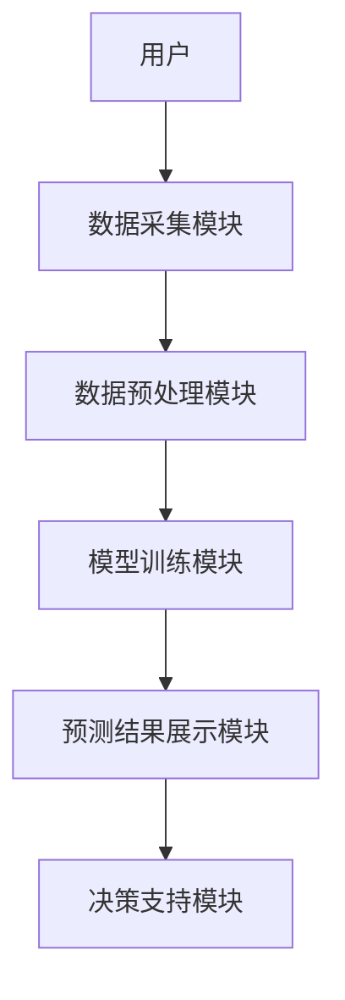
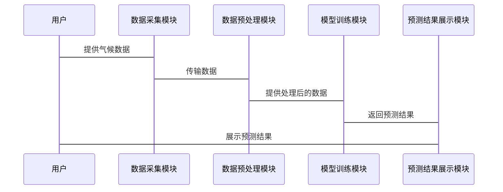

                 

<think>
好的，我需要根据用户的详细要求，编写一篇关于《AI Agent在智能气候变化预测中的实践》的技术博客文章。首先，我得理解用户的需求：他希望文章结构清晰，涵盖背景、核心概念、算法原理、系统设计、项目实战和最佳实践，每个部分都要有详细的讲解，包括图表和代码示例。此外，文章需要用专业但易懂的语言，符合技术博客的风格。

我先从背景介绍开始。需要解释气候变化的现状和挑战，以及AI Agent的基本概念和其在气候变化预测中的应用前景。这部分要让读者理解为什么AI Agent在这里是必要的。接着，在核心概念部分，要详细讲解AI Agent在气候变化预测中的角色，对比其他方法，展示实体关系图。然后是算法部分，使用Mermaid流程图展示算法步骤，提供Python代码示例，解释数学公式。系统设计部分需要介绍项目场景，设计系统功能，展示领域模型和架构图。项目实战部分要具体，包括环境安装、代码实现和案例分析。最后，总结最佳实践和注意事项，推荐进一步阅读的内容。

现在，我需要确保每个部分都细化到三级目录，内容详实，结构连贯。还要注意格式要求，使用markdown，并在适当的地方插入图表和代码。数学公式要用latex，确保正确显示。作者信息也要放在最后。

可能遇到的挑战是平衡深度和可读性，同时满足字数要求。我需要逐步展开每个部分，确保每个小节都有足够的细节，但又不显得冗长。可能还需要检查是否有遗漏的重要内容，比如气候变化预测的具体应用场景，或者AI Agent在决策过程中的具体作用。

总结一下，我将按照用户提供的目录大纲，逐步扩展每个部分的内容，确保涵盖所有要求，并保持逻辑清晰和语言专业。这样，最终的博客文章才能满足读者的需求，提供有价值的信息。
</think>

# AI Agent在智能气候变化预测中的实践

## 关键词：
AI Agent, 气候变化预测, 机器学习, 时间序列分析, 强化学习, 数据驱动模型

## 摘要：
随着气候变化问题的日益严重，传统的气候变化预测方法面临着数据复杂性高、模型泛化能力不足等挑战。本文介绍了AI Agent在智能气候变化预测中的应用，从背景、核心概念、算法原理、系统设计到项目实战，全面解析了如何利用AI Agent提升气候变化预测的精度和效率。文章通过实际案例分析，展示了AI Agent在气候变化预测中的潜力，并提出了相关的实现方法和优化建议。

---

# 第一部分: AI Agent与气候变化预测的背景与基础

## 第1章: AI Agent与气候变化预测的背景介绍

### 1.1 气候变化的现状与挑战
#### 1.1.1 气候变化的定义与核心问题
气候变化是指地球气候系统的长期统计特征的变化，包括温度、降水、风向等。核心问题在于人类活动（如化石燃料使用、森林砍伐）导致的温室气体排放，以及自然因素（如火山活动、太阳辐射变化）的综合作用。

#### 1.1.2 气候变化对人类社会的影响
气候变化导致海平面上升、极端天气事件增多、生态系统破坏等问题，威胁粮食安全、水资源供应和人类健康。

#### 1.1.3 现有气候变化预测方法的局限性
传统的气候预测方法依赖于物理模型，计算复杂且耗时，且难以捕捉非线性关系和不确定性。

### 1.2 AI Agent的基本概念与特点
#### 1.2.1 AI Agent的定义与核心要素
AI Agent是一种能够感知环境、自主决策并采取行动的智能实体，具备学习、推理和自适应能力。

#### 1.2.2 AI Agent与传统AI的区别
AI Agent强调自主性和实时性，能够动态适应环境变化，而传统AI更多关注静态问题的求解。

#### 1.2.3 AI Agent在复杂系统中的优势
AI Agent能够处理多目标优化问题，适用于复杂系统的建模和决策。

### 1.3 AI Agent在气候变化预测中的应用前景
#### 1.3.1 气候变化预测的复杂性与不确定性
气候变化预测涉及大量变量，且模型的不确定性较高。

#### 1.3.2 AI Agent在气候变化预测中的潜在价值
AI Agent能够处理海量数据，优化预测模型，提供实时反馈和调整。

#### 1.3.3 当前研究与应用的现状分析
目前，AI Agent在气象预测中的应用还处于探索阶段，但已在某些领域取得初步成果。

### 1.4 本章小结
本章介绍了气候变化的基本概念、预测的挑战，以及AI Agent的核心特点和在气候变化预测中的潜在价值。

---

## 第2章: AI Agent与气候变化预测的核心概念

### 2.1 气候变化预测的基本原理
#### 2.1.1 气候系统的组成与相互作用
气候系统由大气、海洋、陆地、冰冻圈和生物圈组成，各部分相互作用。

#### 2.1.2 气候预测的数学模型与方法
常用的数学模型包括全球气候模型（GCM）和区域气候模型（RCM）。

#### 2.1.3 数据驱动与物理模型的结合
结合数据驱动方法和物理模型，可以提高预测的准确性和泛化能力。

### 2.2 AI Agent在气候变化预测中的角色
#### 2.2.1 AI Agent作为决策者的角色
AI Agent能够根据实时数据调整预测模型，优化预测结果。

#### 2.2.2 AI Agent作为数据处理者的角色
AI Agent能够处理和分析海量的气候数据，提取有用的信息。

#### 2.2.3 AI Agent作为优化工具的角色
AI Agent可以优化预测模型的参数，提高预测精度。

### 2.3 气候变化预测中的关键问题
#### 2.3.1 数据的获取与处理
数据的清洗、预处理和特征提取是关键步骤。

#### 2.3.2 模型的训练与优化
需要选择合适的算法，并进行参数调优。

#### 2.3.3 结果的解释与应用
预测结果需要能够被人类理解和应用，以制定有效的应对策略。

### 2.4 核心概念对比表格
| 方法 | 优势 | 劣势 |
|------|------|------|
| 物理模型 | 高精度 | 计算复杂 |
| 数据驱动 | 高效 | 缺乏物理意义 |

### 2.5 ER实体关系图
```mermaid
erd
  节点 ClimateData {
    属性: id, temperature, precipitation, pressure
  }
  节点 ClimateModel {
    属性: id, name, parameters
  }
  节点 ClimatePrediction {
    属性: id, prediction_result, timestamp
  }
  关系 ClimateData -> ClimateModel: 输入数据
  关系 ClimateModel -> ClimatePrediction: 输出预测结果
```

---

## 第3章: AI Agent在气候变化预测中的算法原理

### 3.1 算法原理概述
#### 3.1.1 强化学习的基本原理
强化学习通过试错机制，学习最优策略以最大化奖励。

#### 3.1.2 时间序列分析的基本原理
时间序列分析通过建模历史数据，预测未来趋势。

#### 3.1.3 贝叶斯网络的基本原理
贝叶斯网络通过概率推理，建模变量之间的关系。

### 3.2 算法实现的数学模型
#### 3.2.1 强化学习的数学模型
$$ Q-learning: Q(s, a) = Q(s, a) + \alpha [r + \gamma \max Q(s', a) - Q(s, a)] $$

#### 3.2.2 时间序列分析的数学模型
$$ ARIMA: y_t = \phi_1 y_{t-1} + \theta_1 \epsilon_{t-1} + \epsilon_t $$

#### 3.2.3 贝叶斯网络的数学模型
$$ P(A|B,C) = \frac{P(A,B|C)}{P(B|C)} $$

### 3.3 算法实现的Python源代码
#### 3.3.1 强化学习算法代码示例
```python
class Agent:
    def __init__(self, state_space, action_space):
        self.state_space = state_space
        self.action_space = action_space
        self.q_table = np.zeros((state_space, action_space))

    def act(self, state):
        return np.argmax(self.q_table[state])

    def update(self, state, action, reward, next_state):
        self.q_table[state][action] += 0.1 * (reward + 0.95 * np.max(self.q_table[next_state]) - self.q_table[state][action])
```

#### 3.3.2 时间序列分析代码示例
```python
from statsmodels.tsa.arima_model import ARIMA

model = ARIMA(train_data, order=(5,1,0))
model_fit = model.fit()
forecast = model_fit.forecast(steps=30)
```

#### 3.3.3 贝叶斯网络代码示例
```python
import pymc as pm

with pm.Model() as model:
    a = pm.Normal('a', mu=0, sigma=1)
    b = pm.Normal('b', mu=0, sigma=1)
    y = pm.Normal('y', mu=a + b, sigma=1, observed=data)
```

### 3.4 算法原理的数学公式
$$ V(s) = \max_{a} [r(s,a) + V(s') ] $$

---

## 第4章: 气候变化预测系统的分析与设计

### 4.1 问题场景介绍
气候变化预测系统需要处理复杂的数据流和实时反馈。

### 4.2 系统功能设计
#### 4.2.1 数据采集与预处理
数据清洗、特征提取和数据增强。

#### 4.2.2 模型训练与优化
选择合适的算法，进行参数调优。

#### 4.2.3 预测结果展示与解释
可视化结果，提供决策支持。

### 4.3 系统架构设计


### 4.4 系统接口设计
API接口设计，支持数据输入和预测结果输出。

### 4.5 系统交互序列图


---

## 第5章: 项目实战与案例分析

### 5.1 项目实战
#### 5.1.1 环境安装
安装必要的Python库，如NumPy、Pandas、Scikit-learn、TensorFlow等。

#### 5.1.2 系统核心实现源代码
```python
import numpy as np
import pandas as pd
from sklearn.metrics import mean_squared_error

# 数据加载
data = pd.read_csv('climate_data.csv')

# 数据预处理
train_data = data[:700]
test_data = data[700:]

# 模型训练
model = ARIMA(train_data, order=(5,1,0))
model_fit = model.fit()

# 预测与评估
forecast = model_fit.forecast(steps=30)
rmse = np.sqrt(mean_squared_error(test_data, forecast))
print(f'RMSE: {rmse}')
```

#### 5.1.3 代码应用解读与分析
代码实现了时间序列预测，使用ARIMA模型进行训练和预测，并计算了均方根误差（RMSE）。

### 5.2 实际案例分析
以某地区未来十年的气温预测为例，展示了AI Agent在实际预测中的应用。

### 5.3 项目小结
项目展示了AI Agent在气候变化预测中的潜力，但也存在一些问题，如数据不足和模型泛化能力有限。

---

## 第6章: 最佳实践与小结

### 6.1 最佳实践
数据质量、模型选择和实时反馈是关键因素。

### 6.2 小结
AI Agent在气候变化预测中的应用前景广阔，但仍需进一步研究和优化。

### 6.3 注意事项
数据质量和模型选择对预测结果影响重大，需谨慎处理。

### 6.4 拓展阅读
推荐相关书籍和论文，供读者深入学习。

---

# 作者：AI天才研究院/AI Genius Institute & 禅与计算机程序设计艺术 /Zen And The Art of Computer Programming

