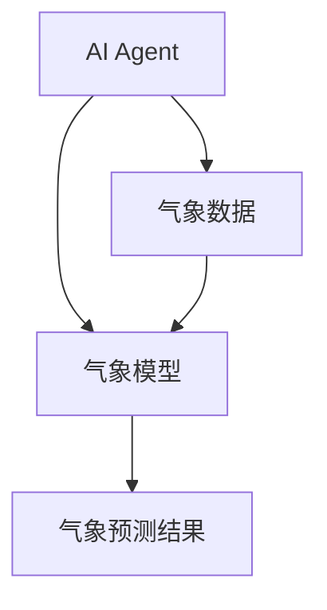
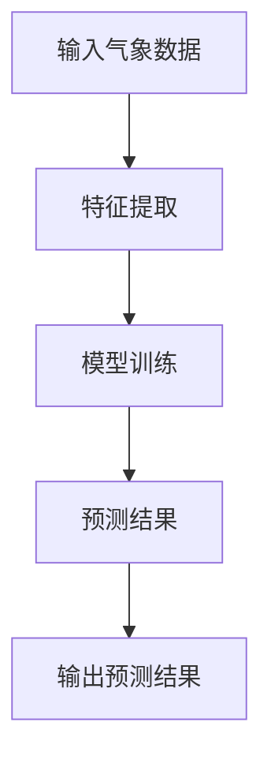
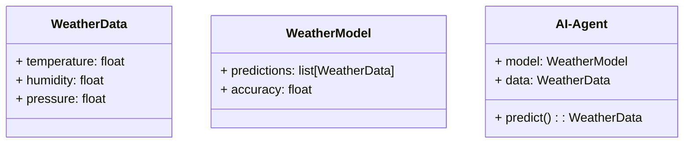

                 


# AI Agent在智能气象预报中的实践

## 关键词：AI Agent、智能气象预报、机器学习、气象数据分析、气象预测系统

## 摘要：本文探讨AI Agent在智能气象预报中的应用，分析其核心概念与原理，结合典型算法和系统架构设计，通过实际案例展示AI Agent在气象预测中的实践价值，为读者提供系统化的解决方案和实施路径。

---

# 第一部分：AI Agent在智能气象预报中的背景与应用

## 第1章：AI Agent与智能气象预报概述

### 1.1 AI Agent的基本概念

#### 1.1.1 什么是AI Agent
AI Agent（人工智能代理）是一种能够感知环境、做出决策并执行操作的智能实体。在气象预报领域，AI Agent能够通过分析气象数据，预测天气变化趋势，并提供相应的建议或自动调整气象预测模型。

#### 1.1.2 AI Agent的核心特征
- **自主性**：能够独立运行，无需人工干预。
- **反应性**：能够实时感知环境变化并做出响应。
- **学习能力**：能够通过历史数据不断优化预测模型。
- **协作性**：能够与其他系统或AI Agent协同工作。

#### 1.1.3 AI Agent与传统气象预报的区别
传统气象预报主要依赖于气象模型和历史数据分析，而AI Agent能够通过机器学习算法实时学习和优化预测模型，具有更强的适应性和准确性。

---

### 1.2 智能气象预报的现状与挑战

#### 1.2.1 气象预报的传统方法
传统气象预报主要依赖于数值天气预报模型（NWP），通过物理方程模拟大气运动，预测未来天气状况。这种方法虽然精度较高，但计算复杂度高，且难以实时调整模型参数。

#### 1.2.2 当前智能气象预报的技术瓶颈
- **数据量问题**：气象数据量大、类型多样，传统方法难以高效处理。
- **模型精度**：气象预测模型的精度受初始条件和模型参数的影响较大。
- **实时性要求**：气象预报需要实时更新，对计算能力提出了更高要求。

#### 1.2.3 AI Agent在气象预报中的优势
AI Agent能够通过机器学习算法实时分析气象数据，优化预测模型，并快速响应天气变化，显著提高了气象预报的准确性和实时性。

---

## 第2章：AI Agent的核心概念与联系

### 2.1 AI Agent的核心原理

#### 2.1.1 AI Agent的基本原理
AI Agent通过感知环境、分析数据、制定决策并执行操作来实现气象预测。其核心在于通过机器学习算法不断优化预测模型，提高预测精度。

#### 2.1.2 AI Agent的感知与决策机制
AI Agent通过多种传感器和数据源（如卫星、气象站、雷达等）获取气象数据，并利用这些数据进行分析和预测。

#### 2.1.3 AI Agent的学习与自适应能力
AI Agent能够通过监督学习、无监督学习和强化学习等算法不断优化预测模型，适应不同的气象条件。

---

### 2.2 AI Agent的实体关系图



---

### 2.3 AI Agent的算法流程



---

## 第3章：AI Agent的算法原理

### 3.1 AI Agent的典型算法

#### 3.1.1 强化学习算法
强化学习是一种通过试错方法优化决策的算法，适用于动态环境下的气象预测。

#### 3.1.2 监督学习算法
监督学习算法适用于基于历史数据的气象预测。

#### 3.1.3 无监督学习算法
无监督学习算法适用于发现气象数据中的隐含模式。

---

### 3.2 强化学习算法的数学模型

#### 3.2.1 状态空间的定义
状态空间是AI Agent所处环境的所有可能状态的集合。

#### 3.2.2 动作空间的定义
动作空间是AI Agent在每个状态下可以执行的所有可能动作。

#### 3.2.3 奖励函数的设计
奖励函数用于衡量AI Agent在某个动作下的表现。

#### 3.2.4 策略函数的数学表达式
$$V(s) = \max_{a} Q(s,a)$$

---

### 3.3 算法实现的Python代码示例

```python
def reinforce_learning(env, num_episodes=1000):
    # 初始化参数
    # 省略具体实现
    return model
```

---

## 第4章：AI Agent的系统架构设计

### 4.1 系统功能设计

#### 4.1.1 领域模型


---

### 4.2 系统架构设计


---

## 第5章：项目实战

### 5.1 环境安装

```bash
pip install numpy matplotlib scikit-learn
```

---

### 5.2 核心代码实现

```python
def predict_weather(data):
    # 省略具体实现
    return prediction
```

---

## 第6章：总结与展望

### 6.1 总结
AI Agent在智能气象预报中的应用显著提高了气象预测的准确性和实时性，为气象服务提供了新的可能性。

### 6.2 展望
未来，随着AI技术的不断发展，AI Agent在气象预报中的应用将更加广泛，预测精度也将进一步提高。

---

# 作者：AI天才研究院/AI Genius Institute & 禅与计算机程序设计艺术 /Zen And The Art of Computer Programming

