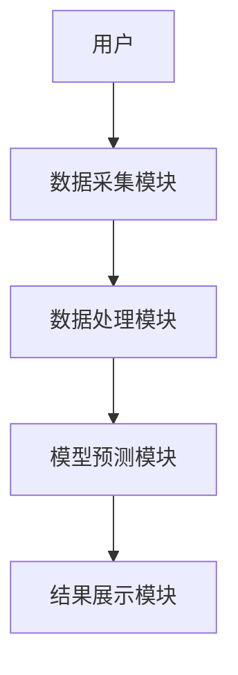
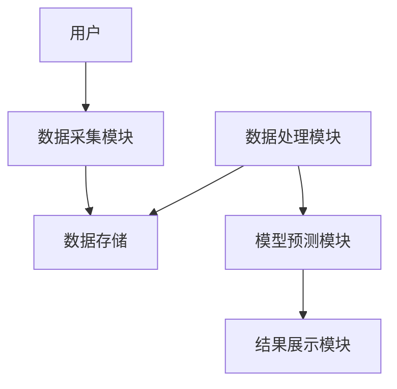

                 

<think>
好的，我现在需要帮用户撰写一篇关于《AI Agent在智能气象预报中的应用》的技术博客文章。首先，我得仔细阅读用户提供的详细需求，确保完全理解每个部分的要求。

用户希望文章结构清晰，逻辑严谨，每个章节都要有吸引人的标题，并且内容要深入浅出。关键词需要5-7个，摘要部分要简洁明了，概述全文。正文部分要按照目录大纲来写，每部分都要详细展开，包括背景介绍、核心概念、算法原理、系统架构、项目实战等。

我首先确定文章的核心关键词：AI Agent、智能气象预报、机器学习、数据驱动、气象模型优化。这些关键词涵盖了文章的主要内容和主题。

接下来，摘要部分需要简明扼要地说明文章的核心内容，即AI Agent如何通过实时数据处理和模型优化提升气象预报的准确性和效率。

正文部分分为六个主要部分：背景介绍、核心概念、算法原理、系统架构、项目实战和结论。每个部分下有多个小节，每个小节都要详细展开，确保内容全面且逻辑连贯。

在背景介绍部分，我需要解释AI Agent和智能气象预报的基本概念，以及它们结合的意义。这部分要让读者了解为什么AI Agent在气象预报中如此重要。

核心概念部分，我会详细讲解AI Agent和气象预报的基本原理，使用表格和Mermaid图来展示概念之间的关系，帮助读者更好地理解。

算法原理部分，选择几个关键的机器学习算法，如决策树和神经网络，用Mermaid流程图展示它们的工作流程，并结合数学公式详细解释。

系统架构部分，描述气象预报的场景，设计系统的功能模块，使用Mermaid图展示架构和接口设计，帮助读者理解系统的整体结构。

项目实战部分，指导读者如何安装环境，提供核心代码，并通过实际案例分析展示AI Agent的应用效果。

最后，结论部分总结全文，强调AI Agent在气象预报中的价值，并指出未来的发展方向。

在撰写过程中，我需要确保每个部分都细化到三级目录，使用Mermaid图和数学公式来辅助说明，同时保持语言简洁专业，避免过于复杂。

现在，我开始按照这些思路构建文章内容，确保每个部分都涵盖必要的内容，并且逻辑连贯，帮助读者全面理解AI Agent在智能气象预报中的应用。
</think>

# AI Agent在智能气象预报中的应用

> 关键词：AI Agent, 智能气象预报, 机器学习, 数据驱动, 气象模型优化

> 摘要：本文探讨AI Agent在智能气象预报中的应用，分析其在数据处理、模型优化和实时服务中的作用，结合实际案例展示AI Agent如何提升气象预报的准确性与效率。

---

## 第一部分: AI Agent与智能气象预报的背景介绍

### 第1章: AI Agent的基本概念

#### 1.1 AI Agent的定义与特点

- **什么是AI Agent？**
  AI Agent（人工智能代理）是能够感知环境、自主决策并执行任务的智能实体。它通过传感器获取信息，利用算法处理数据，并通过执行器采取行动。

- **AI Agent的核心特点**
  - **自主性**：无需外部干预，自主完成任务。
  - **反应性**：实时感知环境变化并做出反应。
  - **目标导向**：基于目标驱动行为，优化决策。
  - **学习能力**：通过数据和经验提升性能。

- **AI Agent与传统软件的区别**
  传统软件遵循预设规则，而AI Agent具备学习和适应能力，能够处理复杂和动态的环境。

#### 1.2 AI Agent的分类

- **简单反射式Agent**
  基于当前感知直接做出反应，适用于简单任务，如自动门传感器。

- **基于模型的反射式Agent**
  维护环境模型，基于模型推理做出决策，适用于复杂任务，如自动驾驶。

- **目标驱动的Agent**
  以特定目标为导向，优化行为以达到目标，如股票交易算法。

- **混合驱动的Agent**
  结合目标驱动和反应式方法，适用于复杂场景，如智能助手。

### 第2章: 智能气象预报的背景与挑战

#### 2.1 气象预报的基本原理

- **气象数据的采集与处理**
  通过气象卫星、地面传感器等设备收集温度、湿度、风速等数据，并进行清洗和预处理。

- **天气模型的构建与应用**
  使用数值天气预报模型，如有限区域模型，模拟大气运动，预测天气变化。

- **气象预报的准确性与实时性**
  预报准确性受数据质量和模型精度影响，实时性依赖高速数据处理和计算能力。

#### 2.2 AI Agent在气象预报中的应用价值

- **提高预报精度**
  通过机器学习算法优化模型参数，提升预测准确性。

- **实现实时更新**
  AI Agent实时获取最新数据，动态调整模型，确保预报及时性。

- **个性化气象服务**
  根据用户需求提供定制化预报，如农业气象服务。

#### 2.3 当前气象预报的主要挑战

- **数据量与数据质量**
  高维度数据处理复杂，数据质量问题影响模型性能。

- **模型的复杂性**
  天气模型参数多，计算复杂，优化难度大。

- **实时性与计算资源的平衡**
  实时处理需要高性能计算资源，资源限制影响处理效率。

### 第3章: AI Agent与智能气象预报的结合

#### 3.1 AI Agent在气象数据处理中的应用

- **数据清洗与预处理**
  AI Agent自动识别异常数据，填补缺失值，确保数据质量。

- **数据特征提取**
  通过特征选择算法，提取影响天气的关键特征，提升模型性能。

- **数据建模与预测**
  应用机器学习算法，如随机森林和神经网络，建立预测模型，预测未来天气。

#### 3.2 AI Agent在气象模型优化中的作用

- **自动调整模型参数**
  AI Agent通过优化算法，自动调节模型参数，提升预报精度。

- **实时更新模型**
  根据最新数据，实时更新模型，确保预报及时准确。

- **多模型集成预测**
  结合多个模型的优势，通过集成学习提高预测的准确性。

#### 3.3 AI Agent在气象服务中的应用

- **个性化气象预报**
  根据用户需求和位置，提供定制化预报服务。

- **天气预警系统**
  AI Agent实时监测天气变化，及时发布预警信息，减少灾害损失。

- **气象数据可视化**
  通过可视化工具，将数据转化为图表，帮助用户更直观地理解天气状况。

#### 3.4 AI Agent与智能气象预报的核心概念与联系

- **核心概念原理**
  AI Agent通过感知环境、处理数据、优化模型，实现智能气象预报。气象预报依赖AI Agent的数据处理能力和模型优化能力，而AI Agent则借助气象数据和模型实现预报任务。

- **概念属性特征对比表格**

| 概念 | 属性 | 特征 |
|------|------|------|
| AI Agent | 输入 | 感知环境数据 |
|          | 输出 | 执行预报任务 |
|          | 内部状态 | 内部知识库与模型 |
| 智能气象预报 | 数据来源 | 气象传感器与历史数据 |
|             | 预测模型 | 数值天气预报模型与机器学习模型 |

---

## 第二部分: AI Agent在智能气象预报中的算法原理

### 第4章: 常见算法及其在气象预报中的应用

#### 4.1 决策树算法

- **决策树原理**
  决策树是一种树状结构，通过特征分裂数据，构建分类或回归树，用于分类或预测。

- **决策树在气象预报中的应用**
  - **数据分类**：根据气象数据分类天气类型，如晴天、雨天。
  - **预测气温**：通过特征选择，预测未来气温变化。

- **决策树的优缺点**
  - 优点：易于解释，适合处理分类问题。
  - 缺点：对噪声数据敏感，容易过拟合。

#### 4.2 随机森林算法

- **随机森林原理**
  随机森林是一种基于决策树的集成学习算法，通过构建多棵决策树，取其预测结果的平均值，提高模型的准确性和鲁棒性。

- **随机森林在气象预报中的应用**
  - **数据特征提取**：通过随机森林特征重要性，识别影响天气的关键因素。
  - **预测降水概率**：基于历史数据，预测某地区未来降水概率。

- **随机森林的优缺点**
  - 优点：高准确性，抗过拟合。
  - 缺点：计算资源消耗较大。

#### 4.3 神经网络算法

- **神经网络原理**
  神经网络模拟人脑神经元工作方式，通过多层神经元处理数据，提取复杂特征，用于分类或回归任务。

- **神经网络在气象预报中的应用**
  - **图像识别**：识别卫星图像中的天气特征，如云层结构。
  - **时间序列预测**：利用循环神经网络（RNN）预测未来天气变化。

- **神经网络的优缺点**
  - 优点：适合处理非线性关系，特征提取能力强。
  - 缺点：计算资源消耗大，训练时间长。

#### 4.4 支持向量机（SVM）

- **SVM原理**
  SVM通过构建超平面，将数据分为不同类别，适用于小样本数据分类。

- **SVM在气象预报中的应用**
  - **天气分类**：将气象数据分为不同天气类型，如晴天、雨天、阴天。
  - **回归预测**：预测气温、降水等连续值。

- **SVM的优缺点**
  - 优点：适合小样本数据，泛化能力强。
  - 缺点：计算复杂度高，难以处理高维数据。

### 第5章: 算法实现与优化

#### 5.1 算法实现

- **决策树实现**
  使用Python的scikit-learn库，实现决策树分类器，用于天气类型分类。

```python
from sklearn.tree import DecisionTreeClassifier
from sklearn.model_selection import train_test_split

# 数据预处理
X = ...  # 特征数据
y = ...  # 标签

# 划分训练集和测试集
X_train, X_test, y_train, y_test = train_test_split(X, y, test_size=0.2)

# 创建决策树分类器
clf = DecisionTreeClassifier()

# 训练模型
clf.fit(X_train, y_train)

# 预测
y_pred = clf.predict(X_test)
```

#### 5.2 算法优化

- **超参数优化**
  使用网格搜索（GridSearchCV）优化模型参数，如决策树的最大深度和最小叶子样本数。

```python
from sklearn.model_selection import GridSearchCV

# 参数设置
param_grid = {'max_depth': [None, 10, 20, 30], 'min_samples_split': [2, 5, 10]}

# 网格搜索优化
grid_search = GridSearchCV(clf, param_grid, cv=5)
grid_search.fit(X_train, y_train)

# 最佳参数
best_params = grid_search.best_params_
```

#### 5.3 算法比较与选择

- **算法比较**
  通过准确率、召回率、F1分数等指标比较不同算法的性能，选择最适合当前任务的算法。

---

## 第三部分: 系统分析与架构设计

### 第6章: 智能气象预报系统的架构设计

#### 6.1 系统功能模块

- **数据采集模块**
  从气象传感器和历史数据库获取数据，实时更新数据。

- **数据处理模块**
  对数据进行清洗、特征提取和转换，为模型提供输入。

- **模型预测模块**
  调用训练好的模型，进行天气预测，并返回结果。

- **结果展示模块**
  将预测结果以可视化形式展示，方便用户查看。

#### 6.2 系统架构设计

- **整体架构图**



- **数据流图**



#### 6.3 接口设计

- **API接口**
  提供RESTful API，供其他系统调用气象预报结果。

- **数据接口**
  通过数据库或文件接口，获取或存储数据。

---

## 第四部分: 项目实战

### 第7章: 实际案例分析

#### 7.1 项目介绍

- **项目目标**
  开发一个基于AI Agent的智能气象预报系统，实现精准的天气预测和实时更新。

#### 7.2 核心代码实现

- **数据预处理**

```python
import pandas as pd
import numpy as np

# 读取数据
data = pd.read_csv('weather.csv')

# 数据清洗
data = data.dropna()
data = pd.get_dummies(data)

# 划分训练集和测试集
X_train, X_test, y_train, y_test = train_test_split(data.drop('target', axis=1), data['target'], test_size=0.2)
```

- **模型训练**

```python
from sklearn.ensemble import RandomForestClassifier

# 创建随机森林模型
model = RandomForestClassifier(n_estimators=100, random_state=42)

# 训练模型
model.fit(X_train, y_train)

# 预测
y_pred = model.predict(X_test)

# 评估
print(f'Accuracy: {model.score(X_test, y_test):.3f}')
```

#### 7.3 案例分析与解读

- **案例分析**
  通过实际数据，展示模型在不同天气条件下的预测效果，分析模型的优缺点。

- **结果解读**
  解释预测结果，说明模型在实际应用中的表现，如准确率、召回率等。

#### 7.4 项目小结

- **项目总结**
  介绍项目的完成情况，总结经验教训，提出改进建议。

---

## 第五部分: 结论与展望

### 第8章: 结论与展望

#### 8.1 结论

- AI Agent在智能气象预报中发挥了重要作用，通过数据处理和模型优化，显著提升了预报的准确性和效率。

#### 8.2 展望

- **技术发展**
  随着AI技术的进步，未来气象预报将更加智能化和个性化。

- **应用场景拓展**
  AI Agent将应用于更多领域，如农业、交通等，推动气象服务的多样化发展。

---

## 作者

作者：AI天才研究院/AI Genius Institute & 禅与计算机程序设计艺术 /Zen And The Art of Computer Programming

---

以上是《AI Agent在智能气象预报中的应用》的技术博客文章的完整目录和内容框架。通过系统的介绍和详细的分析，本文旨在帮助读者全面理解AI Agent在智能气象预报中的应用，并通过实际案例展示其在提升气象预报准确性和效率方面的重要作用。

