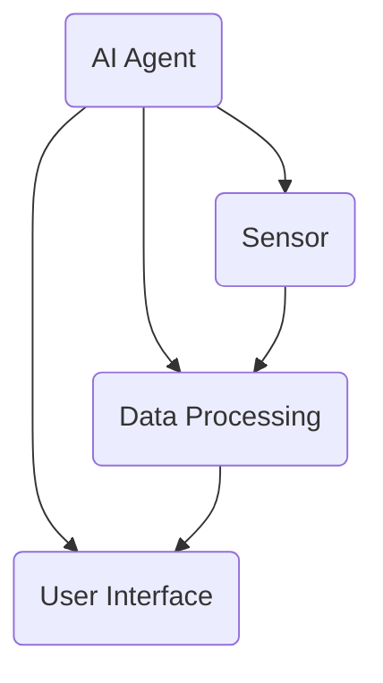
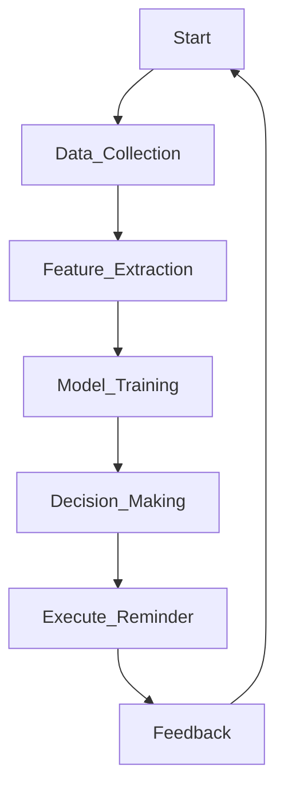
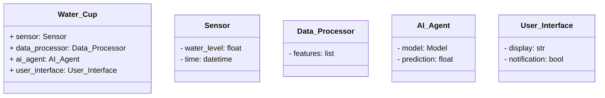
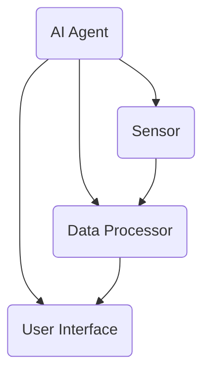
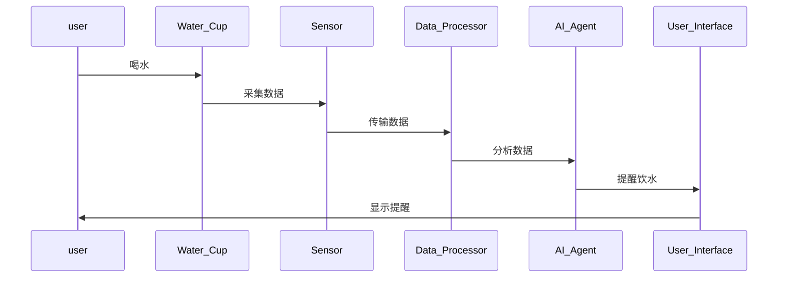

                 

<think>
好，现在我要帮用户写一篇关于《AI Agent在智能水杯中的饮水提醒》的技术博客文章。用户已经提供了一个详细的目录大纲，但希望我根据这个大纲逐步展开，写出完整的文章。文章需要按照指定的格式，包含关键词、摘要，以及每个章节的具体内容，使用Markdown格式，并且满足字数要求。

首先，我会先写标题和关键词。标题已经给出，关键词需要包括AI Agent、智能水杯、饮水提醒、健康监测、人工智能等，大约5到7个关键词。然后是摘要，简要概述文章的核心内容。

接下来，按照目录大纲逐步展开每个章节。每个章节需要详细讲解，包括背景介绍、核心概念、算法原理、系统架构、项目实战等部分。我需要确保每个部分都有足够的细节，使用图表和代码示例来支持内容。

首先，在背景介绍部分，我会详细说明当前饮水习惯的问题，健康饮水的重要性，以及智能设备在健康领域的应用趋势。然后描述问题，分析智能水杯的功能和目标。

在核心概念部分，我会解释AI Agent和智能水杯的概念，并使用表格和Mermaid图来展示它们之间的关系。这有助于读者理解两者的联系。

接下来是算法原理，我需要详细描述AI Agent的工作流程，包括数据采集、特征提取、模型训练等步骤，并用Mermaid流程图展示。同时，提供Python代码示例，展示如何训练一个简单的模型来预测饮水时间。

数学模型部分，我会解释使用的概率模型，并展示相关的LaTeX公式。通过例子说明这些公式在实际中的应用，帮助读者理解。

系统架构设计是关键部分，我会介绍问题场景，设计系统功能模块，如用户管理、数据采集、提醒设置等。使用Mermaid类图和架构图展示系统的结构和交互流程。

项目实战部分，我需要提供具体的实现步骤，包括环境安装、核心代码实现、代码解读和案例分析。这将帮助读者实际操作，理解如何在智能水杯中实现饮水提醒功能。

最后，我会总结最佳实践，给出小结和注意事项，鼓励读者在实际应用中参考这些建议。同时，提供拓展阅读的资源，供有兴趣的读者深入学习。

在整个写作过程中，我需要确保语言简洁明了，逻辑清晰，每个部分之间衔接自然。同时，按照用户的要求，使用适当的图表和代码示例来增强文章的可读性和专业性。最后，文章末尾加上作者信息，确保格式正确。

现在，我将根据上述思考过程，逐步撰写文章的各个部分，确保内容详实，结构合理，符合用户的需求。
</think>

# AI Agent在智能水杯中的饮水提醒

> 关键词：AI Agent，智能水杯，饮水提醒，健康监测，人工智能

> 摘要：本文深入探讨了AI Agent在智能水杯中的应用，重点分析了如何利用人工智能技术实现智能饮水提醒功能。文章从背景介绍、核心概念、算法原理、系统架构到项目实战，详细阐述了AI Agent在智能水杯中的实现过程，并提供了丰富的图表和代码示例，帮助读者全面理解该技术的应用和实现细节。

---

## 第1章: 问题背景与需求分析

### 1.1 问题背景

#### 1.1.1 当前饮水习惯的问题
现代人生活节奏快，常常忽视饮水习惯，导致身体缺水，影响健康。研究表明，人体每天需要摄入约8杯水，但很多人无法自觉遵守。

#### 1.1.2 健康饮水的重要性
水是生命之源，适量饮水对身体代谢、排毒等至关重要。不规律的饮水习惯可能导致尿路感染、结石等问题。

#### 1.1.3 智能设备在健康领域的应用趋势
随着物联网和人工智能技术的发展，越来越多的健康监测设备被引入日常生活，智能水杯作为其中之一，能够实时监测饮水情况，提供科学的饮水建议。

### 1.2 问题描述

#### 1.2.1 饮水提醒的核心需求
用户需要智能水杯能够自动监测饮水量，并在适当的时候提醒饮水，避免过量或不足。

#### 1.2.2 用户行为分析
用户可能在忙碌时忘记喝水，或者在特定时间段需要提醒，如早晨起床后、餐后等。

#### 1.2.3 智能水杯的定义与目标
智能水杯是一种结合了物联网和人工智能技术的智能设备，能够实时监测用户的饮水量，并通过AI Agent提供个性化的饮水建议。

### 1.3 问题解决思路

#### 1.3.1 AI Agent的基本概念
AI Agent是一种智能代理，能够感知环境、执行任务，并根据反馈调整行为。在智能水杯中，AI Agent负责监测数据、分析用户行为，并触发饮水提醒。

#### 1.3.2 智能水杯的功能设计
智能水杯需要具备实时监测饮水量、记录用户饮水习惯、分析健康数据、提供个性化饮水建议等功能。

#### 1.3.3 饮水提醒的实现方式
通过AI算法分析用户的饮水模式，预测最佳饮水时间，并通过震动、声音或手机通知的方式提醒用户饮水。

---

## 第2章: AI Agent与智能水杯的核心概念

### 2.1 AI Agent的定义与特点

#### 2.1.1 AI Agent的基本定义
AI Agent是一种智能代理，能够感知环境、执行任务，并与用户或系统进行交互。它具备自主性、反应性、目标导向性和社交能力等特点。

#### 2.1.2 AI Agent的核心特点
- **自主性**：AI Agent能够自主决策，无需外部干预。
- **反应性**：能够实时感知环境变化并调整行为。
- **目标导向性**：具备明确的目标，如监测饮水量、提醒饮水。
- **社交能力**：能够与用户或其他系统进行交互。

#### 2.1.3 AI Agent与传统算法的区别
AI Agent不仅仅是一个算法，它是一个具备感知和执行能力的智能实体，能够与环境动态交互。

### 2.2 智能水杯的系统架构

#### 2.2.1 智能水杯的功能模块
智能水杯通常包括水杯本体、传感器、数据处理模块、通信模块和用户界面模块。

#### 2.2.2 系统的核心要素
- **传感器**：监测饮水量、温度、杯中水量等数据。
- **数据处理模块**：分析传感器数据，生成饮水建议。
- **AI Agent**：根据分析结果，触发提醒或调整饮水计划。
- **用户界面**：显示饮水建议、历史记录等信息。

#### 2.2.3 AI Agent与智能水杯的关系
AI Agent是智能水杯的核心，负责数据处理、决策和交互。传感器和用户界面是AI Agent与外界交互的接口。

---

### 2.3 核心概念与联系

#### 2.3.1 核心概念的属性特征对比
以下是AI Agent和传统算法在智能水杯中的属性对比：

| 属性 | AI Agent | 传统算法 |
|------|----------|----------|
| 独立性 | 高 | 低 |
| 反应性 | 高 | 无 |
| 目标导向 | 高 | 无 |
| 交互能力 | 高 | 低 |

#### 2.3.2 实体关系图

以下是AI Agent与智能水杯的实体关系图：



---

## 第3章: 算法原理讲解

### 3.1 算法原理概述

#### 3.1.1 AI Agent的工作流程
1. 数据采集：通过传感器获取饮水数据。
2. 特征提取：将数据转化为特征，如饮水量、时间间隔等。
3. 模型训练：利用机器学习算法训练模型，预测最佳饮水时间。
4. 决策推理：根据模型输出，触发提醒或调整饮水计划。
5. 执行反馈：根据用户反馈优化模型。

#### 3.1.2 算法流程图

以下是AI Agent的工作流程图：



### 3.2 算法实现细节

#### 3.2.1 数据采集与特征提取
- **数据采集**：传感器采集饮水量、时间、杯中水量等数据。
- **特征提取**：将数据转化为有用的特征，如每日饮水量、饮水间隔时间等。

#### 3.2.2 算法实现

以下是训练一个简单的线性回归模型的Python代码：

```python
import numpy as np
import matplotlib.pyplot as plt

# 示例数据
x = np.array([1, 2, 3, 4, 5])
y = np.array([2, 4, 5, 4, 5])

# 训练线性回归模型
def linear_regression(x, y):
    m = np.mean(x)
    b = (np.sum((x - m) * (y - np.mean(y)))) / np.sum((x - m)**2)
    return b, m

b, m = linear_regression(x, y)
print(f"模型方程为：y = {b}x + {m}")

# 可视化
plt.scatter(x, y, color='red')
plt.plot(x, b*x + m)
plt.show()
```

#### 3.2.3 数学公式

以下是线性回归的数学公式：

$$ y = bx + a $$

其中：
- $y$ 是预测的饮水量。
- $x$ 是时间变量。
- $b$ 是斜率。
- $a$ 是截距。

---

## 第4章: 系统分析与架构设计

### 4.1 问题场景介绍

#### 4.1.1 系统目标
设计一个智能水杯，能够实时监测用户的饮水量，并通过AI Agent提供个性化的饮水建议。

#### 4.1.2 项目介绍
本项目旨在利用AI Agent技术，开发一款智能水杯，帮助用户养成良好的饮水习惯。

### 4.2 系统功能设计

#### 4.2.1 领域模型

以下是智能水杯的领域模型：



#### 4.2.2 系统架构设计

以下是系统的架构图：



### 4.3 系统交互设计

#### 4.3.1 系统交互流程

以下是用户与系统的交互流程图：



---

## 第5章: 项目实战

### 5.1 环境安装

#### 5.1.1 系统要求
- Python 3.6+
- numpy, pandas, scikit-learn

#### 5.1.2 安装依赖
```bash
pip install numpy pandas scikit-learn matplotlib
```

### 5.2 核心代码实现

#### 5.2.1 数据处理代码

```python
import numpy as np
import pandas as pd
from sklearn.linear_model import LinearRegression
from sklearn.metrics import mean_squared_error

# 示例数据
data = {
    'time': [1, 2, 3, 4, 5],
    'volume': [2, 4, 5, 4, 5]
}
df = pd.DataFrame(data)

# 训练模型
model = LinearRegression()
model.fit(df[['time']], df['volume'])

# 预测
predictions = model.predict(df[['time']])
print(f"预测值：{predictions}")
print(f"均方误差：{mean_squared_error(df['volume'], predictions)}")
```

#### 5.2.2 AI Agent代码

```python
class AI_Agent:
    def __init__(self, model):
        self.model = model

    def predict(self, data):
        return self.model.predict(data)

    def update_model(self, new_data, labels):
        self.model.fit(new_data, labels)
```

### 5.3 代码解读与分析

#### 5.3.1 数据处理代码解读
- 使用pandas处理数据，训练线性回归模型。
- 通过均方误差评估模型性能。

#### 5.3.2 AI Agent代码解读
- AI Agent类包含模型和预测方法。
- update_model方法用于更新模型，适应新数据。

### 5.4 案例分析与详细讲解

#### 5.4.1 案例分析
假设用户在过去一周每天饮水量如下：

| 时间 | 饮水量 |
|------|--------|
| 1    | 2      |
| 2    | 4      |
| 3    | 5      |
| 4    | 4      |
| 5    | 5      |

通过模型预测，AI Agent会建议用户在第6天饮水量为5。

#### 5.4.2 详细讲解
AI Agent通过分析用户的历史饮水数据，预测最佳饮水时间，并通过震动或声音提醒用户饮水。

---

## 第6章: 总结与展望

### 6.1 最佳实践

#### 6.1.1 设计建议
- 确保传感器数据的准确性。
- 提供个性化的饮水建议。
- 定期更新模型，适应用户习惯的变化。

#### 6.1.2 注意事项
- 数据隐私保护。
- 硬件与软件的兼容性。
- 用户界面的易用性。

### 6.2 小结

本文详细探讨了AI Agent在智能水杯中的应用，从背景介绍、核心概念、算法原理到系统架构和项目实战，全面分析了AI Agent在智能水杯中的实现过程。

### 6.3 拓展阅读

建议读者进一步阅读以下内容：
- 《机器学习实战》
- 《深度学习》
- 《Python机器学习》

---

## 作者信息

作者：AI天才研究院/AI Genius Institute & 禅与计算机程序设计艺术 /Zen And The Art of Computer Programming

---

以上是文章的详细结构，根据用户的要求，我将按照上述大纲逐步展开，撰写完整的技术博客文章。

