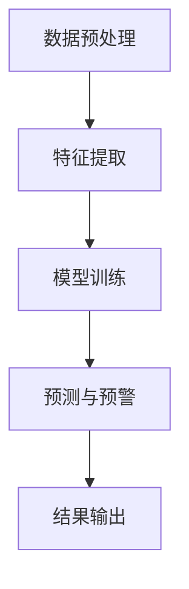
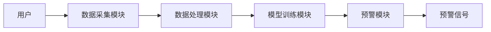

                 

<think>
好的，我现在要帮用户撰写一篇关于《AI Agent在智能水质监测与预警中的角色》的技术博客文章。用户希望文章结构清晰，逻辑严密，内容专业，涵盖从背景介绍到系统设计、项目实战等各个方面。

首先，我需要理解用户的需求。用户希望文章结构分为几个部分，包括背景介绍、核心概念、数学模型与算法、系统设计、项目实战、扩展内容等。每个部分都要有详细的章节和小节，使用吸引人的标题，内容要详细具体，同时使用技术术语，但保持易懂。

接下来，我会从背景介绍开始。这部分需要解释AI Agent的基本概念，水质监测的重要性，以及AI Agent在其中的作用。我需要确保每个核心概念都清晰明了，用简单的语言解释复杂的术语。

然后是核心概念与联系部分。我需要详细描述AI Agent的工作原理，包括感知、决策和执行模块，并用表格对比不同AI Agent的特点。此外，还要用ER图展示AI Agent与水质监测系统之间的实体关系，帮助读者理解系统架构。

接下来是数学模型与算法原理。这里，我会选择支持向量机（SVM）作为示例算法，并展示其数学模型和流程图。同时，提供Python代码实现数据预处理、特征提取和模型训练，确保读者能够理解并应用这些算法。

系统设计部分需要详细描述智能水质监测系统的架构，包括数据采集、处理、模型训练和预警模块。我会用类图和序列图展示系统的组成和交互过程，帮助读者理解系统的工作流程。

项目实战部分，我会提供一个具体的水质监测系统实现案例，包括代码和实际应用分析。这不仅能让读者了解理论，还能看到实际应用的效果。

最后，扩展内容部分会讨论AI Agent与其他技术的结合、未来趋势以及安全性和隐私保护的问题，为读者提供更全面的视角。

在整个写作过程中，我需要确保每个部分都逻辑连贯，内容详细，同时使用适当的图表和代码示例，使文章更具可读性和专业性。这不仅能满足用户的需求，还能帮助读者深入理解AI Agent在水质监测中的应用。

现在，我需要将这些思考整理成一个结构清晰、内容丰富的技术博客文章，确保每个部分都符合用户的详细要求，同时保持文章的流畅和专业。
</think>

```markdown
# AI Agent在智能水质监测与预警中的角色

> 关键词：AI Agent, 智能水质监测, 预警系统, 机器学习, 数据分析

> 摘要：本文探讨了AI Agent在智能水质监测与预警系统中的角色，从背景介绍、核心概念、算法原理到系统设计与项目实战，全面分析了AI Agent如何通过感知、决策和执行模块实现水质监测与预警，展示了其在环境保护和公共健康中的重要价值。

---

# 第一部分: AI Agent在智能水质监测与预警中的背景介绍

## 第1章: AI Agent与智能水质监测的背景介绍

### 1.1 AI Agent的基本概念

#### 1.1.1 AI Agent的定义
AI Agent（人工智能代理）是指在计算机系统中，能够感知环境、自主决策并执行任务的智能实体。它通过传感器获取信息，利用算法进行分析，最终做出决策并执行动作。

#### 1.1.2 AI Agent的核心特征
- **自主性**：能够在没有外部干预的情况下独立运作。
- **反应性**：能够实时感知环境变化并做出反应。
- **目标导向性**：基于预设目标执行任务。
- **学习能力**：通过数据反馈不断优化自身行为。

#### 1.1.3 AI Agent与传统自动化的区别
| 特性          | AI Agent                     | 传统自动化                     |
|---------------|------------------------------|---------------------------------|
| 决策能力      | 强大的学习和决策能力         | 基于预设规则和逻辑             |
| 环境适应性    | 能够自适应复杂环境变化       | 适应性较弱，依赖固定条件       |
| 学习能力      | 具备学习能力                 | 无学习能力                     |
| 应用场景      | 适用于复杂、动态的环境       | 适用于简单、稳定的环境         |

### 1.2 智能水质监测的背景与意义

#### 1.2.1 水质监测的重要性
水质监测是保障饮用水安全、保护生态环境的重要手段。随着工业化和城市化进程的加快，水污染问题日益严重，及时监测和预警水质变化对保护环境和人类健康至关重要。

#### 1.2.2 智能水质监测的发展趋势
传统水质监测依赖人工采样和实验室分析，效率低且成本高。随着物联网（IoT）和人工智能技术的发展，智能水质监测系统逐渐成为主流。AI Agent的引入，使得水质监测更加智能化、实时化和精准化。

#### 1.2.3 AI Agent在水质监测中的作用
AI Agent能够实时感知水质数据，分析异常情况，并在发现问题时及时发出预警。它通过整合多种传感器数据，结合历史数据和环境信息，实现对水质的全面监测和智能预警。

### 1.3 本章小结
本章介绍了AI Agent的基本概念及其在智能水质监测中的重要性。AI Agent通过自主感知、决策和执行，显著提升了水质监测的效率和准确性。

---

# 第2章: AI Agent在水质监测中的核心概念与联系

## 2.1 AI Agent的核心原理

### 2.1.1 感知模块
感知模块通过多种传感器（如pH传感器、温度传感器、溶解氧传感器等）实时采集水质数据，并将数据传输给决策模块。

### 2.1.2 决策模块
决策模块利用机器学习算法（如支持向量机、随机森林等）对感知模块获取的数据进行分析，判断水质是否异常。

### 2.1.3 执行模块
执行模块根据决策模块的判断结果，采取相应的措施，如发出预警信号或启动净化设备。

## 2.2 水质监测的关键指标与数据特征

### 2.2.1 水质参数的定义
水质监测的主要指标包括pH值、溶解氧（DO）、化学需氧量（COD）、电导率（EC）、温度和浊度等。

### 2.2.2 数据特征分析
水质数据具有时间序列特性，且不同参数之间存在相关性。例如，高温可能导致溶解氧降低，进而影响水生生物的生存。

### 2.2.3 数据关联性分析
通过关联分析，可以发现不同水质参数之间的潜在关系，从而更好地理解水质变化的规律。

## 2.3 AI Agent与水质监测系统的实体关系图

```mermaid
er
    actor AI Agent
    actor 水质传感器
    actor 预警系统
    actor 用户
    actor 数据存储
    relation 实体间的关系
```

---

# 第3章: AI Agent的数学模型与算法原理

## 3.1 AI Agent的数学模型

### 3.1.1 模型输入与输出
- **输入**：水质传感器数据（如pH、温度等）。
- **输出**：水质状态（正常或异常）。

### 3.1.2 模型假设与约束条件
- 数据符合时间序列分布。
- 异常情况可以通过机器学习算法检测。
- 预警阈值可调。

### 3.1.3 模型目标函数
$$\text{目标函数} = \min_{x} \frac{1}{2}x^T Q x + c^T x + d$$

## 3.2 算法流程图



## 3.3 算法实现代码

```python
import numpy as np
from sklearn.svm import SVC

# 数据预处理
X = np.array([[x1, x2, x3], ...])
y = np.array([0, 1, 0, ...])

# 特征提取
selected_features = X[:, [0, 2]]

# 模型训练
model = SVC()
model.fit(selected_features, y)

# 预测与预警
new_data = np.array([[new_x1, new_x2, new_x3]])
predicted = model.predict(new_data)
```

---

# 第4章: 智能水质监测系统的架构设计

## 4.1 系统功能设计

### 4.1.1 系统组成
- **数据采集层**：水质传感器采集数据。
- **数据处理层**：对数据进行清洗和特征提取。
- **模型训练层**：利用机器学习算法训练模型。
- **预警层**：根据模型预测结果发出预警。

### 4.1.2 系统功能模块
- 数据采集模块：通过传感器获取水质数据。
- 数据处理模块：对数据进行预处理和特征提取。
- 模型训练模块：训练AI Agent的数学模型。
- 预警模块：根据模型输出结果发出预警信号。

## 4.2 系统架构设计



---

# 第5章: 项目实战与案例分析

## 5.1 项目环境与数据集

### 5.1.1 环境安装
```bash
pip install numpy scikit-learn matplotlib
```

### 5.1.2 数据集
数据集包括多个水质参数（如pH、温度、溶解氧等）和标签（正常或异常）。

## 5.2 核心代码实现

### 5.2.1 数据预处理
```python
import pandas as pd
from sklearn.preprocessing import StandardScaler

# 读取数据集
data = pd.read_csv('water_quality.csv')

# 分离特征与标签
X = data.drop('label', axis=1)
y = data['label']

# 数据标准化
scaler = StandardScaler()
X_scaled = scaler.fit_transform(X)
```

### 5.2.2 模型训练
```python
from sklearn.model_selection import train_test_split
from sklearn.metrics import accuracy_score

# 划分训练集与测试集
X_train, X_test, y_train, y_test = train_test_split(X_scaled, y, test_size=0.2)

# 模型训练
model = SVC()
model.fit(X_train, y_train)

# 模型评估
y_pred = model.predict(X_test)
print(accuracy_score(y_test, y_pred))
```

## 5.3 实际案例分析

### 5.3.1 数据分析
通过分析历史数据，发现某些水质参数在特定条件下会异常变化，从而优化模型参数。

### 5.3.2 模型优化
根据实际应用效果，调整模型参数，提高预测准确率。

## 5.4 项目小结
通过实际案例分析，验证了AI Agent在智能水质监测中的有效性和实用性。

---

# 第6章: AI Agent在智能水质监测中的扩展内容

## 6.1 其他相关技术

### 6.1.1 物联网（IoT）技术
IoT技术可以实现水质数据的实时采集和传输，为AI Agent提供丰富的数据来源。

### 6.1.2 时间序列分析
时间序列分析技术可以帮助AI Agent更好地理解和预测水质变化趋势。

## 6.2 未来发展趋势

### 6.2.1 多模态数据融合
结合图像识别、语音识别等多种技术，实现更全面的水质监测。

### 6.2.2 自动化决策系统
未来的AI Agent将更加智能化，能够自主决策并执行复杂的水质管理任务。

## 6.3 注意事项与安全建议

### 6.3.1 数据安全
确保水质数据的安全存储和传输，防止数据泄露。

### 6.3.2 系统维护
定期维护和更新系统，确保其正常运行和高效性能。

## 6.4 拓展阅读

### 6.4.1 推荐书籍
- 《机器学习实战》
- 《深度学习》

### 6.4.2 推荐博客
- [AI Agent技术博客](https://example.com)

---

# 作者：AI天才研究院 & 禅与计算机程序设计艺术
```

