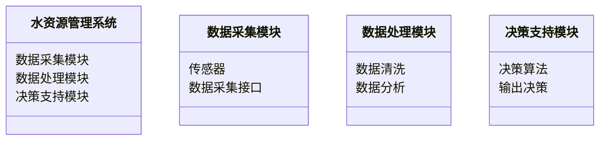
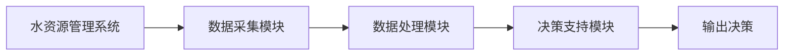
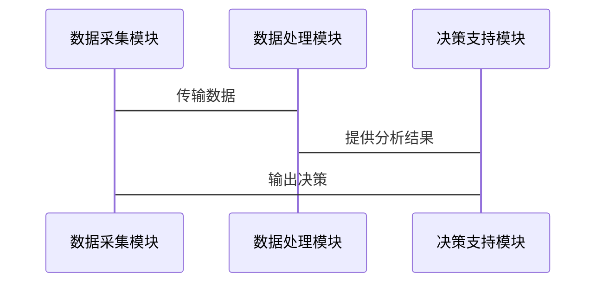

                 


# AI Agent在智能水资源管理中的实践

> 关键词：AI Agent, 智能水资源管理, 人工智能, 水资源优化, 数据挖掘, 机器学习

> 摘要：本文详细探讨了AI Agent在智能水资源管理中的应用，从核心概念到算法实现，再到系统设计和实际项目，系统地分析了AI Agent如何通过感知、决策和执行机制优化水资源管理，实现高效、智能的水资源优化配置。

---

## 第1章: AI Agent与智能水资源管理概述

### 1.1 AI Agent的基本概念

#### 1.1.1 什么是AI Agent
AI Agent（人工智能代理）是指能够感知环境、做出决策并执行动作的智能实体。它可以自主工作或与其他系统协作，以实现特定目标。AI Agent的核心在于其智能性，能够通过数据处理和学习不断优化自身行为。

#### 1.1.2 AI Agent的核心特征
- **自主性**：能够独立运作，无需外部干预。
- **反应性**：能够实时感知环境变化并做出响应。
- **学习性**：通过数据学习和优化决策。
- **协作性**：能够与其他系统或AI Agent协同工作。

#### 1.1.3 AI Agent与传统自动化系统的区别
传统自动化系统通常基于固定的规则和程序运行，而AI Agent具备学习和适应能力，能够根据环境反馈动态调整行为。

### 1.2 智能水资源管理的背景与挑战

#### 1.2.1 水资源管理的基本概念
水资源管理是指对水的分配、使用和保护进行规划和控制，以满足人类需求并保护环境。

#### 1.2.2 当前水资源管理的主要问题
- **水资源短缺**：全球多地面临水资源不足的问题。
- **污染问题**：工业和生活废水导致水质下降。
- **管理效率低下**：传统管理方式缺乏实时监控和优化能力。

#### 1.2.3 智能化水资源管理的必要性
随着水资源问题的加剧，智能化管理成为解决这些问题的关键。AI Agent能够通过实时数据处理和智能决策，提升水资源管理的效率和效果。

### 1.3 AI Agent在水资源管理中的应用前景

#### 1.3.1 AI Agent在水资源管理中的优势
- **高效性**：能够快速处理大量数据，做出最优决策。
- **适应性**：能够根据环境变化自动调整策略。
- **实时性**：能够实时监控和响应水资源变化。

#### 1.3.2 AI Agent在水资源管理中的典型应用场景
- **水质监测**：实时监测水质参数，预测污染风险。
- **水量预测**：基于历史数据和天气预报，预测未来水资源需求。
- **优化配置**：智能分配水资源，减少浪费。

#### 1.3.3 未来发展趋势
随着AI技术的不断进步，AI Agent在水资源管理中的应用将更加广泛和深入，特别是在复杂环境下的自主决策和协作优化方面。

---

## 第2章: AI Agent的核心概念与原理

### 2.1 AI Agent的核心概念

#### 2.1.1 感知机制
AI Agent通过传感器或数据源获取环境信息，如水质、水量等参数。

#### 2.1.2 决策机制
基于感知到的信息，AI Agent利用算法做出最优决策，如分配水资源或发出警报。

#### 2.1.3 执行机制
AI Agent根据决策结果执行动作，如启动水泵或关闭阀门。

### 2.2 AI Agent的感知与决策算法

#### 2.2.1 强化学习算法
- **Q-learning算法**：通过奖励机制优化决策策略。
- **Deep Q-Network算法**：结合深度学习，处理复杂环境。

#### 2.2.2 监督学习算法
- **线性回归算法**：预测水资源需求。
- **支持向量机算法**：分类水质数据。

#### 2.2.3 聚类分析算法
- **K-means算法**：将水质数据分成不同类别。
- **层次聚类算法**：分析水资源分布模式。

### 2.3 AI Agent的系统架构

#### 2.3.1 分层架构
将系统分为感知层、决策层和执行层，各层之间相互协作。

#### 2.3.2 微服务架构
将系统功能模块化，每个模块独立运行，便于扩展和维护。

#### 2.3.3 混合架构
结合分层架构和微服务架构，综合两者的优点。

---

## 第3章: AI Agent在水资源管理中的系统分析

### 3.1 水资源管理系统的组成

#### 3.1.1 数据采集模块
通过传感器实时采集水质、水量等数据。

#### 3.1.2 数据处理模块
对采集到的数据进行清洗、转换和分析。

#### 3.1.3 决策支持模块
基于数据和算法，生成决策建议。

### 3.2 水资源管理系统的功能需求

#### 3.2.1 数据采集与存储
实时采集并存储水资源相关数据。

#### 3.2.2 数据分析与预测
利用机器学习算法预测水资源变化趋势。

#### 3.2.3 决策支持与优化
基于分析结果，优化水资源分配方案。

### 3.3 水资源管理系统的架构设计

#### 3.3.1 分层架构设计
- 感知层：负责数据采集。
- 决策层：负责数据处理和决策。
- 执行层：负责执行决策。

#### 3.3.2 微服务架构设计
- 模块化设计：每个功能模块独立运行。
- 便于扩展和维护：每个模块可以独立升级或修改。

#### 3.3.3 混合架构设计
结合分层架构和微服务架构，优化系统性能和扩展性。

---

## 第4章: AI Agent在水资源管理中的算法实现

### 4.1 强化学习算法

#### 4.1.1 Q-learning算法
- **实现步骤**：
  1. 初始化Q表。
  2. 与环境交互，获取状态和奖励。
  3. 更新Q表，最大化奖励。
- **Mermaid流程图**：
  ```mermaid
  graph LR
    A[初始状态] --> B[选择动作]
    B --> C[执行动作]
    C --> D[获取奖励和新状态]
    D --> A
  ```

#### 4.1.2 Deep Q-Network算法
- **实现步骤**：
  1. 构建神经网络。
  2. 使用经验回放优化训练。
  3. 更新神经网络参数。

### 4.2 监督学习算法

#### 4.2.1 线性回归算法
- **数学模型**：
  $$y = \beta_0 + \beta_1x + \epsilon$$
- **实现步骤**：
  1. 收集数据。
  2. 训练模型。
  3. 预测结果。

#### 4.2.2 支持向量机算法
- **数学模型**：
  $$\max_{\beta, \beta_0, \epsilon} \frac{1}{2}||\beta||^2 + C\sum_{i=1}^n \epsilon_i$$
  $$y_i = \beta_0 + \beta^T x_i + \epsilon_i$$

### 4.3 聚类分析算法

#### 4.3.1 K-means算法
- **实现步骤**：
  1. 初始化聚类中心。
  2. 计算每个数据点到聚类中心的距离。
  3. 重新计算聚类中心，直到收敛。

#### 4.3.2 层次聚类算法
- **实现步骤**：
  1. 将每个数据点视为一个簇。
  2. 计算簇之间的距离，合并最近的簇。
  3. 重复合并，直到形成所需数量的簇。

---

## 第5章: AI Agent在水资源管理中的项目

### 5.1 项目背景
本项目旨在通过AI Agent优化某地区的水资源管理，解决水资源分配不均和污染问题。

### 5.2 系统设计

#### 5.2.1 领域模型


#### 5.2.2 系统架构


#### 5.2.3 接口设计


### 5.3 实现过程

#### 5.3.1 环境安装
- 安装Python和相关库（如TensorFlow、Scikit-learn）。

#### 5.3.2 核心代码实现
```python
import numpy as np
from sklearn.linear_model import LinearRegression

# 数据准备
X = np.array([1, 2, 3, 4, 5]).reshape(-1, 1)
y = np.array([2, 4, 5, 4, 6])

# 模型训练
model = LinearRegression()
model.fit(X, y)

# 预测
print(model.predict([[6]]))
```

### 5.4 实际案例分析

#### 5.4.1 案例背景
某地区面临水资源短缺问题，希望通过AI Agent优化水资源分配。

#### 5.4.2 数据分析与处理
- 数据清洗：去除异常值。
- 数据分析：预测未来水资源需求。

#### 5.4.3 决策与优化
- 基于预测结果，优化水资源分配方案，减少浪费。

### 5.5 项目小结
通过AI Agent实现的水资源管理系统，显著提高了管理效率和优化效果，为水资源保护和合理利用提供了有力支持。

---

## 第6章: 最佳实践与总结

### 6.1 小结
AI Agent在智能水资源管理中的应用前景广阔，能够有效解决传统管理中的难题，实现高效、智能的水资源优化。

### 6.2 注意事项
- 数据质量：确保数据准确性和完整性。
- 模型优化：根据不同场景选择合适的算法。
- 系统维护：定期更新模型和优化系统架构。

### 6.3 拓展阅读
- 《机器学习实战》
- 《深度学习入门》
- 《人工智能导论》

---

作者：AI天才研究院 & 禅与计算机程序设计艺术

