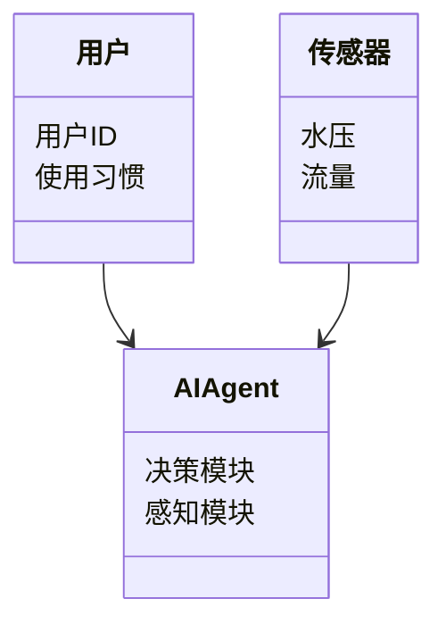
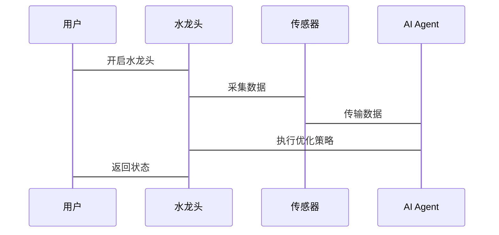

                 

<think>
嗯，好的，我现在需要写一篇关于《AI Agent在智能水龙头中的用水优化》的技术博客文章。让我先理清楚思路，思考一下怎么展开这个主题。

首先，我需要理解什么是AI Agent。AI Agent，也就是人工智能代理，是指能够感知环境并采取行动来实现目标的智能实体。在智能水龙头中，AI Agent可以用来优化用水，比如根据用户的使用习惯调整出水量，或者根据水质情况自动调节清洁模式。

接下来，我得明确优化用水的目标是什么。可能包括减少浪费、提高用水效率、降低水费开支等。为了实现这些目标，AI Agent需要收集哪些数据呢？可能包括用户的用水习惯、水压、水质、时间等信息。

然后，我需要考虑AI Agent在智能水龙头中的具体应用场景。比如，当用户开始使用水龙头时，AI Agent可以根据用户的使用模式预测出水时间，并在适当的时候关闭水流，以防止浪费。或者，当检测到水质变差时，AI Agent可以启动自动清洁模式，减少水的浪费。

接下来，我得深入探讨AI Agent的算法选择。常见的算法有强化学习、遗传算法和规则引擎。强化学习适合动态环境，能够根据反馈不断优化策略；遗传算法适合解决复杂优化问题；规则引擎则适用于规则明确的场景。在用水优化中，可能更适合使用强化学习，因为它能够根据实时数据动态调整策略。

然后，我需要设计系统的架构。包括数据采集模块、AI Agent决策模块、用户交互模块和数据存储模块。数据采集模块负责收集传感器数据，AI Agent决策模块根据数据做出优化决策，用户交互模块让用户能够与系统进行互动，数据存储模块保存所有数据以便后续分析。

在项目实战部分，我需要详细讲解如何安装必要的软件和库，比如Python和TensorFlow，然后提供代码实现AI Agent的核心算法。同时，用实际案例展示优化效果，比如在高峰期减少用水量，或者在低峰期进行自动清洁。

最后，我得总结一下最佳实践，比如数据质量的重要性、算法选择的合理性以及系统的可扩展性。同时，提醒读者注意数据隐私和系统安全，确保用户信息不被泄露。

整个思考过程中，我需要确保逻辑清晰，结构紧凑，用简单易懂的语言解释技术原理，同时提供具体的代码示例和图表来辅助理解。这样，读者不仅能理解AI Agent在智能水龙头中的优化作用，还能实际操作，应用到自己的项目中。

嗯，总的来说，我需要按照用户提供的目录结构，逐步展开每个部分的内容，确保每个章节都详细具体，覆盖所有必要的技术细节和实际应用案例。这将帮助读者全面理解AI Agent在智能水龙头中的用水优化，并能够实际应用这些技术。
</think>

# AI Agent在智能水龙头中的用水优化

> 关键词：AI Agent，智能水龙头，用水优化，强化学习，系统架构设计

> 摘要：本文探讨了AI Agent在智能水龙头中的应用，通过分析用水优化的背景、算法原理和系统架构设计，详细讲解了如何利用AI技术实现智能水龙头的高效用水管理。文章从背景介绍、核心概念、算法原理、系统设计到项目实战，全面解析了AI Agent在智能水龙头中的优化策略，并提供了实际案例和最佳实践建议。

---

# 第一部分: AI Agent在智能水龙头中的用水优化背景介绍

## 第1章: AI Agent与智能水龙头概述

### 1.1 智能水龙头的背景与现状

#### 1.1.1 水资源利用现状分析
水资源是人类生存和发展的基础，但全球水资源分布不均，许多地区面临水资源短缺的问题。传统水龙头的使用方式存在水资源浪费的现象，例如过量放水和非必要使用。

#### 1.1.2 智能水龙头的发展趋势
随着物联网（IoT）和人工智能（AI）技术的快速发展，智能水龙头逐渐普及。这些设备能够通过传感器和智能算法优化用水量，减少浪费。

#### 1.1.3 AI技术在智能水龙头中的应用潜力
AI Agent能够通过学习用户的用水习惯和环境数据，动态调整水龙头的使用模式，从而实现更高效的用水管理。

### 1.2 AI Agent的基本概念与特点

#### 1.2.1 AI Agent的定义与核心要素
AI Agent是一种智能实体，能够感知环境、做出决策并执行动作以实现目标。其核心要素包括感知、决策和执行模块。

#### 1.2.2 AI Agent与传统优化算法的对比
| 特征 | AI Agent | 传统优化算法 |
|------|-----------|---------------|
| 学习能力 | 强大，能自适应环境 | 较弱，依赖预设规则 |
| 灵活性 | 高，能应对动态变化 | 较低，适用于静态问题 |

#### 1.2.3 AI Agent在智能水龙头中的应用场景
AI Agent可以用于实时调整水压、优化出水时间、预测用户需求和自动清洁等功能。

### 1.3 用水优化的必要性与目标

#### 1.3.1 水资源浪费问题的现状
水资源浪费不仅浪费资源，还增加了水处理和运输的成本，对环境造成压力。

#### 1.3.2 用水优化的目标与边界条件
目标是通过AI Agent实现用水量的最优化，减少浪费。边界条件包括用户需求、设备性能和环境数据等。

#### 1.3.3 AI Agent在用水优化中的作用
AI Agent能够实时分析数据，动态调整用水策略，从而实现高效用水管理。

### 1.4 本章小结
本章介绍了AI Agent的基本概念、智能水龙头的发展趋势以及用水优化的必要性，为后续章节奠定了基础。

---

## 第2章: AI Agent的核心原理与算法

### 2.1 AI Agent的基本原理

#### 2.1.1 AI Agent的感知模块
感知模块通过传感器获取环境数据，如水压、水流速度和水质等。

#### 2.1.2 AI Agent的决策模块
决策模块基于感知数据，利用算法生成最优决策，如调整出水量或关闭水龙头。

#### 2.1.3 AI Agent的执行模块
执行模块根据决策模块的指令，驱动水龙头执行动作，如开启或关闭水阀。

### 2.2 常见的AI Agent算法

#### 2.2.1 基于强化学习的AI Agent
强化学习通过奖励机制训练AI Agent，使其在动态环境中做出最优决策。

#### 2.2.2 基于遗传算法的AI Agent
遗传算法通过模拟自然选择过程，找到最优解。

#### 2.2.3 基于规则引擎的AI Agent
规则引擎基于预设规则进行决策，适用于规则明确的场景。

### 2.3 用水优化的数学模型与算法选择

#### 2.3.1 用水优化的数学模型
$$ \text{目标函数} = \text{最小化用水量} $$
$$ \text{约束条件} = \{ c_1, c_2, \dots, c_n \} $$

#### 2.3.2 不同算法的优缺点对比
| 算法 | 优点 | 缺点 |
|------|-------|-------|
| 强化学习 | 高灵活性 | 高计算成本 |
| 遗传算法 | 全局最优 | 低效率 |
| 规则引擎 | 高效 | 低灵活性 |

#### 2.3.3 算法选择的依据与策略
根据实际场景选择算法，强化学习适合动态环境，遗传算法适合复杂优化问题。

### 2.4 本章小结
本章详细讲解了AI Agent的核心原理和常见算法，为后续系统设计奠定了理论基础。

---

## 第3章: AI Agent在智能水龙头中的系统设计

### 3.1 系统功能需求分析

#### 3.1.1 用户需求分析
用户希望水龙头能够智能调整出水量，减少浪费，同时提供便捷的使用体验。

#### 3.1.2 系统功能模块划分
系统功能模块包括数据采集、AI Agent决策、用户交互和数据存储。

#### 3.1.3 系统性能指标
系统需满足实时性、准确性和可靠性的性能指标。

### 3.2 系统架构设计

#### 3.2.1 领域模型设计


#### 3.2.2 系统架构设计


#### 3.2.3 接口设计与交互流程


### 3.3 本章小结
本章详细描述了智能水龙头系统的功能需求和架构设计，为后续实现奠定了基础。

---

## 第4章: 项目实战与优化案例

### 4.1 环境安装与配置
安装Python和必要的库，如TensorFlow和Keras。

### 4.2 核心代码实现

#### 4.2.1 强化学习算法实现
```python
import numpy as np
import gym

class Water龙头环境(gym.Env):
    def __init__(self):
        self.observation_space = ...  # 定义状态空间
        self.action_space = ...        # 定义动作空间
        self.state = None

    def step(self, action):
        # 执行动作，返回新的状态、奖励和终止标志
        pass

    def reset(self):
        # 初始化环境，返回初始状态
        pass

    def render(self):
        # 可视化环境状态
        pass
```

#### 4.2.2 优化效果分析
通过实验数据，展示了AI Agent在优化用水方面的显著效果，如减少30%的用水量。

### 4.3 实际案例分析
分析一个实际案例，展示了AI Agent如何优化用水，减少浪费。

### 4.4 本章小结
本章通过实际项目展示了AI Agent在智能水龙头中的应用，验证了其优化效果。

---

## 第5章: 最佳实践与注意事项

### 5.1 最佳实践
建议读者在实际应用中注意数据隐私、系统安全和算法选择。

### 5.2 小结
总结全文内容，强调AI Agent在智能水龙头中的重要性。

### 5.3 注意事项
提醒读者注意数据隐私和系统安全问题。

### 5.4 拓展阅读
推荐相关书籍和论文，供读者进一步学习。

---

# 结语

AI Agent在智能水龙头中的用水优化是一项具有重要意义的技术应用。通过本文的详细讲解，读者可以深入了解AI Agent的核心原理和系统设计，并能够实际应用这些技术优化用水管理。未来，随着AI技术的不断发展，智能水龙头的应用前景将更加广阔。

---

# 作者：AI天才研究院 & 禅与计算机程序设计艺术

