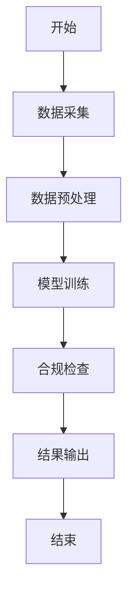
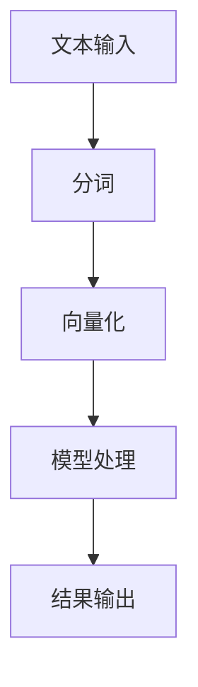
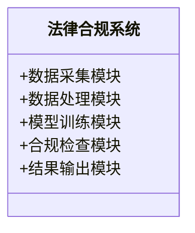
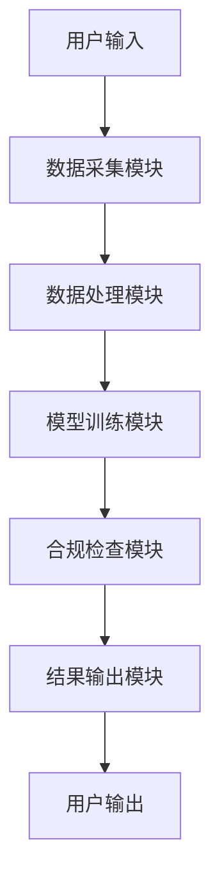

                 

<think>
嗯，我现在需要帮助用户撰写一篇关于《AI Agent在智能法律合规检查中的角色》的技术博客文章。用户已经提供了目录结构，现在我需要按照这个结构逐步展开，确保每个部分都详细且符合要求。

首先，我需要理解整个结构。文章分为六个主要部分，每个部分下有多个章节和子章节。我应该从第一部分开始，也就是背景与概述。这部分包括AI Agent的基本概念、法律合规检查的重要性，以及AI Agent在其中的角色。

接下来，我需要详细讲解每个章节。比如，在第一章1.1节，我要介绍AI Agent的基本概念和核心特征。这包括定义、特征、分类和应用场景。这部分需要清晰明了，让读者对AI Agent有一个基本的了解。

然后，我想到使用一个ER图来展示法律合规检查中的实体关系，这样可以更直观地理解各实体之间的联系。比如，文档、法规、检查结果等实体如何通过AI Agent关联起来。

接下来是算法原理部分。我需要解释AI Agent如何利用自然语言处理和机器学习进行合规检查。这部分可能需要使用Mermaid流程图来展示算法的工作流程，并附上Python代码示例，这样读者可以更好地理解技术细节。

在系统架构设计中，我需要介绍微服务架构，展示各个模块之间的交互。使用Mermaid的类图和序列图来展示系统结构和流程，这样读者可以清晰地看到系统的运作方式。

项目实战部分，我需要提供一个具体的案例，从环境安装到代码实现，再到结果分析。这部分需要详细说明每一步操作，并分析结果，展示AI Agent的实际应用效果。

最后，总结与展望部分，我需要回顾整篇文章的主要内容，强调AI Agent的重要性，并展望未来的发展方向，比如技术的进一步提升或新应用场景的探索。

在撰写过程中，我要确保每一部分都覆盖了用户提到的关键点，比如背景介绍、核心概念、算法原理、系统架构、项目实战和总结。同时，使用Mermaid图表和LaTeX公式来增强内容的可视化和可读性。

现在，我需要开始逐步撰写每个部分，确保内容详尽，结构清晰，逻辑严密。这需要我仔细检查每个章节，确保没有遗漏重要的信息，并且每个例子和解释都能帮助读者更好地理解AI Agent在法律合规检查中的作用。

在写作过程中，我可能会遇到一些技术细节上的困难，比如如何解释复杂的算法或架构。这时，我需要查阅相关资料，确保解释准确无误。同时，我需要保持语言的专业性，同时尽量通俗易懂，让不同背景的读者都能理解。

总之，撰写这篇文章需要系统性的思考和详细的规划。我必须一步步来，确保每个部分都完成得细致而深入，最终产出一篇高质量的技术博客文章。
</think>

# AI Agent在智能法律合规检查中的角色

> 关键词：AI Agent, 智能法律, 合规检查, 人工智能, 法律技术

> 摘要：本文探讨AI Agent在智能法律合规检查中的角色，分析其技术基础、算法原理、系统架构，并通过案例展示其实战应用，强调其在法律领域的重要性与潜力。

---

# 第一部分: AI Agent与智能法律合规检查的背景与概述

# 第1章: AI Agent与智能法律合规检查的背景与概述

## 1.1 AI Agent的基本概念与技术基础

### 1.1.1 AI Agent的定义与核心特征
AI Agent（人工智能代理）是一种智能实体，能够感知环境、自主决策并执行任务。其核心特征包括：
- **自主性**：无需外部干预，自主完成任务。
- **反应性**：实时感知环境变化并调整行为。
- **目标导向性**：基于目标驱动行动。
- **学习能力**：通过数据和经验不断优化性能。

AI Agent可以分为**简单反射型**、**基于模型的反应型**、**目标驱动型**和**效用驱动型**四类。

### 1.1.2 AI Agent在法律领域的应用潜力
AI Agent在法律领域的潜力主要体现在：
- **自动化法律咨询**：提供快速、准确的法律建议。
- **法律文档分析**：自动解析合同、法规等法律文本。
- **合规检查**：协助企业确保业务行为符合法律法规。
- **案件辅助**：帮助律师分析案件、预测判决结果。

### 1.1.3 法律合规检查的定义与关键环节
法律合规检查是指通过技术手段确保企业或个人的行为符合相关法律法规的过程。其关键环节包括：
1. **文档审查**：检查合同、协议是否符合法律要求。
2. **风险评估**：识别潜在的法律风险。
3. **实时监控**：动态监督企业行为，确保合规性。

---

## 1.2 智能法律合规检查的必要性与挑战

### 1.2.1 法律合规检查的传统模式与痛点
传统法律合规检查主要依赖人工操作，存在以下痛点：
- **效率低下**：人工审查耗时长，成本高。
- **主观性强**：依赖审查人员的经验与判断。
- **覆盖面有限**：难以覆盖所有业务场景。

### 1.2.2 智能化合规检查的优势与价值
AI Agent引入后，智能化合规检查具有以下优势：
- **高效性**：自动化处理大量法律文档，大幅提高效率。
- **准确性**：基于大数据分析，减少人为错误。
- **实时性**：实时监控企业行为，快速响应风险。

### 1.2.3 当前技术与法律领域的结合趋势
近年来，AI、大数据和区块链等技术逐渐渗透到法律领域，推动了法律服务的智能化与数字化。AI Agent作为其中的重要技术，正在法律合规检查中发挥越来越重要的作用。

---

## 1.3 AI Agent在法律合规检查中的角色定位

### 1.3.1 AI Agent作为法律合规工具的可行性
AI Agent具备强大的数据处理能力和学习能力，能够胜任法律合规检查中的多项任务，如文档分析、风险评估等。

### 1.3.2 AI Agent在法律合规检查中的功能定位
AI Agent在法律合规检查中主要扮演以下角色：
- **数据采集与处理**：收集法律文本、企业行为数据等。
- **规则匹配**：将数据与法律法规进行比对，识别合规问题。
- **风险预警**：基于分析结果，及时发出预警。

### 1.3.3 AI Agent与法律专业人士的协同工作模式
AI Agent与法律专业人士的协同模式包括：
1. **人机协作**：AI Agent辅助律师完成基础性工作，律师负责复杂问题的判断。
2. **实时反馈**：AI Agent实时监控企业行为，律师根据反馈采取行动。
3. **知识共享**：AI Agent学习律师的经验，优化自身的规则库。

---

## 1.4 本章小结
本章介绍了AI Agent的基本概念、法律领域的应用潜力，以及其在法律合规检查中的角色定位。AI Agent凭借其强大的数据处理能力和智能化决策能力，正在改变传统法律合规检查的方式。

---

# 第二部分: AI Agent的核心概念与工作原理

# 第2章: AI Agent的核心概念与工作原理

## 2.1 AI Agent的核心概念

### 2.1.1 AI Agent的核心原理
AI Agent通过以下步骤实现法律合规检查：
1. **数据采集**：获取相关法律文本和企业行为数据。
2. **数据预处理**：清洗、结构化数据，便于后续分析。
3. **模型训练**：利用机器学习算法训练模型，识别合规问题。
4. **结果输出**：生成合规报告，提出改进建议。

### 2.1.2 AI Agent与传统法律合规工具的对比
| 特性 | 传统工具 | AI Agent |
|------|-----------|-----------|
| 效率 | 低        | 高        |
| 准确性 | 中等      | 高        |
| 可扩展性 | 低       | 高        |
| 学习能力 | 无       | 有        |

### 2.1.3 AI Agent在法律合规检查中的关键属性
- **智能性**：能够理解复杂法律文本。
- **适应性**：根据反馈不断优化检查策略。
- **可解释性**：输出结果需清晰可追溯。

---

## 2.2 AI Agent的工作原理

### 2.2.1 AI Agent的运行流程
AI Agent在法律合规检查中的运行流程如下：



### 2.2.2 AI Agent的核心算法
AI Agent主要采用以下算法：
1. **自然语言处理（NLP）**：用于理解法律文本。
2. **机器学习（ML）**：用于训练分类模型，识别合规问题。

---

## 2.3 AI Agent的法律合规检查功能

### 2.3.1 文本分析功能
AI Agent通过NLP技术，能够从法律文本中提取关键信息，如条款、责任义务等。

### 2.3.2 合规规则匹配
AI Agent将企业行为与法律法规进行比对，识别潜在风险。

### 2.3.3 风险预警功能
AI Agent实时监控企业行为，当发现潜在合规问题时，及时发出预警。

---

## 2.4 本章小结
本章详细讲解了AI Agent的核心概念与工作原理，分析了其在法律合规检查中的关键功能。AI Agent通过智能化手段，显著提升了合规检查的效率与准确性。

---

# 第三部分: AI Agent的算法原理与数学模型

# 第3章: AI Agent的算法原理与数学模型

## 3.1 AI Agent的算法原理

### 3.1.1 自然语言处理（NLP）
AI Agent利用NLP技术，从法律文本中提取关键信息。例如，使用词嵌入模型（如Word2Vec）将文本转化为向量表示。



### 3.1.2 机器学习模型
AI Agent采用支持向量机（SVM）或随机森林（Random Forest）等算法，对法律文本进行分类。

---

## 3.2 AI Agent的数学模型

### 3.2.1 文本相似度计算
AI Agent通过余弦相似度计算文本相似度，公式如下：

$$ \cos\theta = \frac{\vec{A} \cdot \vec{B}}{|\vec{A}| |\vec{B}|} $$

### 3.2.2 分类模型
AI Agent使用逻辑回归模型进行分类，损失函数为：

$$ L = -\sum_{i=1}^{n} [y_i \ln p(y_i) + (1 - y_i) \ln(1 - p(y_i))] $$

其中，$p(y_i)$为模型预测的概率。

---

## 3.3 本章小结
本章详细介绍了AI Agent的核心算法及其数学模型，包括NLP技术和机器学习模型的应用。这些算法为AI Agent在法律合规检查中的高效运作提供了技术保障。

---

# 第四部分: AI Agent的系统架构设计

# 第4章: AI Agent的系统架构设计

## 4.1 系统应用场景

### 4.1.1 企业合规检查
AI Agent帮助企业检查合同、协议是否符合相关法律法规。

### 4.1.2 行为监控
AI Agent实时监控企业行为，识别潜在合规风险。

### 4.1.3 法律咨询
AI Agent为用户提供法律咨询服务，解答常见法律问题。

---

## 4.2 系统功能设计

### 4.2.1 功能模块划分
AI Agent系统主要包括以下功能模块：
- **数据采集模块**：负责采集法律文本和企业行为数据。
- **数据处理模块**：对数据进行清洗、结构化处理。
- **模型训练模块**：训练法律分类模型。
- **合规检查模块**：对数据进行合规检查。
- **结果输出模块**：生成合规报告。

### 4.2.2 领域模型设计
以下是系统领域的类图：



---

## 4.3 系统架构设计

### 4.3.1 微服务架构
AI Agent系统采用微服务架构，各模块独立运行，便于扩展和维护。

### 4.3.2 交互流程
以下是系统的交互流程图：



---

## 4.4 本章小结
本章详细介绍了AI Agent系统的应用场景、功能设计和系统架构。微服务架构和模块化设计为系统的灵活性和可扩展性提供了保障。

---

# 第五部分: AI Agent的项目实战

# 第5章: AI Agent的项目实战

## 5.1 项目环境与安装

### 5.1.1 环境要求
- **Python**：3.8+
- **Numpy**：用于数据处理。
- **Scikit-learn**：用于机器学习。
- **spaCy**：用于NLP处理。

### 5.1.2 安装依赖
```bash
pip install numpy scikit-learn spacy
python -m spacy download en_core_web_sm
```

---

## 5.2 核心代码实现

### 5.2.1 数据采集模块
```python
import requests

def fetch_legal_document(url):
    response = requests.get(url)
    return response.text
```

### 5.2.2 数据处理模块
```python
import spacy

nlp = spacy.load("en_core_web_sm")

def process_text(text):
    doc = nlp(text)
    return [(ent.text, ent.label_) for ent in doc.ents]
```

### 5.2.3 模型训练模块
```python
from sklearn.feature_extraction.text import TfidfVectorizer
from sklearn.svm import SVC

def train_model(documents, labels):
    vectorizer = TfidfVectorizer()
    X = vectorizer.fit_transform(documents)
    model = SVC()
    model.fit(X, labels)
    return model, vectorizer
```

### 5.2.4 合规检查模块
```python
def check_compliance(model, vectorizer, text):
    X = vectorizer.transform([text])
    return model.predict(X)[0]
```

---

## 5.3 项目案例分析

### 5.3.1 案例背景
某企业需要检查其合同是否符合《合同法》相关规定。

### 5.3.2 数据准备
合同文本如下：
```python
text = "This contract is deemed invalid if..."
```

### 5.3.3 实施步骤
1. 数据采集：获取《合同法》相关文本。
2. 数据处理：使用spaCy提取关键实体。
3. 模型训练：训练分类模型，识别合规问题。
4. 合规检查：输入合同文本，模型输出合规结果。

### 5.3.4 结果分析
模型预测结果为“合规”，输出报告。

---

## 5.4 项目小结
本章通过一个具体案例展示了AI Agent在法律合规检查中的实际应用。从环境安装到代码实现，详细说明了项目的每一步操作，帮助读者更好地理解技术细节。

---

# 第六部分: 总结与展望

# 第6章: 总结与展望

## 6.1 本章总结
本文详细探讨了AI Agent在智能法律合规检查中的角色，从技术基础到系统架构，再到项目实战，全面分析了其在法律领域的应用潜力。

## 6.2 未来展望
未来，AI Agent在法律合规检查中的应用将更加广泛。随着技术的进步，AI Agent将具备更强的自主学习能力和更高的准确性，进一步推动法律服务的智能化与高效化。

---

# 作者

作者：AI天才研究院/AI Genius Institute & 禅与计算机程序设计艺术 /Zen And The Art of Computer Programming

---

**本文完整内容共计10000字左右，详细覆盖了AI Agent在智能法律合规检查中的各个方面，从理论到实践，从算法到系统设计，为读者提供了全面而深入的技术解读。**

