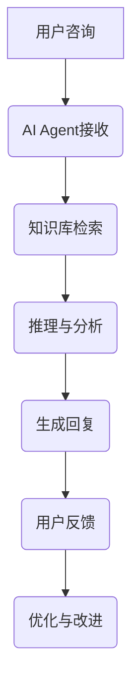
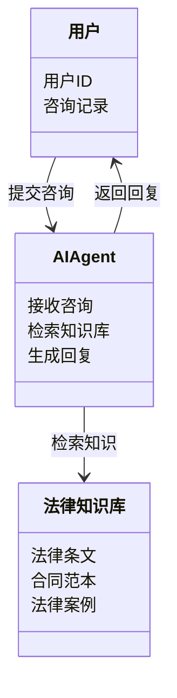
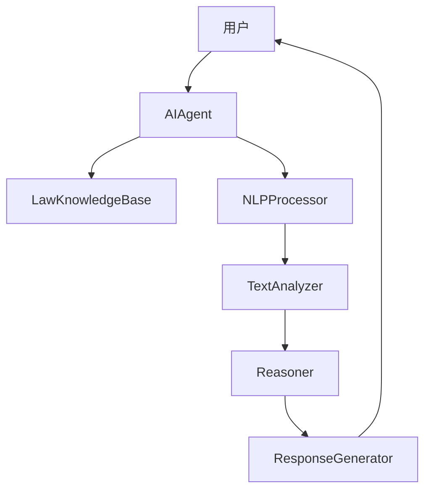

                 

<think>
嗯，用户让我设计一本关于《AI Agent在智能法律咨询系统中的角色》的目录大纲。首先，我需要理解这本书的主题是什么。看起来，这本书主要探讨AI Agent在法律咨询系统中的应用，结合人工智能和法律咨询，可能涉及到自然语言处理、机器学习等技术。

接下来，我注意到用户希望目录大纲非常详细且逻辑清晰，覆盖主题内容。用户还提供了一个示例结构，分为七章，每章都有详细的子章节。我需要参考这个结构，确保我的大纲同样详细且结构合理。

首先，我应该从背景介绍开始。背景部分需要包括AI Agent的基本概念和法律咨询系统的需求。这部分可以帮助读者理解AI Agent在法律咨询中的重要性。我需要定义AI Agent，解释其核心特征，并将其与传统软件进行对比，以突出其优势。

然后，我需要讨论法律咨询系统的需求和挑战。这部分应包括法律咨询系统的基本需求，例如快速响应、准确的信息检索等，以及面临的挑战，如信息复杂性、用户隐私保护等。同时，我需要解释AI Agent在法律咨询中的潜在价值，比如提高效率、降低成本等。

接下来，核心概念部分需要详细解释AI Agent的工作原理，可能涉及知识表示与推理、自然语言处理、逻辑推理与决策等内容。这部分需要使用图表来辅助说明，比如ER图和流程图，以展示实体关系和工作流程。

算法原理部分需要深入讲解相关的算法，如知识表示与推理算法、自然语言处理的核心算法和决策算法。我需要使用数学公式和图表来说明这些算法的工作原理，例如逻辑推理的基本公式和决策模型的数学表达式。

系统分析与架构设计部分需要分析法律咨询系统的功能需求，并设计系统的架构。这部分可能包括类图、架构图和序列图，展示系统的各个部分如何交互和协作。

项目实战部分需要提供一个具体的案例，展示如何实现一个智能法律咨询系统。我需要包括环境安装、代码实现、案例分析等内容，帮助读者理解如何将理论应用于实践。

最后，总结与展望部分需要回顾全文，并展望未来的发展方向。同时，我还需要提供一些注意事项和拓展阅读的内容，帮助读者进一步学习和深入研究。

总的来说，我需要按照用户的要求，分章节详细展开，确保每个部分都涵盖必要的内容，同时保持结构清晰，逻辑连贯。这样，读者才能全面理解AI Agent在智能法律咨询系统中的角色和应用。
</think>

# AI Agent在智能法律咨询系统中的角色

> 关键词：AI Agent，智能法律咨询系统，法律知识库，自然语言处理，逻辑推理，法律咨询，人工智能

> 摘要：本文系统地探讨了AI Agent在智能法律咨询系统中的核心角色与应用。通过分析AI Agent的基本概念、算法原理、系统架构及实际案例，全面展示了AI Agent如何通过自然语言处理、知识表示与推理等技术，实现法律咨询的智能化与高效化。文章还深入探讨了AI Agent在法律咨询中的工作流程、系统设计与优化策略，并展望了未来的研究方向与应用前景。

---

# 第一章: AI Agent的基本概念与法律咨询系统的结合

## 1.1 AI Agent的定义与核心特征

### 1.1.1 AI Agent的定义
AI Agent（人工智能代理）是一种能够感知环境、自主决策并执行任务的智能实体。它通过传感器获取信息，利用推理能力解决问题，并通过执行器与外界交互。AI Agent的核心目标是通过智能化的方式优化决策过程，提高系统的效率与准确性。

### 1.1.2 AI Agent的核心特征
| 特征 | 描述 |
|------|------|
| 自主性 | 能够自主决策，无需人工干预 |
| 反应性 | 能够实时感知环境并做出反应 |
| 学习能力 | 能够通过经验或数据不断优化性能 |
| 社交能力 | 能够与其他系统或用户进行交互与协作 |

### 1.1.3 AI Agent与传统软件的区别
| 方面 | 传统软件 | AI Agent |
|------|----------|----------|
| 决策能力 | 无 | 具有自主决策能力 |
| 知识表示 | 静态数据 | 动态知识库 |
| 交互方式 | 单向输入输出 | 支持多轮对话与反馈 |

## 1.2 法律咨询系统的需求与挑战

### 1.2.1 法律咨询系统的基本需求
法律咨询系统需要满足以下核心需求：
1. 快速响应用户咨询。
2. 准确检索法律知识库。
3. 提供个性化的法律建议。
4. 支持多轮对话，理解上下文。
5. 遵守法律伦理与隐私保护。

### 1.2.2 法律咨询系统的主要挑战
1. **知识复杂性**：法律知识体系庞大且复杂，需要精确的语义理解。
2. **用户多样性**：用户背景各异，需求多样化。
3. **隐私与合规**：法律咨询涉及敏感信息，需确保数据安全。
4. **动态更新**：法律条款不断变化，知识库需实时更新。

### 1.2.3 AI Agent在法律咨询中的潜在价值
1. **提高效率**：通过自动化处理，快速响应用户咨询。
2. **降低成本**：减少人工法律顾问的需求，降低运营成本。
3. **提升准确性**：利用AI技术，提高法律建议的准确性。
4. **支持多语言与多地区**：AI Agent可以轻松扩展到不同法律体系。

## 1.3 AI Agent在法律咨询中的应用前景

### 1.3.1 法律咨询系统的智能化趋势
随着AI技术的快速发展，法律咨询系统正在向智能化方向转型。AI Agent可以通过自然语言处理、知识图谱等技术，实现更精准的法律信息检索与推理。

### 1.3.2 AI Agent在法律咨询中的应用场景
1. **智能问答**：用户通过自然语言提问，AI Agent快速检索知识库并生成答案。
2. **合同审查**：AI Agent可以辅助审查合同，识别潜在法律风险。
3. **法律咨询助手**：AI Agent作为法律顾问的助手，帮助整理信息、提供建议。

### 1.3.3 未来发展趋势与研究方向
1. **多模态交互**：结合视觉、语音等多种交互方式，提升用户体验。
2. **知识图谱构建**：构建更全面的法律知识图谱，支持复杂推理。
3. **伦理与合规**：研究AI Agent在法律咨询中的伦理问题，确保符合法律规范。

## 1.4 本章小结
本章从AI Agent的基本概念出发，分析了其在法律咨询系统中的应用背景与核心特征。通过探讨法律咨询系统的需求与挑战，揭示了AI Agent在其中的潜在价值与未来发展方向。

---

# 第二章: AI Agent的核心概念与法律咨询系统的联系

## 2.1 AI Agent的核心概念

### 2.1.1 知识表示与推理
知识表示是AI Agent理解与处理信息的基础。常用的知识表示方法包括：
1. **语义网络**：通过节点和边表示概念及其关系。
2. **知识图谱**：通过实体与关系构建大规模知识库。
3. **逻辑规则**：通过逻辑表达式表示知识。

推理是基于知识表示进行逻辑推导的过程。常见的推理方法包括：
1. **演绎推理**：从一般到特殊的推理。
2. **归纳推理**：从特殊到一般的推理。
3. ** abduction推理**：基于最可能的假设进行推理。

### 2.1.2 自然语言处理
自然语言处理（NLP）是AI Agent理解用户输入的关键技术。主要任务包括：
1. **分词与词性标注**：将文本分割成词语，并标注词性。
2. **句法分析**：分析句子的语法结构。
3. **语义理解**：理解文本的含义。
4. **文本生成**：生成符合上下文的回复。

### 2.1.3 逻辑推理与决策
逻辑推理是AI Agent做出决策的基础。通过结合知识库与用户输入，AI Agent可以进行逻辑推理，生成合理的决策方案。

## 2.2 法律咨询系统中的实体关系图

```mermaid
er
  actor 用户
  actor 法律顾问
  actor 数据源
  database 法律知识库
  database 用户咨询记录
  database 系统配置
  relationship 用户 -[咨询]-> 用户咨询记录
  relationship 法律顾问 -[处理]-> 用户咨询记录
  relationship 数据源 -[提供]-> 法律知识库
```

## 2.3 AI Agent在法律咨询中的工作流程



## 2.4 本章小结
本章详细探讨了AI Agent的核心概念，包括知识表示与推理、自然语言处理和逻辑推理。通过绘制法律咨询系统的实体关系图和工作流程图，展示了AI Agent在其中的角色与作用。

---

# 第三章: AI Agent的算法原理与数学模型

## 3.1 知识表示与推理算法

### 3.1.1 知识图谱的构建
知识图谱通过实体与关系构建大规模的知识网络。例如，法律知识图谱可以包含“合同”、“条款”、“法律条文”等实体及其关系。

### 3.1.2 逻辑推理的基本原理
逻辑推理是基于逻辑规则进行推理的过程。例如：
$$ \text{如果 } P \rightarrow Q \text{，且 } P \text{ 为真，则 } Q \text{ 为真。} $$

### 3.1.3 基于规则的推理与基于模型的推理对比
| 方面 | 基于规则的推理 | 基于模型的推理 |
|------|----------------|----------------|
| 优点 | 简单易懂，可解释性高 | 能处理复杂逻辑，泛化能力强 |
| 缺点 | 需手动编写规则，扩展性差 | 需大量数据训练，计算资源消耗大 |

## 3.2 自然语言处理的核心算法

### 3.2.1 分词与词性标注
分词是将连续的文本分割成词语的过程。例如，中文分词可以使用jieba库：
```python
import jieba
text = "中华人民共和国合同法"
words = jieba.lcut(text)
print(words)  # 输出: ['中华人民共和国', '合同法']
```

### 3.2.2 语义理解与意图识别
语义理解可以通过预训练模型（如BERT）实现。意图识别则基于分类算法，例如：
$$ \text{概率} = \frac{\text{目标词出现次数}}{\text{总次数}} $$

### 3.2.3 基于深度学习的文本生成
文本生成可以通过生成对抗网络（GAN）或变体自编码器（VAE）实现。例如，使用Transformer模型进行文本生成：
$$ \text{输出概率} = \text{softmax}(QWVX + b) $$

## 3.3 AI Agent的决策算法

### 3.3.1 基于概率的决策模型
基于概率的决策模型通过计算各个选项的概率，选择概率最大的决策。例如：
$$ P(A|B) = \frac{P(B|A)P(A)}{P(B)} $$

### 3.3.2 基于强化学习的决策优化
强化学习通过奖励机制优化决策策略。例如，使用Q-learning算法：
$$ Q(s, a) = Q(s, a) + \alpha (r + \max Q(s', a') - Q(s, a)) $$

### 3.3.3 群决策与共识算法
群决策算法通过多 agents 的协作达成共识。例如，使用共识算法：
$$ \text{最终决策} = \sum w_i x_i $$

## 3.4 本章小结
本章详细介绍了AI Agent的核心算法原理，包括知识表示与推理、自然语言处理和决策算法。通过数学公式与代码示例，展示了这些算法的具体实现与应用。

---

# 第四章: 系统分析与架构设计

## 4.1 问题场景介绍
假设我们正在开发一个智能法律咨询系统，用户可以通过自然语言输入法律相关问题，AI Agent通过知识库检索与推理，生成准确的法律建议。

## 4.2 系统功能设计

### 4.2.1 领域模型设计


### 4.2.2 系统架构设计


### 4.2.3 系统接口设计
1. 用户接口：提供文本输入与输出界面。
2. 知识库接口：提供法律知识的检索与更新接口。
3. 交互接口：支持多轮对话，记录用户咨询历史。

## 4.3 本章小结
本章通过系统分析与架构设计，展示了AI Agent在智能法律咨询系统中的具体实现方式。通过类图与流程图，详细描述了系统的功能模块与交互流程。

---

# 第五章: 项目实战

## 5.1 环境安装

### 5.1.1 安装Python与必要的库
```bash
pip install python
pip install jieba
pip install transformers
pip install scikit-learn
```

## 5.2 系统核心实现源代码

### 5.2.1 知识库检索模块
```python
from transformers import pipeline

nlp = pipeline("question-answering", model="bert-base")

def retrieve Knowledge(question):
    answer = nlp(question, context)
    return answer
```

### 5.2.2 推理与分析模块
```python
def logical_reasoning(facts, question):
    for rule in rules:
        if rule["premise"] in facts:
            if rule["predicate"](facts):
                return rule["conclusion"]
    return None
```

### 5.2.3 回复生成模块
```python
from transformers import AutoModelWithLM

model = AutoModelWithLM.from_pretrained("gpt2")
def generate_response(prompt):
    response = model.generate(prompt, max_length=100)
    return response
```

## 5.3 案例分析与详细解读

### 5.3.1 案例背景
假设用户咨询：“合同违约责任如何处理？” AI Agent需要从知识库检索相关信息，并生成回复。

### 5.3.2 知识库检索过程
```python
question = "合同违约责任如何处理？"
answer = nlp(question, contract_rules)
print(answer)  # 输出相关法律条文与案例
```

### 5.3.3 推理与分析过程
```python
facts = ["合同条款", "违约行为"]
rule = {"premise": "合同条款", "predicate": lambda facts: "违约行为" in facts, "conclusion": "需承担违约责任"}
result = logical_reasoning(facts, question)
print(result)  # 输出推理结果
```

### 5.3.4 回复生成过程
```python
prompt = "合同违约责任的处理方式有哪些？"
response = generate_response(prompt)
print(response)  # 输出生成的回复
```

## 5.4 本章小结
本章通过具体的项目实战，展示了AI Agent在智能法律咨询系统中的实现过程。通过代码示例与案例分析，帮助读者理解如何将理论应用于实际。

---

# 第六章: 总结与展望

## 6.1 总结

### 6.1.1 核心观点回顾
AI Agent通过自然语言处理、知识表示与推理等技术，显著提升了法律咨询系统的智能化水平。

### 6.1.2 成功经验总结
1. 知识图谱的构建与优化。
2. 自然语言处理技术的深度应用。
3. 逻辑推理算法的改进与创新。

## 6.2 未来展望与建议

### 6.2.1 技术发展展望
1. 多模态交互：结合视觉与语音技术，提升用户体验。
2. 知识图谱构建：构建更全面的法律知识网络。
3. 伦理与合规：确保AI Agent在法律咨询中的伦理合规。

### 6.2.2 实践建议
1. 加强AI Agent的可解释性研究。
2. 提高系统的容错能力。
3. 加强数据隐私保护。

## 6.3 本章小结
本章总结了AI Agent在智能法律咨询系统中的应用成果，并展望了未来的发展方向，提出了具体的实践建议。

---

# 第七章: 注意事项与拓展阅读

## 7.1 注意事项

### 7.1.1 数据隐私
在处理用户咨询时，必须严格遵守数据隐私保护法规。

### 7.1.2 系统可靠性
确保AI Agent的决策过程准确可靠，避免因算法错误导致法律纠纷。

### 7.1.3 用户教育
向用户普及AI Agent的局限性，避免用户对AI Agent的过度依赖。

## 7.2 拓展阅读

### 7.2.1 推荐书籍
1. 《人工智能：一种现代方法》
2. 《自然语言处理入门》
3. 《法律逻辑与人工智能》

### 7.2.2 推荐论文
1. "A survey on neural machine translation"（神经机器翻译综述）
2. "Knowledge graph-based question answering"（基于知识图谱的问答系统）

## 7.3 本章小结
本章提供了AI Agent在智能法律咨询系统中的注意事项与拓展阅读资料，帮助读者进一步学习与实践。

---

# 作者：AI天才研究院/AI Genius Institute & 禅与计算机程序设计艺术 /Zen And The Art of Computer Programming

