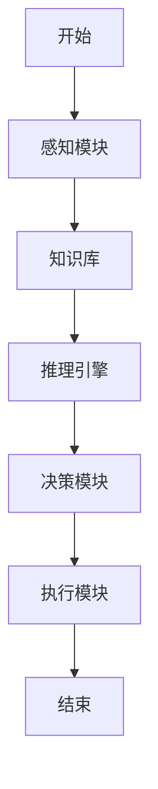
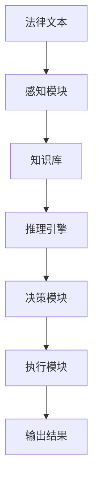

                 


# 第二章: AI Agent的核心概念与法律文本分析的挑战

## 2.1 AI Agent的核心概念与原理

### 2.1.1 AI Agent的定义与特点

AI Agent（人工智能代理）是指能够感知环境、自主决策并执行任务的智能实体。它通过传感器获取信息，利用知识库和推理引擎进行分析，然后通过执行器采取行动。AI Agent的核心特点包括：

- **自主性**：能够自主决策，无需外部干预。
- **反应性**：能够实时感知环境并做出反应。
- **学习性**：能够通过经验改进性能。
- **适应性**：能够适应环境的变化。

AI Agent的结构通常包括以下几个模块：

1. **感知模块**：负责接收外部输入，如法律文本数据。
2. **知识库**：存储法律相关知识和规则。
3. **推理引擎**：对输入数据进行分析和推理。
4. **决策模块**：基于推理结果做出决策。
5. **执行模块**：将决策转化为具体操作。

接下来，我们通过一个简单的mermaid流程图来展示AI Agent的基本工作流程：



AI Agent在法律文本分析中的优势在于其能够处理复杂多变的法律条文和案例，提供高效的分析和决策支持。

### 2.1.2 AI Agent的核心原理

AI Agent的核心原理包括感知、推理和执行三个主要阶段。

1. **感知阶段**：
   - 通过自然语言处理（NLP）技术，AI Agent能够从法律文本中提取关键信息。
   - 使用关键词提取和实体识别技术，识别出法律文本中的关键实体，如人名、机构名、日期等。

2. **推理阶段**：
   - 利用知识库和推理引擎，AI Agent能够对提取的信息进行逻辑推理。
   - 知识库可以是法律规则、案例库或法律条款，推理引擎则基于这些知识进行分析。

3. **执行阶段**：
   - AI Agent根据推理结果生成相应的输出，如法律意见书、合同审查结果等。
   - 输出可以是文本形式，也可以是结构化的数据，供用户进一步处理。

为了更好地理解AI Agent在法律文本分析中的工作流程，我们可以通过一个具体的案例来说明。假设我们需要分析一份合同，AI Agent会按照以下步骤进行：

1. **感知**：AI Agent首先阅读合同文本，提取出合同的主要条款和关键实体。
2. **推理**：基于知识库中的法律规则，AI Agent分析合同的合法性、合规性以及潜在的风险。
3. **执行**：生成一份合同审查报告，指出合同中的问题并提出建议。

### 2.2 法律文本分析的挑战与解决方案

法律文本分析是一项复杂的任务，涉及多方面的挑战。以下是法律文本分析的主要挑战及其解决方案：

#### 挑战

1. **法律术语的复杂性**：
   - 法律文本中充满了专业术语和复杂的句法结构，这使得文本分析变得困难。
2. **文本的多样性**：
   - 法律文本可以是合同、法规、判决书等多种形式，每种形式都有其独特的结构和内容。
3. **语义理解的难度**：
   - 法律文本中的语义常常依赖于上下文，难以通过简单的关键词匹配来理解。
4. **数据稀疏性**：
   - 在某些法律领域，可用的训练数据可能非常有限，导致模型性能不佳。

#### 解决方案

1. **构建专业的法律知识库**：
   - 通过收集和整理大量的法律案例、法规和条款，构建一个专业的法律知识库，为AI Agent提供必要的上下文信息。
2. **使用先进的NLP技术**：
   - 借助于深度学习和自然语言处理技术，如BERT、GPT等，提高AI Agent对法律文本的理解能力。
3. **结合规则引擎**：
   - 在AI Agent中集成规则引擎，利用专家制定的法律规则进行推理和决策。
4. **多模态数据处理**：
   - 结合法律文书的结构化数据和非结构化数据，提升分析的全面性和准确性。

为了更直观地展示法律文本分析的挑战与解决方案，我们可以创建一个对比表格：

```markdown
| 挑战                   | 解决方案                       |
|------------------------|------------------------------|
| 法律术语复杂性           | 构建专业的法律术语库            |
| 文本多样性               | 使用多模态数据处理技术          |
| 语义理解难度             | 借助深度学习模型（如BERT、GPT） |
| 数据稀疏性               | 收集和整理专业法律数据          |
```

此外，我们还可以使用mermaid图来展示法律文本分析的系统架构：



通过以上分析，我们可以看到，AI Agent在法律文本分析中的角色不仅限于简单的文本处理，还包括复杂的推理和决策过程。结合专业的法律知识库和先进的NLP技术，AI Agent能够有效地应对法律文本分析中的各种挑战，为用户提供高效、准确的法律支持。

---

## 2.2 法律文本分析的挑战与解决方案

### 2.2.1 法律文本分析的核心挑战

法律文本分析是一项复杂的任务，涉及多个方面的挑战。以下是法律文本分析的核心挑战：

1. **法律术语的复杂性**：
   - 法律文本中充满了专业术语和复杂的句法结构，这使得文本分析变得困难。
2. **文本的多样性**：
   - 法律文本可以是合同、法规、判决书等多种形式，每种形式都有其独特的结构和内容。
3. **语义理解的难度**：
   - 法律文本中的语义常常依赖于上下文，难以通过简单的关键词匹配来理解。
4. **数据稀疏性**：
   - 在某些法律领域，可用的训练数据可能非常有限，导致模型性能不佳。

### 2.2.2 解决法律文本分析挑战的方案

为了应对上述挑战，我们需要采取一系列有效的解决方案。以下是具体的解决方案：

1. **构建专业的法律知识库**：
   - 通过收集和整理大量的法律案例、法规和条款，构建一个专业的法律知识库，为AI Agent提供必要的上下文信息。
2. **使用先进的NLP技术**：
   - 借助于深度学习和自然语言处理技术，如BERT、GPT等，提高AI Agent对法律文本的理解能力。
3. **结合规则引擎**：
   - 在AI Agent中集成规则引擎，利用专家制定的法律规则进行推理和决策。
4. **多模态数据处理**：
   - 结合法律文书的结构化数据和非结构化数据，提升分析的全面性和准确性。

### 2.2.3 法律文本分析的解决方案架构

为了更直观地展示法律文本分析的解决方案，我们可以创建一个mermaid图：


该图展示了法律文本分析的整体流程，从文本输入到输出结果的每个步骤都清晰可见。通过这样的架构，我们可以更好地理解法律文本分析的复杂性以及AI Agent在其中发挥的作用。

---

## 2.3 本章小结

本章主要介绍了AI Agent的核心概念与原理，以及法律文本分析的挑战与解决方案。我们首先定义了AI Agent的结构和功能，分析了其在法律文本分析中的优势。接着，我们详细讨论了法律文本分析的核心挑战，包括法律术语复杂性、文本多样性、语义理解难度和数据稀疏性。最后，我们提出了相应的解决方案，如构建专业法律知识库、使用先进NLP技术、结合规则引擎和多模态数据处理。通过这些分析，我们可以看到，AI Agent在法律文本分析中的角色不仅限于简单的文本处理，还包括复杂的推理和决策过程。结合专业的法律知识库和先进的NLP技术，AI Agent能够有效地应对法律文本分析中的各种挑战，为用户提供高效、准确的法律支持。

---

作者：AI天才研究院 & 禅与计算机程序设计艺术

