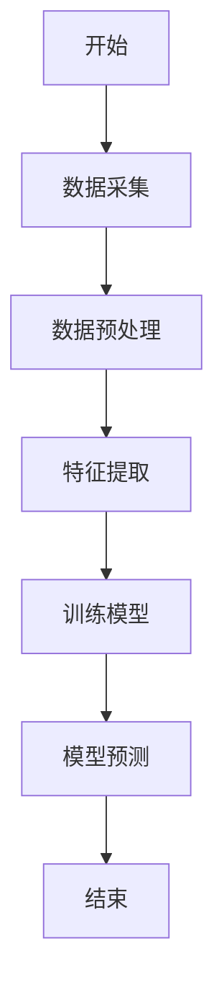
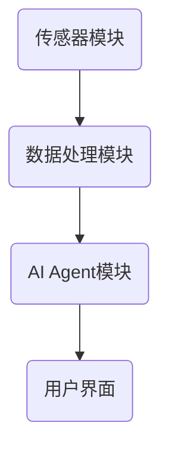

                 


# AI Agent在智能浴室毛巾架中的卫生状况评估

> 关键词：AI Agent, 卫生评估, 智能浴室, 物联网, 传感器, 数据分析

> 摘要：本文详细探讨了AI Agent在智能浴室毛巾架卫生状况评估中的应用，从问题背景、技术原理到系统架构和项目实战，全面分析了如何利用AI技术实现智能化卫生管理。

---

## 第1章: AI Agent与智能浴室毛巾架的卫生评估概述

### 1.1 问题背景与挑战

#### 1.1.1 浴室环境的卫生问题
浴室是一个高湿度、高使用频率的环境，毛巾架的卫生状况直接影响用户的健康。传统毛巾架的清洁依赖人工操作，难以实时监控和评估卫生状况，存在清洁不及时、效率低的问题。

#### 1.1.2 毛巾架使用中的卫生痛点
- 细菌滋生：潮湿环境容易导致细菌和霉菌繁殖。
- 清洁频率：难以确定清洁的最优时间点。
- 用户体验：用户无法实时了解毛巾架的卫生状况。

#### 1.1.3 AI Agent在卫生评估中的作用
AI Agent可以通过传感器数据采集、环境分析和智能决策，实现毛巾架卫生状况的实时监控和自动评估。

### 1.2 问题描述与目标

#### 1.2.1 卫生状况评估的核心问题
如何利用AI技术实现毛巾架卫生状况的实时监测、分析和评估。

#### 1.2.2 AI Agent的目标与功能
- 实时监测：通过传感器获取环境数据。
- 智能分析：基于数据进行卫生状况评估。
- 自动决策：根据评估结果提供清洁建议。

#### 1.2.3 解决方案的边界与外延
- 边界：仅关注毛巾架的卫生状况，不涉及其他浴室设备。
- 外延：可扩展至其他智能卫浴设备的卫生管理。

### 1.3 核心概念与组成

#### 1.3.1 AI Agent的基本定义
AI Agent是一种智能代理，能够感知环境、处理信息并做出决策。

#### 1.3.2 卫生评估的关键要素
- 环境数据：湿度、温度、细菌浓度等。
- 时间因素：使用频率、清洁周期。
- 用户反馈：用户的使用习惯和反馈。

#### 1.3.3 系统架构的核心组成
- 数据采集模块：传感器。
- 数据处理模块：特征提取。
- AI Agent模块：决策和反馈。

---

## 第2章: AI Agent的核心原理与技术

### 2.1 AI Agent的基本原理

#### 2.1.1 智能代理的定义与分类
智能代理根据智能水平分为反应式、基于模型和混合式代理。

#### 2.1.2 AI Agent的核心算法
- 机器学习算法：如支持向量机（SVM）、随机森林。
- 数据分析算法：如聚类分析、回归分析。

#### 2.1.3 多智能体系统的基本概念
多智能体系统由多个相互作用的智能体组成，共同完成复杂任务。

### 2.2 卫生评估的核心技术

#### 2.2.1 数据采集与特征提取
传感器采集数据，提取关键特征如湿度、温度、细菌浓度。

#### 2.2.2 环境感知与状态识别
通过传感器数据识别环境状态，如干燥、湿润、清洁等。

#### 2.2.3 数据分析与决策算法
利用机器学习模型进行数据分析和决策，如分类算法。

### 2.3 系统架构与模块化设计

#### 2.3.1 系统整体架构
```
+----------------+     +----------------+     +----------------+
| 传感器模块    |     | 数据处理模块  |     | AI Agent模块  |
+----------------+     +----------------+     +----------------+
```

#### 2.3.2 各模块的功能与交互
- 传感器模块：采集环境数据。
- 数据处理模块：提取特征并进行预处理。
- AI Agent模块：分析数据并做出决策。

#### 2.3.3 模块间的依赖关系
传感器模块依赖于环境数据，数据处理模块依赖于传感器数据，AI Agent模块依赖于数据处理结果。

---

## 第3章: 算法原理与实现

### 3.1 数据采集与特征提取

#### 3.1.1 数据采集流程
```
1. 传感器采集环境数据。
2. 数据预处理，去除噪声。
3. 特征提取，提取关键特征。
```

#### 3.1.2 特征提取代码示例
```python
import numpy as np

# 示例数据
data = np.array([1, 2, 3, 4, 5])
# 特征提取
features = data.reshape(-1, 1)
print(features)
```

### 3.2 数据分析与分类算法

#### 3.2.1 分类算法选择
使用支持向量机（SVM）进行分类。

#### 3.2.2 SVM算法原理
SVM是一种监督学习算法，用于分类和回归。

#### 3.2.3 SVM算法实现
```python
from sklearn import svm

# 示例数据
X = [[1, 0], [0, 1], [0, 0], [1, 1]]
y = [0, 0, 1, 1]
# 创建SVM模型
model = svm.SVC()
# 训练模型
model.fit(X, y)
# 预测
print(model.predict([[1, 1]]))
```

### 3.3 算法流程图


---

## 第4章: 系统架构与接口设计

### 4.1 系统架构设计

#### 4.1.1 系统整体架构
```
+----------------+     +----------------+     +----------------+
| 传感器模块    |     | 数据处理模块  |     | AI Agent模块  |
+----------------+     +----------------+     +----------------+
```

#### 4.1.2 系统架构图


### 4.2 接口设计

#### 4.2.1 接口定义
- 传感器接口：提供环境数据。
- 数据处理接口：接收传感器数据并进行处理。
- AI Agent接口：接收处理后的数据并做出决策。

#### 4.2.2 接口交互流程图


---

## 第5章: 项目实战与案例分析

### 5.1 项目实战

#### 5.1.1 环境安装
安装必要的Python库，如numpy、scikit-learn。

#### 5.1.2 核心代码实现
```python
import numpy as np
from sklearn import svm

# 数据集
X = np.array([[1, 0], [0, 1], [0, 0], [1, 1]])
y = np.array([0, 0, 1, 1])

# 创建模型
model = svm.SVC()

# 训练模型
model.fit(X, y)

# 预测
print(model.predict([[1, 1]]))
```

### 5.2 案例分析

#### 5.2.1 实际案例
分析传感器数据，评估毛巾架的卫生状况。

#### 5.2.2 案例小结
通过AI Agent实现毛巾架的智能卫生评估，提升用户体验。

---

## 第6章: 最佳实践与总结

### 6.1 小结

#### 6.1.1 核心内容总结
AI Agent通过传感器数据和机器学习算法实现智能卫生评估。

### 6.1.2 注意事项
- 数据采集的准确性。
- 算法的实时性和准确性。
- 系统的可扩展性和可维护性。

### 6.1.3 拓展阅读
推荐学习传感器技术、机器学习和物联网相关知识。

---

## 作者信息

作者：AI天才研究院/AI Genius Institute & 禅与计算机程序设计艺术 /Zen And The Art of Computer Programming

---

这篇文章详细讲解了AI Agent在智能浴室毛巾架卫生评估中的应用，从背景、技术原理到系统架构和项目实战，为读者提供了全面的知识和实践指导。

