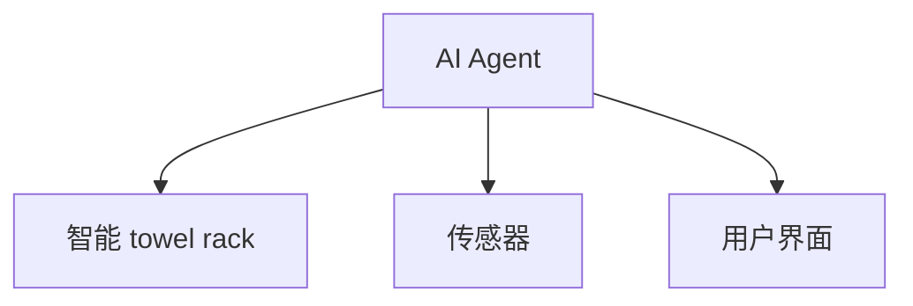
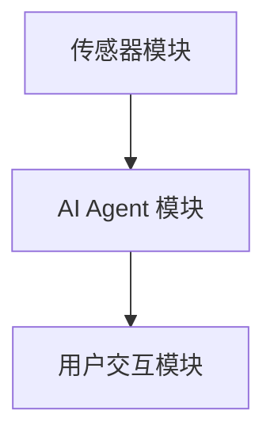
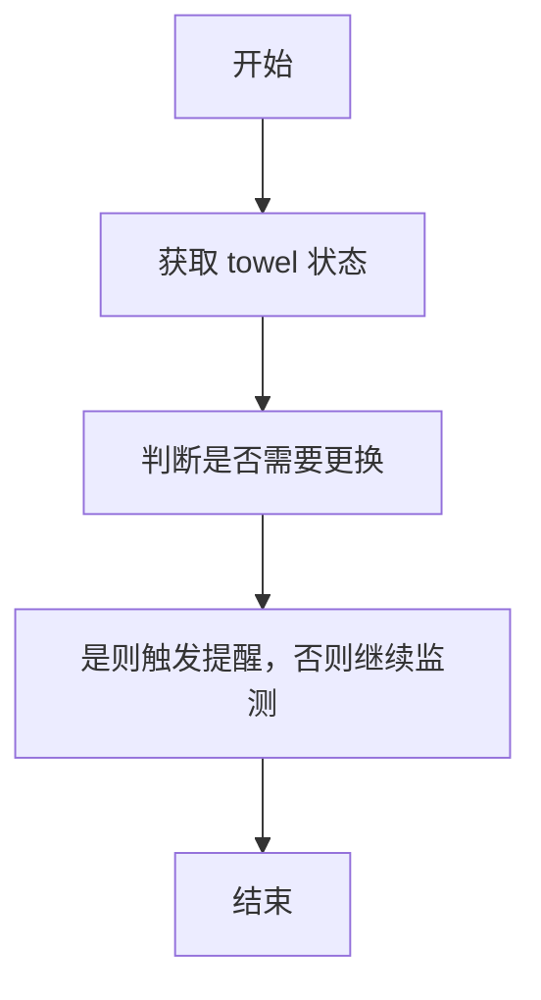
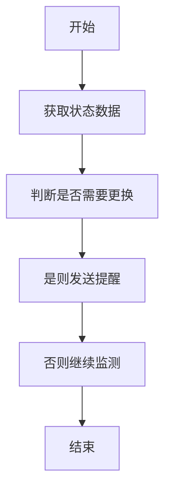
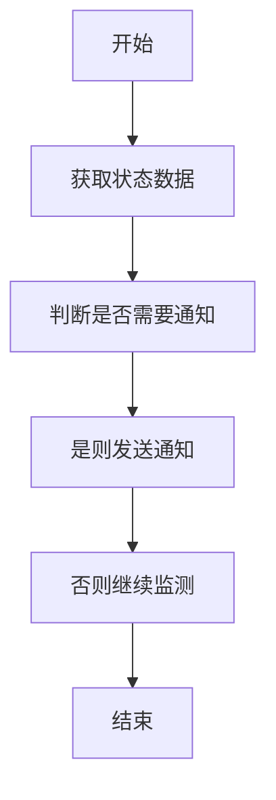
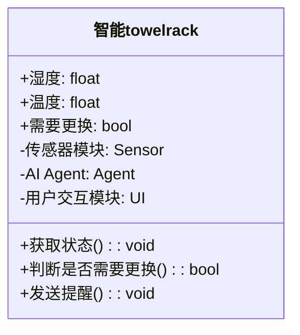
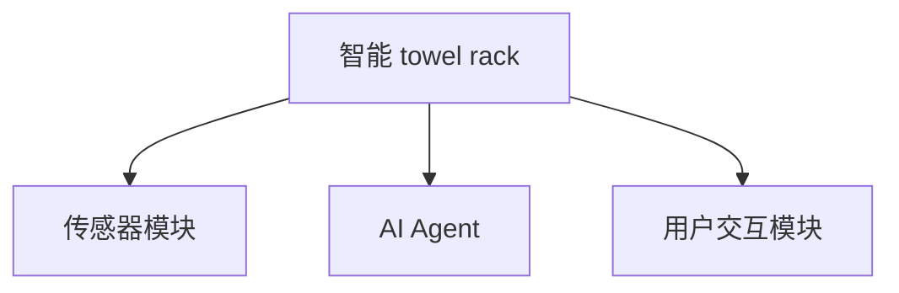
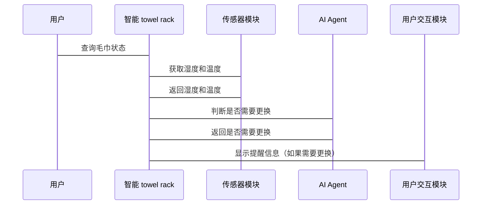

                 


# AI Agent在智能浴室毛巾架中的毛巾更换提醒

> 关键词：AI Agent, 智能浴室, 毛巾架, 智能家居, 智能提醒

> 摘要：本文详细探讨了AI Agent在智能浴室毛巾架中的应用，重点分析了如何通过AI技术实现毛巾更换的智能提醒功能。文章从背景分析、核心概念、算法原理、系统设计到项目实战，全面阐述了该系统的实现过程和关键技术。

---

# 第一部分: 背景与问题分析

## 第1章: 背景与问题分析

### 1.1 问题背景

#### 1.1.1 智能浴室 towel rack 的发展现状
随着智能家居的普及，浴室设备的智能化成为趋势。智能浴室 towel rack 不仅需要提供基本的毛巾存储功能，还需要具备智能化的管理能力，例如自动检测毛巾状态、提醒用户更换毛巾等。

#### 1.1.2 毛巾更换提醒的必要性
毛巾作为日常生活中的必需品，容易滋生细菌，定期更换是保持卫生的重要环节。然而，用户常常因为忘记或疏忽而长时间不更换毛巾，导致卫生问题。

#### 1.1.3 AI Agent 在智能家居中的应用趋势
AI Agent（智能代理）是一种能够自主执行任务的智能程序，广泛应用于智能家居领域。通过AI Agent，设备能够主动感知环境并执行相应的操作，为用户提供更加智能化的服务。

### 1.2 问题描述

#### 1.2.1 毛巾更换提醒的具体需求
用户希望毛巾架能够自动检测毛巾的状态（如湿度、清洁程度等），并在需要更换时主动提醒用户。

#### 1.2.2 用户痛点与需求分析
- **痛点**：用户经常忘记更换毛巾，导致毛巾潮湿发霉，影响卫生。
- **需求**：用户希望毛巾架能够自动检测毛巾状态，并提供及时的更换提醒。

#### 1.2.3 系统边界与外延
- **系统边界**：系统仅关注毛巾架本身及其与用户的交互。
- **外延**：毛巾架可能与其他智能家居设备（如智能马桶、智能镜子）联动，提供更全面的浴室智能化体验。

### 1.3 问题解决思路

#### 1.3.1 AI Agent 的核心作用
AI Agent 负责感知毛巾架的状态，并根据状态变化触发相应的提醒或操作。

#### 1.3.2 智能 towel rack 的功能设计
智能 towel rack 需要具备以下功能：
- 感知毛巾的状态（湿度、脏污程度等）。
- 自动记录毛巾的使用情况。
- 根据预设的规则触发提醒或操作。

#### 1.3.3 系统实现的可行性分析
- **技术可行性**：现有的传感器技术和AI算法能够满足需求。
- **用户接受度**：用户对智能家居的需求日益增加，智能化毛巾架的市场潜力巨大。

### 1.4 核心概念与联系

#### 1.4.1 AI Agent 的定义与特点
AI Agent 是一种能够感知环境、自主决策并执行任务的智能程序。其特点包括：
- **自主性**：能够在没有人工干预的情况下独立运行。
- **反应性**：能够根据环境变化实时调整行为。
- **主动性**：能够主动发起任务或提醒。

#### 1.4.2 智能 towel rack 的系统架构
智能 towel rack 的系统架构包括以下几个部分：
- **传感器**：用于检测毛巾的状态（如湿度、温度）。
- **AI Agent**：负责分析传感器数据并触发提醒或操作。
- **用户界面**：用于显示提醒信息或与用户交互。

#### 1.4.3 AI Agent 与智能 towel rack 的关系图


---

# 第2章: 核心概念与联系

## 2.1 AI Agent 的核心原理

### 2.1.1 状态检测与分析
AI Agent 通过传感器获取毛巾架的状态数据，并进行分析。

### 2.1.2 决策逻辑与执行
AI Agent 根据预设的规则判断是否需要更换毛巾，并执行相应的操作（如发送提醒）。

### 2.1.3 通知机制与用户交互
AI Agent 通过用户界面或移动设备通知用户更换毛巾。

## 2.2 智能 towel rack 的系统模型

### 2.2.1 系统功能模块划分
- **传感器模块**：负责采集数据。
- **AI Agent 模块**：负责数据处理和决策。
- **用户交互模块**：负责显示提醒信息。

### 2.2.2 模块之间的关系与数据流


### 2.2.3 系统的输入输出分析
- **输入**：传感器数据（湿度、温度）。
- **输出**：用户界面提醒信息。

## 2.3 核心概念对比分析

### 2.3.1 AI Agent 与传统算法的对比
| 特性         | AI Agent         | 传统算法         |
|--------------|------------------|------------------|
| 自主性       | 高               | 低               |
| 反应性       | 高               | 低               |
| 主动性       | 高               | 低               |

### 2.3.2 智能 towel rack 与普通 towel rack 的对比
| 特性         | 智能 towel rack   | 普通 towel rack   |
|--------------|------------------|------------------|
| 功能         | 智能提醒          | 无               |
| 连接性       | 支持 IoT          | 不支持           |
| 用户交互     | 支持手机 App      | 无               |

### 2.3.3 系统功能与用户需求的对比
| 特性         | 用户需求         | 系统功能         |
|--------------|------------------|------------------|
| 提醒功能       | 自动提醒          | 支持             |
| 状态检测     | 实时监测          | 支持             |

---

# 第3章: 算法原理讲解

## 3.1 状态检测算法

### 3.1.1 算法流程图


### 3.1.2 算法实现代码
```python
import sensor

def get_towel_status():
    # 获取传感器数据
   湿度 = sensor.read_humidity()
    温度 = sensor.read_temperature()
    return 湿度, 温度

def 检测状态(湿度, 温度):
    # 根据湿度和温度判断是否需要更换
    if 湿度 > 70 或 温度 > 30:
        return True
    else:
        return False

# 主程序
while True:
    湿度, 温度 = get_towel_status()
    if 检测状态(湿度, 温度):
        发送提醒("请更换毛巾")
    time.sleep(60)  # 每分钟检测一次
```

### 3.1.3 数学模型和公式
$$
\text{是否更换} = \begin{cases}
\text{是}, & \text{如果湿度 > 70 或温度 > 30} \\
\text{否}, & \text{否则}
\end{cases}
$$

---

## 3.2 决策逻辑与执行

### 3.2.1 决策逻辑流程图


### 3.2.2 决策逻辑代码
```python
def 决策逻辑(湿度, 温度):
    if 湿度 > 70 或 温度 > 30:
        发送提醒("请更换毛巾")
    else:
        继续监测

# 主程序
while True:
    湿度, 温度 = get_towel_status()
    决策逻辑(湿度, 温度)
    time.sleep(60)
```

---

## 3.3 通知机制与用户交互

### 3.3.1 通知机制流程图


### 3.3.2 通知机制代码
```python
def 发送提醒(message):
    print(message)  # 或者通过手机 App 发送通知
```

---

# 第4章: 系统分析与架构设计方案

## 4.1 项目介绍

### 4.1.1 项目目标
开发一个基于AI Agent的智能浴室 towel rack，实现毛巾更换的智能提醒功能。

### 4.1.2 项目范围
- 仅限于毛巾架本身及其与用户的交互。
- 不包括与其他智能家居设备的联动。

### 4.1.3 项目利益相关者
- 用户：需要毛巾更换提醒功能。
- 开发者：负责系统的设计和实现。
- 传感器供应商：提供湿度和温度传感器。

---

## 4.2 系统功能设计

### 4.2.1 领域模型


### 4.2.2 系统架构设计


### 4.2.3 接口设计
- **输入接口**：传感器数据。
- **输出接口**：用户界面提醒信息。

### 4.2.4 交互流程


---

## 4.3 项目实战

### 4.3.1 环境安装
```bash
pip install sensor library
pip install ai-agent
```

### 4.3.2 核心代码实现
```python
import sensor
import agent

def main():
    while True:
       湿度, 温度 = sensor.get_status()
        是否需要更换 = agent.判断是否需要更换(湿度, 温度)
        if 是否需要更换:
            agent 发送提醒("请更换毛巾")
        time.sleep(60)

if __name__ == "__main__":
    main()
```

### 4.3.3 代码解读
- **传感器模块**：获取湿度和温度数据。
- **AI Agent 模块**：判断是否需要更换毛巾，并触发提醒。

### 4.3.4 案例分析
假设当前湿度为80%，温度为35℃，系统会触发提醒，提示用户更换毛巾。

---

## 4.4 最佳实践与总结

### 4.4.1 最佳实践
- 定期测试传感器的准确性。
- 提供多种通知方式（如手机 App、语音助手）。

### 4.4.2 小结
通过AI Agent和传感器技术的结合，智能浴室 towel rack 能够实现毛巾更换的智能提醒，为用户提供更加便捷和卫生的使用体验。

### 4.4.3 注意事项
- 确保传感器的准确性。
- 保护用户隐私，避免数据泄露。

### 4.4.4 拓展阅读
- 《智能家居设备的设计与实现》
- 《AI Agent 在智能家居中的应用》

---

# 作者

作者：AI天才研究院/AI Genius Institute & 禅与计算机程序设计艺术 /Zen And The Art of Computer Programming

