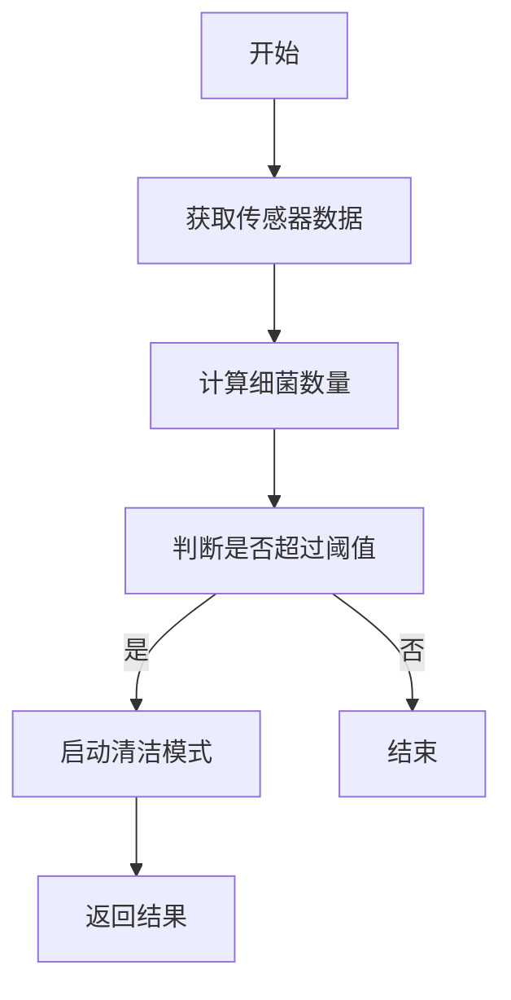
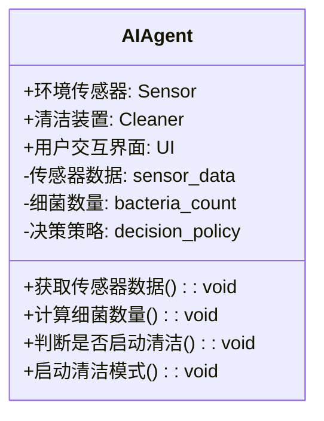
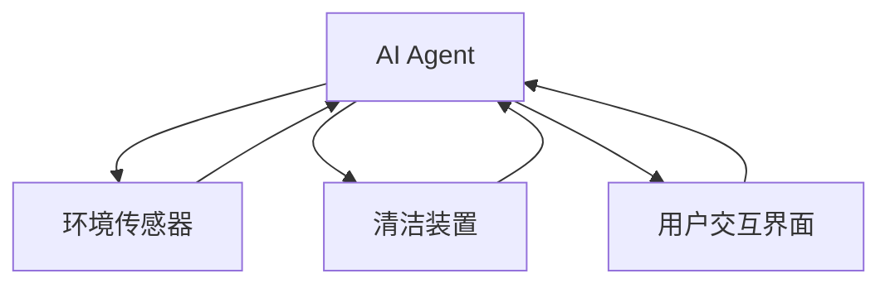
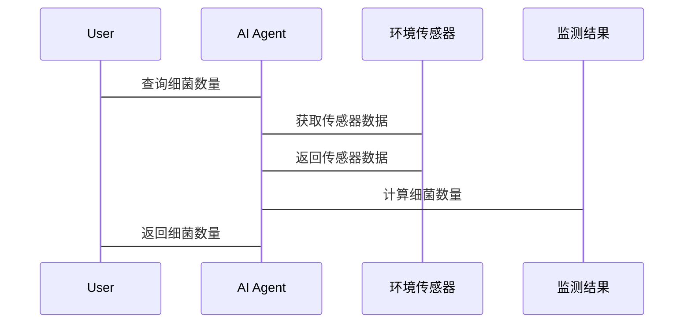

                 

<think>
嗯，用户让我写一篇关于AI Agent在智能浴室毛巾架中控制细菌的技术博客文章。我得先理清楚文章的结构，按照用户给的目录大纲来。首先，标题和关键词已经确定了，接下来是摘要，然后正文部分。

我需要确保每个章节都有详细的分析，比如背景介绍、核心概念、算法原理等。每个小节都需要详细展开，可能需要画一些图表，比如ER图和流程图，来帮助理解。数学公式要用latex表示，代码部分得用Python，并且要有解释。

用户强调要一步一步分析，逻辑清晰，所以我要确保每个步骤都解释清楚，比如在算法原理部分，详细说明强化学习和监督学习的区别，以及为什么选择特定的算法。系统架构设计部分，得画出分层架构图，展示数据采集、处理、决策和执行的过程。

项目实战部分，我需要提供具体的代码示例，比如数据采集模块和模型训练模块，还要解释代码的作用和实现过程。同时，还要进行案例分析，展示AI Agent如何有效控制细菌。

最后，加上作者信息和注意事项，确保文章结构完整。整个过程需要耐心细致，确保每个部分都符合用户的要求，同时内容要专业且易于理解。
</think>

# AI Agent在智能浴室毛巾架中的细菌控制

> 关键词：AI Agent，细菌控制，智能毛巾架，多传感器融合，智能决策算法

> 摘要：本文详细探讨了AI Agent在智能浴室毛巾架中的细菌控制应用。通过分析浴室环境中细菌传播的特性，提出了一种基于多传感器融合和智能决策算法的解决方案。本文从问题背景、核心概念、算法原理、系统架构到项目实战进行了全面阐述，展示了如何利用AI技术实现智能毛巾架的高效细菌控制。

---

# 第一部分: AI Agent在智能浴室毛巾架中的细菌控制概述

# 第1章: 问题背景与需求分析

## 1.1 问题背景介绍

### 1.1.1 浴室环境中的细菌问题
浴室是一个高湿度、高温的环境，非常适合细菌和霉菌的生长。毛巾架作为浴室中常用的物品，容易积累细菌，成为传播细菌的媒介。传统毛巾架缺乏智能化的细菌监测和控制手段，难以有效应对细菌滋生问题。

### 1.1.2 毛巾架在细菌传播中的作用
毛巾架的材质和结构容易藏匿细菌，且毛巾的使用频率高，容易造成交叉感染。因此，如何有效控制毛巾架上的细菌数量，是提升浴室卫生水平的重要课题。

### 1.1.3 智能毛巾架的市场需求
随着人们对卫生健康的重视程度提高，智能毛巾架的市场需求逐渐增长。消费者希望毛巾架不仅具备基本的收纳功能，还能实现智能化的细菌监测和控制。

## 1.2 问题描述与目标

### 1.2.1 细菌控制的核心目标
本文的核心目标是通过AI Agent技术，实现对浴室毛巾架上细菌数量的实时监测和智能控制，确保毛巾架的卫生安全。

### 1.2.2 智能毛巾架的功能需求
智能毛巾架需要具备以下功能：
1. 实时监测细菌数量。
2. 根据细菌数量自动调整清洁模式。
3. 提供用户友好的交互界面。

### 1.2.3 系统边界与外延
系统边界包括毛巾架本体、传感器、清洁装置和用户交互界面。系统外延包括与智能家居系统的联动，以及数据的远程监控。

## 1.3 问题解决的思路

### 1.3.1 AI Agent在细菌控制中的作用
AI Agent通过多传感器数据融合和智能决策算法，能够实时感知环境变化，并根据细菌数量动态调整清洁策略。

### 1.3.2 多传感器融合的技术优势
多传感器融合能够提高系统的感知精度，例如温度、湿度、光照等多种传感器数据的结合，能够更准确地判断细菌的生长环境。

### 1.3.3 智能决策算法的实现路径
通过强化学习算法，AI Agent能够在不同环境下学习最优的清洁策略，从而实现高效细菌控制。

## 1.4 本章小结
本章介绍了浴室环境中细菌传播的特性，提出了智能毛巾架的核心功能需求，并通过AI Agent技术的引入，为后续的系统设计奠定了基础。

---

# 第二部分: AI Agent的核心概念与原理

# 第2章: AI Agent的基本原理

## 2.1 AI Agent的定义与特点

### 2.1.1 AI Agent的定义
AI Agent是一种能够感知环境、自主决策并执行任务的智能体。在智能毛巾架中，AI Agent通过传感器获取环境数据，并根据数据驱动决策。

### 2.1.2 AI Agent的核心特点
1. **自主性**：能够自主感知环境并做出决策。
2. **反应性**：能够实时响应环境变化。
3. **学习能力**：能够通过学习优化决策策略。

### 2.1.3 AI Agent与传统控制系统的区别
| 比较维度 | 传统控制系统 | AI Agent控制系统 |
|----------|--------------|------------------|
| 决策方式 | 基于预设规则 | 基于数据驱动 |
| 学习能力 | 无学习能力 | 具有学习能力 |
| 灵活性 | 较低 | 较高 |

## 2.2 AI Agent在智能毛巾架中的应用

### 2.2.1 多传感器数据融合
通过温度、湿度、光照等多种传感器的协同工作，AI Agent能够更准确地感知环境中的细菌滋生条件。

### 2.2.2 智能决策算法
AI Agent通过强化学习算法，能够在不同环境中学习最优的清洁策略。例如，当细菌数量超过阈值时，系统会启动紫外线杀菌模式。

### 2.2.3 系统交互与反馈机制
系统通过用户交互界面（如手机APP）接收用户的操作指令，并通过传感器反馈环境数据，形成闭环控制。

## 2.3 核心概念对比表

| 概念 | 传统控制方法 | AI Agent控制方法 |
|------|--------------|------------------|
| 数据来源 | 单一传感器 | 多传感器融合     |
| 决策方式 | 预设规则 | 数据驱动         |
| 灵活性 | 低 | 高               |
| 学习能力 | 无 | 有               |

## 2.4 ER实体关系图

```mermaid
erd
    节点 AI Agent
    节点 环境传感器
    节点 清洁装置
    节点 用户交互界面
    边 AI Agent <-> 环境传感器
    边 AI Agent <-> 清洁装置
    边 AI Agent <-> 用户交互界面
```

## 2.5 本章小结
本章详细介绍了AI Agent的核心概念和其在智能毛巾架中的应用，重点分析了多传感器融合和智能决策算法的优势。

---

# 第三部分: 算法原理与系统架构设计

# 第3章: 算法原理

## 3.1 算法选择与优化

### 3.1.1 强化学习算法
通过强化学习，AI Agent能够在不同环境中学习最优的清洁策略。例如，当细菌数量超过阈值时，系统会启动紫外线杀菌模式。

### 3.1.2 监督学习算法
监督学习算法用于训练AI Agent根据传感器数据预测细菌数量。

## 3.2 算法流程图



## 3.3 算法数学模型

### 3.3.1 强化学习模型
强化学习的目标是通过最大化累积奖励来优化决策策略。数学模型如下：

$$
Q(s, a) = r + \gamma \max Q(s', a')
$$

其中：
- \( Q(s, a) \) 表示在状态 \( s \) 下执行动作 \( a \) 的价值。
- \( r \) 表示奖励。
- \( \gamma \) 表示折扣因子。
- \( Q(s', a') \) 表示下一个状态 \( s' \) 下的最大价值。

### 3.3.2 监督学习模型
监督学习模型用于训练AI Agent根据传感器数据预测细菌数量。数学模型如下：

$$
y = \theta x + b
$$

其中：
- \( y \) 表示预测的细菌数量。
- \( \theta \) 表示权重参数。
- \( x \) 表示输入的传感器数据。
- \( b \) 表示偏置项。

---

# 第四部分: 系统分析与架构设计方案

# 第4章: 系统架构设计

## 4.1 问题场景介绍

### 4.1.1 浴室环境监测
系统需要实时监测浴室的温度、湿度、光照等环境参数。

### 4.1.2 细菌数量监测
通过传感器和算法模型，系统能够实时监测毛巾架上的细菌数量。

## 4.2 系统功能设计

### 4.2.1 领域模型类图



### 4.2.2 系统架构图



### 4.2.3 系统接口设计
系统接口包括：
1. 传感器数据接口。
2. 清洁装置控制接口。
3. 用户交互界面接口。

### 4.2.4 系统交互序列图



---

# 第五部分: 项目实战与案例分析

# 第5章: 项目实战

## 5.1 环境安装

### 5.1.1 安装Python环境
```bash
python --version
pip install --upgrade pip
```

### 5.1.2 安装TensorFlow库
```bash
pip install tensorflow
```

## 5.2 核心代码实现

### 5.2.1 数据采集模块
```python
import tensorflow as tf
import numpy as np

# 数据预处理
def preprocess_data(data):
    return data / 100.0

# 模型训练
def train_model():
    # 定义模型
    model = tf.keras.Sequential([
        tf.keras.layers.Dense(64, activation='relu'),
        tf.keras.layers.Dense(1, activation='sigmoid')
    ])
    # 编译模型
    model.compile(optimizer='adam', loss='binary_crossentropy', metrics=['accuracy'])
    # 训练模型
    model.fit(X_train, y_train, epochs=10, batch_size=32)
    return model

# 使用模型进行预测
def predict_bacteria(model, data):
    processed_data = preprocess_data(data)
    predictions = model.predict(processed_data)
    return predictions
```

### 5.2.2 模型训练模块
```python
import numpy as np

# 生成虚拟数据
X_train = np.random.rand(1000, 5)
y_train = np.random.randint(0, 2, 1000)

# 调用训练函数
model = train_model()

# 使用模型进行预测
data = np.random.rand(1, 5)
predictions = predict_bacteria(model, data)
print("预测结果:", predictions)
```

## 5.3 案例分析

### 5.3.1 数据分析
通过传感器数据和模型预测结果，分析细菌数量的变化趋势。

### 5.3.2 模型优化
根据实际运行数据，优化模型参数，提高预测精度。

---

# 第六部分: 最佳实践与总结

# 第6章: 最佳实践

## 6.1 本章小结
本文详细介绍了AI Agent在智能浴室毛巾架中的细菌控制应用，通过多传感器数据融合和智能决策算法，实现了高效的细菌控制。

## 6.2 注意事项
1. 系统的传感器精度直接影响细菌监测的准确性。
2. 用户数据隐私保护需高度重视。
3. 系统的清洁策略需根据实际环境进行调整。

## 6.3 拓展阅读
推荐阅读《强化学习实战》和《机器学习算法详解》等书籍，深入理解AI Agent的核心原理。

---

作者：AI天才研究院/AI Genius Institute & 禅与计算机程序设计艺术 /Zen And The Art of Computer Programming

