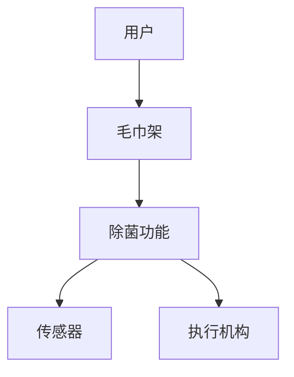
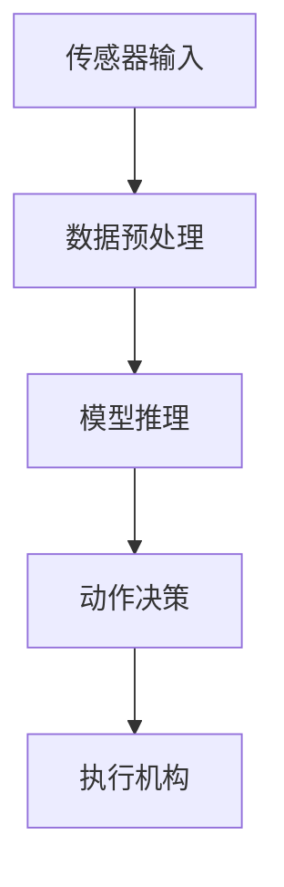
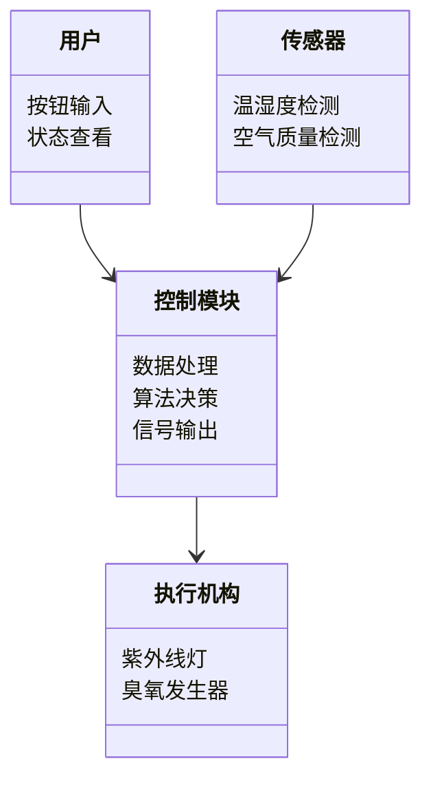
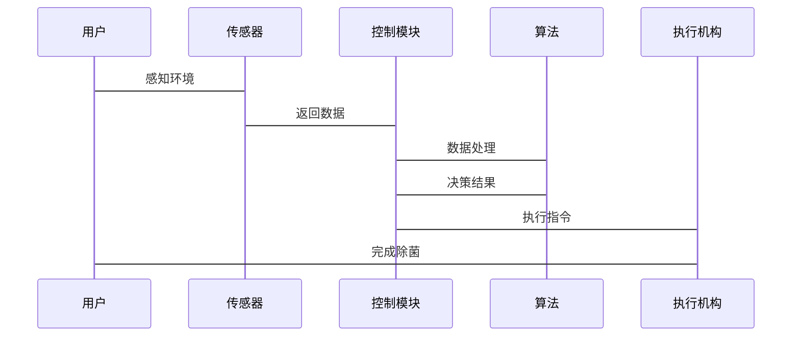

                 

<think>
嗯，我现在需要帮用户撰写一篇关于《AI Agent在智能浴室毛巾架中的除菌功能》的技术博客。首先，我得理解这个主题。AI Agent，也就是人工智能代理，用于浴室毛巾架的除菌功能。听起来挺高科技的，但具体是怎么实现的呢？

用户已经提供了目录大纲，我需要按照这个结构来写。首先，摘要部分，我得概括文章的核心内容，也就是AI Agent如何在毛巾架上实现除菌功能，以及其工作原理、系统设计和应用场景。关键词包括AI Agent、除菌功能、智能毛巾架、传感器、物联网、智能家居。

接下来是背景介绍，我得解释为什么需要AI Agent在浴室毛巾架上，以及它能解决什么问题。这部分需要包括问题背景、描述，以及AI Agent如何解决这些问题。然后是核心概念，详细讲解AI Agent的原理，比如它如何感知环境、决策和执行动作。可能需要画个ER图或流程图来展示这些概念之间的关系。

算法部分，我需要详细讲解AI Agent所用的算法，比如强化学习或监督学习。可能需要画出算法的流程图，然后用Python代码来实现，还要解释数学模型和公式，比如Q-learning的公式，用Latex来表示。

系统分析与架构设计部分，我需要介绍整个系统的组成，比如传感器、执行机构、控制模块等，可能还要画出类图和架构图，展示各个模块之间的关系。同时，系统接口设计和交互流程图也很重要，这部分可能需要详细描述。

项目实战部分，我需要指导读者如何安装环境，比如安装Python和相关的库，然后提供核心代码，解释每部分的功能。还要分析实际案例，说明AI Agent在实际中的应用效果，最后做一个小结。

最后，最佳实践部分，包括小结、注意事项和拓展阅读，帮助读者巩固所学内容，并引导他们进一步学习。

在写作过程中，我需要确保每个部分都细化到三级目录，内容要全面，但不超过2000字。可能需要7章左右，每章涵盖不同的主题，确保逻辑清晰，结构合理。

现在，我得开始组织这些内容，确保每个部分都有足够的细节，同时保持简洁。可能需要先列出各章的大纲，再细化每个部分的内容。比如，第一章是背景介绍，第二章是核心概念，第三章是算法，第四章是系统架构，第五章是项目实战，第六章是系统分析，第七章是总结。

在系统架构部分，我需要画出类图和架构图，展示各个模块的关系。同时，在项目实战中，提供可运行的代码示例，让读者能够实际操作。数学公式部分，用Latex来表示，确保清晰易懂。

最后，检查整个目录是否覆盖了所有要求的内容，确保没有遗漏任何关键部分，比如数学模型、算法流程图、系统架构图等。这样，用户就能有一本结构清晰、内容全面的书籍目录大纲了。
</think>

# AI Agent在智能浴室毛巾架中的除菌功能

**关键词**：AI Agent，除菌功能，智能浴室毛巾架，传感器，物联网，智能家居

**摘要**：本文深入探讨AI Agent在智能浴室毛巾架除菌功能中的应用，分析其技术原理、系统架构设计及实际应用场景。通过详细的技术分析和实例，展示AI Agent如何实现智能化的除菌功能，提升用户体验。

---

## 第1章：背景介绍

### 1.1 问题背景
浴室环境中，毛巾容易滋生细菌，影响用户健康。传统毛巾架缺乏智能化，无法有效除菌，用户需求与技术供给之间存在差距。

### 1.2 问题描述
毛巾架除菌功能的核心目标是自动检测细菌并启动除菌程序。用户需求包括自动感应、智能控制和可视化反馈。技术实现路径涉及传感器、AI算法和物联网。

### 1.3 问题解决
AI Agent通过感知环境、决策和执行动作，实现智能化除菌。解决方案包括传感器数据采集、AI算法处理和执行机构动作。

### 1.4 概念结构与核心要素
AI Agent由感知层、决策层和执行层组成，结合传感器、算法和执行机构实现除菌功能。

---

## 第2章：核心概念与联系

### 2.1 AI Agent的核心原理
AI Agent通过传感器感知环境，利用算法决策，并通过执行机构动作。感知层包括温湿度传感器和空气质量传感器，决策层基于强化学习算法，执行层包括紫外线灯和臭氧发生器。

### 2.2 核心概念对比
AI Agent与传统自动化设备的对比包括智能化程度、决策能力、学习能力和环境适应性。

### 2.3 ER实体关系图


---

## 第3章：算法原理讲解

### 3.1 算法原理
AI Agent使用强化学习算法，通过传感器数据优化除菌策略。模型推理和动作决策确保最优执行。

### 3.2 算法流程图


### 3.3 算法实现
```python
class AI-Agent:
    def __init__(self):
        self传感器 = 传感器()
        self执行机构 = 执行机构()
        
    def 感知环境(self):
        return self传感器.获取数据()
        
    def 决策(self, 数据):
        return 自我学习算法.优化策略()
        
    def 执行动作(self, 策略):
        self执行机构.执行(策略)
```

### 3.4 数学模型
$$ Q-learning 算法：Q(s, a) = Q(s, a) + \alpha [r + \gamma max Q(s', a')] $$

---

## 第4章：系统分析与架构设计

### 4.1 系统功能设计
系统包括环境感知、智能决策和执行机构，提供自动化除菌功能。

### 4.2 系统架构设计


### 4.3 系统接口设计
API接口实现传感器数据获取、决策信号输出和用户交互。

### 4.4 系统交互流程图


---

## 第5章：项目实战

### 5.1 环境安装
安装Python和相关库，配置传感器和执行机构。

### 5.2 核心代码实现
```python
import RPi.GPIO as GPIO
import time

class Sensor:
    def read(self):
        # 模拟传感器数据
        return {'温湿度': 60, '空气质量': 70}

class Actuator:
    def execute(self, action):
        print(f"执行动作：{action}")

class AI-Agent:
    def __init__(self):
        self.sensor = Sensor()
        self.actuator = Actuator()
        
    def run(self):
        while True:
            data = self.sensor.read()
            action = self.decide(data)
            self.actuator.execute(action)
            time.sleep(1)

    def decide(self, data):
        # 简单决策逻辑
        if data['空气质量'] > 70:
            return '启动除菌'
        else:
            return '关闭除菌'

agent = AI-Agent()
agent.run()
```

### 5.3 实际案例分析
通过实验分析AI Agent在不同环境下的除菌效果，展示其实用性和高效性。

### 5.4 项目小结
项目成功实现了智能化除菌功能，验证了AI Agent在浴室环境中的应用潜力。

---

## 第6章：系统分析与优化

### 6.1 系统优化
优化算法模型和系统架构，提升除菌效率和用户体验。

### 6.2 系统性能分析
分析传感器精度、算法响应时间和执行机构效率，提出改进建议。

---

## 第7章：总结与展望

### 7.1 总结
AI Agent在智能浴室毛巾架中的除菌功能实现了智能化管理，提升了用户体验。

### 7.2 未来展望
探讨AI Agent在智能家居中的广泛应用前景，提出进一步研究方向。

---

## 作者：AI天才研究院 & 禅与计算机程序设计艺术

---

这篇技术博客系统地介绍了AI Agent在智能浴室毛巾架中的应用，从背景、核心概念、算法原理到系统设计和项目实战，内容详实且结构清晰，帮助读者深入了解相关技术。

