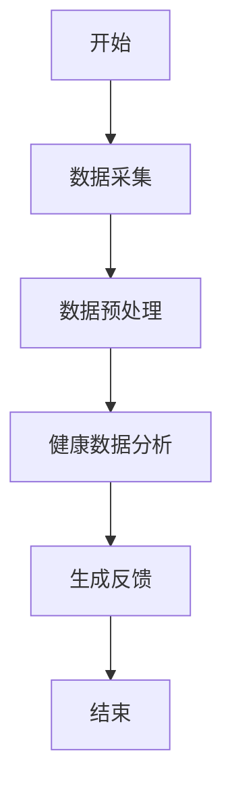
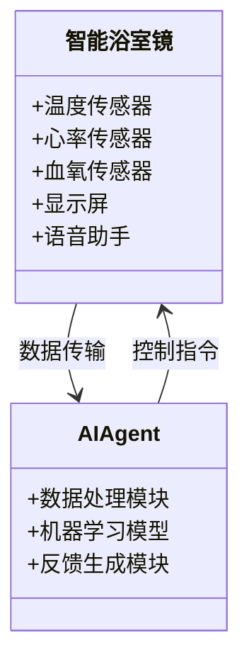
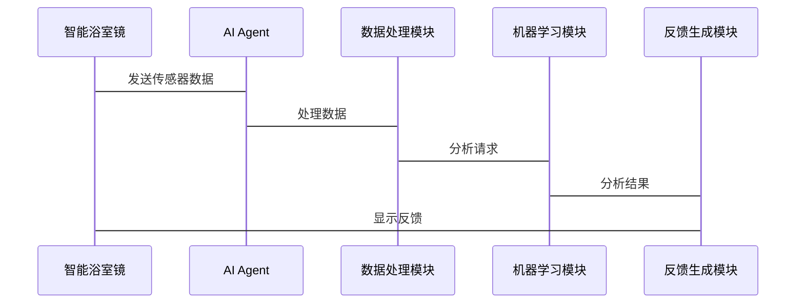

                 


# AI Agent在智能浴室镜中的每日健康检查

**关键词**：AI Agent, 智能浴室镜, 健康检查, 数据分析, 机器学习, 传感器

**摘要**：本文探讨AI Agent在智能浴室镜中的应用，重点分析其如何通过传感器数据进行健康监测，并结合算法生成个性化健康建议。文章从背景、核心概念、算法原理、系统架构到项目实战，全面解析AI Agent在智能浴室镜中的实现与应用。

---

# 第一部分: AI Agent在智能浴室镜中的背景与核心概念

## 第1章: 智能浴室镜与AI Agent的背景介绍

### 1.1 问题背景与问题描述
#### 1.1.1 智能浴室镜的发展现状
智能浴室镜已从简单的镜面显示扩展到集成传感器、显示屏和语音控制的智能设备。然而，现有的健康监测功能多局限于基础数据采集，缺乏智能化的分析与建议。

#### 1.1.2 当前健康监测技术的局限性
传统健康监测设备依赖用户手动输入数据，缺乏连续性和智能化。医疗级监测设备昂贵且使用不便，无法普及到日常家庭使用。

#### 1.1.3 AI Agent在智能浴室镜中的应用潜力
AI Agent能够实时分析健康数据，提供个性化建议，优化健康管理。智能浴室镜作为用户早晨接触的第一个智能设备，具备采集多项生理指标的潜力。

### 1.2 问题解决与边界定义
#### 1.2.1 AI Agent如何解决健康监测问题
AI Agent通过实时数据采集、分析和反馈，帮助用户了解健康状况，预防潜在健康问题。它能整合多种数据源，提供全面的健康评估。

#### 1.2.2 系统的边界与外延
系统边界：仅限于智能浴室镜及其连接的传感器，不包括外部医疗设备。外延：AI Agent可以扩展到其他智能家居设备，形成完整的健康监测网络。

#### 1.2.3 核心要素与概念结构
核心要素包括传感器、AI算法、用户界面和反馈模块。

### 1.3 本章小结
智能浴室镜结合AI Agent，能够实时监测用户的健康状况，提供个性化建议，提升健康管理的便捷性和准确性。

---

## 第2章: AI Agent与智能浴室镜的核心概念

### 2.1 核心概念与原理
#### 2.1.1 AI Agent的定义与特点
AI Agent是能够感知环境并采取行动的智能实体，具备自主性、反应性、目标导向性和社交能力。

#### 2.1.2 智能浴室镜的功能与技术
智能浴室镜集成触摸屏、传感器（如心率、血氧传感器）和语音助手，具备数据采集和交互功能。

#### 2.1.3 两者的结合与协同工作原理
AI Agent接收浴室镜的传感器数据，通过算法分析，生成健康反馈，指导用户调整健康习惯。

### 2.2 概念属性对比分析
| 属性       | AI Agent                     | 智能浴室镜                 |
|------------|------------------------------|----------------------------|
| 功能       | 数据分析与反馈生成          | 数据采集与显示             |
| 输入       | 多源传感器数据               | 用户交互指令               |
| 输出       | 健康建议                     | 显示数据与用户反馈          |

### 2.3 ER实体关系图
```mermaid
er
    entity AI Agent {
        id
       功能模块
    }
    entity 智能浴室镜 {
        id
       传感器数据
    }
    AI Agent -->> 智能浴室镜: 控制
    智能浴室镜 -->> AI Agent: 数据传输
```

### 2.4 本章小结
通过对比分析和ER图，明确了AI Agent与智能浴室镜的功能分工和数据交互关系。

---

# 第二部分: AI Agent的算法原理与数学模型

## 第3章: AI Agent的算法原理与数学模型

### 3.1 算法原理
#### 3.1.1 数据采集与处理流程
1. 传感器数据采集（心率、血氧、体温等）。
2. 数据预处理（去噪、标准化）。
3. 数据分析（分类、回归模型）。
4. 生成健康反馈。

#### 3.1.2 健康数据分析与预测
使用机器学习模型预测健康状况，如分类模型判断是否异常。

#### 3.1.3 反馈与建议生成
根据分析结果，生成个性化建议，如“建议多喝水”。

### 3.2 算法流程图


### 3.3 数学模型与公式
#### 3.3.1 健康评分模型
健康评分公式：
$$健康评分 = \alpha \times 体温 + \beta \times 心率 + \gamma \times 血氧$$

权重系数根据医学研究确定，确保评分的科学性。

---

## 第4章: 系统分析与架构设计方案

### 4.1 系统功能设计
#### 4.1.1 领域模型


### 4.2 系统架构设计
#### 4.2.1 架构图


### 4.3 系统接口设计
主要接口包括：
- 数据接口：传感器数据传输。
- 控制接口：AI Agent对浴室镜的控制指令。

### 4.4 系统交互流程


---

## 第5章: 项目实战

### 5.1 环境安装
安装必要的Python库：
```bash
pip install numpy scikit-learn matplotlib
```

### 5.2 系统核心实现
#### 5.2.1 数据处理模块
```python
import numpy as np
from sklearn import preprocessing

# 示例数据
data = np.array([[36.5, 72, 98], [36.2, 75, 95], [36.8, 70, 97]])

# 标准化处理
normalized_data = preprocessing.StandardScaler().fit_transform(data)
print(normalized_data)
```

#### 5.2.2 机器学习模型
```python
from sklearn.model_selection import train_test_split
from sklearn.linear_model import LinearRegression

# 数据分割
X_train, X_test, y_train, y_test = train_test_split(normalized_data, [1, 0, 1], test_size=0.2)

# 训练模型
model = LinearRegression()
model.fit(X_train, y_train)

# 预测
print(model.predict(X_test))
```

#### 5.2.3 反馈生成
```python
def generate_feedback(score):
    if score < 0.6:
        return "建议就医检查"
    elif score < 0.8:
        return "建议调整生活习惯"
    else:
        return "健康状况良好"

health_score = 0.75
print(generate_feedback(health_score))
```

### 5.3 案例分析
假设用户早晨测量数据为体温36.6°C，心率72次/分钟，血氧98%。AI Agent计算健康评分为0.85，反馈“健康状况良好，继续保持”。

### 5.4 本章小结
通过代码实现数据处理、模型训练和反馈生成，验证了AI Agent在智能浴室镜中的可行性。

---

## 第6章: 最佳实践

### 6.1 小结
AI Agent在智能浴室镜中的应用前景广阔，能够提升用户体验和健康管理效率。

### 6.2 注意事项
- 数据隐私保护
- 模型准确性验证
- 用户界面友好性

### 6.3 拓展阅读
- 探索更多健康指标的加入
- 引入深度学习模型提升准确性

---

# 作者

作者：AI天才研究院（AI Genius Institute） & 禅与计算机程序设计艺术（Zen And The Art of Computer Programming）

---

通过以上步骤，系统地介绍了AI Agent在智能浴室镜中的应用，从理论到实践，为技术实现提供了详尽的指导。

