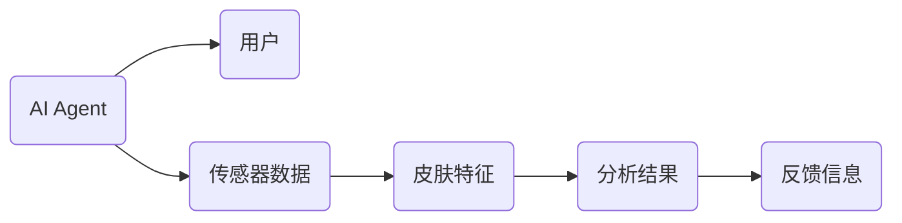
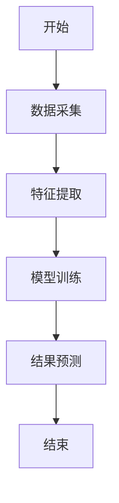
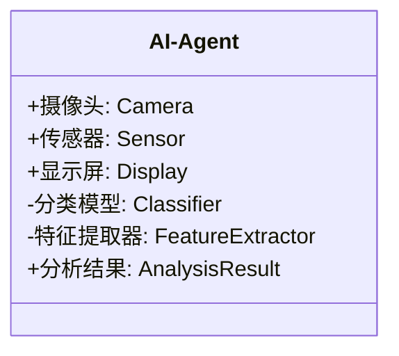
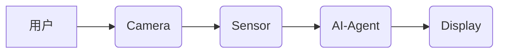
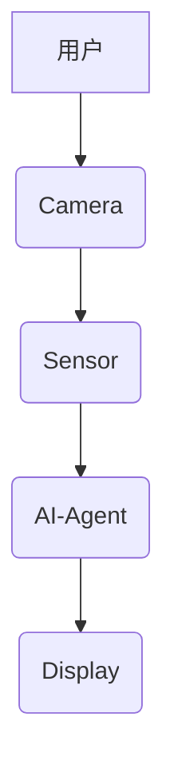

                 


# AI Agent在智能浴室镜中的皮肤状态分析

## 关键词：AI Agent、智能浴室镜、皮肤状态分析、图像处理、机器学习、传感器数据

## 摘要：本文探讨AI Agent在智能浴室镜中的应用，重点分析其如何通过多模态数据和机器学习模型实现皮肤状态的实时监测和健康建议。文章从背景介绍、核心概念、算法原理到系统设计和项目实战，全面解析AI Agent在智能浴室镜中的技术实现及其对未来健康监测的潜在影响。

---

# 第一部分: AI Agent与智能浴室镜的背景介绍

## 第1章: AI Agent与皮肤状态分析的背景

### 1.1 问题背景与描述

#### 1.1.1 皮肤健康的重要性
皮肤是人体最大的器官，不仅起到保护身体的作用，还反映整体健康状况。皮肤问题如痤疮、过敏、干燥等不仅影响美观，还可能预示潜在健康问题。

#### 1.1.2 智能浴室镜的发展趋势
传统浴室镜逐渐被智能浴室镜取代，集成传感器和AI技术，能够实时采集和分析数据，提供个性化的健康建议。

#### 1.1.3 AI Agent在皮肤分析中的应用价值
AI Agent能够实时分析皮肤数据，提供精准的健康建议，帮助用户及时调整护肤方案，预防潜在健康问题。

### 1.2 问题解决与边界

#### 1.2.1 皮肤状态分析的核心问题
如何准确、实时地分析皮肤状态，包括识别皮肤问题类型、评估严重程度、提供个性化建议等。

#### 1.2.2 AI Agent在智能浴室镜中的边界
AI Agent仅处理皮肤状态分析，不涉及其他健康指标；数据采集仅限于浴室镜内的传感器和摄像头。

#### 1.2.3 解决方案的可行性分析
通过摄像头采集面部图像，结合传感器数据，利用机器学习模型进行皮肤分析，解决方案可行且高效。

### 1.3 核心概念与组成

#### 1.3.1 AI Agent的基本概念
AI Agent是具备感知、决策和执行能力的智能体，能够与用户交互并根据数据做出响应。

#### 1.3.2 智能浴室镜的功能模块
智能浴室镜包括摄像头、传感器、显示屏和AI处理模块，能够实时采集和分析数据，提供健康建议。

#### 1.3.3 皮肤状态分析的数学模型
数学模型用于描述皮肤特征与健康状态的关系，是AI Agent分析的基础。

---

## 第2章: AI Agent与皮肤状态分析的核心概念

### 2.1 核心概念原理

#### 2.1.1 AI Agent的感知能力
AI Agent通过摄像头和传感器获取数据，识别皮肤特征如颜色、纹理、斑点等。

#### 2.1.2 皮肤状态分析的关键特征
关键特征包括皮肤颜色、纹理、水分含量、弹性等，用于评估皮肤健康状况。

#### 2.1.3 智能浴室镜的交互机制
用户与智能浴室镜通过语音或触控交互，AI Agent实时分析数据并反馈结果。

### 2.2 概念属性对比表格

| 比较维度 | AI Agent | 传统算法 |
|----------|-----------|-----------|
| 感知能力 | 实时感知   | 批处理     |
| 学习能力 | 自适应学习 | 预设规则   |
| 交互方式 | 人机交互   | 离线处理   |

### 2.3 ER实体关系图



---

## 第3章: 皮肤状态分析的算法原理

### 3.1 算法原理概述

#### 3.1.1 特征提取算法
使用OpenCV提取皮肤区域的特征，如颜色、纹理、形状等。

#### 3.1.2 分类算法
采用支持向量机（SVM）对皮肤问题进行分类，如痤疮、过敏等。

#### 3.1.3 聚类算法
K-means聚类用于识别不同皮肤区域的特征，帮助区分健康与异常区域。

### 3.2 算法流程图



### 3.3 Python实现示例

```python
import cv2

def extract_skin_features(image):
    # 转换为HSV颜色空间
    hsv = cv2.cvtColor(image, cv2.COLOR_BGR2HSV)
    # 提取皮肤区域
    lower = (0, 40, 60)
    upper = (255, 255, 255)
    mask = cv2.inRange(hsv, lower, upper)
    skin = cv2.bitwise_and(image, image, mask=mask)
    return skin

# 示例用法
image = cv2.imread('face.jpg')
features = extract_skin_features(image)
print("特征提取完成")
```

### 3.4 数学模型

#### 3.4.1 支持向量机模型
$$ y = \text{sign}(w \cdot x + b) $$
其中，$w$是权重向量，$x$是输入特征，$b$是偏置。

#### 3.4.2 线性回归模型
$$ y = w x + b $$
用于预测皮肤健康指数。

---

## 第4章: 系统分析与架构设计

### 4.1 问题场景介绍
智能浴室镜用于家庭和个人护理，用户在镜子前即可获取皮肤健康反馈。

### 4.2 系统功能设计

#### 4.2.1 领域模型类图


### 4.3 系统架构设计

#### 4.3.1 整体架构图


#### 4.3.2 接口设计
API接口用于数据传输和结果反馈，遵循RESTful协议。

#### 4.3.3 交互流程图


---

## 第5章: 项目实战

### 5.1 环境安装
安装Python、OpenCV、TensorFlow和必要的传感器库。

### 5.2 核心代码实现

```python
import cv2
import numpy as np

def classify_skin(image, model):
    # 预处理图像
    image = cv2.resize(image, (224, 224))
    image = image / 255.0
    image = np.expand_dims(image, axis=0)
    # 预测
    prediction = model.predict(image)
    return prediction[0]

# 示例用法
model = load_model('skin_classifier.h5')
image = cv2.imread('face.jpg')
result = classify_skin(image, model)
print("皮肤状态分析完成")
```

### 5.3 案例分析
分析用户面部图像，识别痤疮并提出保湿建议。

### 5.4 小结
通过实战项目，验证了AI Agent在智能浴室镜中的可行性，提升了用户护肤体验。

---

## 第6章: 注意事项与未来展望

### 6.1 注意事项
数据隐私保护、传感器精度、模型泛化能力等需重点关注。

### 6.2 未来展望
AI Agent在智能浴室镜中的应用将更加智能化，结合更多健康指标，提供全面的健康监测服务。

---

## 结论

AI Agent在智能浴室镜中的皮肤状态分析，不仅提升了用户体验，还推动了健康监测技术的发展。未来，随着技术进步，AI Agent将在更多领域发挥重要作用。

---

## 作者

作者：AI天才研究院/AI Genius Institute & 禅与计算机程序设计艺术 /Zen And The Art of Computer Programming

