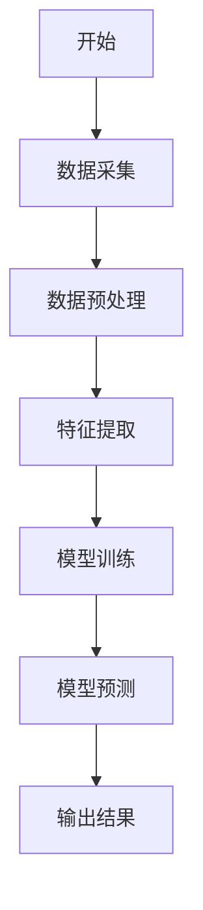

                 


# AI Agent在智能浴室镜中的肤质分析

> 关键词：AI Agent, 肤质分析, 智能浴室镜, 计算机视觉, 机器学习, 图像处理, 智能设备

> 摘要：本文详细探讨了AI Agent在智能浴室镜中的应用，特别是其如何通过计算机视觉和机器学习技术实现肤质分析。文章从背景介绍、核心概念、算法原理、系统架构到项目实战，全面分析了AI Agent在智能浴室镜中的工作原理和实际应用，为读者提供了从理论到实践的详细指南。

---

## 第一部分: AI Agent与肤质分析的背景介绍

### 第1章: AI Agent与肤质分析的背景

#### 1.1 AI Agent的基本概念
- **1.1.1 什么是AI Agent**
  AI Agent（人工智能代理）是一种能够感知环境、自主决策并执行任务的智能实体。它能够通过传感器获取信息，利用算法进行分析，并通过执行器完成操作。
  
- **1.1.2 AI Agent的核心特征**
  - 感知能力：通过摄像头、麦克风等传感器获取数据。
  - 决策能力：基于获取的数据进行分析和推理，做出最优决策。
  - 执行能力：通过执行器（如显示屏、扬声器）输出结果或采取行动。

- **1.1.3 AI Agent的分类与应用场景**
  - 分类：根据智能水平可分为简单反射型、基于模型的反应型、目标驱动型和实用驱动型。
  - 应用场景：广泛应用于自动驾驶、智能助手、智能安防等领域。

#### 1.2 肤质分析的背景与意义
- **1.2.1 肤质分析的基本概念**
  肤质分析是通过技术手段对皮肤的状态进行评估，包括皮肤的健康状况、颜色、纹理、水分含量等。

- **1.2.2 肤质分析的常见方法**
  - 基于图像处理的方法：通过计算机视觉技术对皮肤图像进行分析。
  - 基于传感器的方法：使用光学传感器测量皮肤的生理指标。

- **1.2.3 肤质分析在智能浴室镜中的应用价值**
  智能浴室镜通过AI Agent实现肤质分析，能够为用户提供个性化的护肤建议，优化用户的护肤体验。

### 第2章: AI Agent在智能浴室镜中的应用

#### 2.1 智能浴室镜的功能与特点
- **2.1.1 智能浴室镜的功能模块**
  - 显示屏：用于显示天气、时间、护肤建议等信息。
  - 照明系统：提供柔和的光线，便于用户化妆和护肤。
  - 传感器：检测环境光线、温度、湿度等信息。

- **2.1.2 智能浴室镜的技术基础**
  - 计算机视觉：用于图像处理和人脸识别。
  - 机器学习：用于模式识别和数据预测。

- **2.1.3 智能浴室镜的用户需求**
  - 个性化护肤建议。
  - 实时肤质反馈。
  - 多功能集成：结合镜子功能与智能设备功能。

#### 2.2 AI Agent在智能浴室镜中的作用
- **2.2.1 AI Agent如何实现肤质分析**
  - 数据采集：通过摄像头捕捉用户的面部图像。
  - 数据处理：利用图像处理算法提取皮肤特征。
  - 数据分析：基于机器学习模型对皮肤状态进行分类和评估。

- **2.2.2 AI Agent与其他智能设备的协同工作**
  - 与智能灯具联动：根据肤质分析结果调整光线亮度和色温。
  - 与智能 skincare 设备联动：根据分析结果推荐护肤品或美容仪器使用。

- **2.2.3 AI Agent在智能浴室镜中的未来发展趋势**
  - 更高精度的分析能力。
  - 更强的个性化推荐能力。
  - 更自然的用户交互体验。

---

## 第二部分: AI Agent与肤质分析的核心概念与联系

### 第3章: AI Agent的核心原理

#### 3.1 AI Agent的感知与决策机制
- **3.1.1 感知层: 数据采集与处理**
  - 数据采集：通过摄像头、麦克风等传感器获取环境数据。
  - 数据处理：对采集到的数据进行预处理，提取特征。

- **3.1.2 决策层: 算法与模型**
  - 算法选择：根据任务需求选择合适的算法，如支持向量机（SVM）、随机森林（Random Forest）等。
  - 模型训练：通过大量数据训练模型，使其能够准确分类或预测。

- **3.1.3 执行层: 输出与反馈**
  - 输出结果：通过显示屏、扬声器等方式反馈结果。
  - 反馈机制：根据用户反馈调整模型参数，优化性能。

#### 3.2 AI Agent的算法与模型
- **3.2.1 常见的AI Agent算法**
  - 基于规则的算法：适用于简单的决策任务。
  - 基于学习的算法：通过数据训练模型，适用于复杂的决策任务。

- **3.2.2 深度学习模型在AI Agent中的应用**
  - 卷积神经网络（CNN）：用于图像识别和分类。
  - 循环神经网络（RNN）：用于时间序列数据的处理。

- **3.2.3 算法的优缺点对比**
  - 基于规则的算法：简单易懂，但缺乏灵活性。
  - 基于学习的算法：复杂度高，但适应性强。

### 第4章: 肤质分析的核心原理

#### 4.1 肤质分析的主要指标
- **4.1.1 皮肤颜色与亮度**
  - 通过图像处理技术提取皮肤区域的RGB值，计算亮度和色度。

- **4.1.2 皮肤纹理与毛孔**
  - 通过图像处理技术检测皮肤纹理，评估毛孔大小和分布。

- **4.1.3 皮肤水分与油分**
  - 使用光学传感器测量皮肤的水分和油分含量。

#### 4.2 肤质分析的实现步骤
- **4.2.1 数据采集**
  - 使用摄像头拍摄面部图像。
  - 使用传感器采集皮肤的生理指标。

- **4.2.2 数据预处理**
  - 图像增强：调整光线、对比度等。
  - 去噪处理：去除图像中的噪声。

- **4.2.3 特征提取**
  - 提取皮肤区域的RGB值。
  - 提取皮肤纹理特征，如边缘检测、纹理分析。

- **4.2.4 分类与评估**
  - 使用机器学习模型对皮肤状态进行分类。
  - 根据分类结果生成护肤建议。

---

## 第三部分: 算法原理讲解

### 第5章: AI Agent的算法实现

#### 5.1 AI Agent的算法流程


#### 5.2 算法实现代码
```python
import cv2
import numpy as np

def preprocess_image(image):
    # 调整图像亮度和对比度
    adjusted_image = cv2.cvtColor(image, cv2.COLOR_BGR2RGB)
    adjusted_image = cv2.addWeighted(adjusted_image, 1.2, np.zeros(adjusted_image.shape, np.uint8), 0, 0)
    return adjusted_image

def extract_features(image):
    # 检测图像中的边缘
    edges = cv2.Canny(image, 100, 200)
    return edges

# 示例图像处理
image = cv2.imread('face.jpg')
preprocessed_image = preprocess_image(image)
features = extract_features(preprocessed_image)
cv2.imwrite('features.jpg', features)
```

#### 5.3 算法的数学模型
- **5.3.1 逻辑回归模型**
  $$ P(y=1|x) = \frac{1}{1 + e^{-\beta x}} $$
  其中，$\beta$ 是模型参数，$x$ 是输入特征。

- **5.3.2 支持向量机模型**
  $$ \text{目标函数} = \sum_{i=1}^n \lambda_i y_i (w \cdot x_i + b) + \frac{1}{2} ||w||^2 $$
  其中，$\lambda_i$ 是拉格朗日乘子，$y_i$ 是标签，$w$ 是权重向量，$b$ 是偏置项。

---

## 第四部分: 系统分析与架构设计方案

### 第6章: 问题场景介绍

#### 6.1 问题描述
- **目标**：实现AI Agent在智能浴室镜中的肤质分析功能。
- **需求**：用户希望智能浴室镜能够实时分析肤质，并提供个性化的护肤建议。

#### 6.2 系统功能设计
- **领域模型**：
  ```mermaid
  classDiagram
      class User {
          id
          name
          }
      class SkinAnalyzer {
          analyze(skin_image)
          }
      class Display {
          show_result(result)
          }
      User --> SkinAnalyzer: 提供皮肤图像
      SkinAnalyzer --> Display: 返回分析结果
  ```

- **系统架构**：
  ```mermaid
  architecture
      Client --> Server: 发送皮肤图像
      Server --> Database: 查询用户历史数据
      Server --> Model: 调用机器学习模型进行分析
      Server --> Client: 返回分析结果
  ```

---

## 第五部分: 项目实战

### 第7章: 项目环境安装与实现

#### 7.1 环境安装
- **Python版本**：建议使用Python 3.8或以上。
- **依赖库安装**：
  ```bash
  pip install numpy
  pip install opencv-python
  pip install scikit-learn
  ```

#### 7.2 核心代码实现
```python
from sklearn.svm import SVC
from sklearn.preprocessing import StandardScaler

# 数据预处理
def preprocess_data(X):
    scaler = StandardScaler()
    return scaler.fit_transform(X)

# 模型训练
def train_model(X_train, y_train):
    model = SVC(C=1.0, gamma='auto')
    model.fit(X_train, y_train)
    return model

# 预测与评估
def evaluate_model(model, X_test, y_test):
    accuracy = model.score(X_test, y_test)
    return accuracy
```

#### 7.3 代码应用解读
- **数据预处理**：使用标准化方法对数据进行预处理，确保模型输入一致。
- **模型训练**：使用支持向量机（SVM）进行分类模型的训练。
- **预测与评估**：对测试数据进行预测，并计算模型的准确率。

---

## 第六部分: 最佳实践

### 第8章: 小结与注意事项

#### 8.1 项目小结
- 通过AI Agent实现了智能浴室镜的肤质分析功能。
- 结合了计算机视觉和机器学习技术，提供了个性化的护肤建议。

#### 8.2 注意事项
- 数据隐私问题：确保用户数据的安全性和隐私性。
- 算法优化：持续优化模型，提高分析的准确性和响应速度。

#### 8.3 拓展阅读
- 推荐阅读《机器学习实战》和《深度学习入门：基于Python》。

---

## 作者：AI天才研究院 & 禅与计算机程序设计艺术

---

以上是关于《AI Agent在智能浴室镜中的肤质分析》的技术博客文章的完整撰写。

