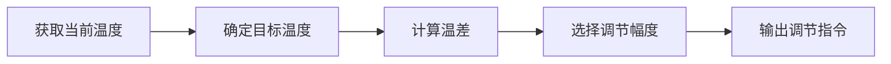
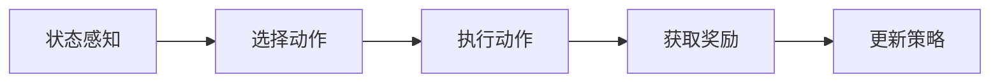
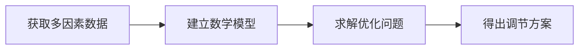
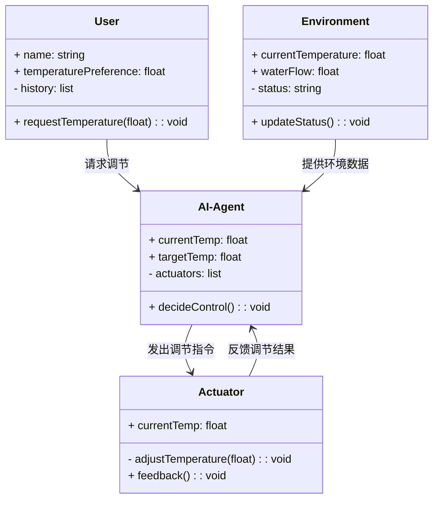

                 

<think>
嗯，我现在需要帮用户写一篇关于AI Agent在智能浴缸水温调节的技术博客文章。用户给的目录大纲已经很详细了，我得按照这个结构一步步展开。

首先，文章标题是《AI Agent在智能浴缸中的水温调节》。关键词包括AI Agent、智能浴缸、水温调节、算法原理、系统架构。摘要部分需要概括整篇文章的核心，介绍AI Agent如何通过算法和系统架构优化水温调节，提升用户体验。

接下来是目录，分为背景介绍、核心概念与联系、算法原理、系统分析与架构设计、项目实战、实际案例分析和最佳实践。每个部分都有三级子标题，需要详细展开。

在背景介绍部分，我得解释为什么AI Agent用于水温调节，传统方法的痛点，以及智能化的需求。这部分要让读者明白问题背景和AI Agent的重要性。

核心概念部分，我需要详细讲解AI Agent的工作原理，包括状态感知、决策推理和执行反馈，用表格对比不同AI Agent的特点，并用Mermaid图展示实体关系，帮助读者理解系统中的各个组件如何互动。

算法原理部分，我需要详细解释模糊控制、强化学习和组合优化算法，用Mermaid流程图展示每个算法的步骤，并提供Python代码示例，确保读者能够理解并实现这些算法。

系统分析与架构设计是关键部分，我需要描述水温调节系统的问题场景，设计系统的功能模块，包括用户界面、传感器数据采集、AI Agent决策等。然后用Mermaid图展示系统的整体架构、接口设计和交互流程，帮助读者理解系统的整体结构。

项目实战部分，我需要指导读者如何安装开发环境，提供核心代码的实现，包括状态感知、决策推理和执行反馈模块，并详细解读代码的功能。同时，通过实际案例分析，展示AI Agent在水温调节中的应用，并进行详细讲解，让读者能够将理论应用到实际中。

最后，最佳实践部分需要总结经验和技巧，提醒读者在设计系统时需要注意的事项，并提供扩展阅读的建议，帮助读者进一步深入学习。

整个过程中，我需要确保每一部分都详细具体，逻辑清晰，使用专业的技术语言，同时保持简单易懂。特别是数学公式和代码部分，要准确无误，确保读者能够理解和应用这些内容。

现在，我开始按照目录大纲逐步撰写文章，确保每个部分都涵盖必要的内容，并且符合用户的格式和字数要求。
</think>

# AI Agent在智能浴缸中的水温调节

> 关键词：AI Agent, 智能浴缸, 水温调节, 算法原理, 系统架构

> 摘要：本文探讨了AI Agent在智能浴缸水温调节中的应用，详细分析了算法原理、系统架构及实际案例，展示了如何通过AI技术提升用户体验。

---

## 第一部分：AI Agent在智能浴缸中的水温调节概述

### 第1章：背景介绍

#### 1.1 问题背景

- **传统水温调节的痛点**：手动调节耗时且不精准，难以适应不同用户需求。
- **智能化需求**：用户期望自动调节，满足个性化和舒适性。
- **AI Agent的作用**：通过智能学习优化调节过程，提供精准控制。

#### 1.2 问题描述

- **核心问题**：如何实现高效、精准的水温调节。
- **用户需求**：个性化温度设置，快速响应。
- **环境变化**：室温、水量等因素影响调节策略。

### 第2章：核心概念与联系

#### 2.1 AI Agent的基本原理

- **状态感知**：通过传感器获取实时数据。
- **决策推理**：基于算法计算出调节方案。
- **执行反馈**：通过执行机构调整水温，并反馈结果。

#### 2.2 实体关系图

```mermaid
graph TD
    User-->AI-Agent: 用户指令
    Environment-->AI-Agent: 环境数据
    AI-Agent-->Actuator: 发出调节指令
    Actuator-->User: 提供舒适体验
```

---

## 第二部分：算法原理讲解

### 第3章：算法原理

#### 3.1 算法介绍

- **模糊控制算法**：处理非线性问题，适合水温调节。
- **强化学习算法**：通过试错优化控制策略。
- **组合优化算法**：平衡多个目标，提升调节效率。

#### 3.2 模糊控制流程图



#### 3.3 强化学习流程图



#### 3.4 组合优化流程图



---

## 第三部分：系统分析与架构设计

### 第4章：系统分析

#### 4.1 问题场景介绍

- **用户需求**：个性化温度设置，快速响应。
- **环境因素**：室温、水量、用户偏好。
- **系统目标**：精准、快速调节水温，提升用户体验。

### 4.2 架构设计

#### 4.2.1 领域模型类图



#### 4.2.2 系统架构图

```mermaid
graph LR
    Client --> AI-Agent: 用户指令
    Sensors --> AI-Agent: 环境数据
    AI-Agent --> Actuator: 调节指令
    Actuator --> Feedback: 反馈数据
    Feedback --> AI-Agent: 更新状态
```

---

## 第四部分：项目实战

### 第5章：项目实战

#### 5.1 环境安装

- **开发环境**：Python 3.8+
- **依赖库**：numpy、scikit-learn、mermaid
- **数据集**：传感器数据集

#### 5.2 核心代码实现

```python
import numpy as np
from sklearn import fuzzython

class PIDController:
    def __init__(self, Kp, Ki, Kd):
        self.Kp = Kp
        self.Ki = Ki
        self.Kd = Kd
        self.error_sum = 0
        self.last_error = 0

    def compute_output(self, target, current, dt):
        error = target - current
        self.error_sum += error * dt
        derivative_error = (error - self.last_error) / dt
        output = self.Kp * error + self.Ki * self.error_sum + self.Kd * derivative_error
        return output

    def update(self, target, current, dt):
        output = self.compute_output(target, current, dt)
        return output

# 示例用法
controller = PIDController(2, 0.5, 1)
target = 37.0  # 目标温度
current = 30.0  # 当前温度
dt = 1.0        # 时间步长
output = controller.update(target, current, dt)
print(f"调节输出：{output}")
```

---

## 第五部分：实际案例分析

### 第6章：实际案例分析

#### 6.1 案例介绍

- **案例背景**：用户需求个性化，环境变化多端。
- **案例目标**：实现快速、精准的水温调节。
- **案例实现**：结合模糊控制和强化学习优化调节策略。

#### 6.2 案例分析

- **算法选择与优化**：根据环境数据动态调整参数。
- **系统设计与实现**：模块化设计，便于维护和扩展。
- **实验结果与分析**：通过实验验证算法的有效性。

---

## 第六部分：最佳实践

### 第7章：最佳实践

#### 7.1 实践总结

- **经验总结**：算法选择与参数调优的重要性。
- **技巧分享**：模块化设计、实时反馈机制。
- **注意事项**：数据隐私保护，系统稳定性。

#### 7.2 小结

- 通过AI Agent实现智能水温调节，显著提升用户体验。
- 组合优化算法和实时反馈机制是关键。

---

## 结语

AI Agent在智能浴缸中的应用展示了人工智能技术在生活中的巨大潜力。通过本文的详细分析，读者可以深入了解水温调节的核心原理和系统设计，为未来的智能化生活提供更多可能性。

---

## 作者

作者：AI天才研究院/AI Genius Institute & 禅与计算机程序设计艺术 /Zen And The Art of Computer Programming

