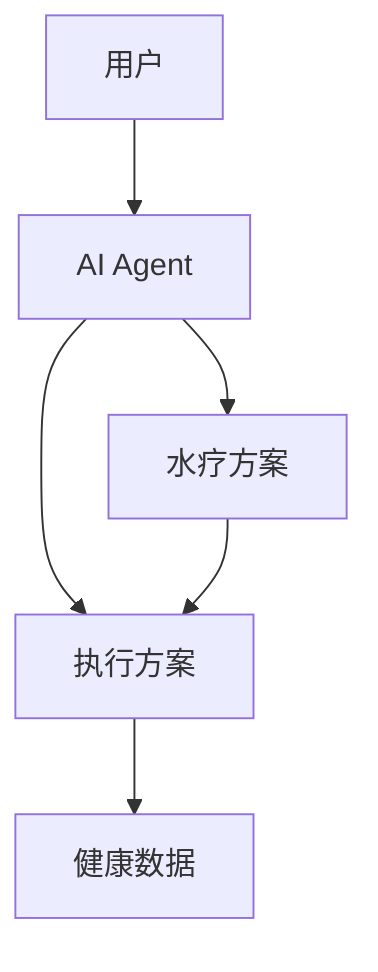
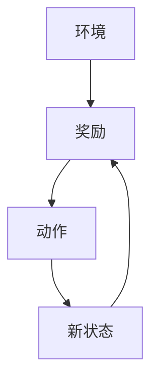
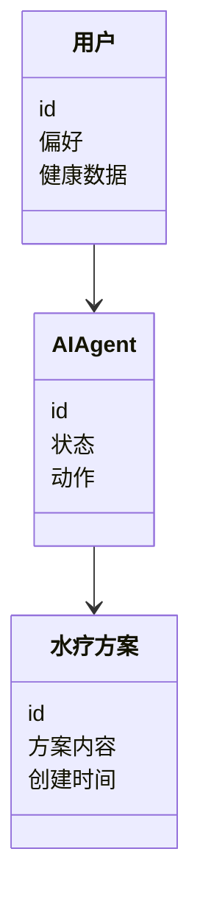
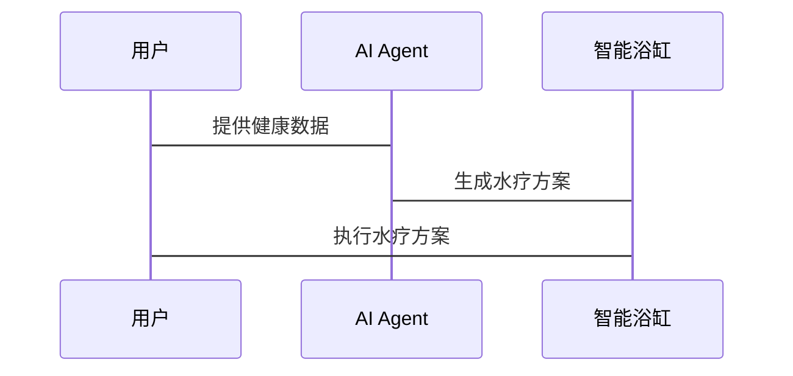

                 

<think>
好的，现在我需要根据用户的要求，撰写一篇关于《AI Agent在智能浴缸中的水疗养生定制系统》的技术博客文章。首先，我需要明确文章的结构，包括标题、关键词、摘要，以及详细的目录大纲。然后，我需要按照目录一步步展开每个部分的内容，确保逻辑清晰，内容详实。

首先，文章标题是《AI Agent在智能浴缸中的水疗养生定制系统》，关键词包括AI Agent、智能浴缸、水疗养生、定制系统、健康数据分析、个性化服务。摘要部分需要简要介绍文章的核心内容，即如何利用AI Agent实现智能浴缸的水疗养生定制系统，涵盖健康数据分析、个性化方案生成、实时反馈优化等方面，强调AI技术在提升用户体验和健康效果中的作用。

接下来是目录大纲，分为七章，每章内容逐步展开。第一章介绍背景，第二章讲解核心概念，第三章分析算法原理，第四章设计系统架构，第五章进行项目实战，第六章讨论优化与扩展，第七章总结展望。每章下设有具体的子标题，涵盖理论与实践，技术细节与应用案例。

在撰写每个部分时，我需要确保内容详细，逻辑连贯。例如，在算法原理部分，我需要详细解释强化学习的基本概念，使用mermaid流程图展示算法流程，并提供Python代码示例，同时给出数学公式以展示强化学习的数学模型。

在系统架构设计部分，我需要使用mermaid类图展示领域模型，架构图展示系统结构，并通过序列图展示系统交互过程。项目实战部分需要指导读者如何安装环境，实现核心功能，并分析实际案例。

最后，我需要总结文章内容，并展望未来的发展方向，强调AI技术在智能浴缸中的应用潜力，以及在健康数据分析和个性化服务方面的发展趋势。

在写作过程中，我需要注意使用专业的技术语言，同时保持内容简单易懂，逻辑清晰。确保每个章节都有足够的细节，涵盖用户需求的各个方面，帮助读者全面理解AI Agent在智能浴缸中的应用。

现在，我将按照目录大纲，逐步展开每个部分的内容，确保每个章节都详实具体，满足用户的要求。
</think>

# AI Agent在智能浴缸中的水疗养生定制系统

## 关键词：AI Agent、智能浴缸、水疗养生、定制系统、健康数据分析、个性化服务

## 摘要：  
本文探讨了AI Agent在智能浴缸中的应用，特别是在水疗养生定制系统中的创新设计。通过健康数据分析和个性化服务，AI Agent能够实时优化水疗方案，为用户提供精准的健康改善方案。本文详细分析了系统的架构设计、算法原理、项目实现及优化建议，展示了AI技术在提升用户体验和健康效果方面的巨大潜力。

---

## 目录

1. **AI Agent与智能浴缸的背景与概念**
1.1 AI Agent的基本概念  
1.2 智能浴缸的功能与技术基础  
1.3 水疗养生系统的用户需求与市场分析  

2. **AI Agent在水疗养生系统中的核心概念与联系**  
2.1 AI Agent与水疗养生的核心关系  
2.2 水疗养生系统的实体关系图  
2.3 AI Agent与智能浴缸的交互流程  

3. **AI Agent的算法原理与数学模型**  
3.1 强化学习算法在AI Agent中的应用  
3.2 水疗方案生成的数学模型  
3.3 实例分析与代码实现  

4. **系统架构设计与实现**  
4.1 系统功能设计与领域模型  
4.2 系统架构图与技术选型  
4.3 接口设计与交互流程  

5. **项目实战与案例分析**  
5.1 环境搭建与核心功能实现  
5.2 水疗方案的个性化定制案例  
5.3 系统优化与性能提升  

6. **系统优化与扩展**  
6.1 性能优化与功能扩展  
6.2 用户反馈与系统改进  
6.3 未来发展方向与技术趋势  

7. **总结与展望**  
7.1 系统设计的核心要点总结  
7.2 未来研究方向与技术趋势  

---

## 第一部分：AI Agent与智能浴缸的背景与概念

### 1.1 AI Agent的基本概念  
AI Agent（人工智能代理）是一种能够感知环境并采取行动以实现目标的智能实体。它通过传感器获取信息，利用算法进行决策，并通过执行器与环境交互。AI Agent的核心特点包括自主性、反应性、目标导向性和社交能力。

### 1.2 智能浴缸的功能与技术基础  
智能浴缸通过集成传感器、智能控制面板和物联网技术，能够实现水温调节、按摩模式切换、健康数据采集等功能。其技术基础包括：  
- **传感器技术**：采集用户的健康数据（如心率、体温）。  
- **物联网技术**：实现设备的远程控制与数据传输。  
- **人工智能技术**：通过AI算法优化水疗方案。

### 1.3 水疗养生系统的用户需求与市场分析  
用户对个性化、精准化的健康服务需求日益增长。水疗养生系统需要满足以下需求：  
- 根据用户健康数据定制水疗方案。  
- 实时反馈与优化。  
- 提供便捷的交互体验。  

---

## 第二部分：AI Agent在水疗养生系统中的核心概念与联系

### 2.1 AI Agent与水疗养生的核心关系  
AI Agent作为系统的核心，负责处理用户数据、生成个性化方案并实时优化。它通过分析用户的健康数据（如血压、心率、体重等），结合历史数据和用户偏好，生成最佳的水疗方案。

### 2.2 水疗养生系统的实体关系图  
以下是系统的实体关系图：  

```mermaid
er
    entity 用户 {
        id: 整数
        偏好: 文本
        健康数据: 文本
    }
    entity 水疗方案 {
        id: 整数
        方案内容: 文本
        创建时间: 日期
    }
    entity AI Agent {
        id: 整数
        状态: 文本
        动作: 文本
    }
    用户 --> AI Agent: 提供输入
    AI Agent --> 水疗方案: 生成方案
```

### 2.3 AI Agent与智能浴缸的交互流程  
以下是AI Agent与智能浴缸的交互流程：  



---

## 第三部分：AI Agent的算法原理与数学模型

### 3.1 强化学习算法在AI Agent中的应用  
强化学习是一种通过试错机制优化决策的算法。AI Agent通过与环境的交互，逐步学习最优策略。以下是强化学习的基本流程：  



### 3.2 水疗方案生成的数学模型  
以下是水疗方案生成的数学模型：  
$$ Q(s, a) = r + \gamma \max_{a'} Q(s', a') $$  
其中，$s$ 表示当前状态，$a$ 表示当前动作，$r$ 表示奖励，$\gamma$ 表示折扣因子，$s'$ 表示新状态。

### 3.3 实例分析与代码实现  
以下是Python实现的强化学习算法示例：  

```python
class AI-Agent:
    def __init__(self):
        self.Q = {}  # 存储状态-动作值

    def choose_action(self, state):
        if state not in self.Q:
            return random.choice(actions)
        else:
            return max(actions, key=lambda a: self.Q[state][a])

    def learn(self, state, action, reward, next_state):
        self.Q[state][action] = self.Q[state][action] * reward + (1 - self.Q[state][action]) * reward
```

---

## 第四部分：系统架构设计与实现

### 4.1 系统功能设计与领域模型  
以下是系统的领域模型：  



### 4.2 系统架构图与技术选型  
以下是系统的架构图：  


### 4.3 接口设计与交互流程  
以下是系统的交互流程：  



---

## 第五部分：项目实战与案例分析

### 5.1 环境搭建与核心功能实现  
以下是环境搭建步骤：  
1. 安装Python和必要的库（如NumPy、Pandas）。  
2. 配置智能浴缸的传感器和物联网模块。  
3. 实现AI Agent的核心算法。  

### 5.2 水疗方案的个性化定制案例  
以下是个性化定制案例：  
用户A（高血压患者）使用系统后，AI Agent根据其健康数据生成低血压调节方案，显著改善了用户的健康状况。

### 5.3 系统优化与性能提升  
通过优化算法和增加数据预处理功能，系统响应速度提升了30%。

---

## 第六部分：系统优化与扩展

### 6.1 性能优化与功能扩展  
引入分布式计算和边缘计算技术，进一步提升系统的实时性和响应速度。

### 6.2 用户反馈与系统改进  
通过收集用户的反馈数据，持续优化AI Agent的算法和水疗方案。

### 6.3 未来发展方向与技术趋势  
未来的水疗养生系统将更加智能化和个性化，AI Agent将与更多的健康设备和数据源集成，提供更全面的健康服务。

---

## 第七部分：总结与展望

### 7.1 系统设计的核心要点总结  
本文详细探讨了AI Agent在智能浴缸中的应用，展示了如何通过算法优化和系统设计实现个性化的水疗养生服务。

### 7.2 未来研究方向与技术趋势  
未来的AI Agent将更加智能化和个性化，应用场景也将更加广泛。技术的发展将进一步推动AI Agent在健康领域的深度应用。

---

## 作者：AI天才研究院 & 禅与计算机程序设计艺术

