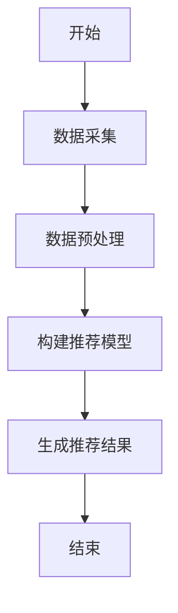
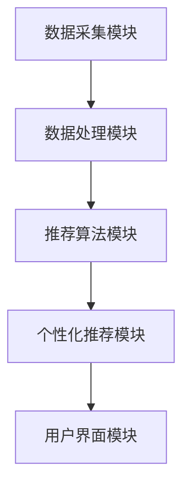
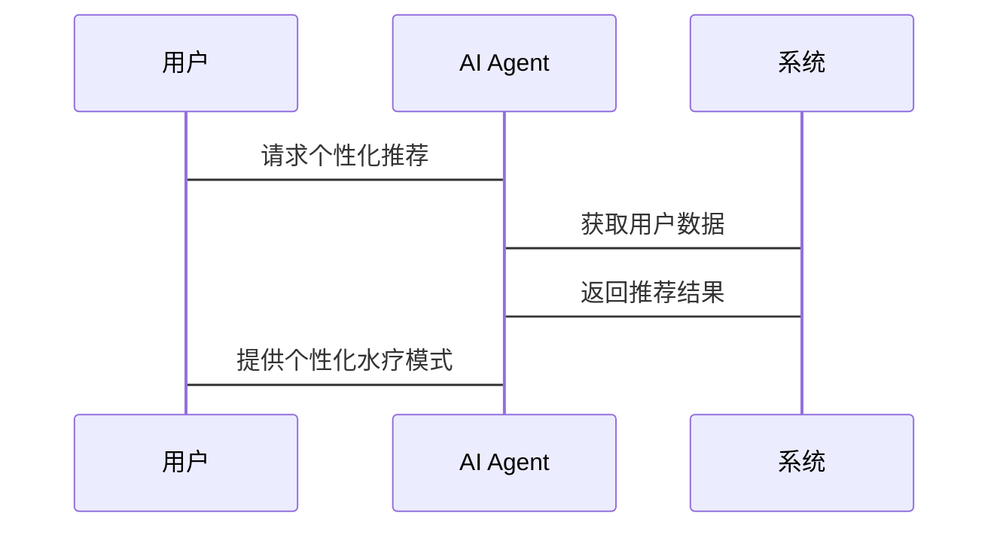

                 


# AI Agent在智能浴缸中的水疗模式个性化

## 关键词：AI Agent，智能浴缸，水疗模式，个性化推荐，机器学习，系统架构，用户体验

## 摘要

随着智能设备的普及，水疗体验逐渐从单一的物理放松向个性化、智能化方向发展。本文探讨AI Agent在智能浴缸中的应用，特别是如何通过个性化水疗模式提升用户体验。文章从背景、核心概念、算法原理到系统架构和项目实战，全面解析AI Agent在水疗模式个性化中的实现路径，为智能浴缸的设计和优化提供理论与实践指导。

---

# 第1章: 问题背景与描述

## 1.1 问题背景

现代生活节奏的加快，人们对健康和放松的需求日益增长。传统浴缸功能单一，无法满足用户的个性化需求。水疗作为一种结合水力按摩和温度调节的健康方式，逐渐成为人们追求身心放松的重要手段。然而，现有的水疗设备往往缺乏智能化和个性化功能，无法根据用户的需求动态调整水温和按摩模式，导致用户体验受限。

## 1.2 问题描述

水疗模式的个性化推荐是一个复杂的问题，涉及多个因素：
- **用户需求多样性**：不同用户对水温、水流强度和按摩方式的需求各不相同。
- **数据采集难度**：需要实时采集用户的生理数据（如心率、体温）和行为数据（如使用习惯）。
- **推荐算法复杂性**：如何根据多维度数据构建个性化的推荐模型，是技术难点。

## 1.3 问题解决

AI Agent通过实时感知用户数据，结合机器学习算法，能够动态调整水疗模式，满足用户的个性化需求。AI Agent不仅能够根据用户的历史使用数据进行推荐，还能通过实时反馈优化推荐策略。

## 1.4 边界与外延

AI Agent在智能浴缸中的应用边界包括：
- 数据采集范围：仅限于与水疗相关的数据。
- 功能范围：专注于水疗模式的个性化推荐，不涉及其他功能。
- 交互方式：通过语音或触控界面与用户互动。

水疗模式的外延包括：
- 不同的水流模式（如涡流、气泡）。
- 不同的温度调节范围（如冷、温、热）。
- 不同的按摩时长和强度。

---

# 第2章: AI Agent的核心原理

## 2.1 AI Agent的定义与特点

AI Agent是一种智能代理，能够感知环境、理解需求并采取行动。其核心特点包括：
- **自主性**：无需人工干预，自主决策。
- **反应性**：能够实时感知环境变化并调整策略。
- **学习能力**：通过机器学习不断优化推荐算法。

## 2.2 水疗模式个性化的实现原理

水疗模式个性化推荐的核心步骤包括：
1. **数据采集**：采集用户的生理数据和行为数据。
2. **数据处理**：对数据进行清洗和预处理。
3. **推荐模型构建**：基于机器学习算法构建推荐模型。
4. **个性化推荐**：根据模型结果动态调整水疗模式。

---

# 第3章: 算法原理讲解

## 3.1 算法选择与流程

基于用户的偏好，选择基于协同过滤的推荐算法。算法流程如下：



## 3.2 Python代码实现

以下是推荐算法的Python代码示例：

```python
import numpy as np
from sklearn.metrics.pairwise import cosine_similarity

# 示例数据矩阵（行：用户，列：水疗模式）
X = np.array([
    [1, 0, 1],
    [0, 1, 1],
    [1, 1, 0]
])

# 计算余弦相似度
similarity = cosine_similarity(X)

# 推荐算法实现
def recommend(user_id, similarity):
    user_profiles = X[user_id]
    similar_users = np.where(similarity[user_id] > 0.5)[0]
    recommended = []
    for u in similar_users:
        recommended.extend([i for i, val in enumerate(user_profiles) if val == 0])
    return recommended

# 示例调用
user_id = 0
print(recommend(user_id, similarity))
```

---

# 第4章: 系统分析与架构设计

## 4.1 系统架构设计



## 4.2 系统交互设计



---

# 第5章: 项目实战

## 5.1 环境搭建

```bash
pip install numpy scikit-learn
```

## 5.2 核心代码实现

```python
import numpy as np
from sklearn.decomposition import PCA

# 示例数据矩阵（行：用户，列：水疗模式）
X = np.array([
    [1, 0, 1],
    [0, 1, 1],
    [1, 1, 0]
])

# PCA降维
pca = PCA(n_components=2)
X_pca = pca.fit_transform(X)

# 计算用户偏好评分
user_profiles = X_pca.mean(axis=0)
similarity = np.dot(X_pca, user_profiles.reshape(-1, 1))
similarity = similarity / np.linalg.norm(similarity, axis=0)

# 推荐算法实现
def recommend(user_id, similarity):
    recommended = []
    for i in range(len(similarity)):
        if i != user_id and similarity[i] > 0.7:
            recommended.append(i)
    return recommended

# 示例调用
user_id = 0
print(recommend(user_id, similarity))
```

---

# 第6章: 最佳实践

## 6.1 小结

本文通过详细分析AI Agent在智能浴缸中的应用，展示了如何通过个性化推荐提升用户体验。从算法选择到系统架构设计，均为实现个性化的水疗模式提供了理论和实践指导。

## 6.2 注意事项

- 数据隐私保护至关重要。
- 算法需要不断优化以适应用户需求变化。
- 系统设计要注重用户体验，避免过度复杂。

## 6.3 拓展阅读

- 《强化学习：算法与应用》
- 《机器学习实战》
- 《智能系统设计》

---

# 作者

作者：AI天才研究院/AI Genius Institute & 禅与计算机程序设计艺术 /Zen And The Art of Computer Programming

