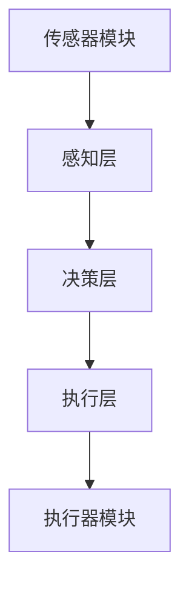
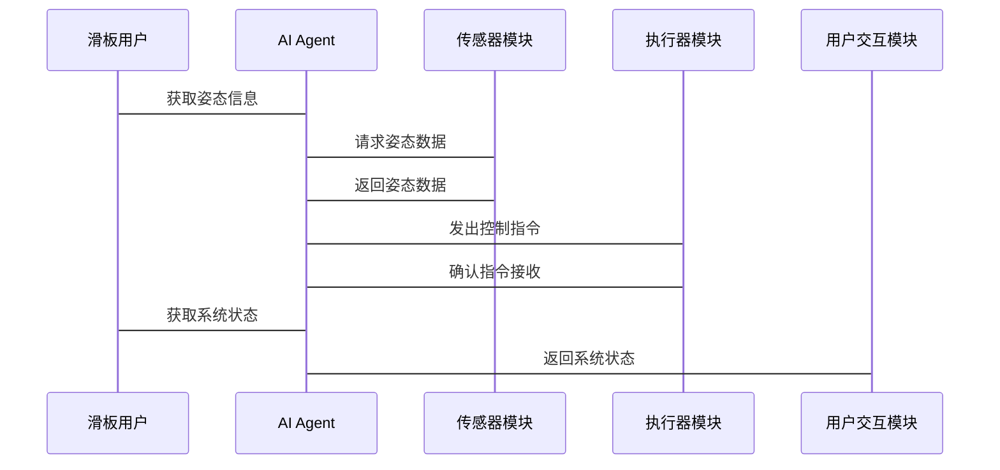

                 


# AI Agent在智能滑板中的平衡控制

> 关键词：AI Agent，智能滑板，平衡控制，传感器，PID算法，强化学习，系统架构

> 摘要：本文探讨了AI Agent在智能滑板平衡控制中的应用，详细分析了平衡控制的核心算法、传感器的作用、系统架构设计，并通过实际案例展示了AI Agent在滑板平衡控制中的实现过程。文章内容涵盖了从理论到实践的各个方面，深入剖析了AI Agent在智能滑板平衡控制中的技术细节和实现方法。

---

# 第1章 AI Agent与智能滑板平衡控制概述

## 1.1 AI Agent的基本概念

### 1.1.1 AI Agent的定义
AI Agent（人工智能代理）是指能够感知环境、做出决策并执行动作的智能实体。它通过传感器获取信息，利用算法进行分析，并通过执行器与环境交互。AI Agent的核心目标是实现自主决策和问题解决。

### 1.1.2 AI Agent的核心特征
1. **自主性**：AI Agent能够在没有外部干预的情况下自主运行。
2. **反应性**：能够实时感知环境变化并做出相应的反应。
3. **学习能力**：通过经验不断优化自身的决策算法。
4. **协作性**：能够与其他AI Agent或系统协同工作。

### 1.1.3 AI Agent在智能滑板中的应用背景
智能滑板是一种结合了AI技术的新型运动工具，它通过AI Agent实现平衡控制、路径规划等功能。AI Agent在滑板中的应用使得滑板能够自主保持平衡，为用户提供更加智能和安全的骑行体验。

## 1.2 智能滑板平衡控制的背景与意义

### 1.2.1 滑板运动的基本原理
滑板的平衡控制依赖于物理原理，包括重心位置、惯性、角动量等。当滑板的重心偏离垂直位置时，滑板需要通过调整姿态来恢复平衡。

### 1.2.2 平衡控制在滑板运动中的重要性
平衡控制是滑板运动的核心，直接关系到滑板的稳定性和骑行的安全性。良好的平衡控制能够使滑板在复杂地形和动态环境中保持稳定。

### 1.2.3 AI Agent在滑板平衡控制中的作用
AI Agent通过传感器实时感知滑板的姿态、速度和环境信息，利用算法进行分析和决策，从而实现滑板的自主平衡控制。

## 1.3 本章小结
本章介绍了AI Agent的基本概念及其在智能滑板中的应用背景，强调了平衡控制在滑板运动中的重要性，为后续章节的深入分析奠定了基础。

---

# 第2章 AI Agent与滑板平衡控制的核心概念

## 2.1 平衡控制的基本原理

### 2.1.1 滑板平衡的物理模型
滑板的平衡控制可以通过物理模型来描述。滑板的重心位置决定了其平衡状态，当重心偏离垂直位置时，滑板需要通过姿态调整来恢复平衡。

### 2.1.2 平衡控制的数学模型
平衡控制的数学模型通常包括姿态角、加速度、角速度等变量。通过建立数学模型，可以分析滑板的动态行为并设计相应的控制算法。

### 2.1.3 平衡控制的核心算法
常用的平衡控制算法包括PID控制、状态估计和强化学习等。这些算法通过不同的方式实现滑板的姿态调整和平衡控制。

## 2.2 传感器与执行器的作用

### 2.2.1 常见传感器类型与功能
智能滑板中常用的传感器包括加速度计、陀螺仪、磁力计等。这些传感器用于感知滑板的姿态、加速度和环境磁场信息。

### 2.2.2 执行器的控制原理
执行器通常包括电机和舵机，用于调整滑板的倾角和位置。执行器的控制信号由AI Agent根据传感器数据和算法计算得出。

### 2.2.3 传感器与执行器的协同工作
传感器和执行器通过AI Agent协同工作，实现滑板的姿态调整和平衡控制。传感器提供环境信息，执行器根据控制信号调整滑板姿态。

## 2.3 AI Agent在滑板平衡控制中的角色

### 2.3.1 AI Agent的决策机制
AI Agent通过传感器数据和算法计算，生成控制信号以调整滑板姿态。决策机制包括状态估计、目标设定和动作选择。

### 2.3.2 AI Agent与滑板运动的实时互动
AI Agent实时感知滑板的姿态和环境信息，根据当前状态做出决策，并通过执行器调整滑板姿态。这种实时互动是实现平衡控制的关键。

### 2.3.3 AI Agent的自适应能力
AI Agent通过学习和优化算法，能够自适应不同的环境和骑行条件，提高平衡控制的稳定性和鲁棒性。

## 2.4 本章小结
本章详细分析了平衡控制的基本原理、传感器和执行器的作用，以及AI Agent在滑板平衡控制中的角色。这些内容为后续章节的算法设计和系统实现提供了理论基础。

---

# 第3章 滑板平衡控制的算法原理

## 3.1 PID控制算法

### 3.1.1 PID算法的基本原理
PID控制是一种常用的反馈控制算法，通过比例、积分和微分三个部分调节系统的输出。PID算法广泛应用于滑板平衡控制中。

### 3.1.2 PID算法的数学模型
PID算法的数学模型可以表示为：
$$
u(t) = K_p e(t) + K_i \int_{0}^{t} e(\tau) d\tau + K_d \frac{d e(t)}{dt}
$$
其中，$e(t)$是误差，$K_p$、$K_i$、$K_d$是比例、积分和微分系数。

### 3.1.3 PID算法在滑板平衡控制中的应用
PID算法用于调整滑板的倾角，使其保持平衡。通过传感器获取滑板的姿态信息，计算误差并生成控制信号。

## 3.2 状态估计与预测算法

### 3.2.1 状态估计的基本原理
状态估计通过融合传感器数据，估计系统的状态变量。常用的状态估计算法包括卡尔曼滤波和粒子滤波。

### 3.2.2 常见状态估计算法（如卡尔曼滤波）
卡尔曼滤波是一种递归算法，用于估计系统的状态和噪声。其基本步骤包括状态预测和观测更新。

### 3.2.3 状态预测在滑板平衡中的应用
状态估计用于提高滑板姿态估计的准确性，尤其是在复杂环境和动态条件下。

## 3.3 基于AI的强化学习算法

### 3.3.1 强化学习的基本原理
强化学习通过智能体与环境的交互，学习最优策略。智能体通过试错的方式，获得最大化的累计奖励。

### 3.3.2 强化学习在滑板平衡控制中的应用
强化学习用于优化滑板的平衡控制策略，通过不断试验和学习，提高控制的稳定性和鲁棒性。

### 3.3.3 强化学习算法的优缺点分析
强化学习的优点包括自适应性和全局优化能力，缺点是训练时间长、计算资源需求高。

## 3.4 算法选择与优化策略

### 3.4.1 不同算法的性能对比
PID算法适用于简单的控制任务，强化学习适用于复杂的优化任务。根据具体需求选择合适的算法。

### 3.4.2 算法优化的关键点
包括参数调整、算法改进和性能评估等。优化算法能够提高控制的精度和效率。

### 3.4.3 算法在实际应用中的调优技巧
通过实验验证和数据分析，找到最佳的算法参数和配置，确保控制效果最优。

## 3.5 本章小结
本章详细分析了PID控制、状态估计和强化学习三种算法的原理和应用，为后续章节的系统设计和项目实现提供了算法基础。

---

# 第4章 滑板平衡控制系统的架构设计

## 4.1 系统功能设计

### 4.1.1 系统功能模块划分
滑板平衡控制系统主要包括传感器模块、AI Agent模块、执行器模块和用户交互模块。

### 4.1.2 功能模块的交互关系
传感器模块采集姿态信息，AI Agent模块进行状态估计和决策，执行器模块调整滑板姿态，用户交互模块提供人机交互界面。

## 4.2 系统架构设计

### 4.2.1 系统架构的层次划分
滑板平衡控制系统通常采用分层架构，包括感知层、决策层和执行层。

### 4.2.2 系统架构的mermaid架构图


### 4.2.3 系统接口设计
系统接口包括传感器接口、执行器接口和用户交互接口。接口设计需要考虑兼容性和易用性。

### 4.2.4 系统交互的mermaid序列图


## 4.3 本章小结
本章详细分析了滑板平衡控制系统的架构设计，包括功能模块划分、系统架构设计和接口设计。系统架构设计为后续章节的项目实现提供了指导。

---

# 第5章 项目实战：AI Agent在滑板平衡控制中的实现

## 5.1 环境安装与配置

### 5.1.1 系统环境要求
滑板平衡控制系统需要高性能的传感器和计算单元。推荐使用树莓派或嵌入式系统作为计算平台。

### 5.1.2 开发工具安装
安装必要的开发工具，包括Python编程环境、传感器驱动和算法库。

## 5.2 核心实现代码

### 5.2.1 PID控制算法的实现
```python
def pid_control(target, current, Kp, Ki, Kd, dt):
    error = target - current
    integral = integral_prev + error * dt
    derivative = (error - error_prev) / dt
    output = Kp * error + Ki * integral + Kd * derivative
    return output, integral, error
```

### 5.2.2 状态估计与预测的实现
```python
import numpy as np

def kalman_filter(state, measurement, R, Q):
    # 状态转移矩阵
    A = np.array([[1, 0], [0, 1]])
    # 测量矩阵
    H = np.array([[1, 0], [0, 1]])
    # 状态协方差
    P = np.array([[1, 0], [0, 1]])
    # 预测状态
    state_pred = A @ state
    # 预测协方差
    P_pred = A @ P @ A.T + Q
    # 更新因子
    K = P_pred @ H.T @ np.linalg.inv(H @ P_pred @ H.T + R)
    # 状态更新
    state_update = state_pred + K @ (measurement - H @ state_pred)
    return state_update
```

## 5.3 实际案例分析与实现

### 5.3.1 案例分析
通过实际案例分析，验证PID控制和卡尔曼滤波在滑板平衡控制中的应用效果。

### 5.3.2 代码实现与解读
详细解读实现代码，包括传感器数据处理、状态估计和控制算法的具体步骤。

## 5.4 本章小结
本章通过实际案例分析和代码实现，展示了AI Agent在滑板平衡控制中的具体应用，验证了算法的有效性和系统的可行性。

---

# 第6章 总结与展望

## 6.1 本章总结
本文详细探讨了AI Agent在智能滑板平衡控制中的应用，分析了平衡控制的核心算法、系统架构设计和实现方法。

## 6.2 对未来的展望
随着AI技术的不断发展，滑板平衡控制将更加智能化和个性化。未来的研究方向包括更复杂的算法优化、多传感器融合和人机交互体验提升。

## 6.3 最佳实践 tips
1. 在实际应用中，建议根据具体需求选择合适的算法。
2. 系统设计时，注重传感器和执行器的协同工作。
3. 开发过程中，加强算法优化和系统调优。

## 6.4 本章小结
本文总结了AI Agent在滑板平衡控制中的应用成果，并展望了未来的发展方向，为后续研究提供了参考。

---

# 作者：AI天才研究院/AI Genius Institute & 禅与计算机程序设计艺术 /Zen And The Art of Computer Programming

---

以上是《AI Agent在智能滑板中的平衡控制》的技术博客文章的完整目录大纲和内容结构。

