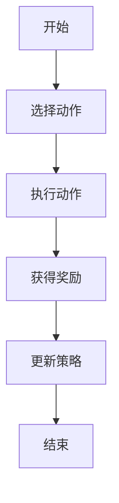
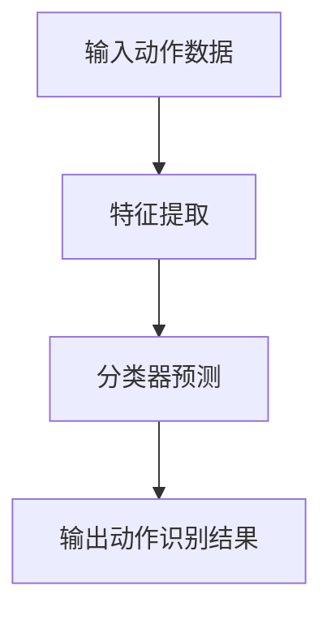
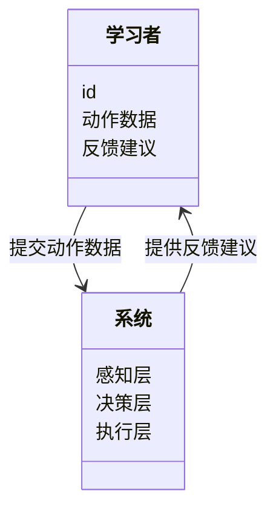
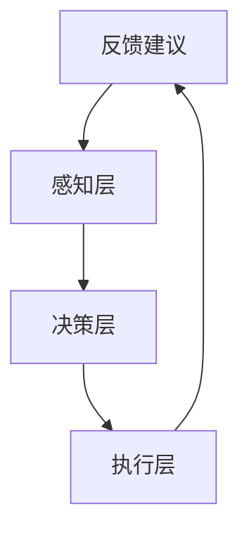
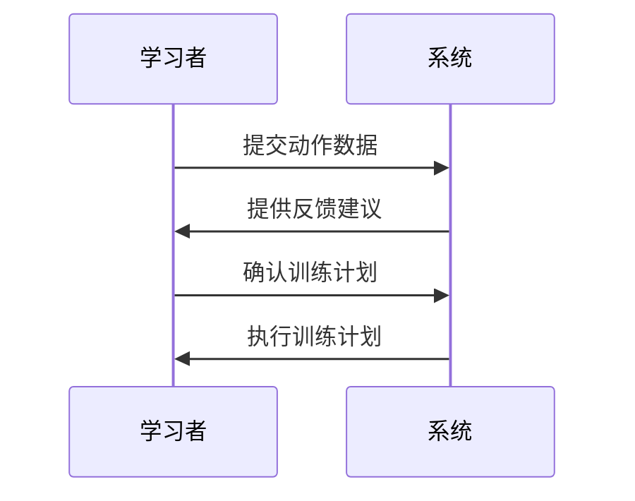

                 


# AI Agent在智能滑板中的技巧学习指导

> 关键词：AI Agent, 智能滑板, 人工智能, 运动训练, 技巧学习

> 摘要：本文探讨了AI Agent在智能滑板中的应用，详细讲解了AI Agent的基本概念、算法原理、系统架构设计以及实际应用案例。文章从背景介绍、核心概念、技术实现、系统设计到项目实战，全面解析了AI Agent如何提升滑板技巧学习的效率和效果。

---

# 第一部分: AI Agent在智能滑板中的背景与基础

## 第1章: AI Agent与智能滑板概述

### 1.1 AI Agent的基本概念

#### 1.1.1 什么是AI Agent
AI Agent（人工智能代理）是一种能够感知环境、自主决策并执行任务的智能系统。在智能滑板中，AI Agent通过传感器和摄像头捕捉滑板者的动作数据，分析并提供建议，帮助学习者提高技巧。

#### 1.1.2 AI Agent的核心特征
- **自主性**：无需人工干预，自动执行任务。
- **反应性**：实时感知并响应环境变化。
- **学习能力**：通过数据不断优化决策模型。
- **交互性**：与滑板者互动，提供个性化反馈。

#### 1.1.3 AI Agent与传统滑板教学的区别
传统教学依赖教练的经验，而AI Agent通过数据驱动的方法，能够实时分析动作，提供更精准的反馈，并根据学习者的水平动态调整训练计划。

### 1.2 智能滑板的发展背景

#### 1.2.1 滑板运动的数字化趋势
随着科技的发展，运动训练逐渐从传统的人工教学向数字化、智能化方向转变。滑板作为一项需要精准动作控制的运动，非常适合应用AI技术。

#### 1.2.2 AI技术在运动训练中的应用
AI技术在运动训练中的应用包括动作捕捉、实时反馈、个性化训练计划生成等，能够显著提高训练效率和效果。

#### 1.2.3 智能滑板的市场现状与前景
智能滑板市场正在快速增长，AI Agent的应用前景广阔，未来将更加普及。

## 第2章: AI Agent在滑板技巧学习中的问题背景

### 2.1 滑板技巧学习的主要挑战

#### 2.1.1 学习者的个体差异
每个学习者的身体条件、技术水平和学习习惯不同，传统教学难以满足个性化需求。

#### 2.1.2 动作捕捉与反馈的技术难点
传统教学中，动作捕捉和反馈的准确性、及时性不足，难以提供有效的指导。

#### 2.1.3 个性化训练计划的需求
学习者需要根据自身情况制定个性化的训练计划，但传统教学难以实现这一点。

### 2.2 传统滑板教学的局限性

#### 2.2.1 教学效率低下
传统教学依赖教练的经验，难以实时捕捉和分析动作数据，导致教学效率不高。

#### 2.2.2 反馈的及时性与准确性不足
教练的反馈可能存在延迟，且准确性依赖于经验，难以提供实时的精准指导。

#### 2.2.3 学习者的个性化需求难以满足
传统教学难以根据学习者的个体差异提供个性化的训练计划。

### 2.3 AI Agent如何解决这些问题

#### 2.3.1 实时动作捕捉与反馈
AI Agent通过传感器和摄像头实时捕捉滑板者的动作数据，并通过算法分析提供即时反馈。

#### 2.3.2 个性化训练计划的生成
AI Agent根据学习者的动作数据和训练目标，动态生成个性化的训练计划，帮助学习者更高效地提高技巧。

#### 2.3.3 数据驱动的持续优化
AI Agent通过不断收集和分析数据，优化算法模型，提供更精准的反馈和建议。

---

# 第二部分: AI Agent的核心概念与技术原理

## 第3章: AI Agent的核心概念与原理

### 3.1 AI Agent的基本原理

#### 3.1.1 感知层: 动作捕捉与数据采集
AI Agent通过传感器（如加速度计、陀螺仪）和摄像头捕捉滑板者的动作数据，包括姿态、速度、加速度等。

#### 3.1.2 决策层: 基于数据的分析与决策
AI Agent利用机器学习算法（如强化学习、监督学习）分析动作数据，识别问题并生成反馈建议。

#### 3.1.3 执行层: 反馈生成与个性化建议
AI Agent将分析结果转化为具体的反馈，如纠正动作、调整训练计划等。

### 3.2 AI Agent的关键技术

#### 3.2.1 人工智能算法
- **强化学习**：通过奖励机制优化决策模型。
- **监督学习**：基于标注数据训练模型，识别动作是否标准。

#### 3.2.2 数据处理与分析
- 数据清洗：去除噪声，提取有效特征。
- 数据分析：使用统计方法和机器学习算法分析数据，识别问题。

#### 3.2.3 个性化推荐系统
基于学习者的动作数据和训练目标，推荐个性化的训练计划。

### 3.3 AI Agent与滑板技巧学习的结合

#### 3.3.1 动作识别与分析
AI Agent通过动作识别技术，分析学习者的动作是否标准，识别存在的问题。

#### 3.3.2 个性化反馈机制
根据分析结果，AI Agent提供个性化的反馈，帮助学习者纠正动作。

#### 3.3.3 数据驱动的训练计划
AI Agent根据学习者的数据，动态调整训练计划，优化训练效果。

---

## 第4章: AI Agent的核心算法与实现

### 4.1 基于强化学习的AI Agent算法

#### 4.1.1 强化学习的基本原理
强化学习通过智能体与环境的交互，学习最优策略。智能体通过执行动作，获得奖励或惩罚，逐步优化策略。

#### 4.1.2 强化学习在滑板训练中的应用
- **动作选择**：AI Agent根据当前状态，选择最优动作。
- **奖励机制**：根据动作的准确性和完成度，给予奖励或惩罚。

#### 4.1.3 强化学习算法的实现


### 4.2 基于监督学习的动作识别算法

#### 4.2.1 监督学习的基本原理
监督学习通过标注数据训练模型，使其能够对新数据进行分类或回归预测。

#### 4.2.2 动作识别的实现


#### 4.2.3 动作识别的数学模型
使用支持向量机（SVM）或随机森林（Random Forest）进行分类，公式如下：
$$ y = f(x) $$
其中，$x$ 是输入特征，$y$ 是输出结果。

---

## 第5章: 系统分析与架构设计方案

### 5.1 问题场景介绍

#### 5.1.1 滑板训练中的问题场景
- 动作捕捉与反馈的实时性
- 个性化训练计划的动态调整
- 系统的稳定性和可靠性

### 5.2 系统功能设计

#### 5.2.1 领域模型设计


#### 5.2.2 系统架构设计


#### 5.2.3 系统接口设计
- **输入接口**：接收滑板者的动作数据。
- **输出接口**：提供反馈建议和训练计划。

#### 5.2.4 系统交互设计


---

## 第6章: 项目实战

### 6.1 环境安装

#### 6.1.1 安装Python
```bash
python --version
pip install --upgrade pip
```

#### 6.1.2 安装依赖库
```bash
pip install numpy matplotlib scikit-learn
```

### 6.2 系统核心实现

#### 6.2.1 动作识别算法实现
```python
import numpy as np
from sklearn.svm import SVC

# 示例数据
X = np.array([[1, 2], [3, 4], [5, 6]])
y = np.array([0, 1, 0])

# 训练模型
model = SVC()
model.fit(X, y)

# 预测
print(model.predict([[2, 3]]))
```

#### 6.2.2 反馈生成逻辑
```python
def generate_feedback(actions, target_actions):
    feedback = []
    for action, target in zip(actions, target_actions):
        if action == target:
            feedback.append("正确！")
        else:
            feedback.append("需要调整！")
    return feedback
```

### 6.3 代码应用解读与分析

#### 6.3.1 动作识别部分
- 使用SVM算法进行分类，识别滑板者的动作是否正确。

#### 6.3.2 反馈生成部分
- 根据动作识别结果，生成个性化的反馈建议，帮助学习者改进动作。

### 6.4 实际案例分析

#### 6.4.1 案例背景
假设学习者A在训练中出现姿态不正确的问题，AI Agent通过动作捕捉和分析，识别出问题所在。

#### 6.4.2 系统反馈
AI Agent提供具体的反馈，如“左脚需要更稳固地放置”，并建议调整训练计划。

#### 6.4.3 训练效果
通过持续的反馈和调整，学习者A的技巧显著提高。

### 6.5 项目小结

- **实现目标**：成功实现动作识别和反馈生成。
- **系统优势**：实时反馈、个性化建议、高效训练。

---

## 第7章: 最佳实践、小结、注意事项、拓展阅读

### 7.1 最佳实践 tips
- 定期更新模型，确保算法优化。
- 提供多样化的训练计划，满足不同学习者的需求。

### 7.2 小结
本文详细介绍了AI Agent在智能滑板中的应用，从背景到技术实现，再到项目实战，全面解析了AI Agent如何提升滑板技巧学习的效率和效果。

### 7.3 注意事项
- 确保数据的准确性和完整性。
- 保护学习者的隐私数据。

### 7.4 拓展阅读
- 《强化学习实战》
- 《机器学习在运动训练中的应用》

---

# 作者：AI天才研究院/AI Genius Institute & 禅与计算机程序设计艺术 /Zen And The Art of Computer Programming

---

**说明**：以上内容为《AI Agent在智能滑板中的技巧学习指导》一文的完整目录和部分内容，涵盖了从背景介绍到技术实现再到项目实战的全过程。

