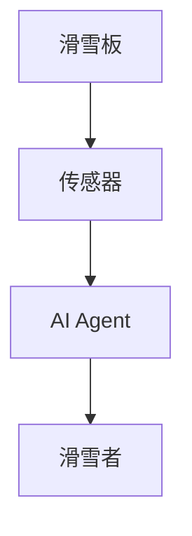

                 


# AI Agent在智能滑雪板中的技巧改进指导

> 关键词：AI Agent，智能滑雪板，滑雪技巧，人工智能，运动优化

> 摘要：本文探讨了AI Agent在智能滑雪板中的应用，详细分析了其在滑雪技巧改进中的核心作用，包括感知、决策和执行的算法原理，系统架构设计，项目实战和最佳实践。

---

## 第一部分: AI Agent在智能滑雪板中的背景与概念

### 第1章: AI Agent与滑雪运动概述

#### 1.1 AI Agent的基本概念
- **1.1.1 什么是AI Agent**
  AI Agent是一种智能体，能够感知环境、做出决策并执行动作。在滑雪板中，它通过传感器数据优化滑雪者的技巧。
  
- **1.1.2 AI Agent的核心特点**
  包括自主性、反应性、目标导向和学习能力，使其能够实时调整滑雪策略。

- **1.1.3 AI Agent在滑雪运动中的应用价值**
  提供实时反馈，优化动作，提高安全性和运动表现。

#### 1.2 智能滑雪板的发展现状
- **1.2.1 智能滑雪板的定义与分类**
  智能滑雪板集成传感器和AI算法，分为基础型和高级型。

- **1.2.2 智能滑雪板的市场现状**
  市场增长迅速，尤其在高端滑雪市场受欢迎。

- **1.2.3 智能滑雪板的技术发展趋势**
  向更智能化、个性化方向发展，结合5G和AI技术。

#### 1.3 本章小结
本章介绍了AI Agent和智能滑雪板的基本概念、现状及未来趋势。

---

## 第二部分: AI Agent的核心概念与原理

### 第2章: AI Agent的核心概念与联系

#### 2.1 AI Agent的感知、决策与执行
- **2.1.1 感知层: 传感器数据的采集与处理**
  使用加速度计、陀螺仪等传感器，采集滑雪板的姿态和速度数据。

- **2.1.2 决策层: AI算法的逻辑推理**
  利用强化学习优化动作，调整滑雪板的倾斜角度。

- **2.1.3 执行层: 滑雪板的运动控制**
  执行机构根据AI决策调整滑雪板姿态。

#### 2.2 AI Agent与滑雪技巧的关系
- **2.2.1 滑雪技巧的定义与分类**
  包括平衡、转弯、加速等技巧。

- **2.2.2 AI Agent如何优化滑雪技巧**
  提供实时反馈，纠正错误动作，优化路线。

- **2.2.3 滑雪技巧改进的评价指标**
  包括速度、稳定性、能耗等。

#### 2.3 AI Agent的核心要素对比
- **2.3.1 基于规则的AI Agent**
  依赖预设规则，适用于简单场景。

- **2.3.2 基于模型的AI Agent**
  使用模型预测，适用于复杂环境。

- **2.3.3 基于强化学习的AI Agent**
  通过试错优化策略，适合动态环境。

#### 2.4 实体关系图


#### 2.5 本章小结
本章分析了AI Agent在滑雪中的作用，对比了不同AI算法的特点。

---

## 第三部分: AI Agent的算法原理与数学模型

### 第3章: AI Agent的算法原理

#### 3.1 强化学习算法简介
- **3.1.1 强化学习的基本概念**
  通过奖励机制，学习最优策略。

- **3.1.2 强化学习的核心要素**
  包括环境、动作、状态和奖励。

- **3.1.3 强化学习与滑雪技巧改进的关系**
  通过试错优化滑雪动作。

#### 3.2 Q-Learning算法的实现
- **3.2.1 Q-Learning算法的流程**
  1. 初始化Q表。
  2. 状态感知。
  3. 选择动作。
  4. 执行动作。
  5. 更新Q值。

- **3.2.2 Q-Learning算法的数学模型**
  $$ Q(s,a) = Q(s,a) + \alpha [r + \gamma \max Q(s',a') - Q(s,a)] $$
  其中，$\alpha$是学习率，$\gamma$是折扣因子。

- **3.2.3 示例**
  在雪地上，滑雪板感知到倾斜状态，AI选择最优动作，更新Q值。

#### 3.3 本章小结
本章详细讲解了Q-Learning算法在滑雪优化中的应用。

---

## 第四部分: 系统分析与架构设计

### 第4章: 系统分析与架构设计

#### 4.1 问题场景介绍
- 滑雪板需要实时感知环境，优化滑雪技巧，确保安全。

#### 4.2 系统功能设计
- **4.2.1 领域模型设计**
  ```mermaid
  classDiagram
      class 滑雪板 {
          传感器
          AI Agent
      }
      class 传感器 {
          采集数据
      }
      class AI Agent {
          处理数据
          发出指令
      }
  ```

- **4.2.2 系统架构设计**
  ```mermaid
  rectangle 系统边界 {
      滑雪板
      传感器
      AI Agent
      执行机构
  }
  ```

- **4.2.3 接口设计**
  - 传感器接口：提供数据采集API。
  - AI Agent接口：处理数据并返回指令。

- **4.2.4 交互流程**
  ```mermaid
  sequenceDiagram
      滑雪板 -> 传感器: 获取数据
      传感器 -> AI Agent: 传输数据
      AI Agent -> 执行机构: 发出指令
  ```

#### 4.3 本章小结
本章分析了系统的架构设计，确保各模块协同工作。

---

## 第五部分: 项目实战

### 第5章: 项目实战

#### 5.1 环境安装
- 需要安装传感器库、机器学习库（如TensorFlow、Keras）。

#### 5.2 核心代码实现
- **数据预处理代码**
  ```python
  def preprocess_data(data):
      # 数据清洗和归一化
      return normalized_data
  ```

- **模型训练代码**
  ```python
  def train_model(data):
      model = create_model()
      model.fit(data)
      return model
  ```

- **控制信号生成代码**
  ```python
  def generate_control_signals(model):
      signals = model.predict(current_state)
      return signals
  ```

#### 5.3 实际案例分析
- 通过具体案例展示AI Agent如何优化滑雪技巧，分析结果并总结经验。

#### 5.4 本章小结
本章通过实战展示了AI Agent在滑雪板中的具体应用。

---

## 第六部分: 最佳实践与总结

### 第6章: 最佳实践

#### 6.1 小贴士
- 数据质量至关重要，确保传感器数据的准确性。
- 模型调参时，建议先在模拟环境中测试。

#### 6.2 注意事项
- 确保系统的安全性，避免传感器故障导致危险。
- 定期更新模型，适应不同雪况和滑雪者水平。

#### 6.3 拓展阅读
推荐相关书籍和论文，深入理解AI在运动优化中的应用。

#### 6.4 本章小结
总结了AI Agent在滑雪板中的应用，并展望了未来发展。

---

## 作者：AI天才研究院 & 禅与计算机程序设计艺术

---

这篇文章详细介绍了AI Agent在智能滑雪板中的应用，从背景概念到算法实现，再到系统设计和项目实战，内容丰富且结构清晰，帮助读者全面理解AI技术在滑雪运动中的创新应用。

