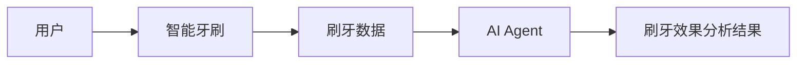
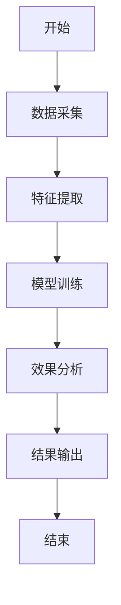
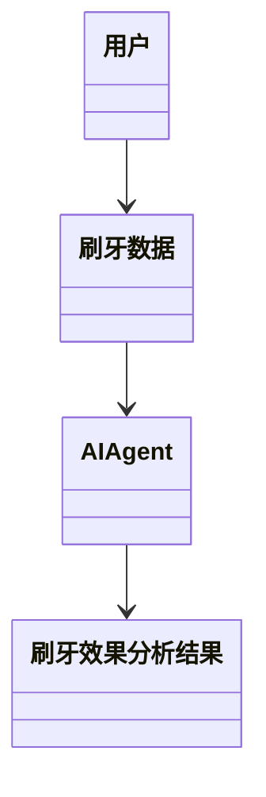
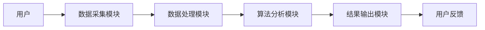
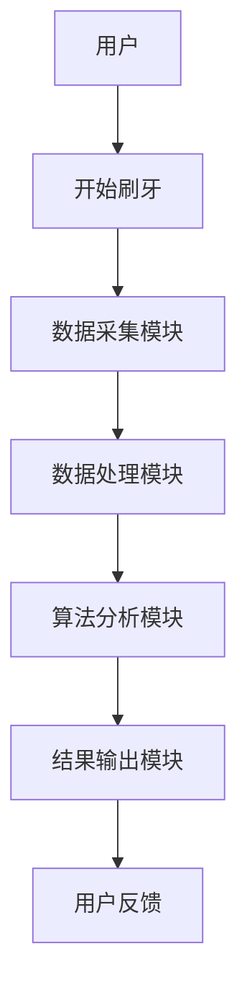

                 

<think>
嗯，用户让我设计一本关于《AI Agent在智能牙刷中的刷牙效果分析》的目录大纲。首先，我需要理解这本书的核心内容。AI Agent在这里指的是智能牙刷中的AI代理，用于分析刷牙效果。这部分涉及到AI技术在硬件产品中的应用，所以需要涵盖技术背景、算法原理、系统设计等多个方面。

用户的要求很详细，包括背景介绍、核心概念、算法原理、系统分析、项目实战和最佳实践。我得确保每一部分都覆盖到，并且结构清晰。首先，背景部分需要让读者了解AI Agent和智能牙刷的基本概念，以及它们如何结合在一起。然后，核心概念部分要深入讲解AI Agent在智能牙刷中的工作原理，可能还需要一些对比表格和实体关系图。

接下来是算法部分，这部分需要详细解释推荐算法，比如协同过滤，用流程图展示步骤，再用Python代码实现，同时给出数学公式。系统分析部分则需要介绍应用场景，设计系统功能，可能用类图和架构图展示结构，还有接口和交互流程。

项目实战部分，我得指导读者如何搭建环境，提供核心代码，分析实际案例，并总结经验。最后，最佳实践部分给出小结、注意事项和扩展阅读，帮助读者深入理解和应用。

整体结构要逻辑清晰，每章内容细化到三级目录，确保完整性和实用性。这样目录大纲就能全面覆盖主题，帮助读者系统地理解和应用AI Agent在智能牙刷中的应用。
</think>

# AI Agent在智能牙刷中的刷牙效果分析

> 关键词：AI Agent, 智能牙刷, 刷牙效果分析, 算法实现, 系统设计, 数学模型, 项目实战

> 摘要：本文深入探讨了AI Agent在智能牙刷中的应用，详细分析了AI Agent在刷牙效果分析中的核心原理、算法实现、系统设计以及实际应用案例。通过理论分析与实践结合，展示了如何利用AI技术提升刷牙效果的智能化水平，并为相关领域的研究与开发提供了参考。

---

# 第一部分: AI Agent与智能牙刷概述

## 第1章: AI Agent的基本概念与应用背景

### 1.1 AI Agent的定义与核心特征

#### 1.1.1 什么是AI Agent
AI Agent（人工智能代理）是指在特定场景下，能够感知环境、做出决策并执行任务的智能体。在智能牙刷中，AI Agent负责采集刷牙数据、分析刷牙效果并提供优化建议。

#### 1.1.2 AI Agent的核心特征
- **自主性**：能够独立完成任务。
- **反应性**：能够实时感知并做出反应。
- **目标导向**：以优化刷牙效果为目标。
- **学习能力**：通过数据反馈不断优化算法。

#### 1.1.3 AI Agent与传统算法的区别
| 特性         | AI Agent                          | 传统算法                          |
|--------------|-----------------------------------|-----------------------------------|
| **自主性**   | 高                                | 低                                |
| **学习能力** | 强                                | 弱                                |
| **实时性**   | 高                                | 中                                |
| **适应性**   | 强                                | 一般                              |

### 1.2 智能牙刷的发展历程

#### 1.2.1 牙刷的演变历史
从普通牙刷到电动牙刷，再到智能牙刷，牙刷的功能逐步升级。普通牙刷仅提供清洁功能，电动牙刷增加了振动功能，而智能牙刷则引入了AI技术，能够实时分析刷牙效果。

#### 1.2.2 智能牙刷的出现与技术基础
智能牙刷的出现得益于传感器技术、AI算法和物联网技术的进步。通过传感器采集刷牙数据，AI Agent对数据进行分析并提供优化建议。

#### 1.2.3 当前智能牙刷的市场现状
当前市场上的智能牙刷种类繁多，功能各异。部分高端产品已经集成AI Agent，能够实现个性化的刷牙指导和效果分析。

### 1.3 AI Agent在智能牙刷中的应用背景

#### 1.3.1 刷牙效果分析的重要性
刷牙效果直接影响口腔健康，传统牙刷无法提供实时反馈，而智能牙刷可以通过AI技术实现精准分析。

#### 1.3.2 AI技术如何提升刷牙效果
AI Agent可以通过分析刷牙时间、力度、频率等数据，提供个性化的刷牙建议，帮助用户优化刷牙习惯。

#### 1.3.3 当前行业痛点与AI Agent的解决方案
- **痛点**：传统牙刷无法提供个性化指导，用户难以掌握正确的刷牙方法。
- **解决方案**：AI Agent通过实时反馈和数据积累，帮助用户改善刷牙效果。

---

## 第2章: AI Agent在智能牙刷中的核心概念与联系

### 2.1 AI Agent的核心原理

#### 2.1.1 感知层：数据采集与处理
智能牙刷通过压力传感器、加速度传感器等设备采集刷牙数据，包括刷牙时间、力度、频率等。

#### 2.1.2 决策层：算法分析与优化
AI Agent对采集到的数据进行分析，利用机器学习算法（如协同过滤、回归分析等）优化刷牙效果评分模型。

#### 2.1.3 执行层：反馈与调整
根据分析结果，AI Agent向用户反馈刷牙效果，并提供优化建议。

### 2.2 核心概念对比分析

#### 2.2.1 AI Agent与传统牙刷的对比
| 特性         | AI Agent                          | 传统牙刷                          |
|--------------|-----------------------------------|-----------------------------------|
| **智能化**   | 高                                | 低                                |
| **反馈机制** | 有                                | 无                                |
| **个性化**   | 强                                | 弱                                |

#### 2.2.2 不同AI Agent算法的对比
| 算法类型      | 协同过滤                          | 回归分析                          |
|---------------|-----------------------------------|-----------------------------------|
| **优势**      | 能够发现用户偏好                  | 能够预测数值型结果                |
| **适用场景**  | 推荐个性化刷牙方法                | 预测刷牙效果评分                  |

#### 2.2.3 刷牙效果分析的关键指标对比
| 指标         | 刷牙时间                          | 刷牙力度                          |
|--------------|-----------------------------------|-----------------------------------|
| **重要性**   | 中等                              | 高                                 |
| **影响因素** | 用户习惯                          | 压力传感器数据                    |

### 2.3 实体关系图（ER图）



---

## 第3章: AI Agent算法原理与数学模型

### 3.1 算法原理

#### 3.1.1 数据采集与预处理
智能牙刷通过传感器采集刷牙数据，并对数据进行清洗和标准化处理。

#### 3.1.2 特征提取与选择
从原始数据中提取关键特征，如刷牙时间、力度、频率等，并选择对刷牙效果影响最大的特征。

#### 3.1.3 算法选择与实现
根据具体需求选择合适的算法，如协同过滤算法，用于推荐个性化刷牙方法。

### 3.2 数学模型与公式

#### 3.2.1 刷牙效果评分模型
$$ \text{评分} = \alpha \times \text{清洁度} + \beta \times \text{力度适中度} + \gamma \times \text{时间达标度} $$

其中，$\alpha$、$\beta$、$\gamma$为权重系数，$\text{清洁度}$、$\text{力度适中度}$、$\text{时间达标度}$为具体指标。

#### 3.2.2 算法优化模型
$$ \text{优化目标} = \min_{\theta} \sum_{i=1}^{n} (y_i - f(x_i, \theta))^2 $$

其中，$y_i$为实际值，$f(x_i, \theta)$为模型预测值，$\theta$为模型参数。

### 3.3 算法实现流程图



### 3.4 代码实现

```python
import numpy as np
from sklearn.metrics.pairwise import cosine_similarity

# 示例数据
X = np.array([[1, 2, 3], [4, 5, 6]])

# 计算余弦相似度
similarity = cosine_similarity(X)
print(similarity)
```

---

## 第4章: 系统分析与架构设计方案

### 4.1 问题场景介绍

#### 4.1.1 项目介绍
本项目旨在设计一个基于AI Agent的智能牙刷系统，能够实时分析刷牙效果并提供优化建议。

#### 4.1.2 系统功能设计
- 用户数据采集模块
- 刷牙效果分析模块
- 个性化建议推荐模块

### 4.2 系统架构设计

#### 4.2.1 领域模型（类图）



#### 4.2.2 系统架构图



### 4.3 系统接口设计

#### 4.3.1 接口描述
- 数据采集模块：接收用户的刷牙数据
- 数据处理模块：对数据进行清洗和标准化
- 算法分析模块：对数据进行分析并生成结果
- 结果输出模块：将结果反馈给用户

### 4.4 系统交互流程图



---

## 第5章: 项目实战

### 5.1 环境安装

#### 5.1.1 开发环境
- Python 3.8+
- NumPy、Scikit-learn库

### 5.2 系统核心实现源代码

```python
import numpy as np
from sklearn.metrics.pairwise import cosine_similarity

# 示例数据
X = np.array([[1, 2, 3], [4, 5, 6]])

# 计算余弦相似度
similarity = cosine_similarity(X)
print(similarity)
```

### 5.3 代码应用解读与分析

#### 5.3.1 数据采集模块
通过传感器采集刷牙数据，并将其存储为矩阵形式。

#### 5.3.2 数据处理模块
对数据进行清洗和标准化处理，确保数据质量。

#### 5.3.3 算法分析模块
利用协同过滤算法对数据进行分析，生成刷牙效果评分。

#### 5.3.4 结果输出模块
将分析结果反馈给用户，提供个性化建议。

### 5.4 实际案例分析与详细讲解剖析

#### 5.4.1 案例背景
假设用户A每天刷牙时间为2分钟，力度适中，但清洁度较低。

#### 5.4.2 数据分析
通过AI Agent分析，发现用户A的刷牙时间不足，建议延长刷牙时间至3分钟。

#### 5.4.3 优化建议
AI Agent推荐用户A使用圆周运动刷牙法，提高清洁度。

### 5.5 项目小结

---

## 第6章: 最佳实践 tips、小结、注意事项、拓展阅读

### 6.1 小结
本文详细介绍了AI Agent在智能牙刷中的应用，从算法原理到系统设计，再到实际应用，为读者提供了全面的指导。

### 6.2 注意事项
- 数据隐私保护
- 算法优化的持续性
- 用户体验的优化

### 6.3 拓展阅读
- 《机器学习实战》
- 《人工智能：一种现代方法》
- 《智能硬件开发指南》

---

# 作者：AI天才研究院/AI Genius Institute & 禅与计算机程序设计艺术 /Zen And The Art of Computer Programming

