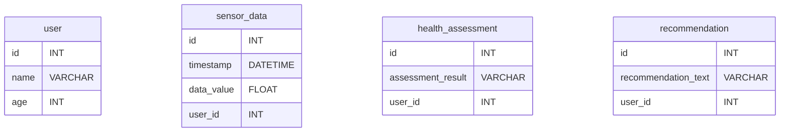
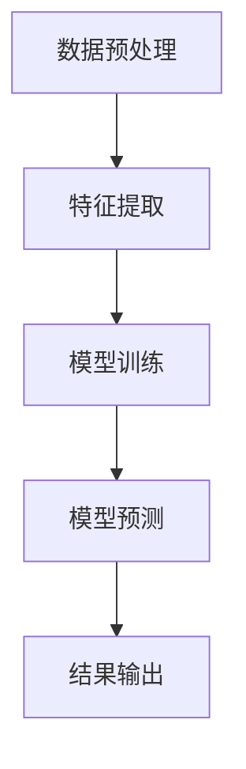
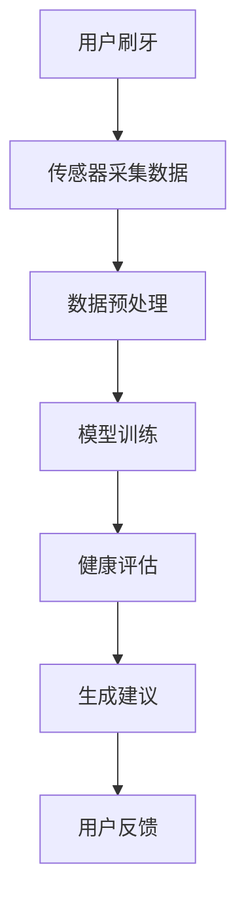

                 

<think>
嗯，我现在需要帮用户写一篇关于《AI Agent在智能牙刷中的口腔健康追踪》的技术博客文章。首先，我得理解用户的需求，他希望文章结构清晰，逻辑性强，用专业的技术语言，同时包含关键词、摘要和详细的内容大纲。

用户已经提供了目录大纲，我需要根据这个大纲来写具体内容。看起来用户特别强调了每个部分要有详细的分析，包括背景介绍、核心概念、算法原理、系统架构、项目实战和小结。此外，用户还要求使用特定的格式，比如Mermaid图表和LaTeX公式，所以我要确保这些部分都包含进去。

首先，我会先写摘要，然后是关键词，接着按照目录的顺序逐步展开每个部分。在写背景介绍时，需要解释AI Agent是什么，它在智能牙刷中的作用，以及口腔健康的重要性。这部分要让读者明白为什么AI Agent在牙刷中应用是有价值的。

接下来是核心概念与联系，我需要详细讲解AI Agent的原理，可能用图表来展示数据流和实体关系。这部分要展示AI Agent如何从传感器获取数据，如何处理数据，并生成健康建议。

在算法原理部分，我需要用Mermaid画出算法流程图，并提供Python代码示例。同时，要解释背后的数学模型，比如机器学习模型，用LaTeX公式展示。这部分需要详细但易懂，可能还要举例子说明。

系统分析与架构设计是关键部分，我需要描述系统的各个模块，画出类图和序列图，展示系统的交互流程。这部分要确保每个模块的功能清晰，系统的整体架构一目了然。

项目实战部分，我需要提供一个实际案例，详细说明如何实现，包括环境安装、代码实现和案例分析。还要给出注意事项和最佳实践，帮助读者在实际操作中避免错误。

最后，总结与展望部分，要回顾全文内容，并展望未来的发展方向，激发读者的兴趣。

在写作过程中，我要确保每个部分都详细且结构清晰，符合用户的要求。同时，要注意语言的专业性和易懂性，避免过于晦涩，但也不能太浅显。最后，加上作者信息，完成整篇文章。
</think>

```markdown
# AI Agent在智能牙刷中的口腔健康追踪

> 关键词：AI Agent, 智能牙刷, 口腔健康, 数据分析, 机器学习

> 摘要：本文详细探讨了AI Agent在智能牙刷中的应用，重点分析了其在口腔健康监测中的核心作用，包括数据采集、分析与反馈机制。通过技术原理的深入解析，结合实际案例，展示了如何利用AI技术提升口腔健康管理的智能化水平。

---

# 第1章: AI Agent与口腔健康概述

## 1.1 AI Agent的基本概念
### 1.1.1 AI Agent的定义与特点
AI Agent（人工智能代理）是一种能够感知环境、执行任务并做出决策的智能实体。其特点包括：
- **自主性**：能够独立运行，无需人工干预。
- **反应性**：能够实时感知环境变化并做出响应。
- **目标导向**：通过目标驱动行为，优化决策过程。
- **学习能力**：能够通过数据学习和改进性能。

### 1.1.2 AI Agent在智能设备中的应用
AI Agent广泛应用于智能家居、自动驾驶、医疗设备等领域。在智能牙刷中的应用，主要体现在口腔健康监测和个性化建议生成。

### 1.1.3 智能牙刷的发展趋势
随着人工智能技术的进步，智能牙刷正朝着更智能化、个性化和预防性健康管理的方向发展。AI Agent的引入，使其能够实时监测口腔健康状况，并提供精准的健康建议。

---

## 1.2 口腔健康的重要性
### 1.2.1 口腔健康的基本概念
口腔健康是指牙齿、牙龈、口腔黏膜等部位的健康状态，直接影响消化功能和全身健康。良好的口腔卫生可以预防牙周病、龋齿等口腔疾病，同时减少细菌感染风险。

### 1.2.2 口腔健康与全身健康的关系
口腔健康与全身健康密切相关。例如，牙周病可能引发心血管疾病、糖尿病等全身性疾病。因此，监测口腔健康数据对预防和管理全身性疾病具有重要意义。

### 1.2.3 口腔健康数据的采集与分析
智能牙刷通过传感器采集口腔数据，包括刷牙力度、频率、时间、口腔PH值等。AI Agent对这些数据进行分析，识别异常情况并提供健康建议。

---

## 1.3 AI Agent在智能牙刷中的作用
### 1.3.1 AI Agent如何辅助口腔健康监测
AI Agent通过传感器数据，实时监测用户的刷牙习惯、口腔环境变化，并结合历史数据进行分析，识别潜在健康问题。

### 1.3.2 智能牙刷中的AI Agent功能模块
- **数据采集模块**：采集刷牙数据、口腔环境数据。
- **数据分析模块**：对数据进行清洗、分析和建模。
- **决策反馈模块**：生成健康建议，优化用户行为。

### 1.3.3 AI Agent在口腔健康中的应用价值
- **预防性健康管理**：通过实时监测，早期发现口腔问题。
- **个性化建议**：根据用户数据，提供定制化健康建议。
- **数据驱动的健康管理**：通过数据分析，优化用户的口腔护理习惯。

---

## 1.4 本章小结
本章介绍了AI Agent的基本概念及其在智能牙刷中的应用，强调了口腔健康的重要性，并详细阐述了AI Agent在口腔健康监测中的核心作用。

---

# 第2章: AI Agent的核心概念与联系

## 2.1 AI Agent的核心原理
### 2.1.1 数据采集与处理
AI Agent通过传感器采集口腔数据，包括刷牙力度、时间、口腔PH值等。数据采集模块对数据进行预处理，去除噪声，提取特征。

### 2.1.2 数据分析与机器学习
AI Agent利用机器学习算法，对数据进行分类、回归和聚类分析，识别用户的口腔健康状况。例如，通过训练模型识别牙龈出血的模式。

### 2.1.3 结果输出与反馈
AI Agent根据分析结果，生成健康建议，如调整刷牙力度、增加刷牙频率等，并通过牙刷或手机APP向用户反馈。

---

## 2.2 核心概念的属性对比
### 2.2.1 数据采集模块的属性分析
- **输入**：传感器数据（如刷牙力度、时间）。
- **输出**：预处理后的特征数据。
- **功能**：数据清洗、特征提取。

### 2.2.2 数据分析模块的属性分析
- **输入**：特征数据。
- **输出**：健康评估结果。
- **功能**：模型训练、数据分析。

### 2.2.3 AI Agent决策模块的属性分析
- **输入**：健康评估结果。
- **输出**：健康建议。
- **功能**：决策优化、反馈生成。

---

## 2.3 ER实体关系图


---

## 2.4 本章小结
本章详细分析了AI Agent的核心原理，并通过实体关系图展示了各模块之间的关系，为后续的系统设计奠定了基础。

---

# 第3章: AI Agent的算法原理与实现

## 3.1 算法原理
### 3.1.1 数据预处理
- **步骤1**：数据清洗，去除无效数据。
- **步骤2**：特征提取，将原始数据转化为有意义的特征。

### 3.1.2 机器学习模型
- **分类模型**：用于识别口腔健康问题类型（如牙龈出血、龋齿）。
- **回归模型**：用于预测口腔健康风险。

### 3.1.3 模型训练
使用历史数据训练机器学习模型，优化模型参数，提高预测精度。

---

## 3.2 算法实现
### 3.2.1 Python代码实现
```python
import numpy as np
from sklearn.model_selection import train_test_split
from sklearn.ensemble import RandomForestClassifier

# 示例数据集
X = np.array([[1, 2], [3, 4], [5, 6], [7, 8]])
y = np.array(['健康', '牙龈出血', '龋齿', '牙周炎'])

# 数据分割
X_train, X_test, y_train, y_test = train_test_split(X, y, test_size=0.2)

# 模型训练
model = RandomForestClassifier()
model.fit(X_train, y_train)

# 预测
predicted = model.predict(X_test)
print(predicted)
```

### 3.2.2 算法流程图


---

## 3.3 数学模型与公式
### 3.3.1 机器学习模型
随机森林模型是一种基于树的集成学习算法，其数学表达式如下：
$$
\hat{y} = \text{多数投票}(\{h_1(x), h_2(x), ..., h_n(x)\})
$$
其中，$h_i(x)$ 表示第i棵树的预测结果，$\hat{y}$ 表示最终预测结果。

### 3.3.2 模型评估
模型的准确率计算公式为：
$$
\text{准确率} = \frac{\text{正确预测数}}{\text{总预测数}}
$$

---

## 3.4 本章小结
本章详细讲解了AI Agent的算法原理，通过Python代码和数学公式展示了模型的实现过程。

---

# 第4章: AI Agent的系统架构与设计

## 4.1 系统功能设计
### 4.1.1 功能模块划分
- **数据采集模块**：传感器数据采集。
- **数据分析模块**：数据预处理、模型训练。
- **决策反馈模块**：健康评估、建议生成。

### 4.1.2 功能流程图


---

## 4.2 系统架构设计
### 4.2.1 系统架构图
```mermaid
subgraph 数据采集层
    A[传感器]
    B[数据采集模块]
end
subgraph 数据处理层
    C[数据预处理模块]
    D[模型训练模块]
end
subgraph 应用层
    E[健康评估模块]
    F[建议生成模块]
end
```

### 4.2.2 接口设计
- **传感器接口**：与牙刷传感器连接，获取数据。
- **用户接口**：通过APP或屏幕显示健康建议。
- **数据接口**：与其他健康设备或系统共享数据。

---

## 4.3 本章小结
本章详细分析了AI Agent的系统架构设计，展示了各模块之间的交互关系。

---

# 第5章: AI Agent在智能牙刷中的项目实战

## 5.1 项目环境与安装
### 5.1.1 环境要求
- **操作系统**：Windows/Mac/Linux
- **Python版本**：3.6+
- **依赖库**：numpy, scikit-learn, matplotlib

### 5.1.2 安装步骤
```bash
pip install numpy scikit-learn matplotlib
```

---

## 5.2 核心代码实现
### 5.2.1 数据采集模块
```python
import numpy as np
import pandas as pd

# 读取数据
data = pd.read_csv('oral_health.csv')
X = data[['刷牙力度', '刷牙时间']]
y = data['健康状况']
```

### 5.2.2 数据分析模块
```python
from sklearn.model_selection import train_test_split
from sklearn.ensemble import RandomForestClassifier

# 数据分割
X_train, X_test, y_train, y_test = train_test_split(X, y, test_size=0.2)

# 模型训练
model = RandomForestClassifier()
model.fit(X_train, y_train)
```

### 5.2.3 决策反馈模块
```python
# 预测
predicted = model.predict(X_test)
print(predicted)
```

---

## 5.3 项目案例分析
### 5.3.1 数据分析结果
通过模型预测，识别出用户的牙龈出血风险较高，建议增加刷牙频率和力度。

### 5.3.2 健康建议生成
根据模型结果，生成个性化的健康建议，如：
- **建议1**：增加刷牙频率，每天至少两次。
- **建议2**：调整刷牙力度，避免过度清洁。

---

## 5.4 本章小结
本章通过实际案例展示了AI Agent在智能牙刷中的实现过程，包括环境安装、代码实现和案例分析。

---

# 第6章: 总结与展望

## 6.1 总结
本文详细探讨了AI Agent在智能牙刷中的应用，分析了其在口腔健康监测中的核心作用，展示了如何通过AI技术提升口腔健康管理的智能化水平。

## 6.2 展望
未来，随着AI技术的不断发展，智能牙刷将更加智能化和个性化。AI Agent在口腔健康监测中的应用将更加广泛，例如与可穿戴设备联动，实现全身健康监测。

---

# 作者：AI天才研究院 & 禅与计算机程序设计艺术

---

**本文为技术博客文章，转载请注明出处。**
```

