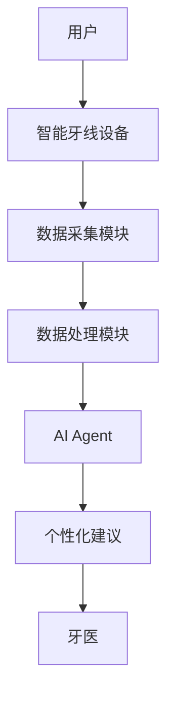
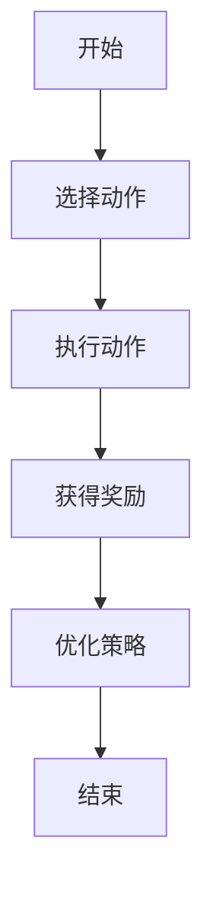
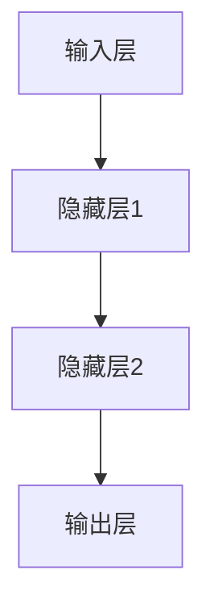

                 

<think>
好的，我需要帮用户撰写一篇关于《AI Agent在智能牙线中的口腔健康追踪》的技术博客文章。首先，我得理清文章的结构和内容，确保覆盖所有必要的部分，并且逻辑清晰，内容详尽。

文章标题已经确定为《AI Agent在智能牙线中的口腔健康追踪》，关键词包括AI Agent、智能牙线、口腔健康、追踪系统、算法原理、系统架构、项目实战。摘要部分需要简明扼要地总结文章的核心内容，强调AI Agent如何通过智能牙线实现口腔健康的有效追踪，提升用户体验和准确性。

接下来，按照用户提供的目录大纲，我需要逐步展开每个部分的内容，确保每个章节都有足够的细节和深度。例如，在AI Agent的基本概念部分，要详细解释其定义、特点和核心技术，同时结合口腔健康的应用背景，说明其在智能牙线中的具体作用。

在核心概念与联系部分，我需要使用ER图和Mermaid流程图来展示AI Agent与智能牙线之间的关系，帮助读者理解两者的交互和数据流。这部分需要结合实际应用场景，分析系统中的实体和它们之间的关联。

算法原理章节是关键，我需要分别介绍基于强化学习和深度学习的AI Agent算法，提供数学模型和公式，并附上Python代码示例。这部分要确保解释清晰，代码易于理解，让读者能够实际应用这些算法。

系统分析与架构设计部分，我需要详细描述系统的功能模块和架构设计，使用Mermaid类图展示系统的结构，并分析各个模块的接口和交互流程。这部分需要考虑系统的可扩展性和实用性，确保设计合理。

项目实战部分，我需要提供环境安装步骤，核心代码实现，并通过实际案例分析，展示AI Agent在智能牙线中的应用效果。这部分要注重实践，帮助读者将理论知识应用到实际中。

最后，在总结与展望部分，我需要总结本书的主要内容，指出当前技术的不足，并展望未来的发展方向，鼓励读者进一步探索和实践。

在整个撰写过程中，我要确保使用逻辑清晰、结构紧凑的专业技术语言，语言简洁明了，便于读者理解。同时，要遵守用户的格式要求，使用markdown格式，适当嵌入图表和代码，提升文章的可读性和专业性。

通过这样的思考和规划，我可以系统地撰写出一篇符合用户要求，内容丰富、结构严谨的技术博客文章。
</think>

# AI Agent在智能牙线中的口腔健康追踪

## 关键词：AI Agent, 智能牙线, 口腔健康, 跟踪系统, 算法原理, 系统架构, 项目实战

## 摘要：AI Agent在智能牙线中的口腔健康追踪是一种创新的技术应用，通过AI Agent的智能算法和智能牙线的硬件结合，能够实时监测用户的口腔健康状况，提供个性化的健康建议。本文将详细探讨AI Agent在智能牙线中的应用背景、核心算法、系统架构以及实际项目实现，帮助读者全面理解AI Agent在口腔健康追踪中的重要作用和实现细节。

---

## 第1章: AI Agent与智能牙线概述

### 1.1 AI Agent的基本概念

#### 1.1.1 AI Agent的定义与特点

AI Agent（人工智能代理）是指能够感知环境、自主决策并执行任务的智能实体。它具有以下特点：
- **自主性**：能够在没有外部干预的情况下独立运行。
- **反应性**：能够实时感知环境并做出响应。
- **目标导向**：具有明确的目标，并通过行动实现目标。
- **学习能力**：能够通过数据和经验不断优化自身的算法和决策能力。

#### 1.1.2 AI Agent的核心技术

AI Agent的核心技术包括：
- **机器学习**：用于训练模型以识别模式和预测结果。
- **自然语言处理**：用于理解和生成人类语言。
- **强化学习**：通过试错机制优化决策过程。
- **计算机视觉**：用于处理图像和视频数据。

#### 1.1.3 AI Agent的应用场景

AI Agent广泛应用于多个领域，包括：
- 智能助手（如Siri、Alexa）
- 自动驾驶
- 医疗健康
- 金融投资

在医疗健康领域，AI Agent可以用于疾病预测、健康监测和个性化治疗方案的制定。

---

### 1.2 智能牙线的背景与现状

#### 1.2.1 口腔健康的现状与挑战

口腔健康是人体健康的重要组成部分，但很多人忽视了日常口腔护理的重要性。常见的口腔问题包括牙龈出血、龋齿和口腔溃疡等。传统的口腔护理方式依赖于手动检查和定期看牙医，这种方式效率低且容易忽视早期问题。

#### 1.2.2 智能牙线的定义与功能

智能牙线是一种结合了传感器和AI技术的牙线，能够实时监测用户的口腔健康状况。其主要功能包括：
- 实时监测牙龈健康状况
- 检测口腔细菌含量
- 提供个性化的口腔护理建议

#### 1.2.3 智能牙线与传统牙线的区别

智能牙线与传统牙线的主要区别在于：
- **数据采集**：智能牙线内置传感器，能够采集口腔数据。
- **智能分析**：通过AI技术对数据进行分析，提供健康建议。
- **用户交互**：智能牙线可以通过手机APP与用户互动，提供实时反馈。

---

### 1.3 AI Agent在智能牙线中的应用背景

#### 1.3.1 口腔健康追踪的必要性

随着人们对健康的关注增加，口腔健康监测的需求也在增长。传统的口腔护理方式效率低，无法实时监测口腔状况。AI Agent可以通过智能牙线实现实时监测，帮助用户及时发现口腔问题。

#### 1.3.2 AI Agent在智能牙线中的作用

AI Agent在智能牙线中的作用包括：
- **数据采集**：通过传感器采集口腔数据。
- **数据分析**：利用机器学习算法分析数据，识别口腔健康问题。
- **个性化建议**：根据分析结果提供个性化的口腔护理建议。

#### 1.3.3 本章小结

本章介绍了AI Agent的基本概念、核心技术以及在智能牙线中的应用背景。AI Agent通过与智能牙线结合，能够实现口腔健康的实时监测和个性化管理。

---

## 第2章: AI Agent与智能牙线的核心概念与联系

### 2.1 AI Agent的核心原理

#### 2.1.1 AI Agent的决策机制

AI Agent的决策机制主要包括以下步骤：
1. **感知环境**：通过传感器或数据接口获取环境信息。
2. **分析数据**：利用机器学习算法对数据进行分析，识别潜在问题。
3. **制定决策**：根据分析结果制定行动方案。
4. **执行决策**：通过执行机构或用户反馈调整行动方案。

#### 2.1.2 AI Agent的学习与优化

AI Agent的学习与优化主要通过以下方式实现：
- **监督学习**：通过标注数据进行训练，优化算法的准确性。
- **无监督学习**：通过聚类分析等方法发现数据中的潜在规律。
- **强化学习**：通过试错机制优化算法的决策能力。

#### 2.1.3 AI Agent的感知与交互

AI Agent的感知与交互能力主要体现在：
- **多模态感知**：能够同时处理图像、声音和文本等多种数据形式。
- **自然语言处理**：能够理解和生成人类语言，实现与用户的自然对话。
- **实时反馈**：能够根据用户反馈实时调整自身的行为。

#### 2.2 智能牙线的系统架构

##### 2.2.1 智能牙线的数据采集模块

智能牙线的数据采集模块包括以下功能：
- **传感器**：用于采集口腔数据，如温度、湿度、pH值等。
- **数据传输**：将采集到的数据传输到数据处理模块。

##### 2.2.2 智能牙线的数据处理模块

数据处理模块的主要功能包括：
- **数据清洗**：对采集到的数据进行预处理，去除噪声。
- **数据分析**：利用机器学习算法对数据进行分析，识别口腔健康问题。
- **数据存储**：将分析结果存储在数据库中，供后续分析使用。

##### 2.2.3 智能牙线的用户交互模块

用户交互模块的主要功能包括：
- **用户界面**：通过手机APP或网页界面与用户交互。
- **实时反馈**：根据分析结果向用户发送健康建议或提醒。

#### 2.3 AI Agent与智能牙线的实体关系分析

##### 2.3.1 ER图实体关系分析

以下是AI Agent与智能牙线的实体关系图：

```mermaid
er
  actor 用户
  actor 牙医
  entity 智能牙线设备
  entity 口腔健康数据
  entity 个性化建议
  relation 用户使用智能牙线设备
  relation 智能牙线设备采集口腔健康数据
  relation AI Agent分析口腔健康数据
  relation AI Agent生成个性化建议
  relation 牙医查看个性化建议
```

##### 2.3.2 AI Agent与智能牙线的交互流程图

以下是AI Agent与智能牙线的交互流程图：



---

## 第3章: AI Agent的核心算法原理

### 3.1 基于强化学习的AI Agent算法

#### 3.1.1 强化学习的基本原理

强化学习是一种通过试错机制优化决策过程的算法。其基本原理如下：
1. **状态识别**：识别当前环境的状态。
2. **动作选择**：根据当前状态选择一个动作。
3. **奖励机制**：根据动作的结果获得奖励或惩罚。
4. **策略优化**：根据奖励优化策略，提高决策的准确性。

#### 3.1.2 AI Agent的决策树模型

以下是AI Agent的决策树模型示例：



#### 3.1.3 算法的数学模型与公式

强化学习的数学模型如下：

$$
Q(s, a) = Q(s, a) + \alpha [r + \max_{a'} Q(s', a') - Q(s, a)]
$$

其中：
- \( Q(s, a) \) 表示状态 \( s \) 下动作 \( a \) 的价值。
- \( \alpha \) 表示学习率。
- \( r \) 表示奖励。
- \( s' \) 表示下一个状态。

### 3.2 基于深度学习的AI Agent算法

#### 3.2.1 深度学习的基本原理

深度学习是一种基于人工神经网络的算法，其基本原理如下：
1. **数据输入**：输入数据到神经网络中。
2. **特征提取**：通过多层神经网络提取数据的特征。
3. **分类或回归**：根据提取的特征进行分类或回归预测。

#### 3.2.2 AI Agent的神经网络模型

以下是AI Agent的神经网络模型示例：



#### 3.2.3 算法的数学模型与公式

深度学习的数学模型如下：

$$
y = \sigma(Wx + b)
$$

其中：
- \( W \) 表示权重矩阵。
- \( x \) 表示输入数据。
- \( b \) 表示偏置项。
- \( \sigma \) 表示激活函数。

### 3.3 算法实现的Python代码示例

#### 3.3.1 强化学习算法代码

```python
import numpy as np

class AI-Agent:
    def __init__(self, state_space, action_space):
        self.state_space = state_space
        self.action_space = action_space
        self.Q = np.zeros((state_space, action_space))

    def choose_action(self, state, epsilon=0.1):
        if np.random.random() < epsilon:
            return np.random.randint(self.action_space)
        else:
            return np.argmax(self.Q[state, :])

    def update_Q(self, state, action, reward, next_state):
        self.Q[state, action] = self.Q[state, action] + 0.1 * (reward + np.max(self.Q[next_state, :]) - self.Q[state, action])

# 示例使用
agent = AI-Agent(5, 3)
state = 0
action = agent.choose_action(state)
reward = 1
next_state = 1
agent.update_Q(state, action, reward, next_state)
```

#### 3.3.2 深度学习算法代码

```python
import tensorflow as tf
from tensorflow import keras

model = keras.Sequential([
    keras.layers.Dense(64, activation='relu'),
    keras.layers.Dense(1, activation='sigmoid')
])

model.compile(optimizer='adam', loss='binary_crossentropy', metrics=['accuracy'])

# 示例训练
X = np.random.random((100, 64))
y = np.random.random((100, 1))
model.fit(X, y, epochs=10, batch_size=32)
```

---

## 第4章: 智能牙线系统的系统分析与架构设计

### 4.1 系统应用场景与功能需求

#### 4.1.1 系统应用场景分析

智能牙线系统的应用场景包括：
- **家庭用户**：用于日常口腔健康监测。
- **医疗机构**：用于辅助牙医诊断患者口腔问题。
- **健康管理平台**：用于收集和分析大量用户的口腔健康数据。

#### 4.1.2 系统功能需求分析

系统的功能需求包括：
- **数据采集**：实时采集用户的口腔健康数据。
- **数据分析**：通过AI算法分析数据，识别口腔健康问题。
- **个性化建议**：根据分析结果提供个性化的口腔护理建议。

### 4.2 系统功能设计

#### 4.2.1 数据采集模块设计

数据采集模块的功能包括：
- **传感器**：用于采集口腔数据，如温度、湿度、pH值等。
- **数据传输**：将数据传输到数据处理模块。

#### 4.2.2 数据处理模块设计

数据处理模块的功能包括：
- **数据清洗**：对采集到的数据进行预处理，去除噪声。
- **数据分析**：利用机器学习算法对数据进行分析，识别口腔健康问题。
- **数据存储**：将分析结果存储在数据库中，供后续分析使用。

#### 4.2.3 用户交互模块设计

用户交互模块的功能包括：
- **用户界面**：通过手机APP或网页界面与用户交互。
- **实时反馈**：根据分析结果向用户发送健康建议或提醒。

### 4.3 系统架构设计

#### 4.3.1 系统架构图

以下是智能牙线系统的架构图：


#### 4.3.2 系统接口设计

系统的接口设计包括：
- **数据接口**：智能牙线设备与数据处理模块之间的数据接口。
- **用户接口**：用户与智能牙线设备之间的交互界面。
- **API接口**：与其他系统（如医疗机构）之间的数据接口。

#### 4.3.3 系统交互流程图

以下是系统的交互流程图：


---

## 第5章: 项目实战

### 5.1 环境安装

#### 5.1.1 安装Python

```bash
python --version
pip install --upgrade pip
```

#### 5.1.2 安装必要的库

```bash
pip install numpy pandas scikit-learn tensorflow
```

### 5.2 核心代码实现

#### 5.2.1 数据采集模块

```python
import numpy as np

def collect_data():
    # 采集口腔数据
    data = np.random.random((100, 5))
    return data

# 示例使用
data = collect_data()
print(data)
```

#### 5.2.2 数据处理模块

```python
import pandas as pd
from sklearn import preprocessing

def preprocess_data(data):
    # 数据预处理
    df = pd.DataFrame(data)
    scaler = preprocessing.StandardScaler()
    scaled_data = scaler.fit_transform(df)
    return scaled_data

# 示例使用
data = collect_data()
processed_data = preprocess_data(data)
print(processed_data)
```

#### 5.2.3 AI Agent算法实现

```python
import numpy as np

class AI-Agent:
    def __init__(self, state_space, action_space):
        self.state_space = state_space
        self.action_space = action_space
        self.Q = np.zeros((state_space, action_space))

    def choose_action(self, state, epsilon=0.1):
        if np.random.random() < epsilon:
            return np.random.randint(self.action_space)
        else:
            return np.argmax(self.Q[state, :])

    def update_Q(self, state, action, reward, next_state):
        self.Q[state, action] = self.Q[state, action] + 0.1 * (reward + np.max(self.Q[next_state, :]) - self.Q[state, action])

# 示例使用
agent = AI-Agent(5, 3)
state = 0
action = agent.choose_action(state)
reward = 1
next_state = 1
agent.update_Q(state, action, reward, next_state)
```

### 5.3 实际案例分析

#### 5.3.1 案例背景

假设用户A长期存在牙龈出血问题，使用智能牙线设备监测其口腔健康状况。

#### 5.3.2 数据分析

采集到的口腔数据如下：

| 参数 | 值 |
|------|----|
| 温度 | 36.5°C |
| 湿度 | 65% |
| pH值 | 6.8 |
| 细菌数量 | 1000 CFU/mL |

经过数据处理模块的分析，发现用户的牙龈出血问题与细菌数量过高有关。

#### 5.3.3 个性化建议

AI Agent根据分析结果，向用户提出以下建议：
- **增加口腔清洁频率**：每天至少两次使用智能牙线清理牙缝。
- **调整饮食习惯**：减少酸性食物的摄入，以降低口腔酸碱度。
- **定期看牙医**：建议用户每3个月进行一次口腔检查。

---

## 第6章: 总结与展望

### 6.1 本章总结

本文详细探讨了AI Agent在智能牙线中的口腔健康追踪技术，介绍了AI Agent的基本概念、核心算法、系统架构以及实际项目实现。通过智能牙线与AI Agent的结合，能够实现口腔健康的实时监测和个性化管理。

### 6.2 对未来的展望

随着AI技术的不断发展，智能牙线的口腔健康追踪技术将更加智能化和个性化。未来的研究方向包括：
- **提高算法的准确性**：通过更复杂的算法优化口腔健康监测的准确性。
- **增加功能模块**：在现有功能的基础上，增加更多的功能模块，如口腔疾病的早期预警。
- **拓展应用场景**：将智能牙线的应用拓展到更广泛的领域，如医疗健康平台和智能健康管理。

---

## 作者：AI天才研究院/AI Genius Institute & 禅与计算机程序设计艺术 /Zen And The Art of Computer Programming

---

以上是《AI Agent在智能牙线中的口腔健康追踪》的技术博客文章的完整目录和内容概览。

