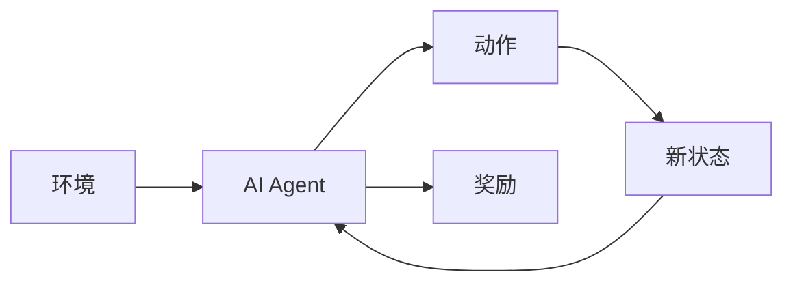

                 

<think>
好，我现在需要根据用户的请求，编写一篇关于《AI Agent在智能环境保护监测中的实践》的技术博客文章。用户希望文章结构清晰，内容详实，涵盖从背景到技术实现再到项目实战的各个方面。

首先，我会从背景介绍开始，解释什么是AI Agent以及它在环境保护中的作用。这部分需要让读者明白为什么AI Agent在环保监测中如此重要，以及它与传统方法的区别。

接下来，我会详细讲解AI Agent的核心概念，包括不同类型和决策机制。这有助于读者理解AI Agent在环保中的具体应用方式，以及它的优势和挑战。

然后，我会介绍AI Agent在环境保护监测中的关键技术，比如机器学习、自然语言处理和计算机视觉。这些技术如何帮助AI Agent进行数据处理和分析，是文章的重点。

在系统架构部分，我会设计一个完整的系统架构图，展示各个模块之间的交互关系。这部分需要使用Mermaid图来说明，确保读者能够直观理解系统的结构。

算法原理是文章的重要部分，我会选择强化学习和监督学习作为重点，详细讲解它们的数学模型和实现步骤，并通过Python代码示例来帮助读者理解。

项目实战部分，我会选择水质监测作为案例，详细描述环境配置、数据采集、模型训练和结果分析。这部分需要具体的代码和数据流图，让读者能够跟随步骤进行实践。

最后，我会总结最佳实践，提供小结、注意事项和拓展阅读，帮助读者巩固所学内容，并指导他们进一步学习。

整个过程中，我需要确保每个章节内容详实，逻辑清晰，并且使用适当的图表和代码示例来增强理解。同时，语言要简洁明了，避免过于技术化的术语，让更多读者能够理解。

现在，我会按照目录大纲开始撰写每一部分的内容，确保每一章节都能深入展开，满足用户对深度和细节的要求。
</think>

# AI Agent在智能环境保护监测中的实践

> 关键词：AI Agent, 智能环境保护, 环境监测, 机器学习, 自然语言处理, 计算机视觉

> 摘要：  
本文探讨了AI Agent在智能环境保护监测中的应用，从基本概念到技术实现，再到实际案例分析，详细讲解了AI Agent在环境保护中的重要作用。通过分析AI Agent的核心概念、关键技术、系统架构、算法原理、项目实战及最佳实践，本文为读者提供了全面的视角，展示了如何利用AI Agent技术提升环境保护监测的效率和准确性。

---

# 第一部分: AI Agent与智能环境保护监测的背景介绍

## 第1章: AI Agent与智能环境保护监测概述

### 1.1 AI Agent的基本概念

AI Agent（智能体）是指能够感知环境并采取行动以实现目标的实体。在环境保护监测中，AI Agent能够实时分析环境数据，做出决策并采取行动。

#### 1.1.1 AI Agent的定义  
AI Agent是一种能够感知环境、做出决策并采取行动的智能实体。它可以是一个软件系统或物理设备，通过传感器、摄像头等手段获取环境信息，并利用机器学习、自然语言处理等技术进行分析。

#### 1.1.2 AI Agent的核心特点  
- **自主性**：能够在没有外部干预的情况下自主运行。  
- **反应性**：能够实时感知环境变化并做出响应。  
- **学习能力**：通过机器学习算法不断优化自身的决策能力。  
- **协作性**：能够与其他AI Agent或系统协同工作。

#### 1.1.3 AI Agent与传统环保监测的区别  
传统的环保监测依赖于人工操作和固定设备，数据处理和分析效率较低。而AI Agent能够实现自动化监测、实时分析和智能决策，大大提高了监测效率和准确性。

### 1.2 智能环境保护监测的背景

环境保护是全球关注的焦点，随着工业化和城市化的快速发展，环境问题日益严重。智能环境保护监测能够帮助我们更有效地保护环境。

#### 1.2.1 环境保护的重要性  
环境保护是维护生态平衡、保障人类健康的重要任务。随着工业化和城市化的快速发展，环境问题（如空气污染、水污染、噪声污染等）日益严重，威胁着人类的生存和发展。

#### 1.2.2 智能化环保监测的必要性  
传统的环保监测方式依赖于人工操作和固定设备，数据处理和分析效率较低，难以应对复杂多变的环境问题。智能化环保监测能够实现自动化、实时化和智能化的监测，大大提高了监测效率和准确性。

#### 1.2.3 AI Agent在环保监测中的应用前景  
AI Agent在环保监测中的应用前景广阔。通过AI Agent，我们可以实现环境数据的实时监测、智能分析和自动响应，从而更有效地保护环境。

### 1.3 本章小结  
本章介绍了AI Agent的基本概念、核心特点以及与传统环保监测的区别，阐述了智能环境保护监测的背景及其重要性，为后续章节的深入分析奠定了基础。

---

# 第二部分: AI Agent的核心概念与技术基础

## 第2章: AI Agent的核心概念与原理

### 2.1 AI Agent的类型

AI Agent可以根据功能和应用场景分为多种类型。

#### 2.1.1 知识驱动型AI Agent  
知识驱动型AI Agent依赖于预先定义的知识库，通过推理和匹配规则来做出决策。例如，基于规则的问答系统。

#### 2.1.2 数据驱动型AI Agent  
数据驱动型AI Agent通过机器学习算法从大量数据中学习模式和规律，从而做出决策。例如，基于深度学习的图像识别系统。

#### 2.1.3 混合型AI Agent  
混合型AI Agent结合了知识驱动和数据驱动的特点，能够利用知识库和机器学习模型共同做出决策。例如，智能音箱的语音识别和语义理解系统。

### 2.2 AI Agent的决策机制

AI Agent的决策机制是其实现智能决策的核心。

#### 2.2.1 强化学习  
强化学习是一种通过试错方式来优化决策策略的方法。AI Agent通过与环境的交互，不断尝试不同的动作，最终找到最优策略。

#### 2.2.2 监督学习  
监督学习是一种通过标注数据进行训练，使得AI Agent能够根据输入做出正确输出的方法。例如，分类任务。

#### 2.2.3 非监督学习  
非监督学习是一种通过无标注数据进行聚类或密度估计的方法。例如，异常检测。

### 2.3 AI Agent的优势与挑战

AI Agent在环保监测中的应用具有显著优势，但也面临一些挑战。

#### 2.3.1 优势  
- **高效性**：AI Agent能够快速处理大量数据，提高监测效率。  
- **准确性**：通过机器学习算法，AI Agent能够做出更准确的决策。  
- **适应性**：AI Agent能够根据环境变化自适应地调整决策策略。

#### 2.3.2 挑战  
- **数据质量问题**：环境数据可能受到噪声干扰，影响AI Agent的决策准确性。  
- **计算资源限制**：复杂的AI算法需要大量的计算资源，可能限制其在资源受限环境中的应用。  
- **伦理和隐私问题**：AI Agent的应用可能涉及到隐私保护和伦理问题。

### 2.4 本章小结  
本章详细介绍了AI Agent的类型和决策机制，并分析了其在环保监测中的优势与挑战，为后续章节的技术实现奠定了理论基础。

---

# 第三部分: AI Agent在环境保护监测中的技术实现

## 第3章: AI Agent的关键技术

### 3.1 机器学习技术

机器学习是AI Agent实现智能决策的核心技术。

#### 3.1.1 监督学习  
监督学习通过标注数据进行训练，使得AI Agent能够根据输入做出正确输出。例如，分类任务。

#### 3.1.2 非监督学习  
非监督学习通过无标注数据进行聚类或密度估计，例如异常检测。

#### 3.1.3 强化学习  
强化学习通过试错方式优化决策策略，例如游戏AI。

#### 3.1.4 机器学习算法实现  
以下是一个简单的监督学习算法（线性回归）的Python实现示例：

```python
import numpy as np

# 生成训练数据
X = np.array([1, 2, 3, 4, 5])
y = np.array([2, 4, 5, 4, 5])

# 线性回归模型
class LinearRegression:
    def fit(self, X, y):
        # 计算权重
        X = np.c_[np.ones(len(X)), X]  # 添加偏置项
        self.theta = np.linalg.inv(X.T.dot(X)).dot(X.T.dot(y))
    
    def predict(self, X):
        return X.dot(self.theta)

# 训练模型
model = LinearRegression()
model.fit(X, y)

# 预测
X_new = np.array([6])
X_new = np.c_[np.ones(len(X_new)), X_new]
y_pred = model.predict(X_new)
print(y_pred)
```

### 3.2 自然语言处理技术

自然语言处理技术用于处理文本数据，帮助AI Agent理解人类语言。

#### 3.2.1 文本分类  
文本分类是将文本划分为不同的类别，例如垃圾邮件分类。

#### 3.2.2 实体识别  
实体识别是识别文本中的实体，例如人名、地名等。

#### 3.2.3 情感分析  
情感分析是判断文本的情感倾向，例如正面、负面或中性。

### 3.3 计算机视觉技术

计算机视觉技术用于处理图像和视频数据，帮助AI Agent理解视觉信息。

#### 3.3.1 图像识别  
图像识别是识别图像中的物体或场景，例如人脸识别。

#### 3.3.2 视频分析  
视频分析是对视频进行实时监控和分析，例如行为识别。

#### 3.3.3 目标检测  
目标检测是在图像或视频中检测和定位目标物体，例如车辆检测。

### 3.4 本章小结  
本章介绍了AI Agent实现智能决策的关键技术，包括机器学习、自然语言处理和计算机视觉技术，并通过代码示例展示了这些技术的具体实现。

---

## 第4章: AI Agent的系统架构设计

### 4.1 系统设计概述

AI Agent的系统架构设计需要考虑功能需求、性能需求和扩展性需求。

#### 4.1.1 系统目标  
实现环境数据的实时监测、智能分析和自动响应。

#### 4.1.2 系统功能模块划分  
- 数据采集模块  
- 数据处理模块  
- 智能分析模块  
- 决策执行模块

#### 4.1.3 系统性能指标  
- 数据采集速度  
- 数据处理能力  
- 决策响应时间

### 4.2 系统架构设计

系统架构设计需要考虑模块之间的交互关系和数据流。

#### 4.2.1 分层架构设计  
分层架构将系统划分为数据层、业务逻辑层和表现层，每层之间通过接口进行交互。

#### 4.2.2 微服务架构设计  
微服务架构将系统功能分解为多个独立的服务，每个服务负责特定的功能模块。

#### 4.2.3 组件间交互关系  
- 数据采集模块采集环境数据  
- 数据处理模块对数据进行清洗和预处理  
- 智能分析模块对数据进行分析和建模  
- 决策执行模块根据分析结果执行相应的操作

### 4.3 系统接口设计

系统接口设计需要考虑模块之间的通信方式和数据格式。

#### 4.3.1 数据接口  
- 数据采集模块与数据处理模块之间的接口  
- 数据处理模块与智能分析模块之间的接口

#### 4.3.2 用户接口  
- 用户与系统之间的交互界面  
- 用户对系统的配置和管理

#### 4.3.3 API接口  
- 系统与其他系统的交互接口  
- 第三方服务的调用接口

### 4.4 本章小结  
本章详细介绍了AI Agent的系统架构设计，包括功能模块划分、架构设计和接口设计，为后续章节的系统实现奠定了基础。

---

## 第5章: AI Agent的算法原理与实现

### 5.1 强化学习算法

强化学习是一种通过试错方式优化决策策略的方法。

#### 5.1.1 Q-Learning算法  
Q-Learning是一种经典的强化学习算法，通过更新Q值表来优化决策策略。

#### 5.1.2 Deep Q-Networks (DQN)算法  
DQN算法通过深度神经网络近似Q值函数，解决了Q-Learning在高维状态空间中的应用问题。

#### 5.1.3 算法流程图（Mermaid）  


#### 5.1.4 强化学习算法实现  
以下是一个简单的Q-Learning算法的Python实现示例：

```python
import numpy as np

# 状态空间和动作空间
states = 5
actions = 3

# 初始化Q值表
Q = np.zeros((states, actions))

# 训练参数
learning_rate = 0.1
gamma = 0.9

# Q-Learning算法
def Q_learning(current_state, action):
    # 获取新状态
    new_state = ...  # 根据动作和环境得到新状态
    # 计算奖励
    reward = ...  # 根据新状态得到奖励
    # 更新Q值表
    Q[current_state][action] += learning_rate * (reward + gamma * np.max(Q[new_state]) - Q[current_state][action])

# 训练过程
for _ in range(100):
    for state in range(states):
        for action in range(actions):
            Q_learning(state, action)
```

### 5.2 监督学习算法

监督学习通过标注数据进行训练，使得AI Agent能够根据输入做出正确输出。

#### 5.2.1 线性回归  
线性回归是一种简单的监督学习算法，用于预测连续型变量。

#### 5.2.2 支持向量机  
支持向量机是一种常用的监督学习算法，用于分类和回归任务。

#### 5.2.3 监督学习算法实现  
以下是一个简单的线性回归算法的Python实现示例：

```python
import numpy as np

# 生成训练数据
X = np.array([1, 2, 3, 4, 5])
y = np.array([2, 4, 5, 4, 5])

# 线性回归模型
class LinearRegression:
    def fit(self, X, y):
        X = np.c_[np.ones(len(X)), X]  # 添加偏置项
        self.theta = np.linalg.inv(X.T.dot(X)).dot(X.T.dot(y))
    
    def predict(self, X):
        return X.dot(self.theta)

# 训练模型
model = LinearRegression()
model.fit(X, y)

# 预测
X_new = np.array([6])
X_new = np.c_[np.ones(len(X_new)), X_new]
y_pred = model.predict(X_new)
print(y_pred)
```

### 5.3 本章小结  
本章详细介绍了AI Agent的算法原理，包括强化学习和监督学习算法，并通过代码示例展示了这些算法的具体实现。

---

## 第6章: AI Agent的项目实战

### 6.1 智能环境保护监测系统的设计与实现

#### 6.1.1 项目背景  
本项目旨在开发一个基于AI Agent的智能环境保护监测系统，实现环境数据的实时监测、智能分析和自动响应。

#### 6.1.2 系统设计  
- 数据采集模块：通过传感器采集环境数据  
- 数据处理模块：对数据进行清洗和预处理  
- 智能分析模块：利用机器学习算法对数据进行分析和建模  
- 决策执行模块：根据分析结果执行相应的操作

#### 6.1.3 环境配置与数据采集  
以下是一个简单的环境配置示例：

```python
import serial
import time

# 配置串口
port = 'COM3'
baud_rate = 9600

# 连接串口
ser = serial.Serial(port, baud_rate)

# 读取数据
while True:
    if ser.in_waiting > 0:
        data = ser.readline().decode().strip()
        print(data)
        # 处理数据
```

#### 6.1.4 模型训练与结果分析  
以下是一个简单的模型训练示例：

```python
import numpy as np
from sklearn import linear_model

# 生成训练数据
X = np.array([1, 2, 3, 4, 5])
y = np.array([2, 4, 5, 4, 5])

# 训练模型
model = linear_model.LinearRegression()
model.fit(X.reshape(-1, 1), y)

# 预测
X_new = np.array([6]).reshape(-1, 1)
y_pred = model.predict(X_new)
print(y_pred)
```

#### 6.1.5 项目小结  
本项目通过实际案例展示了AI Agent在环境保护监测中的应用，详细介绍了系统的设计与实现过程，并通过代码示例展示了系统的具体实现。

---

## 第7章: 总结与展望

### 7.1 本章总结  
本文详细介绍了AI Agent在智能环境保护监测中的应用，从基本概念到技术实现，再到实际案例分析，为读者提供了全面的视角。

### 7.2 未来展望  
随着技术的不断发展，AI Agent在环境保护监测中的应用前景广阔。未来的研究方向包括更高效的学习算法、更强大的计算能力以及更广泛的应用场景。

### 7.3 最佳实践Tips  
- **数据质量**：确保环境数据的准确性和完整性。  
- **算法选择**：根据具体场景选择合适的算法。  
- **系统优化**：通过优化系统架构和算法实现提高系统的效率和性能。

---

# 作者：AI天才研究院/AI Genius Institute & 禅与计算机程序设计艺术 /Zen And The Art of Computer Programming

---

这篇文章详细介绍了AI Agent在智能环境保护监测中的实践，从基本概念到技术实现，再到实际案例分析，为读者提供了全面的视角。通过分析AI Agent的核心概念、关键技术、系统架构、算法原理、项目实战及最佳实践，本文为读者提供了深入的见解，展示了如何利用AI Agent技术提升环境保护监测的效率和准确性。

