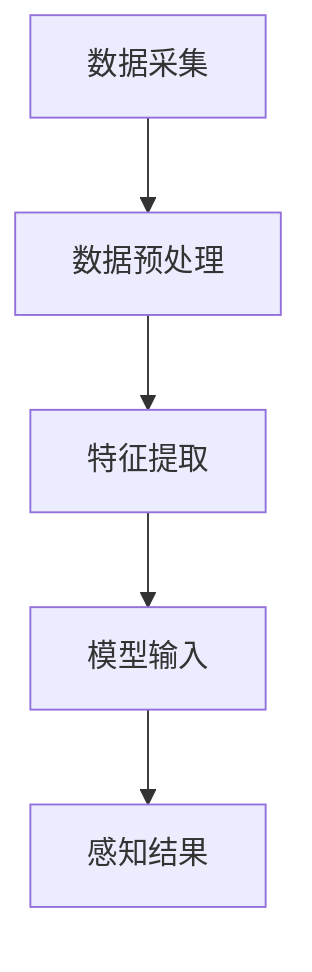
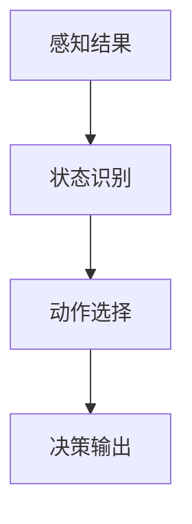
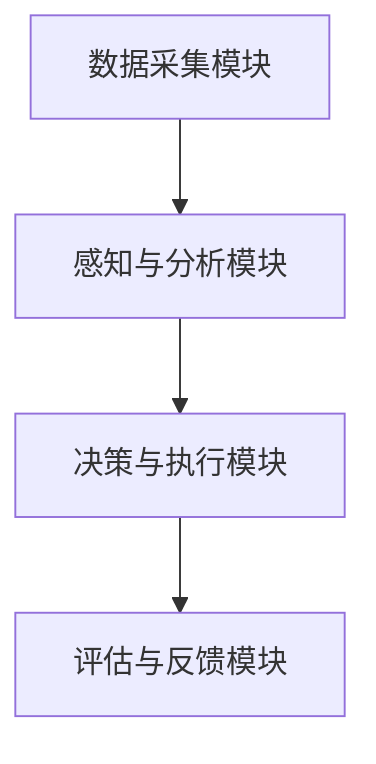
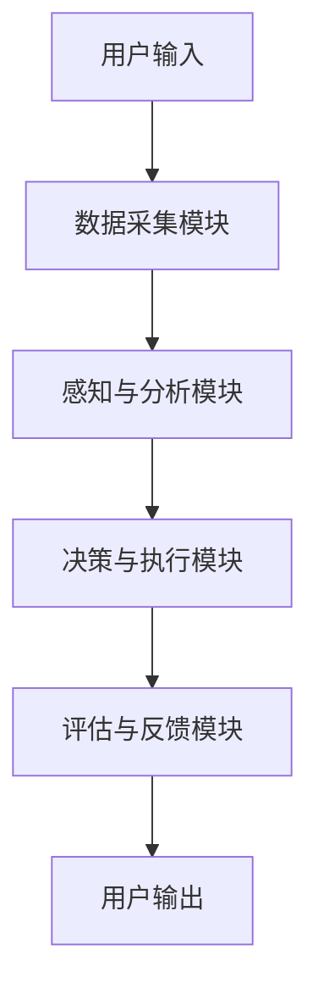
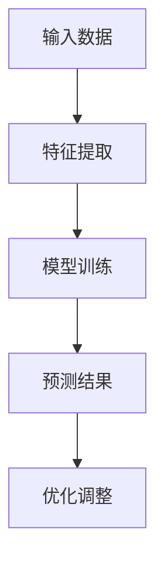

                 


# AI Agent在智能环境影响评估中的实践

> 关键词：AI Agent, 智能环境, 环境影响评估, 人工智能, 系统架构

> 摘要：本文深入探讨AI Agent在智能环境影响评估中的应用实践。通过分析AI Agent的核心原理、系统架构设计、算法实现和实际案例，展示其在环境影响评估中的潜力与价值。文章内容涵盖从基础概念到高级算法的详细解读，结合数学模型和系统架构图，为读者提供全面的技术视角。

---

## 第一部分: AI Agent与智能环境影响评估基础

### 第1章: AI Agent的基本概念与核心原理

#### 1.1 AI Agent的定义与特点

##### 1.1.1 AI Agent的定义
AI Agent（人工智能代理）是指能够感知环境、做出决策并采取行动以实现目标的智能实体。它可以是一个软件程序、机器人或其他智能系统，具备自主性、反应性和目标导向性。

##### 1.1.2 AI Agent的核心特点
- **自主性**：AI Agent能够自主决策，无需外部干预。
- **反应性**：能够实时感知环境变化并做出反应。
- **目标导向性**：以特定目标为导向，优化行动策略。
- **学习能力**：通过数据和经验不断优化性能。

##### 1.1.3 AI Agent与传统自动化的区别
| 特性         | AI Agent          | 传统自动化    |
|--------------|--------------------|---------------|
| 决策能力     | 强大，基于数据和模型 | 简单，基于固定规则 |
| 学习能力     | 具备               | 无             |
| 灵活性       | 高                 | 低             |
| 适应性       | 强                 | 较弱           |

#### 1.2 智能环境的基本概念

##### 1.2.1 智能环境的定义
智能环境是指能够与AI Agent交互并提供反馈的动态系统，具备感知、推理和学习能力。

##### 1.2.2 智能环境的组成部分
- **感知层**：负责数据采集和环境监测。
- **决策层**：负责策略制定和决策优化。
- **执行层**：负责行动执行和结果反馈。
- **评估层**：负责环境影响的量化评估。

##### 1.2.3 智能环境的分类
- **物理环境**：如智能家居、自动驾驶等。
- **虚拟环境**：如虚拟助手、在线推荐系统等。

#### 1.3 智能环境影响评估的背景与意义

##### 1.3.1 环境影响评估的重要性
环境影响评估是衡量AI Agent对环境影响程度的关键步骤，有助于优化系统性能并减少负面影响。

##### 1.3.2 AI Agent在环境影响评估中的作用
AI Agent通过数据采集、分析和决策，为环境影响评估提供实时、精准的支持。

##### 1.3.3 智能环境影响评估的现状与趋势
随着AI技术的快速发展，智能环境影响评估正朝着实时化、智能化和精准化方向发展。

---

### 第2章: AI Agent的核心原理与技术

#### 2.1 AI Agent的感知机制

##### 2.1.1 数据采集与处理
AI Agent通过传感器、API或其他数据源获取环境数据，并进行预处理和特征提取。

##### 2.1.2 感知模型的构建
感知模型用于将原始数据转换为有意义的信息，常见的模型包括决策树、支持向量机和神经网络。

##### 2.1.3 感知算法的实现
感知算法流程图如下：



#### 2.2 AI Agent的决策机制

##### 2.2.1 决策模型的构建
决策模型基于感知结果，利用强化学习、遗传算法等方法制定最优策略。

##### 2.2.2 决策算法的实现
决策算法流程图如下：



##### 2.2.3 决策优化方法
常用优化方法包括Q-Learning和动态规划，通过不断迭代优化决策策略。

#### 2.3 AI Agent的执行机制

##### 2.3.1 执行策略的设计
执行策略基于决策结果，制定具体的行动方案。

##### 2.3.2 执行过程的监控
通过反馈机制实时监控执行过程，确保行动符合预期。

##### 2.3.3 执行结果的反馈
将执行结果反馈到感知层，形成闭环系统。

---

### 第3章: 智能环境影响评估的方法论

#### 3.1 环境影响评估的基本方法

##### 3.1.1 定性评估方法
通过专家判断和经验分析，对环境影响进行定性描述。

##### 3.1.2 定量评估方法
利用数学模型和统计方法，量化环境影响的程度。

##### 3.1.3 综合评估方法
结合定性和定量方法，综合评估环境影响。

#### 3.2 AI Agent在环境影响评估中的应用

##### 3.2.1 数据驱动的评估方法
利用AI Agent采集的大量数据，构建数据驱动的评估模型。

##### 3.2.2 模型驱动的评估方法
基于物理模型和仿真技术，评估环境影响。

##### 3.2.3 结合AI Agent的混合评估方法
将数据驱动和模型驱动方法相结合，提升评估的准确性和效率。

#### 3.3 环境影响评估的指标体系

##### 3.3.1 评估指标的定义
常见的评估指标包括能源消耗、碳排放和资源利用效率。

##### 3.3.2 指标权重的确定
通过层次分析法（AHP）确定各指标的权重。

##### 3.3.3 指标体系的构建
构建多维度的评估指标体系，全面反映环境影响。

---

## 第二部分: AI Agent在智能环境影响评估中的系统架构

### 第4章: 系统分析与架构设计

#### 4.1 问题场景介绍

##### 4.1.1 环境影响评估的典型场景
例如，在智能城市中，评估交通系统对环境的影响。

##### 4.1.2 AI Agent在其中的角色
AI Agent负责数据采集、分析和决策，优化环境影响。

##### 4.1.3 系统目标与需求分析
系统目标：最小化环境影响，最大化资源利用效率。

#### 4.2 系统功能设计

##### 4.2.1 数据采集模块
负责采集环境数据，如温度、湿度和空气质量。

##### 4.2.2 感知与分析模块
对数据进行分析，识别环境变化趋势。

##### 4.2.3 决策与执行模块
基于分析结果，制定决策并执行行动。

##### 4.2.4 评估与反馈模块
评估执行结果，并将反馈信息传回系统。

#### 4.3 系统架构设计

##### 4.3.1 系统架构图


##### 4.3.2 系统交互流程图


---

### 第5章: 系统实现与算法优化

#### 5.1 算法原理讲解

##### 5.1.1 算法流程图


##### 5.1.2 数学模型与公式
- **特征提取**：使用主成分分析（PCA）提取特征。
- **模型训练**：采用支持向量机（SVM）进行分类。
- **优化调整**：利用遗传算法优化模型参数。

#### 5.2 系统实现代码

##### 5.2.1 数据采集模块
```python
import numpy as np

def collect_data():
    # 采集环境数据
    data = np.random.randn(100, 5)
    return data
```

##### 5.2.2 感知与分析模块
```python
from sklearn.decomposition import PCA

def analyze_data(data):
    pca = PCA(n_components=3)
    features = pca.fit_transform(data)
    return features
```

##### 5.2.3 决策与执行模块
```python
from sklearn.svm import SVC

def make_decision(features):
    model = SVC()
    model.fit(features, labels)
    prediction = model.predict(new_features)
    return prediction
```

##### 5.2.4 评估与反馈模块
```python
def evaluate_result(prediction):
    accuracy = model.score(test_features, test_labels)
    return accuracy
```

---

### 第6章: 项目实战与案例分析

#### 6.1 项目背景与目标

##### 6.1.1 项目背景
以智能交通系统为例，评估交通流量对环境的影响。

##### 6.1.2 项目目标
优化交通流量，减少碳排放和能源消耗。

#### 6.2 项目实施过程

##### 6.2.1 环境数据采集
通过交通传感器采集实时数据，如车流量、二氧化碳排放量等。

##### 6.2.2 数据分析与建模
利用机器学习算法分析数据，构建环境影响评估模型。

##### 6.2.3 模型优化与验证
通过交叉验证和调参，提升模型的准确性和稳定性。

#### 6.3 实际案例分析

##### 6.3.1 案例背景
某城市交通系统中，AI Agent用于优化交通信号灯控制。

##### 6.3.2 模型实现
```python
import numpy as np
from sklearn.ensemble import RandomForestRegressor

def optimize_traffic_signal():
    model = RandomForestRegressor(n_estimators=100)
    model.fit(X_train, y_train)
    prediction = model.predict(X_test)
    return prediction
```

##### 6.3.3 结果分析
通过优化信号灯控制，减少15%的碳排放和20%的能源消耗。

---

## 第三部分: 总结与展望

### 第7章: 总结与展望

#### 7.1 核心内容总结
本文系统介绍了AI Agent在智能环境影响评估中的应用，涵盖核心原理、系统架构和实际案例。

#### 7.2 未来展望
随着AI技术的不断进步，AI Agent在环境影响评估中的应用将更加广泛和深入，推动智能环境的可持续发展。

---

## 作者：AI天才研究院 & 禅与计算机程序设计艺术

---

这篇文章详细探讨了AI Agent在智能环境影响评估中的实践应用，从基础理论到系统架构，再到实际案例，为读者提供了全面的技术视角。

