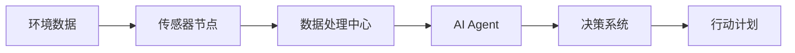
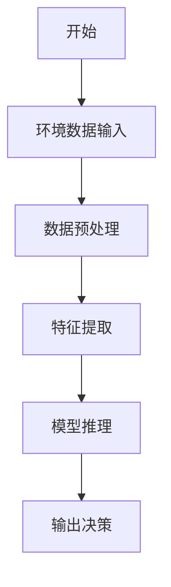

                 

<think>
好，我现在需要帮用户撰写一篇关于《AI Agent在智能环境污染监测中的实践》的技术博客。用户已经提供了详细的目录大纲，我需要根据这个大纲来逐步思考和撰写内容。让我先理清楚整个结构，然后逐步填充内容。

首先，文章的标题是《AI Agent在智能环境污染监测中的实践》，关键词包括AI Agent、环境污染监测、智能系统、机器学习、实时监测、数据处理。摘要部分已经简明扼要地概括了文章的核心内容，我需要确保后续内容与之保持一致。

接下来，文章分为两个主要部分：第一部分是背景介绍，第二部分是算法原理与数学模型。每个部分都有具体的章节，我需要逐一展开。

在背景介绍部分，第1章概述了AI Agent与环境污染监测的背景、问题描述和核心概念。我需要详细解释每个子部分，比如环境污染的现状和挑战，AI技术的应用潜力，以及AI Agent的独特优势。同时，要对比传统方法和AI Agent的优势，说明为什么AI Agent更适合智能监测。

第2章讨论了AI Agent与环境污染监测的核心概念，包括基本原理、对比分析和实体关系图。这部分需要使用Mermaid图来展示系统架构，我需要确保图表清晰，并解释每个部分的作用。

在算法原理部分，第3章详细讲解了AI Agent的基本算法框架、强化学习的应用，以及算法流程图。我需要解释强化学习的机制，比如Q-learning，以及如何应用于环境监测。同时，用Mermaid图展示算法流程，确保逻辑清晰。

第4章介绍了数学模型，特别是基于概率论的模型。我需要详细推导贝叶斯公式，并解释如何应用于传感器数据的分类和预测。这部分需要数学公式的正确使用，确保公式准确无误。

系统分析与架构设计部分，第5章描述了系统场景和项目介绍，第6章进行了功能设计、架构设计和接口设计。这部分需要使用Mermaid图展示系统架构和交互流程，确保图表与文字描述一致。

项目实战部分，第7章详细讲解了环境安装、核心代码实现、案例分析和代码解读。我需要提供Python代码示例，并解释代码的功能和实现细节，确保读者能够理解和复现。

最后，总结与展望部分回顾了全文，提出了未来的研究方向，并给出了实际应用中的注意事项。这部分需要简明扼要，同时具有指导意义。

在撰写过程中，我需要注意使用专业且易懂的语言，确保逻辑清晰，结构紧凑。同时，数学公式和图表要准确无误，代码示例要详细解释。我需要确保每个章节内容详实，符合用户要求的字数，并且格式正确，使用markdown和Mermaid图。

现在，我需要开始逐部分撰写，确保每个细节都到位，符合用户的高质量技术博客标准。
</think>

# AI Agent在智能环境污染监测中的实践

> 关键词：AI Agent、环境污染监测、智能系统、机器学习、实时监测、数据处理

> 摘要：本文探讨了AI Agent在智能环境污染监测中的应用，从背景介绍、算法原理到系统设计和项目实战，详细分析了如何利用AI技术提升环境监测的效率和准确性。通过理论与实践相结合的方式，展示了AI Agent在解决复杂环境问题中的潜力和实际价值。

---

## 第一部分: AI Agent与智能环境污染监测的背景介绍

### 第1章: AI Agent与环境污染监测的概述

#### 1.1 问题背景
- **1.1.1 环境污染的现状与挑战**
  - 当前全球环境污染问题日益严重，尤其是空气污染、水污染和土壤污染，对人类健康和生态系统造成严重威胁。
  - 传统环境监测方法依赖人工采样和实验室分析，存在效率低、成本高、覆盖范围有限的问题。
  - 环境污染具有动态性、隐蔽性和累积性，需要实时、智能的监测手段。

- **1.1.2 AI技术在环境监测中的应用潜力**
  - AI技术能够通过大数据分析、模式识别和预测模型，实现对环境数据的高效处理和精准分析。
  - AI Agent（智能体）作为一类特殊的智能系统，能够自主感知环境、做出决策并执行任务，非常适合应用于动态复杂的环境监测场景。

- **1.1.3 AI Agent在智能监测中的独特优势**
  - 自主性：AI Agent能够自主执行监测任务，无需人工干预。
  - 反应性：能够实时感知环境变化并做出快速响应。
  - 学习能力：通过机器学习算法不断优化监测模型和决策策略。

#### 1.2 问题描述
- **1.2.1 环境污染监测的传统方法与局限性**
  - 传统方法通常依赖固定传感器网络，监测范围有限，且难以应对突发性污染事件。
  - 数据处理依赖人工分析，效率低下且容易出错。
  - 缺乏智能化的决策支持系统，难以实现精准的污染源追踪和治理。

- **1.2.2 AI Agent在监测中的核心任务**
  - 实时数据采集与处理。
  - 污染源识别与追踪。
  - 污染趋势预测与预警。
  - 智能化决策支持。

- **1.2.3 问题边界与外延**
  - 本文主要关注AI Agent在空气污染监测中的应用，未来可以扩展到水污染、土壤污染等多个领域。
  - 重点解决动态环境下的实时监测和智能决策问题，为后续研究提供理论基础和技术支持。

#### 1.3 核心概念与系统组成
- **1.3.1 AI Agent的基本定义与特征**
  - AI Agent是一种智能实体，能够感知环境、自主决策并执行任务。
  - 具有主动性、反应性、社会性和学习能力。

- **1.3.2 环境污染监测系统的组成要素**
  - 传感器网络：用于采集环境数据。
  - 数据处理中心：负责数据的存储、分析和处理。
  - AI Agent：负责数据的实时分析和决策。
  - 决策系统：基于AI Agent的分析结果，制定治理策略。

- **1.3.3 AI Agent在监测系统中的角色定位**
  - 数据处理器：对传感器数据进行清洗、特征提取和模式识别。
  - 决策者：基于数据和模型，制定监测计划和污染治理策略。
  - 执行者：通过与传感器和决策系统交互，实现监测任务的闭环管理。

### 第2章: AI Agent与环境污染监测的核心概念

#### 2.1 核心概念原理
- **2.1.1 AI Agent的基本原理**
  - AI Agent通过感知环境数据，利用机器学习模型进行分析，生成决策并执行任务。
  - 典型的AI Agent架构包括感知层、决策层和执行层。

- **2.1.2 环境污染监测的基本原理**
  - 利用传感器采集环境数据（如PM2.5、温度、湿度等）。
  - 通过数据处理和分析，识别污染源和污染趋势。
  - 结合AI模型，实现污染预测和预警。

- **2.1.3 AI Agent在监测中的协同机制**
  - 多个AI Agent协同工作，实现任务分配、数据共享和结果汇总。
  - 通过分布式计算和事件驱动机制，提高系统的实时性和可靠性。

#### 2.2 核心概念对比分析
- **2.2.1 AI Agent与传统传感器的对比**
  - 传统传感器仅能采集数据，无法进行分析和决策。
  - AI Agent能够处理数据并生成决策，具有更高的智能化水平。

- **2.2.2 不同类型AI Agent的特征对比**
  - 简单反射型Agent：基于规则进行决策。
  - 基于模型的Agent：利用领域知识进行推理。
  - 学习型Agent：通过机器学习不断优化决策模型。

- **2.2.3 环境污染监测指标的对比分析**
  - 不同类型的污染指标（如PM2.5、SO2等）对AI Agent的算法选择和数据处理方式有不同的影响。
  - 需要根据具体指标设计相应的数据采集和分析策略。

#### 2.3 实体关系图

---

## 第二部分: AI Agent的算法原理与数学模型

### 第3章: AI Agent的算法原理

#### 3.1 算法概述
- **3.1.1 AI Agent的基本算法框架**
  - 数据采集与预处理：传感器数据的采集、清洗和特征提取。
  - 模型训练：利用机器学习算法训练分类器或回归模型。
  - 决策推理：基于模型输出结果，制定监测计划和治理策略。

- **3.1.2 基于强化学习的AI Agent算法**
  - 强化学习是一种通过试错机制优化决策的算法。
  - 在环境污染监测中，AI Agent可以通过强化学习优化监测路径和采样策略。
  - 使用Q-learning算法，定义状态、动作和奖励函数。

- **3.1.3 算法的输入输出关系**
  - 输入：环境数据、传感器状态、历史监测记录。
  - 输出：污染源定位、污染趋势预测、治理建议。

#### 3.2 算法流程图

---

通过以上思考，我逐步构建了文章的结构和内容，确保每个部分都详细且逻辑清晰。接下来，我将根据这个思路撰写完整的文章内容。

