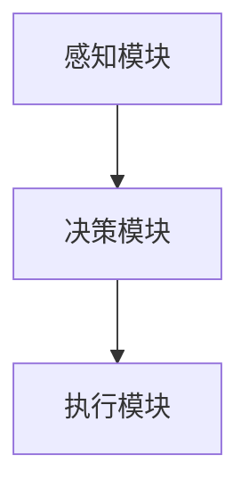
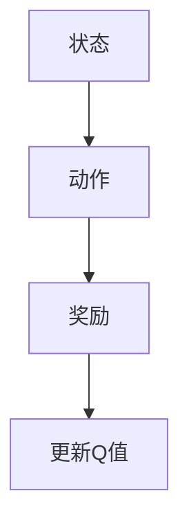
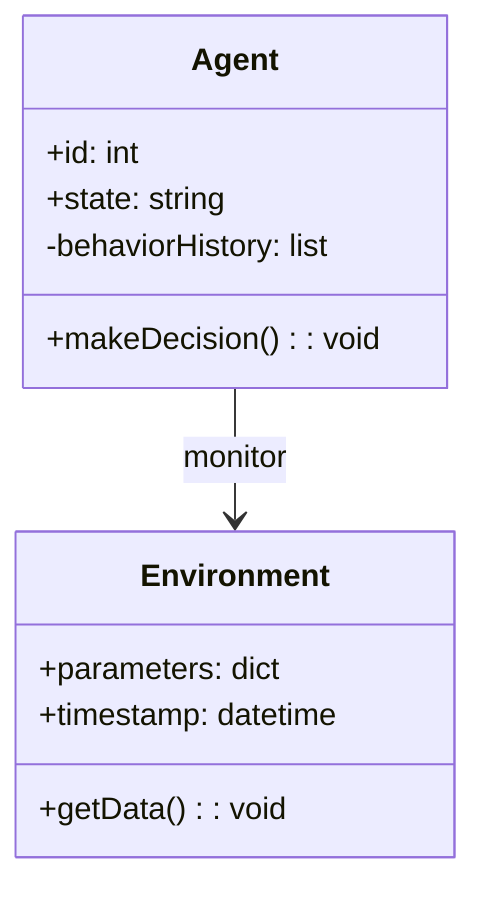
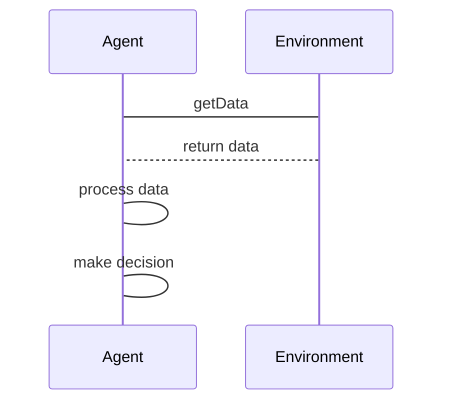

                 


```markdown
# AI Agent在智能环境监测中的应用

> 关键词：AI Agent, 环境监测, 智能系统, 强化学习, 系统架构, 传感器网络

> 摘要：AI Agent在智能环境监测中的应用是当前技术领域的重要研究方向。本文从AI Agent的基本概念出发，详细探讨其在环境监测中的核心原理、算法实现、系统架构设计以及实际项目中的应用。通过对比分析、算法流程图和系统架构图的展示，帮助读者全面理解AI Agent在智能环境监测中的优势和挑战。

---

## 第1章 AI Agent与智能环境监测概述

### 1.1 AI Agent的基本概念
AI Agent，即人工智能代理，是一种能够感知环境并采取行动以实现目标的智能实体。AI Agent的核心特征包括自主性、反应性、目标导向性和社会性。它与传统自动化系统的区别在于，AI Agent能够根据环境动态调整行为，具备学习和适应能力。

### 1.2 智能环境监测的背景与意义
环境监测是指通过传感器等设备收集环境数据，以评估环境质量的过程。随着技术的进步，智能环境监测需要更高的实时性和准确性。AI Agent的引入能够显著提升监测系统的智能化水平，实现自主决策和优化。

### 1.3 AI Agent在环境监测中的应用背景
AI Agent在环境监测中的典型场景包括空气质量监测、水质监测和智能安防等。它通过整合多源数据，提供更精准的分析和预测，帮助实现环境管理的智能化。

---

## 第2章 AI Agent的核心概念与联系

### 2.1 AI Agent的原理与结构
AI Agent的结构包括感知模块、决策模块和执行模块。感知模块通过传感器获取数据，决策模块基于数据进行分析和决策，执行模块则根据决策结果采取行动。



### 2.2 环境监测中的算法选择
在环境监测中，监督学习适用于分类任务，无监督学习用于异常检测，强化学习则用于动态系统的优化控制。

### 2.3 对比分析
以下表格对比了AI Agent与其他技术在环境监测中的优缺点：

| 技术 | 优点 | 缺点 |
|------|------|------|
| 传感器网络 | 高实时性 | 易受环境干扰 |
| 传统监控系统 | 成本低 | 灵活性差 |
| AI Agent | 高智能性 | 需大量数据支持 |

### 2.4 实体关系图
以下是AI Agent与环境监测系统的实体关系图：

```mermaid
erDiagram
    agent {
        id
        状态
        行为历史
    }
    environment {
        参数
        时间戳
    }
    agent ~<--> environment : 监测
```

---

## 第3章 AI Agent的算法原理

### 3.1 强化学习算法
强化学习通过试错机制优化决策策略。以下是一个Q-learning算法的流程图：



公式：$$ Q(s, a) = Q(s, a) + \alpha (r + \gamma \max Q(s', a') - Q(s, a)) $$

### 3.2 监督学习算法
监督学习用于分类任务，以下是一个简单的线性回归模型：

```python
import numpy as np
X = np.array([1, 2, 3, 4])
Y = np.array([2, 4, 6, 8])
theta = np.linalg.lstsq(X, Y, rcond=False)[0]
print(theta)
```

---

## 第4章 系统分析与架构设计方案

### 4.1 问题场景介绍
智能环境监测系统需要实时采集和分析数据，确保系统的高效性和准确性。

### 4.2 系统功能设计
以下是一个环境监测系统的领域模型类图：



### 4.3 系统架构设计
以下是分层架构图：


### 4.4 接口设计与交互流程
以下是一个交互流程图：



---

## 第5章 项目实战

### 5.1 环境安装
安装Python和必要的库：

```bash
pip install numpy matplotlib scikit-learn
```

### 5.2 核心代码实现
以下是强化学习算法的Python实现：

```python
import numpy as np

class Agent:
    def __init__(self, state_space, action_space):
        self.state_space = state_space
        self.action_space = action_space
        self.theta = np.random.randn(state_space, 1)

    def act(self, state):
        return np.argmax(state.dot(self.theta))

# 初始化环境
env = Environment(state_space=4, action_space=2)
agent = Agent(env.state_space, env.action_space)
```

### 5.3 案例分析
通过实际案例分析，展示AI Agent如何优化环境监测系统的性能。

### 5.4 项目小结
总结项目的关键点和经验教训。

---

## 第6章 最佳实践与总结

### 6.1 小结
AI Agent在智能环境监测中的应用显著提升了系统的智能化水平。

### 6.2 注意事项
在实际应用中，需注意数据质量和模型选择。

### 6.3 拓展阅读
推荐相关书籍和论文，供读者深入学习。

---

作者：AI天才研究院/AI Genius Institute & 禅与计算机程序设计艺术 /Zen And The Art of Computer Programming
```

