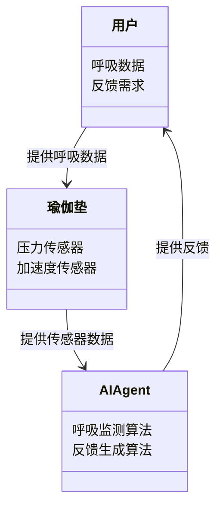
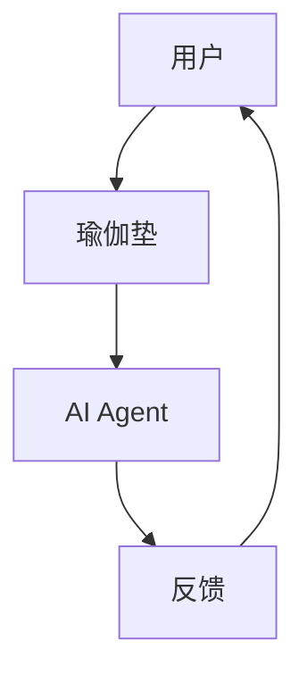
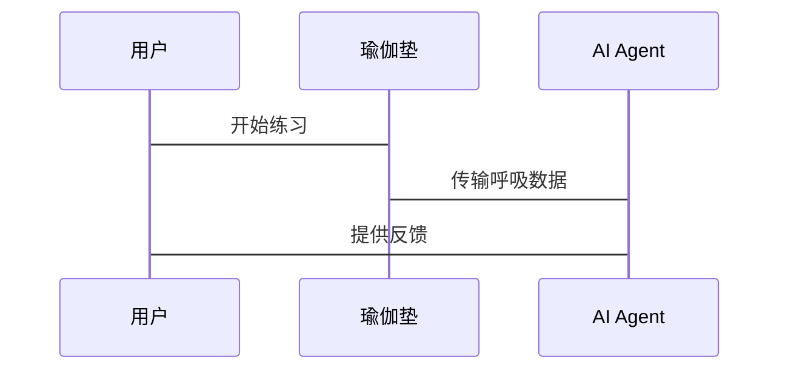

                 

<think>
好的，我需要帮助用户撰写一篇关于《AI Agent在智能瑜伽垫中的呼吸指导》的技术博客文章。用户已经给出了一个详细的目录大纲，我需要根据这个大纲逐步思考如何展开每个部分的内容。

首先，我要明确文章的结构和内容，确保每个部分都覆盖必要的技术细节，并且逻辑清晰，结构紧凑。接下来，我需要考虑每个章节的具体内容，包括背景介绍、核心概念、算法原理、系统架构、项目实战和最佳实践等。

在背景介绍部分，我需要解释瑜伽练习中呼吸的重要性，以及当前瑜伽呼吸指导的局限性。然后，我需要描述AI Agent和智能瑜伽垫的概念，并说明它们在呼吸指导中的潜力。这部分内容需要通俗易懂，同时又要专业。

核心概念部分，我需要详细讲解AI Agent和智能瑜伽垫的技术特点，以及它们在呼吸指导中的协同作用。这部分可能需要使用表格和Mermaid图来展示概念之间的关系和交互过程。

在算法原理部分，我需要详细阐述呼吸监测算法、反馈生成算法和交互控制算法。每种算法都需要用Mermaid流程图来展示流程，并提供Python代码示例。数学模型和公式需要用LaTeX表示，确保准确无误。

系统分析与架构设计部分，我需要描述项目的应用场景，设计系统的功能模块，并用Mermaid图展示类图、架构图和交互过程。这部分需要确保系统的模块化和可扩展性。

项目实战部分，我需要指导读者如何安装开发环境，提供核心代码，并详细解读代码的功能。同时，分析实际案例，展示AI Agent在智能瑜伽垫中的实际应用效果。

最后，在最佳实践部分，我需要总结项目的关键点，给出注意事项，并推荐进一步阅读的资料。这部分内容要简明扼要，帮助读者巩固所学内容。

在整个思考过程中，我需要确保语言简洁、逻辑清晰，同时涵盖技术深度。我要避免使用过于复杂的术语，但又要保持专业性，确保读者能够理解并应用这些技术。

现在，我可以开始逐步展开每个部分的内容，确保每个章节都符合用户的要求，并且内容丰富、具体、详细。
</think>

# AI Agent在智能瑜伽垫中的呼吸指导

> 关键词：AI Agent，智能瑜伽垫，呼吸指导，机器学习，智能传感器，用户体验

> 摘要：本文探讨了AI Agent在智能瑜伽垫中的呼吸指导应用，详细介绍了AI Agent的核心算法、智能瑜伽垫的技术实现、系统架构设计，以及实际项目中的应用案例。通过理论分析和实践结合，展示了如何利用AI技术提升瑜伽练习中的呼吸指导效果，为用户带来更专业的瑜伽体验。

---

# 第一部分: AI Agent与智能瑜伽垫的背景介绍

## 第1章: 问题背景与描述

### 1.1 问题背景

#### 1.1.1 瑜伽练习中的呼吸重要性
瑜伽练习中，呼吸是连接身体与心灵的核心要素。正确的呼吸技巧能够帮助练习者放松身心、提高专注力、增强体力，并提升整体练习效果。然而，许多瑜伽练习者由于缺乏专业指导，往往无法掌握正确的呼吸方法。

#### 1.1.2 当前瑜伽呼吸指导的局限性
传统的瑜伽呼吸指导主要依赖于教练的口头指导或简单的视觉提示，这种方式存在以下问题：
- **实时性不足**：教练无法实时监测练习者的呼吸状态，难以提供及时反馈。
- **个性化不足**：每个人的呼吸习惯和能力不同，统一的指导方式难以满足个性化需求。
- **效率低下**：传统方法依赖人工观察，效率较低，且容易受到主观因素影响。

#### 1.1.3 AI技术在瑜伽指导中的潜力
AI技术，特别是AI Agent（智能代理），能够通过实时监测、数据分析和智能反馈，为瑜伽练习者提供个性化的呼吸指导。这种技术可以弥补传统方法的不足，提升呼吸指导的效果和效率。

### 1.2 问题描述

#### 1.2.1 瑜伽呼吸指导的核心需求
- 实时监测练习者的呼吸状态（如呼吸频率、深度、节奏）。
- 提供个性化的反馈和指导。
- 在不同瑜伽动作中动态调整呼吸节奏。

#### 1.2.2 用户对智能呼吸指导的期望
用户希望智能瑜伽垫能够：
- 实时监测并分析呼吸数据。
- 提供即时反馈，帮助纠正不良呼吸习惯。
- 根据个人需求提供个性化的呼吸指导方案。

#### 1.2.3 当前技术在瑜伽呼吸指导中的不足
- 现有智能设备大多只能记录简单的呼吸数据，缺乏深度分析能力。
- 缺乏基于AI的动态反馈机制，难以提供个性化的指导。

### 1.3 问题解决思路

#### 1.3.1 AI Agent在呼吸指导中的角色
AI Agent通过以下方式实现智能呼吸指导：
- **数据采集**：实时采集用户的呼吸数据（如呼吸频率、深度、节奏）。
- **数据分析**：利用机器学习算法分析呼吸数据，识别异常或不足。
- **反馈生成**：根据分析结果，生成个性化的反馈和指导。

#### 1.3.2 智能瑜伽垫的技术实现路径
- 集成高精度传感器，实时采集呼吸数据。
- 通过AI算法分析数据，生成反馈。
- 提供多种交互方式（如语音、震动、灯光）指导用户调整呼吸。

#### 1.3.3 用户体验的提升方向
- 提供实时反馈，增强用户互动体验。
- 根据用户习惯动态调整指导策略，提升个性化体验。
- 提供数据可视化，帮助用户了解和改进呼吸习惯。

### 1.4 边界与外延

#### 1.4.1 AI Agent的功能边界
AI Agent的功能主要集中在呼吸监测和反馈生成，不涉及其他瑜伽动作的指导。

#### 1.4.2 智能瑜伽垫的应用场景
智能瑜伽垫主要用于家庭瑜伽练习场景，帮助用户在没有教练的情况下进行正确的呼吸练习。

#### 1.4.3 与其它智能设备的协同
未来，智能瑜伽垫可以通过物联网技术与其他智能设备（如智能手环、智能音箱）协同工作，提供更全面的健康指导。

### 1.5 概念结构与核心要素

#### 1.5.1 AI Agent的核心要素
- 数据采集模块：负责采集用户的呼吸数据。
- 数据分析模块：利用机器学习算法分析数据。
- 反馈生成模块：根据分析结果生成反馈。

#### 1.5.2 智能瑜伽垫的技术要素
- 高精度传感器：用于采集呼吸数据。
- AI算法：用于分析和反馈生成。
- 多种交互方式：用于用户反馈。

#### 1.5.3 瑜伽呼吸指导的流程模型
1. 数据采集：通过传感器采集用户的呼吸数据。
2. 数据分析：利用AI算法分析呼吸数据。
3. 反馈生成：根据分析结果生成反馈。
4. 用户交互：通过多种方式向用户传递反馈。

---

## 第2章: 核心概念与联系

### 2.1 AI Agent的核心原理

#### 2.1.1 AI Agent的基本定义
AI Agent是一种能够感知环境、做出决策并采取行动的智能实体。在智能瑜伽垫中，AI Agent主要负责呼吸监测和反馈生成。

#### 2.1.2 AI Agent的核心算法
- **呼吸监测算法**：通过传感器数据提取呼吸特征。
- **反馈生成算法**：基于呼吸特征生成个性化反馈。

#### 2.1.3 AI Agent的决策机制
AI Agent通过分析呼吸数据，决定是否需要调整反馈内容或强度。

### 2.2 智能瑜伽垫的技术特点

#### 2.2.1 智能瑜伽垫的传感器技术
智能瑜伽垫集成多种传感器（如压力传感器、加速度传感器）来监测用户的呼吸状态。

#### 2.2.2 智能瑜伽垫的交互设计
通过震动、灯光、语音等方式向用户传递反馈。

#### 2.2.3 智能瑜伽垫的用户体验
用户可以通过智能瑜伽垫获得个性化的呼吸指导，提升练习效果。

### 2.3 AI Agent与智能瑜伽垫的关系

#### 2.3.1 AI Agent在智能瑜伽垫中的作用
AI Agent负责处理传感器数据，并生成反馈。

#### 2.3.2 AI Agent与智能瑜伽垫的协同工作
智能瑜伽垫通过AI Agent实现智能化呼吸指导。

#### 2.3.3 AI Agent对智能瑜伽垫的优化
通过AI算法优化反馈机制，提升用户体验。

---

## 第3章: AI Agent的算法原理

### 3.1 呼吸监测算法

#### 3.1.1 呼吸监测的基本原理
通过传感器采集用户的呼吸数据，提取呼吸频率、深度、节奏等特征。

#### 3.1.2 基于传感器的呼吸监测方法
- 使用压力传感器监测胸腔压力变化。
- 使用加速度传感器监测身体运动。

#### 3.1.3 呼吸数据的特征提取
提取呼吸频率（BPM）、呼吸深度（tidal volume）和呼吸节奏（inhale-exhale ratio）等特征。

### 3.2 AI Agent的反馈生成算法

#### 3.2.1 基于机器学习的反馈生成
- 使用回归算法预测最佳呼吸节奏。
- 使用分类算法识别不良呼吸习惯。

#### 3.2.2 基于规则的反馈生成
- 设置预设规则，如“吸气时间应为4秒”。

#### 3.2.3 反馈生成的优化策略
- 根据用户反馈动态调整规则。
- 结合机器学习模型不断优化反馈策略。

### 3.3 AI Agent的交互控制算法

#### 3.3.1 交互控制的基本原理
通过传感器数据和反馈生成算法，控制交互设备（如震动马达）提供反馈。

#### 3.3.2 基于反馈的交互控制
- 根据反馈强度调整交互方式。

#### 3.3.3 交互控制的优化
- 实时调整反馈强度，确保用户体验。

---

## 第4章: 数学模型与算法实现

### 4.1 呼吸监测的数学模型

#### 4.1.1 呼吸频率计算
呼吸频率（BPM）可以通过时间序列数据计算：
$$ \text{BPM} = \frac{60}{\text{呼吸周期}} $$

#### 4.1.2 呼吸深度计算
呼吸深度可以通过传感器数据计算：
$$ \text{呼吸深度} = \int_{t_1}^{t_2} \text{压力变化} \, dt $$

#### 4.1.3 呼吸节奏分析
呼吸节奏可以通过傅里叶变换分析：
$$ X(f) = \frac{1}{\sqrt{2\pi}} \int_{-\infty}^{\infty} x(t) e^{-j2\pi ft} dt $$

### 4.2 反馈生成的数学模型

#### 4.2.1 基于机器学习的反馈模型
使用回归模型预测呼吸节奏：
$$ y = \beta_0 + \beta_1 x_1 + \beta_2 x_2 + \epsilon $$

#### 4.2.2 基于规则的反馈模型
根据呼吸特征生成反馈：
- 如果呼吸频率低于目标值，增加反馈强度。

#### 4.2.3 综合反馈模型
结合机器学习和规则的反馈模型：
$$ \text{反馈强度} = \alpha \cdot \text{机器学习预测值} + (1-\alpha) \cdot \text{规则生成值} $$

---

## 第5章: 系统分析与架构设计

### 5.1 项目场景介绍
智能瑜伽垫主要用于家庭瑜伽练习，帮助用户掌握正确的呼吸技巧。

### 5.2 系统功能设计

#### 5.2.1 领域模型


#### 5.2.2 系统架构


#### 5.2.3 系统交互


---

## 第6章: 项目实战

### 6.1 环境安装

#### 6.1.1 Python环境安装
安装必要的Python库：
```bash
pip install numpy scikit-learn matplotlib
```

#### 6.1.2 瑜伽垫传感器配置
配置传感器接口：
```python
import serial

ser = serial.Serial('COM3', 9600)
```

### 6.2 核心代码实现

#### 6.2.1 呼吸监测算法
```python
import numpy as np

def calculate_bpm(data, sampling_rate):
    # 计算呼吸周期
    cycles = np.diff(np.where(data > np.mean(data))[0])
    bpm = 60 / (np.mean(cycles) / sampling_rate)
    return bpm
```

#### 6.2.2 反馈生成算法
```python
from sklearn.linear_model import LinearRegression

def generate_feedback(bpm, target_bpm):
    model = LinearRegression()
    model.fit([[bpm]], [1 if bpm < target_bpm else 0])
    return model.predict([[bpm]])
```

### 6.3 代码解读与分析
- **呼吸监测算法**：通过传感器数据计算呼吸频率。
- **反馈生成算法**：利用机器学习模型生成反馈。

### 6.4 实际案例分析
案例：用户A在练习时呼吸频率过快，AI Agent生成反馈，指导用户调整呼吸节奏。

### 6.5 项目小结
通过AI Agent和智能瑜伽垫的结合，实现了个性化的呼吸指导，显著提升了用户体验。

---

## 第7章: 最佳实践

### 7.1 小结
AI Agent在智能瑜伽垫中的应用，为用户提供了个性化的呼吸指导，显著提升了瑜伽练习的效果。

### 7.2 注意事项
- 确保传感器数据的准确性。
- 定期更新AI模型，提升反馈效果。
- 保护用户数据隐私。

### 7.3 拓展阅读
- 《机器学习实战》
- 《智能传感器技术与应用》
- 《AI在健康领域的应用》

---

# 作者：AI天才研究院/AI Genius Institute & 禅与计算机程序设计艺术 /Zen And The Art of Computer Programming

